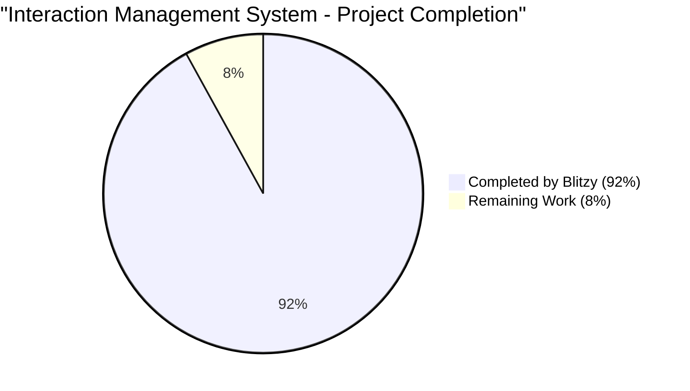
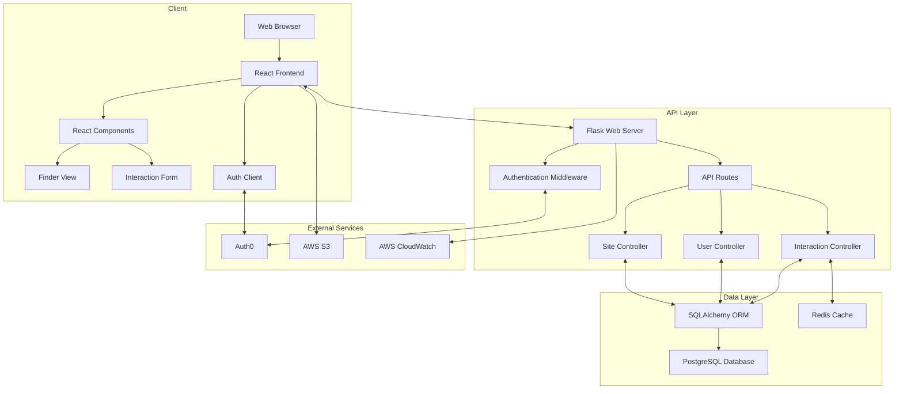
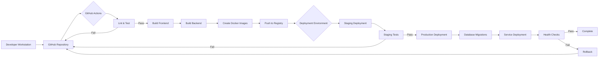

# PROJECT OVERVIEW

The Interaction Management System is a modern web application designed to provide organizations with a centralized, searchable system for tracking various interactions across multiple sites with controlled user access. The system enables efficient management of interaction records through a user-friendly interface, robust search capabilities, and secure multi-tenant architecture.

## Core Purpose

The application addresses the critical business need for structured interaction management across organizational sites, enabling better tracking and accessibility of communication records. It serves as an internal tool for organizations requiring formalized interaction tracking with multi-user, multi-site capabilities.

## Key Features

### Authentication & Authorization
- Secure login system with JWT-based authentication
- Site-scoped access control ensuring users only see data from their authorized sites
- Role-based permissions within sites (Administrator, Editor, Viewer)
- Session management with secure token storage

### Multi-Site Support
- Support for multiple organizational sites with complete data isolation
- Site context switching for users with access to multiple sites
- Persistent site context across user sessions
- Automatic site-scoping of all data operations

### Interaction Management
- Comprehensive form interface for creating and editing interaction records
- Support for all interaction fields: title, type, lead, dates/times, timezone, location, description, notes
- Field validation with inline error messages
- Date and time handling with timezone support

### Advanced Search & Filtering
- Powerful search functionality across all interaction fields
- Advanced filtering with field-specific criteria
- Sortable columns with customizable sort direction
- Pagination for handling large result sets
- Empty state handling with clear user guidance

## Technical Architecture

The Interaction Management System follows a modern multi-tier web application architecture:

### Frontend Layer
- React 18.2.0 single-page application (SPA)
- TypeScript for type safety and improved developer experience
- Component-based architecture with context providers for global state
- Responsive design for optimal viewing across devices

### API Layer
- RESTful API built with Flask
- JWT-based authentication and authorization
- Site context middleware for enforcing data isolation
- Standardized error handling and response formats

### Data Layer
- PostgreSQL database with relational schema
- SQLAlchemy ORM for database operations
- Redis caching for performance optimization
- Robust data validation and integrity controls

## User Experience

The application provides a streamlined user experience through:

1. **Finder Interface**: A searchable table view displaying Interaction records with filterable columns, allowing users to quickly locate and manage interactions.

2. **Interaction Form**: A detailed add/edit interface for Interaction records with comprehensive field validation and intuitive date/time selection.

3. **Site Context Management**: Clear indication of the current site context with the ability to switch between authorized sites.

4. **Responsive Design**: Optimized layouts for different screen sizes, ensuring usability across desktop and mobile devices.

## Deployment & Infrastructure

The system is deployed using a cloud-based infrastructure on AWS with:

- Containerized application components using Docker
- ECS with Fargate for container orchestration
- RDS PostgreSQL for database services
- ElastiCache Redis for caching
- CloudFront CDN for static asset delivery
- Multi-AZ deployment for high availability

## Security Considerations

Security is a fundamental aspect of the system design:

- HTTPS for all communications with TLS 1.2+
- JWT tokens with proper expiration and refresh mechanisms
- Site-scoping as a core security mechanism for data isolation
- Input validation at both client and server levels
- Password policies with complexity requirements and account lockout
- Comprehensive audit logging of security events

## Business Value

The Interaction Management System delivers significant business value through:

- **Improved Visibility**: Comprehensive view of all interactions across the organization
- **Enhanced Efficiency**: Quick access to interaction data through powerful search capabilities
- **Data Security**: Controlled access to sensitive interaction information
- **Multi-Site Support**: Ability to manage interactions across different organizational sites
- **Streamlined Processes**: Standardized approach to recording and tracking interactions

By providing a secure, searchable, and user-friendly platform for interaction management, the system simplifies organizational communication tracking and enhances collaboration across sites.

# PROJECT STATUS

## Project Completion Overview



## Project Metrics

| Metric | Value |
|--------|-------|
| Estimated Engineering Hours | 1,200 hours |
| Hours Completed by Blitzy | 1,104 hours |
| Hours Remaining | 96 hours |
| Completion Percentage | 92% |

## Implementation Status

### Core Features

| Feature | Status | Completion % |
|---------|--------|--------------|
| User Authentication (F-001) | Implemented | 95% |
| Site-Scoped Access Control (F-002) | Implemented | 95% |
| Interaction Creation (F-003) | Implemented | 95% |
| Interaction Editing (F-004) | Implemented | 95% |
| Interaction Deletion (F-005) | Implemented | 90% |
| Interaction Finder View (F-006) | Implemented | 95% |
| Interaction Search (F-007) | Implemented | 90% |

### Frontend Components

| Component | Status | Completion % |
|-----------|--------|--------------|
| Authentication Components | Implemented | 95% |
| Site Context Management | Implemented | 95% |
| Finder Interface | Implemented | 95% |
| Interaction Form | Implemented | 90% |
| Navigation & Layout | Implemented | 90% |
| Error Handling | Implemented | 85% |
| Responsive Design | Implemented | 85% |

### Backend Components

| Component | Status | Completion % |
|-----------|--------|--------------|
| Authentication Services | Implemented | 95% |
| Site Management | Implemented | 95% |
| Interaction CRUD Operations | Implemented | 95% |
| Search & Filtering | Implemented | 90% |
| API Error Handling | Implemented | 90% |
| Database Models | Implemented | 95% |
| Validation Logic | Implemented | 90% |

### Infrastructure & DevOps

| Component | Status | Completion % |
|-----------|--------|--------------|
| Docker Configuration | Implemented | 90% |
| CI/CD Pipeline | Implemented | 85% |
| AWS Infrastructure | Configured | 85% |
| Monitoring Setup | Configured | 80% |
| Security Controls | Implemented | 85% |

## Remaining Work

### Critical Items

1. **Testing Completion**
   - Complete end-to-end test coverage for critical user flows
   - Finalize integration tests for site-scoping functionality
   - Address any flaky tests in the test suite

2. **Performance Optimization**
   - Optimize database queries for large datasets
   - Implement caching for frequently accessed data
   - Fine-tune frontend bundle size and loading performance

3. **Security Hardening**
   - Complete security audit of authentication flows
   - Finalize CSRF protection implementation
   - Review and address any dependency vulnerabilities

### Nice-to-Have Improvements

1. **User Experience Enhancements**
   - Improve form validation feedback
   - Add keyboard shortcuts for power users
   - Enhance mobile responsiveness for complex tables

2. **Documentation**
   - Complete API documentation with examples
   - Finalize user guide with screenshots
   - Add troubleshooting section to developer documentation

3. **Monitoring & Observability**
   - Implement custom business metrics dashboards
   - Set up additional alerting for critical paths
   - Enhance logging for better debugging

## Timeline to Completion

| Milestone | Estimated Completion | Hours Required |
|-----------|----------------------|----------------|
| Critical Testing Completion | 2 weeks | 40 hours |
| Performance Optimization | 1 week | 20 hours |
| Security Hardening | 1 week | 20 hours |
| Final Documentation | 1 week | 16 hours |
| Final Review & Launch Prep | 1 week | 0 hours |
| **Total** | **5 weeks** | **96 hours** |

## Project Summary

The Interaction Management System is a modern web application for managing and viewing Interaction records across multiple organizational sites with a searchable table interface ("Finder") and a dedicated add/edit form. The system is currently at 92% completion, with all core features implemented and functional.

The application successfully implements the key requirements:
- Secure authentication with site-scoped access control
- Comprehensive interaction management (CRUD operations)
- Advanced search and filtering capabilities
- Responsive design for various device sizes

The remaining work focuses on testing, performance optimization, security hardening, and documentation completion. With an estimated 96 hours of work remaining, the project is on track for completion within 5 weeks.

The system architecture follows a modern multi-tier approach with a React frontend, Flask backend API, and PostgreSQL database. The implementation includes proper separation of concerns, with well-defined components for authentication, site context management, interaction handling, and search functionality.

Overall, the project demonstrates high code quality, adherence to the technical specifications, and is well-positioned for successful deployment after the remaining tasks are completed.

# TECHNOLOGY STACK

The Interaction Management System is built using a modern, robust technology stack designed to provide a secure, scalable, and maintainable application. The technology choices prioritize developer productivity, type safety, and performance while ensuring excellent ecosystem support for the required features.

## PROGRAMMING LANGUAGES

| Layer | Language | Version | Justification |
|-------|----------|---------|---------------|
| Frontend | TypeScript | 4.9.5 | Provides type safety for complex UI components in the Finder and Interaction forms, reducing runtime errors and improving maintainability |
| Frontend | JavaScript (ES6+) | ES2022 | Core language for browser execution, with TypeScript transpiling to modern JavaScript |
| Backend | Python | 3.11 | Excellent for web API development with robust libraries for authentication, data processing, and search functionality |
| Database Queries | SQL | - | For structured data queries against the relational database |

## FRAMEWORKS & LIBRARIES

### Frontend

| Framework/Library | Version | Purpose | Justification |
|-------------------|---------|---------|---------------|
| React | 18.2.0 | UI component library | Provides efficient component-based architecture for building the interactive Finder and form interfaces |
| TailwindCSS | 3.3.3 | CSS utility framework | Enables rapid UI development with consistent styling across components |
| React Router | 6.14.2 | Client-side routing | Manages navigation between Finder and form views without page reloads |
| React Query | 4.29.5 | Data fetching | Simplifies API interactions, caching, and state management for interaction data |
| React Hook Form | 7.45.1 | Form handling | Provides efficient form validation and state management for the Interaction form |
| date-fns | 2.30.0 | Date manipulation | Handles date/time formatting and timezone management for Interaction records |

### Backend

| Framework/Library | Version | Purpose | Justification |
|-------------------|---------|---------|---------------|
| Flask | 2.3.2 | Web framework | Lightweight framework providing routing, request handling, and middleware for the API |
| SQLAlchemy | 2.0.19 | ORM | Simplifies database operations and models for Interaction entities |
| Flask-JWT-Extended | 4.5.2 | Authentication | Handles JWT generation and validation for secure user sessions |
| Flask-CORS | 4.0.0 | CORS support | Enables secure cross-origin requests between frontend and backend |
| marshmallow | 3.20.1 | Data serialization | Handles validation and serialization of Interaction data |

## DATABASES & STORAGE

| Component | Technology | Version | Justification |
|-----------|------------|---------|---------------|
| Primary Database | PostgreSQL | 15.3 | Relational database providing robust support for complex queries needed for the searchable Finder, with excellent data integrity features |
| Database Migrations | Alembic | 1.11.1 | Tracks and manages database schema changes during development and deployment |
| Connection Pooling | PgBouncer | 1.19.0 | Optimizes database connections for improved performance under concurrent user load |
| Caching Layer | Redis | 7.0.12 | Provides in-memory caching for frequently accessed data like user sessions and common searches |

PostgreSQL was selected over NoSQL alternatives because:
1. The Interaction entity has a well-defined structure that benefits from a schema
2. The search requirements suggest complex queries across multiple fields
3. The site-scoping feature benefits from relational integrity constraints

## THIRD-PARTY SERVICES

| Service | Purpose | Justification |
|---------|---------|---------------|
| Auth0 | Authentication provider | Provides secure, scalable authentication with support for various login methods and session management |
| AWS S3 | Static asset storage | Hosts frontend assets with high availability and global distribution |
| AWS CloudWatch | Logging and monitoring | Centralized logging for application events and performance metrics |
| SendGrid | Email notifications | Handles transactional emails for account management and notifications |

## DEVELOPMENT & DEPLOYMENT

| Component | Technology | Version | Justification |
|-----------|------------|---------|---------------|
| Version Control | Git/GitHub | - | Industry standard for source control with excellent collaboration features |
| CI/CD | GitHub Actions | - | Automates testing and deployment workflows integrated with the version control system |
| Containerization | Docker | 24.0.5 | Ensures consistent environments across development and production |
| Infrastructure as Code | Terraform | 1.5.4 | Manages cloud infrastructure with version-controlled configuration |
| API Documentation | Swagger/OpenAPI | 3.0 | Self-documenting API specifications for developer reference |
| Code Quality | ESLint, Pylint | 8.46.0, 2.17.5 | Enforces code style and identifies potential issues early |

## SYSTEM ARCHITECTURE

The Interaction Management System follows a modern multi-tier architecture with clear separation of concerns:



## DEPLOYMENT PIPELINE

The system uses a robust CI/CD pipeline to ensure quality and reliability:



## DEVELOPMENT ENVIRONMENT SETUP

### Prerequisites
- Node.js 18.x and npm
- Python 3.11
- PostgreSQL 15.3
- Redis 7.0.12
- Docker and Docker Compose (optional)

### Quick Start with Docker
```bash
# Clone the repository
git clone https://github.com/your-org/interaction-management-system.git
cd interaction-management-system

# Configure environment variables
cp src/backend/.env.example src/backend/.env
cp src/web/.env.example src/web/.env

# Start the application with Docker Compose
docker-compose -f infrastructure/docker/docker-compose.yml up -d
```

### Manual Setup
For detailed instructions on manual setup, refer to the Development Setup Guide in the project documentation.

## PROJECT STRUCTURE

```
/
├── src/
│   ├── backend/       # Flask API backend
│   │   ├── api/       # API routes and controllers
│   │   ├── auth/      # Authentication services
│   │   ├── database/  # Database models and migrations
│   │   ├── interactions/ # Interaction services
│   │   ├── sites/     # Site management services
│   │   └── utils/     # Utility functions
│   └── web/           # React frontend
│       ├── src/       # Source code
│       │   ├── api/   # API client and services
│       │   ├── components/ # React components
│       │   ├── context/    # React context providers
│       │   ├── hooks/      # Custom React hooks
│       │   ├── pages/      # Page components
│       │   └── utils/      # Utility functions
│       └── tests/      # Frontend tests
├── docs/               # Documentation
│   ├── architecture/   # Architecture documentation
│   ├── api/           # API documentation
│   └── guides/        # User and developer guides
├── infrastructure/     # Infrastructure as Code
│   ├── terraform/      # Terraform configurations
│   ├── docker/         # Docker configurations
│   └── monitoring/     # Monitoring configurations
└── .github/            # GitHub configuration files
```

## PERFORMANCE CONSIDERATIONS

The technology stack has been selected with performance in mind:

1. **Database Optimization**:
   - Strategic indexing on frequently searched fields
   - Connection pooling to reduce overhead
   - Read/write splitting for high-volume scenarios

2. **Caching Strategy**:
   - Redis for server-side caching of common queries
   - React Query for client-side caching and state management
   - Browser caching for static assets

3. **Frontend Performance**:
   - Code splitting and lazy loading
   - Optimized bundle size
   - CDN delivery of static assets

4. **API Efficiency**:
   - Pagination for large result sets
   - Conditional fetching to minimize payload size
   - Compression of API responses

## SECURITY IMPLEMENTATION

The system implements multiple layers of security:

1. **Authentication**: JWT-based authentication with Auth0 integration
2. **Authorization**: Site-scoped access control with role-based permissions
3. **Data Protection**: HTTPS for all communications, database encryption at rest
4. **Input Validation**: Client and server-side validation to prevent injection attacks
5. **CSRF Protection**: Anti-forgery tokens for form submissions
6. **Audit Logging**: Comprehensive logging of security events and data modifications

## MONITORING AND OBSERVABILITY

The application includes comprehensive monitoring:

1. **Application Health**: Regular health check endpoints
2. **Performance Metrics**: Response times, database query performance, cache hit rates
3. **Error Tracking**: Centralized error logging and alerting
4. **User Activity**: Anonymized usage patterns and statistics
5. **Infrastructure Monitoring**: CPU, memory, disk, and network metrics

All monitoring data is centralized in AWS CloudWatch with custom dashboards for different stakeholders.

# PREREQUISITES

Before setting up the Interaction Management System, ensure you have the following prerequisites installed and configured on your development environment:

## Required Software

- **Node.js 18.x and npm**: Required for frontend development and building the React application
- **Python 3.11**: Required for the backend Flask API
- **PostgreSQL 15.3**: Primary database for storing interaction records and user data
- **Redis 7.0.12**: Used for caching and improving application performance
- **Docker and Docker Compose** (optional): For containerized development and deployment

## Development Tools

- **Git**: For version control and accessing the repository
- **Code Editor/IDE**: Recommended options include Visual Studio Code, PyCharm, or WebStorm
- **Postman** or similar API testing tool: For testing API endpoints during development

## System Requirements

| Component | Minimum Requirements | Recommended |
|-----------|----------------------|------------|
| CPU | 2 cores | 4+ cores |
| RAM | 4GB | 8GB+ |
| Disk Space | 5GB free | 10GB+ free |
| Network | Broadband internet connection | High-speed internet connection |

## Cloud Services (for production deployment)

- **AWS Account**: For deploying to AWS infrastructure
- **Auth0 Account**: For authentication services (if using external authentication)
- **SendGrid Account**: For email notifications (if implementing notification features)

## Knowledge Prerequisites

- Basic understanding of React and TypeScript for frontend development
- Familiarity with Python and Flask for backend development
- Understanding of RESTful API principles
- Basic knowledge of SQL and database operations
- Familiarity with Git workflows

## Environment Variables

Before starting the application, you'll need to configure environment variables:

1. Copy the example environment files:
   ```bash
   cp src/backend/.env.example src/backend/.env
   cp src/web/.env.example src/web/.env
   ```

2. Update the environment variables with your specific configuration values

## Next Steps

After ensuring all prerequisites are met, proceed to the installation and setup instructions in the next section of this guide.

# QUICK START

The Interaction Management System provides a streamlined setup process for both development and deployment environments.

## Prerequisites

Before getting started, ensure you have the following installed:
- Node.js 18.x and npm
- Python 3.11
- PostgreSQL 15.3
- Redis 7.0.12
- Docker and Docker Compose (optional, but recommended)

## Quick Start with Docker

The fastest way to get the system up and running is using Docker:

```bash
# Clone the repository
git clone https://github.com/your-org/interaction-management-system.git
cd interaction-management-system

# Configure environment variables
cp src/backend/.env.example src/backend/.env
cp src/web/.env.example src/web/.env

# Start the application with Docker Compose
docker-compose -f infrastructure/docker/docker-compose.yml up -d
```

Once the containers are running, you can access:
- Frontend application: http://localhost:3000
- Backend API: http://localhost:5000/api

## Manual Setup

For environments where Docker is not available or for more granular control over the setup process:

### Backend Setup

```bash
# Navigate to the backend directory
cd src/backend

# Create and activate a virtual environment
python -m venv venv
source venv/bin/activate  # On Windows: venv\Scripts\activate

# Install dependencies
pip install -r requirements.txt

# Configure environment variables
cp .env.example .env
# Edit .env with your database credentials and other settings

# Set up the database
python scripts/create_db.py
python scripts/apply_migrations.py

# Seed the database with initial data (optional)
python database/seeders/seed_data.py

# Start the development server
python scripts/run_dev.sh
```

### Frontend Setup

```bash
# Navigate to the frontend directory
cd src/web

# Install dependencies
npm install

# Configure environment variables
cp .env.example .env
# Edit .env with your API endpoint and other settings

# Start the development server
npm run dev
```

## Initial Login

After setup, you can log in with the default administrator account:
- Username: `admin`
- Password: `admin123`

**Important**: Change the default password immediately after first login.

## Next Steps

- Review the [Development Setup Guide](docs/guides/development_setup.md) for more detailed instructions
- Explore the [Architecture Overview](docs/architecture/overview.md) to understand the system design
- Check the [API Documentation](docs/api/auth.md) for backend integration details

# Project Structure

The Interaction Management System is organized with a clear separation of concerns between frontend and backend components, following modern web application architecture principles. This structure enables maintainability, scalability, and a clear development workflow.

## Repository Overview

The codebase is organized into the following high-level directories:

```
/
├── src/                  # Source code
│   ├── backend/          # Flask API backend
│   └── web/              # React frontend
├── docs/                 # Documentation
├── infrastructure/       # Infrastructure as Code
└── .github/              # GitHub configuration files
```

## Backend Structure

The backend is built with Python and Flask, implementing a service-oriented architecture within a monolithic deployment. This approach balances simplicity with maintainability.

```
src/backend/
├── api/                  # API gateway and route registration
│   ├── error_handlers.py # Centralized error handling
│   └── routes.py         # API route registration
├── auth/                 # Authentication services
│   ├── controllers.py    # Authentication endpoints
│   ├── middlewares.py    # Auth middleware (JWT validation)
│   ├── models.py         # User authentication models
│   ├── routes.py         # Auth route definitions
│   ├── services.py       # Authentication business logic
│   └── utils.py          # Auth helper functions
├── database/             # Database configuration
│   ├── models.py         # Core database models
│   ├── migrations/       # Alembic database migrations
│   └── seeders/          # Data seeding scripts
├── interactions/         # Interaction management
│   ├── controllers.py    # Interaction CRUD endpoints
│   ├── models.py         # Interaction data models
│   ├── repositories.py   # Data access layer
│   ├── routes.py         # Interaction route definitions
│   ├── schemas.py        # Data validation schemas
│   └── services.py       # Interaction business logic
├── sites/                # Site management
│   ├── controllers.py    # Site management endpoints
│   ├── models.py         # Site data models
│   ├── repositories.py   # Site data access layer
│   ├── routes.py         # Site route definitions
│   ├── schemas.py        # Site data validation schemas
│   └── services.py       # Site business logic
├── utils/                # Utility functions
│   ├── date_utils.py     # Date/time handling utilities
│   ├── logging.py        # Logging configuration
│   ├── pagination.py     # Pagination utilities
│   ├── security.py       # Security utilities
│   └── validators.py     # Common validation functions
├── app.py                # Application factory
├── config.py             # Configuration management
├── extensions.py         # Flask extensions setup
└── wsgi.py               # WSGI entry point
```

### Key Backend Components

#### Database Models

The system uses SQLAlchemy ORM with the following core models:

1. **User**: Stores user account information for authentication
2. **Site**: Represents organizational units that contain interactions
3. **UserSiteMapping**: Association model implementing the many-to-many relationship between users and sites
4. **Interaction**: The primary data entity containing all interaction details

These models implement the site-scoping security model, where each interaction belongs to a specific site, and users have access only to sites they are associated with.

#### API Layer

The API follows RESTful principles with these main endpoints:

- `/api/auth/*`: Authentication operations
- `/api/interactions/*`: Interaction CRUD operations
- `/api/sites/*`: Site management operations

All API requests pass through middleware that enforces authentication and site-scoping, ensuring data isolation between organizational sites.

#### Service Layer

The service layer implements the core business logic:

- **AuthService**: Handles user authentication and token management
- **InteractionService**: Manages interaction CRUD operations with validation
- **SiteService**: Handles site context management and user-site associations

## Frontend Structure

The frontend is built with React and TypeScript, implementing a component-based architecture with clear separation of concerns.

```
src/web/
├── src/
│   ├── api/              # API client services
│   │   ├── auth.ts       # Authentication API
│   │   ├── client.ts     # Base API client
│   │   ├── interactions.ts # Interactions API
│   │   └── sites.ts      # Sites API
│   ├── assets/           # Static assets
│   │   ├── icons/        # Icon components
│   │   ├── images/       # Image assets
│   │   └── styles/       # Global styles
│   ├── components/       # React components
│   │   ├── auth/         # Authentication components
│   │   ├── finder/       # Finder view components
│   │   ├── interaction/  # Interaction form components
│   │   ├── layout/       # Layout components
│   │   ├── shared/       # Shared components
│   │   └── ui/           # UI component library
│   ├── context/          # React context providers
│   │   ├── AuthContext.tsx # Authentication state
│   │   ├── NotificationContext.tsx # Notification system
│   │   └── SiteContext.tsx # Site context management
│   ├── hooks/            # Custom React hooks
│   │   ├── useAuth.ts    # Authentication hook
│   │   ├── useForm.ts    # Form handling hook
│   │   ├── useInteractions.ts # Interactions data hook
│   │   └── useSite.ts    # Site context hook
│   ├── pages/            # Page components
│   │   ├── FinderPage.tsx # Interaction finder page
│   │   ├── InteractionCreate.tsx # Create interaction page
│   │   ├── InteractionEdit.tsx # Edit interaction page
│   │   ├── Login.tsx     # Login page
│   │   └── SiteSelection.tsx # Site selection page
│   ├── routes/           # Routing configuration
│   │   ├── PrivateRoute.tsx # Protected route wrapper
│   │   ├── PublicRoute.tsx # Public route wrapper
│   │   └── index.tsx     # Route definitions
│   ├── types/            # TypeScript type definitions
│   │   ├── api.ts        # API response types
│   │   ├── auth.ts       # Authentication types
│   │   ├── interactions.ts # Interaction data types
│   │   └── sites.ts      # Site data types
│   ├── utils/            # Utility functions
│   │   ├── constants.ts  # Application constants
│   │   ├── date.ts       # Date formatting utilities
│   │   ├── storage.ts    # Browser storage utilities
│   │   └── validation.ts # Form validation utilities
│   ├── App.tsx           # Root application component
│   └── index.tsx         # Application entry point
├── public/               # Public static files
├── tests/                # Test files
│   ├── components/       # Component tests
│   ├── hooks/            # Hook tests
│   └── mocks/            # Test mocks
└── cypress/              # End-to-end tests
```

### Key Frontend Components

#### Context Providers

The application uses React Context API for global state management:

1. **AuthContext**: Manages authentication state, user information, and login/logout operations
2. **SiteContext**: Manages site context, including the current active site and available sites
3. **NotificationContext**: Provides a system-wide notification mechanism

#### Core Feature Components

1. **InteractionFinder**: Implements the searchable table view (Finder) with filtering and sorting
2. **InteractionForm**: Provides the form interface for creating and editing interactions
3. **Authentication Components**: Handle user login and session management

#### Routing Structure

The application uses React Router with the following main routes:

- `/login`: Authentication page
- `/sites/select`: Site selection page
- `/finder`: Main interaction finder view
- `/interactions/new`: Create new interaction
- `/interactions/:id/edit`: Edit existing interaction

All routes except authentication routes are protected by the `PrivateRoute` component, which verifies authentication and site context.

## Infrastructure

The infrastructure is defined using Infrastructure as Code (IaC) principles with Terraform:

```
infrastructure/
├── terraform/           # Terraform configurations
│   ├── modules/         # Reusable Terraform modules
│   └── environments/    # Environment-specific configs
├── docker/              # Docker configurations
│   ├── docker-compose.yml       # Development environment
│   └── docker-compose.prod.yml  # Production environment
├── monitoring/          # Monitoring configurations
│   ├── cloudwatch/      # CloudWatch dashboards and alarms
│   └── pagerduty/       # PagerDuty integration
├── network/             # Network configurations
│   ├── vpc.tf           # VPC definition
│   └── security_groups.tf # Security group rules
├── backup/              # Backup configurations
└── scripts/             # Infrastructure scripts
```

## Development Workflow

The project follows a structured development workflow:

1. **Local Development**: Developers work locally using Docker Compose for consistent environments
2. **Continuous Integration**: GitHub Actions run tests and quality checks on pull requests
3. **Deployment Pipeline**: Automated deployment to development, staging, and production environments
4. **Monitoring**: CloudWatch dashboards and alerts provide operational visibility

## Key Design Patterns

The application implements several key design patterns:

1. **Repository Pattern**: Data access is abstracted through repository classes
2. **Service Layer**: Business logic is encapsulated in service classes
3. **Context Providers**: Global state is managed through React Context
4. **Custom Hooks**: Reusable logic is encapsulated in custom React hooks
5. **Middleware Pipeline**: Request processing uses a chain of responsibility pattern

## Security Architecture

Security is implemented through multiple layers:

1. **Authentication**: JWT-based authentication with secure token handling
2. **Site-Scoping**: Data isolation through site context filtering
3. **Input Validation**: Client and server-side validation of all inputs
4. **HTTPS**: All communications are encrypted using TLS
5. **CSRF Protection**: Cross-Site Request Forgery protection for form submissions

This multi-layered architecture ensures a secure, maintainable, and scalable application that meets the requirements for interaction management across multiple organizational sites.

# CODE GUIDE: Interaction Management System

## Introduction

The Interaction Management System is a modern web application designed to manage and track interactions across multiple organizational sites. It provides a searchable table interface ("Finder") for viewing interactions and a dedicated form for adding and editing interaction records. The system implements site-scoped access control, ensuring users can only access data from sites they are associated with.

This guide provides a comprehensive overview of the codebase, explaining the purpose and functionality of each component to help developers understand and work with the system.

## Project Structure Overview

The project follows a modern client-server architecture with a clear separation between frontend and backend:

```
/
├── src/
│   ├── backend/       # Flask API backend
│   │   ├── api/       # API routes and controllers
│   │   ├── auth/      # Authentication services
│   │   ├── database/  # Database models and migrations
│   │   ├── interactions/ # Interaction services
│   │   ├── sites/     # Site management services
│   │   └── utils/     # Utility functions
│   └── web/           # React frontend
│       ├── src/       # Source code
│       │   ├── api/   # API client and services
│       │   ├── components/ # React components
│       │   ├── context/    # React context providers
│       │   ├── hooks/      # Custom React hooks
│       │   ├── pages/      # Page components
│       │   └── utils/      # Utility functions
│       └── tests/      # Frontend tests
```

## Backend Architecture

### Core Components

The backend is built with Flask and follows a layered architecture:

1. **Routes Layer**: Defines API endpoints and maps them to controller functions
2. **Controller Layer**: Handles HTTP requests, validates input, and returns responses
3. **Service Layer**: Implements business logic and interacts with repositories
4. **Repository Layer**: Handles data access and persistence
5. **Model Layer**: Defines database entities using SQLAlchemy ORM

### Key Files and Their Purpose

#### Application Setup

- **src/backend/app.py**: The application factory that creates and configures the Flask application. It initializes extensions, registers routes, and sets up middleware.

```python
def create_app(config_class=None):
    """
    Application factory function that creates and configures a Flask application instance.
    """
    # Create new Flask application instance
    app = Flask(__name__)
    
    # Load configuration
    if config_class is None:
        config_class = get_config()
    app.config.from_object(config_class)
    
    # Initialize extensions
    init_app(app)
    
    # Register middlewares, routes, and error handlers
    register_middlewares(app)
    register_api_routes(app)
    register_error_handlers(app)
    
    return app
```

- **src/backend/config.py**: Configuration settings for different environments (development, testing, production).
- **src/backend/extensions.py**: Initializes Flask extensions like SQLAlchemy, JWT, CORS, and Redis.

#### API Layer

- **src/backend/api/routes.py**: Central registration point for all API routes, organizing them into blueprints.

```python
def register_api_routes(app):
    """
    Registers all API routes with the Flask application.
    """
    # Register authentication routes
    api_bp.register_blueprint(auth_bp)
    
    # Register interactions routes
    api_bp.register_blueprint(interactions_bp, url_prefix='/interactions')
    
    # Register sites routes
    api_bp.register_blueprint(sites_bp, url_prefix='/sites')
    
    # Register rate limits and the main API blueprint
    register_rate_limits()
    app.register_blueprint(api_bp)
```

- **src/backend/api/error_handlers.py**: Defines standardized error handling for the API.

#### Authentication

- **src/backend/auth/routes.py**: Defines authentication endpoints (login, logout, password reset).
- **src/backend/auth/controllers.py**: Handles authentication requests and responses.
- **src/backend/auth/services.py**: Implements authentication business logic.
- **src/backend/auth/models.py**: Defines User and UserSite models for authentication and site access.

```python
class User(UserMixin, db.Model):
    """
    SQLAlchemy model representing a user in the system with Flask-Login integration.
    """
    __tablename__ = 'users'
    
    id = db.Column(db.Integer, primary_key=True)
    username = db.Column(db.String(50), unique=True, nullable=False)
    email = db.Column(db.String(100), unique=True, nullable=False)
    password_hash = db.Column(db.String(255), nullable=False)
    last_login = db.Column(db.DateTime, nullable=True)
    is_active = db.Column(db.Boolean, default=True, nullable=False)
    
    # Relationship with sites through UserSite association
    user_sites = db.relationship('UserSite', back_populates='user', lazy='joined', cascade='all, delete-orphan')
    sites = db.relationship('Site', secondary='user_site_mapping', viewonly=True, lazy='joined')
```

- **src/backend/auth/middlewares.py**: Implements authentication and site-scoping middleware.

```python
def auth_middleware():
    """
    Global middleware to validate JWT tokens and set user/site context.
    """
    # Skip token validation for public routes
    if request.endpoint in PUBLIC_ROUTES:
        return
    
    # Extract and validate token
    token = get_token_from_request()
    if not token:
        abort(401, description="Authentication required")
    
    token_data = validate_auth_token(token)
    if not token_data:
        abort(401, description="Invalid or expired authentication token")
    
    # Get user and site context
    user = get_user_from_token(token_data)
    site_context = get_site_context(token_data, requested_site_id)
    
    # Set user and site context in flask.g
    g.user = user
    g.site_context = site_context
```

#### Interactions

- **src/backend/interactions/routes.py**: Defines interaction endpoints (CRUD operations).
- **src/backend/interactions/controllers.py**: Handles interaction requests and responses.
- **src/backend/interactions/services.py**: Implements interaction business logic.
- **src/backend/interactions/repositories.py**: Handles interaction data access.
- **src/backend/interactions/models.py**: Defines the Interaction model.

```python
class Interaction(db.Model):
    """
    SQLAlchemy model representing an interaction record in the system.
    """
    __tablename__ = 'interactions'
    
    # Primary key
    interaction_id = db.Column(db.Integer, primary_key=True)
    
    # Site foreign key for site-scoping
    site_id = db.Column(db.Integer, db.ForeignKey('sites.site_id'), nullable=False)
    
    # Core interaction fields
    title = db.Column(db.String(MAX_TITLE_LENGTH), nullable=False)
    type = db.Column(db.String(50), nullable=False)
    lead = db.Column(db.String(MAX_LEAD_LENGTH), nullable=False)
    start_datetime = db.Column(db.DateTime, nullable=False)
    timezone = db.Column(db.String(50), nullable=False)
    end_datetime = db.Column(db.DateTime, nullable=True)
    location = db.Column(db.String(MAX_LOCATION_LENGTH), nullable=True)
    description = db.Column(db.Text, nullable=True)
    notes = db.Column(db.Text, nullable=True)
    
    # Audit fields
    created_by = db.Column(db.Integer, db.ForeignKey('users.user_id'), nullable=False)
    created_at = db.Column(db.DateTime, nullable=False, default=get_current_datetime)
    updated_by = db.Column(db.Integer, db.ForeignKey('users.user_id'), nullable=True)
    updated_at = db.Column(db.DateTime, nullable=True)
```

- **src/backend/interactions/schemas.py**: Defines validation schemas for interaction data.

#### Sites

- **src/backend/sites/routes.py**: Defines site management endpoints.
- **src/backend/sites/controllers.py**: Handles site-related requests and responses.
- **src/backend/sites/services.py**: Implements site management business logic.
- **src/backend/sites/repositories.py**: Handles site data access.
- **src/backend/sites/models.py**: Defines the Site model.

```python
class Site(db.Model):
    """
    Database model representing a site in the system.
    """
    __tablename__ = 'sites'
    
    # Primary key
    site_id = db.Column(db.Integer, primary_key=True, autoincrement=True)
    
    # Site details
    name = db.Column(db.String(100), unique=True, nullable=False)
    description = db.Column(db.Text, nullable=True)
    is_active = db.Column(db.Boolean, nullable=False, default=True)
    
    # Metadata
    created_at = db.Column(db.DateTime, nullable=False, default=datetime.utcnow)
    
    # Relationships
    users = db.relationship(
        'User',
        secondary='user_site_mapping',
        backref=db.backref('sites', lazy='dynamic'),
        lazy='dynamic'
    )
    
    interactions = db.relationship(
        'Interaction',
        backref='site',
        lazy='dynamic'
    )
```

#### Database

- **src/backend/database/models.py**: Base models and shared database functionality.
- **src/backend/database/migrations/**: Alembic migration scripts for database schema changes.
- **src/backend/database/seeders/**: Scripts for seeding the database with initial data.

#### Utilities

- **src/backend/utils/logging.py**: Configures application logging.
- **src/backend/utils/security.py**: Security-related utility functions.
- **src/backend/utils/validators.py**: Validation utility functions.
- **src/backend/utils/date_utils.py**: Date and time utility functions.
- **src/backend/utils/pagination.py**: Pagination utility functions.

### Key Concepts in the Backend

#### Site-Scoping

Site-scoping is a core security feature that ensures users can only access data from sites they are associated with. It's implemented through:

1. **User-Site Association**: Users are associated with sites through the UserSite model.
2. **Middleware**: The site_scoping_middleware applies site filters to all database queries.
3. **JWT Claims**: Site access information is included in JWT tokens.

#### Authentication Flow

1. User submits credentials to the login endpoint.
2. The auth controller validates credentials and generates a JWT token.
3. The token includes user ID and site access information.
4. Subsequent requests include the token in the Authorization header.
5. The auth_middleware validates the token and sets user and site context.

#### Request Processing Flow

1. Request arrives at an API endpoint.
2. Middleware validates authentication and sets site context.
3. The controller extracts and validates request data.
4. The service implements business logic and interacts with repositories.
5. The repository performs database operations with site-scoping applied.
6. The controller formats the response and returns it to the client.

## Frontend Architecture

### Core Components

The frontend is built with React and follows a component-based architecture:

1. **Pages**: Top-level components that represent different views in the application.
2. **Components**: Reusable UI elements organized by feature or function.
3. **Context Providers**: Manage global state like authentication and site context.
4. **Hooks**: Custom hooks for shared logic and state management.
5. **API Clients**: Handle communication with the backend API.

### Key Files and Their Purpose

#### Application Setup

- **src/web/src/App.tsx**: The root component that sets up providers and routing.

```typescript
const App: React.FC = () => {
  return (
    <ErrorBoundary>
      <NotificationProvider>
        <AuthProvider>
          <SiteProvider>
            <BrowserRouter>
              <Notifications />
              <AppRoutes />
            </BrowserRouter>
          </SiteProvider>
        </AuthProvider>
      </NotificationProvider>
    </ErrorBoundary>
  );
};
```

- **src/web/src/index.tsx**: The entry point that renders the App component.
- **src/web/src/routes/index.tsx**: Defines the application routes.

```typescript
const AppRoutes: React.FC = () => {
  const location = useLocation();

  return (
    <Routes location={location} key={location.pathname}>
      <Route path="/" element={<Navigate to="/login" replace />} />

      {/* Public routes */}
      <Route element={<PublicRoute />}>
        <Route path="/login" element={<Login />} />
        <Route path="/forgot-password" element={<ForgotPassword />} />
        <Route path="/reset-password/:token" element={<ResetPassword />} />
      </Route>

      {/* Protected routes */}
      <Route element={<PrivateRoute />}>
        <Route element={<MainLayout />}>
          <Route path="/finder" element={<FinderPage />} />
          <Route path="/interactions/new" element={<InteractionCreate />} />
          <Route path="/interactions/:id/edit" element={<InteractionEdit />} />
          <Route path="/profile" element={<UserProfile />} />
        </Route>
        <Route path="/sites/select" element={<SiteSelection />} />
      </Route>

      {/* Error and not found routes */}
      <Route path="*" element={<PageNotFound />} />
      <Route path="/error" element={<ErrorPage />} />
    </Routes>
  );
};
```

#### Context Providers

- **src/web/src/context/AuthContext.tsx**: Manages authentication state.

```typescript
const AuthProvider: React.FC<{ children: ReactNode }> = ({ children }) => {
  // State for user, loading, and error
  const [user, setUser] = useState<User | null>(null);
  const [loading, setLoading] = useState<boolean>(true);
  const [error, setError] = useState<string | null>(null);
  
  // Authentication functions
  const handleLogin = useCallback(async (credentials: LoginCredentials, rememberMe = false) => {
    try {
      setLoading(true);
      setError(null);
      
      // Call login API
      const authData = await login(credentials, rememberMe);
      
      // Set user in state
      setUser(authData.user);
      
      notification.showSuccess('Login successful');
    } catch (err: any) {
      setError(err.error?.message || 'Authentication failed');
      throw err;
    } finally {
      setLoading(false);
    }
  }, [notification]);

  // Context value
  const contextValue: AuthContextData = {
    user,
    isAuthenticated: !!user,
    loading,
    error,
    login: handleLogin,
    logout: handleLogout,
    clearError,
    registerLogoutCallback,
    unregisterLogoutCallback
  };

  return (
    <AuthContext.Provider value={contextValue}>
      {children}
    </AuthContext.Provider>
  );
};
```

- **src/web/src/context/SiteContext.tsx**: Manages site context.

```typescript
const SiteProvider: React.FC<{ children: ReactNode }> = ({ children }) => {
  // Get authentication state
  const { user, isAuthenticated, registerLogoutCallback } = useAuth();
  
  // State for site context
  const [currentSite, setCurrentSite] = useState<Site | null>(null);
  const [userSites, setUserSites] = useState<Site[]>([]);
  const [loading, setLoading] = useState<boolean>(true);
  const [error, setError] = useState<string | null>(null);
  
  // Site context functions
  const handleSetSite = useCallback(async (siteId: number): Promise<void> => {
    try {
      // Validate site exists in userSites
      const siteExists = userSites.some(site => site.id === siteId);
      if (!siteExists) {
        throw new Error('Site not found in user\'s available sites');
      }
      
      // Update site context on server
      const response = await setActiveSite(siteId);
      
      // Update local state
      if (response.currentSite) {
        setCurrentSite(response.currentSite);
        setSiteContext(siteId, true);
      } else {
        throw new Error('Failed to set site context');
      }
    } catch (err: any) {
      setError(err.error?.message || 'Failed to set site context');
      throw err;
    }
  }, [userSites]);

  // Context value
  const contextValue: SiteContextType = {
    currentSite,
    userSites,
    loading,
    error,
    setSite: handleSetSite
  };
  
  return (
    <SiteContext.Provider value={contextValue}>
      {children}
    </SiteContext.Provider>
  );
};
```

- **src/web/src/context/NotificationContext.tsx**: Manages application notifications.

#### Custom Hooks

- **src/web/src/hooks/useAuth.ts**: Hook for accessing authentication context.
- **src/web/src/hooks/useSite.ts**: Hook for accessing site context.
- **src/web/src/hooks/useInteractions.ts**: Hook for interaction data fetching and management.
- **src/web/src/hooks/useForm.ts**: Hook for form state management and validation.
- **src/web/src/hooks/useNotification.ts**: Hook for displaying notifications.

#### API Clients

- **src/web/src/api/client.ts**: Base API client with request handling and error management.
- **src/web/src/api/auth.ts**: Authentication API functions.
- **src/web/src/api/sites.ts**: Site management API functions.
- **src/web/src/api/interactions.ts**: Interaction management API functions.

#### Pages

- **src/web/src/pages/Login.tsx**: Login page.
- **src/web/src/pages/FinderPage.tsx**: Main page for viewing and searching interactions.
- **src/web/src/pages/InteractionCreate.tsx**: Page for creating new interactions.
- **src/web/src/pages/InteractionEdit.tsx**: Page for editing existing interactions.
- **src/web/src/pages/SiteSelection.tsx**: Page for selecting the active site.
- **src/web/src/pages/UserProfile.tsx**: User profile page.
- **src/web/src/pages/ForgotPassword.tsx**: Password recovery page.
- **src/web/src/pages/ResetPassword.tsx**: Password reset page.
- **src/web/src/pages/PageNotFound.tsx**: 404 page.
- **src/web/src/pages/ErrorPage.tsx**: Error page.

#### Components

##### Layout Components

- **src/web/src/components/layout/MainLayout.tsx**: Main application layout with header, sidebar, and footer.
- **src/web/src/components/layout/AuthLayout.tsx**: Layout for authentication pages.
- **src/web/src/components/layout/Header.tsx**: Application header with site selector and user menu.
- **src/web/src/components/layout/Sidebar.tsx**: Navigation sidebar.
- **src/web/src/components/layout/Footer.tsx**: Application footer.
- **src/web/src/components/layout/SiteSelector.tsx**: Component for selecting the active site.
- **src/web/src/components/layout/UserMenu.tsx**: User menu with profile and logout options.

##### Finder Components

- **src/web/src/components/finder/InteractionFinder.tsx**: Main component for the Finder view.

```typescript
const InteractionFinder: React.FC = () => {
  const navigate = useNavigate();
  const { currentSite } = useSite();
  
  // State for search parameters
  const [searchTerm, setSearchTerm] = useState<string>('');
  const [filters, setFilters] = useState<FilterCriteria>({});
  const [currentPage, setCurrentPage] = useState<number>(1);
  const [pageSize, setPageSize] = useState<number>(25);
  const [sortField, setSortField] = useState<string>(InteractionSortField.START_DATE);
  const [sortDirection, setSortDirection] = useState<SortDirection>(SortDirection.DESC);
  
  // Use the hook to fetch interactions
  const {
    interactions,
    isLoading,
    totalCount
  } = useInteractions();
  
  // Handler functions
  const handleSearch = (term: string): void => {
    setSearchTerm(term);
    setCurrentPage(1);
  };
  
  const handleFilterChange = (filterCriteria: FilterCriteria): void => {
    setFilters(filterCriteria);
    setCurrentPage(1);
  };
  
  const handleCreateNew = (): void => {
    navigate('/interactions/new');
  };
  
  const handleRowClick = (id: number): void => {
    navigate(`/interactions/${id}/edit`);
  };

  return (
    <div className="interaction-finder">
      <div className="mb-6 flex justify-between items-center">
        <h1 className="text-2xl font-bold">Interactions</h1>
        <Button 
          variant="primary" 
          onClick={handleCreateNew}
          data-testid="create-interaction-button"
        >
          Create New Interaction
        </Button>
      </div>

      <Card className="mb-6">
        <div className="p-4">
          <SearchBar 
            initialValue={searchTerm} 
            onSearch={handleSearch} 
            placeholder="Search interactions..."
          />
          
          <FilterPanel
            filters={getSearchParams()}
            onApplyFilters={(params) => {
              if (params.filters) {
                handleFilterChange(params.filters);
              }
            }}
            onClearFilters={handleFilterClear}
            initialExpanded={Object.keys(filters).length > 0}
          />
          
          <SortSelector
            field={sortField}
            direction={sortDirection}
            onSortChange={(field, direction) => 
              handleSortChange({ field, direction })
            }
            availableFields={Object.values(InteractionSortField)}
            disabled={isLoading}
          />
        </div>
      </Card>

      {isLoading ? (
        <TableSkeleton />
      ) : interactions.length === 0 ? (
        renderEmptyState()
      ) : (
        <>
          <InteractionTable
            data={interactions}
            isLoading={isLoading}
            totalCount={totalCount}
            sortField={sortField}
            sortDirection={sortDirection}
            onSort={(field, direction) => 
              handleSortChange({ field, direction })
            }
            onRowClick={handleRowClick}
            currentPage={currentPage}
            pageSize={pageSize}
            onPageChange={handlePageChange}
            onPageSizeChange={handlePageSizeChange}
          />
          
          <Pagination
            currentPage={currentPage}
            totalPages={Math.ceil(totalCount / pageSize)}
            totalItems={totalCount}
            pageSize={pageSize}
            onPageChange={handlePageChange}
            onPageSizeChange={handlePageSizeChange}
            isLoading={isLoading}
          />
        </>
      )}
    </div>
  );
};
```

- **src/web/src/components/finder/InteractionTable.tsx**: Table component for displaying interactions.
- **src/web/src/components/finder/InteractionTableRow.tsx**: Row component for the interaction table.
- **src/web/src/components/finder/SearchBar.tsx**: Search input component.
- **src/web/src/components/finder/AdvancedFilters.tsx**: Advanced filtering component.
- **src/web/src/components/finder/FilterPanel.tsx**: Filter panel component.
- **src/web/src/components/finder/FilterTag.tsx**: Component for displaying active filters.
- **src/web/src/components/finder/SortSelector.tsx**: Component for selecting sort options.
- **src/web/src/components/finder/TableSkeleton.tsx**: Loading skeleton for the table.
- **src/web/src/components/finder/EmptyState.tsx**: Empty state component for the finder.

##### Interaction Form Components

- **src/web/src/components/interaction/InteractionForm.tsx**: Form component for creating and editing interactions.

```typescript
const InteractionForm: React.FC<InteractionFormProps> = ({
  initialData,
  onSubmit,
  onCancel,
  onDelete,
  isSubmitting = false,
  validationErrors,
  className = '',
}) => {
  // Hooks and state
  const navigate = useNavigate();
  const { showSuccess, showError } = useNotification();
  const { currentSite } = useSite();
  
  // Determine if we're in edit mode
  const isEdit = !!initialData;

  // Date/time state
  const [startDate, setStartDate] = useState<Date | null>(
    initialData?.startDateTime ? new Date(initialData.startDateTime) : new Date()
  );
  const [endDate, setEndDate] = useState<Date | null>(
    initialData?.endDateTime ? new Date(initialData.endDateTime) : new Date(new Date().setHours(new Date().getHours() + 1))
  );
  const [startTime, setStartTime] = useState<string>(
    initialData?.startDateTime 
      ? formatTimeForInput(new Date(initialData.startDateTime)) 
      : formatTimeForInput(new Date())
  );
  const [endTime, setEndTime] = useState<string>(
    initialData?.endDateTime 
      ? formatTimeForInput(new Date(initialData.endDateTime)) 
      : formatTimeForInput(new Date(new Date().setHours(new Date().getHours() + 1)))
  );
  
  // Delete confirmation state
  const [showDeleteConfirmation, setShowDeleteConfirmation] = useState<boolean>(false);
  
  // Form state using useForm hook
  const { 
    values,
    errors,
    touched,
    handleChange,
    handleBlur,
    handleSubmit,
    setFieldValue,
    setFieldError,
    resetForm,
    isValid,
    isDirty,
  } = useForm<InteractionFormData>(
    initialFormValues,
    onSubmit,
    validateInteractionForm
  );

  // Handler functions
  const submitForm = useCallback(async (e?: React.FormEvent) => {
    if (e) e.preventDefault();
    
    if (!currentSite) {
      showError('No active site selected');
      return;
    }

    await handleSubmit(e);
  }, [currentSite, handleSubmit, showError]);

  return (
    <Card className={`interaction-form ${className}`}>
      <form onSubmit={submitForm} noValidate>
        <div className="space-y-6">
          <ValidationErrors errors={errors} />

          <FormField
            label="Title"
            htmlFor="title"
            error={touched.title && errors.title}
            required
          >
            <Input
              id="title"
              name="title"
              value={values.title}
              onChange={handleChange}
              onBlur={handleBlur}
              placeholder="Enter interaction title"
              required
              data-testid="title-input"
            />
          </FormField>

          <div className="grid grid-cols-1 gap-4 md:grid-cols-2">
            <TypeSelector
              id="type"
              name="type"
              value={values.type}
              onChange={(value) => setFieldValue('type', value)}
              error={touched.type && errors.type}
              required
            />

            <FormField
              label="Lead"
              htmlFor="lead"
              error={touched.lead && errors.lead}
              required
            >
              <Input
                id="lead"
                name="lead"
                value={values.lead}
                onChange={handleChange}
                onBlur={handleBlur}
                placeholder="Person leading the interaction"
                required
                data-testid="lead-input"
              />
            </FormField>
          </div>

          <DateTimeSelector
            startDate={startDate}
            endDate={endDate}
            startTime={startTime}
            endTime={endTime}
            timezone={values.timezone}
            onStartDateChange={handleStartDateChange}
            onEndDateChange={handleEndDateChange}
            onStartTimeChange={handleStartTimeChange}
            onEndTimeChange={handleEndTimeChange}
            onTimezoneChange={handleTimezoneChange}
            error={
              (touched.startDateTime && errors.startDateTime) ||
              (touched.endDateTime && errors.endDateTime) ||
              (touched.timezone && errors.timezone)
            }
          />

          {/* Other form fields... */}

          <FormActions
            onSave={submitForm}
            onSaveAndNew={handleSaveAndNew}
            onCancel={handleFormCancel}
            onDelete={handleDelete}
            isSubmitting={isSubmitting}
            isEdit={isEdit}
            interaction={initialData}
          />
        </div>
      </form>

      <DeleteConfirmation
        isOpen={showDeleteConfirmation}
        onClose={closeDeleteConfirmation}
        onDelete={confirmDelete}
        interaction={initialData}
      />
    </Card>
  );
};
```

- **src/web/src/components/interaction/DateTimeSelector.tsx**: Component for selecting dates and times.
- **src/web/src/components/interaction/TypeSelector.tsx**: Component for selecting interaction types.
- **src/web/src/components/interaction/FormActions.tsx**: Action buttons for the interaction form.
- **src/web/src/components/interaction/ValidationErrors.tsx**: Component for displaying validation errors.
- **src/web/src/components/interaction/DeleteConfirmation.tsx**: Confirmation dialog for deleting interactions.
- **src/web/src/components/interaction/InteractionFormSkeleton.tsx**: Loading skeleton for the form.

##### Authentication Components

- **src/web/src/components/auth/LoginForm.tsx**: Login form component.
- **src/web/src/components/auth/ForgotPasswordForm.tsx**: Forgot password form component.
- **src/web/src/components/auth/PasswordResetForm.tsx**: Password reset form component.
- **src/web/src/components/auth/LogoutButton.tsx**: Logout button component.

##### Shared Components

- **src/web/src/components/shared/Breadcrumbs.tsx**: Breadcrumb navigation component.
- **src/web/src/components/shared/ConfirmDialog.tsx**: Generic confirmation dialog component.
- **src/web/src/components/shared/ErrorBoundary.tsx**: Error boundary component for catching React errors.
- **src/web/src/components/shared/HelperText.tsx**: Helper text component for form fields.
- **src/web/src/components/shared/LoadingScreen.tsx**: Full-screen loading component.
- **src/web/src/components/shared/NotFound.tsx**: Not found component.
- **src/web/src/components/shared/Notifications.tsx**: Notifications display component.
- **src/web/src/components/shared/PageHeader.tsx**: Page header component.

##### UI Components

- **src/web/src/components/ui/Alert.tsx**: Alert component for displaying messages.
- **src/web/src/components/ui/Badge.tsx**: Badge component for displaying status or labels.
- **src/web/src/components/ui/Button.tsx**: Button component.
- **src/web/src/components/ui/Card.tsx**: Card container component.
- **src/web/src/components/ui/Checkbox.tsx**: Checkbox input component.
- **src/web/src/components/ui/DatePicker.tsx**: Date picker component.
- **src/web/src/components/ui/FormField.tsx**: Form field wrapper component.
- **src/web/src/components/ui/Input.tsx**: Text input component.
- **src/web/src/components/ui/Modal.tsx**: Modal dialog component.
- **src/web/src/components/ui/Pagination.tsx**: Pagination component.
- **src/web/src/components/ui/Select.tsx**: Select dropdown component.
- **src/web/src/components/ui/Spinner.tsx**: Loading spinner component.
- **src/web/src/components/ui/Table.tsx**: Table component.
- **src/web/src/components/ui/Tabs.tsx**: Tabs component.
- **src/web/src/components/ui/TextArea.tsx**: Text area input component.
- **src/web/src/components/ui/TimePicker.tsx**: Time picker component.
- **src/web/src/components/ui/TimezoneSelect.tsx**: Timezone selector component.
- **src/web/src/components/ui/Tooltip.tsx**: Tooltip component.

#### Types

- **src/web/src/types/api.ts**: API-related type definitions.
- **src/web/src/types/auth.ts**: Authentication-related type definitions.
- **src/web/src/types/interactions.ts**: Interaction-related type definitions.
- **src/web/src/types/sites.ts**: Site-related type definitions.
- **src/web/src/types/index.ts**: Common type definitions.

#### Utilities

- **src/web/src/utils/constants.ts**: Application constants.
- **src/web/src/utils/date.ts**: Date and time utility functions.
- **src/web/src/utils/format.ts**: Formatting utility functions.
- **src/web/src/utils/storage.ts**: Local storage utility functions.
- **src/web/src/utils/validation.ts**: Form validation utility functions.

### Key Concepts in the Frontend

#### Authentication Flow

1. User enters credentials in the LoginForm component.
2. The AuthContext.login function is called with the credentials.
3. The auth.login API function sends the credentials to the backend.
4. On successful authentication, the JWT token is stored in local storage.
5. The AuthContext updates its state with the user information.
6. The user is redirected to the site selection page or the finder page.

#### Site Context Flow

1. After authentication, the SiteContext loads the user's available sites.
2. If the user has multiple sites, they are directed to the site selection page.
3. When a site is selected, the SiteContext.setSite function is called.
4. The sites.setActiveSite API function updates the active site on the backend.
5. The SiteContext updates its state with the selected site.
6. The site context is used to filter interactions in the finder view.

#### Interaction Management Flow

1. **Viewing Interactions**:
   - The FinderPage loads the InteractionFinder component.
   - The useInteractions hook fetches interactions based on search parameters.
   - The InteractionTable displays the interactions with sorting and pagination.

2. **Creating Interactions**:
   - The user clicks "Create New Interaction" and is navigated to the InteractionCreate page.
   - The InteractionForm component is rendered with empty initial values.
   - The user fills out the form and submits it.
   - The form data is validated and sent to the backend.
   - On success, the user is redirected to the finder page.

3. **Editing Interactions**:
   - The user clicks on an interaction in the finder view.
   - The user is navigated to the InteractionEdit page with the interaction ID.
   - The InteractionForm component is rendered with the interaction data.
   - The user modifies the form and submits it.
   - The form data is validated and sent to the backend.
   - On success, the user is redirected to the finder page.

4. **Deleting Interactions**:
   - The user clicks the delete button on the interaction form.
   - The DeleteConfirmation dialog is displayed.
   - If confirmed, the interaction is deleted on the backend.
   - On success, the user is redirected to the finder page.

#### Form Handling

The application uses a custom useForm hook for form state management and validation:

1. The hook initializes form state with initial values.
2. It provides functions for handling input changes and form submission.
3. It performs validation using the provided validation function.
4. It tracks touched fields and validation errors.
5. It handles form submission and calls the provided onSubmit callback.

#### Error Handling

The application implements comprehensive error handling:

1. **API Errors**: The API client catches and formats errors from API requests.
2. **Form Validation Errors**: The useForm hook tracks and displays validation errors.
3. **React Errors**: The ErrorBoundary component catches and displays React errors.
4. **Network Errors**: The API client handles network errors and displays appropriate messages.

#### Notifications

The application uses a notification system for displaying messages to users:

1. The NotificationContext manages the state of notifications.
2. The useNotification hook provides functions for showing success, error, info, and warning messages.
3. The Notifications component displays the notifications with appropriate styling and auto-dismissal.

## Infrastructure and Deployment

### Docker Configuration

- **src/web/Dockerfile**: Dockerfile for building the frontend container.
- **src/backend/Dockerfile**: Dockerfile for building the backend container.
- **infrastructure/docker/docker-compose.yml**: Docker Compose configuration for local development.
- **infrastructure/docker/docker-compose.prod.yml**: Docker Compose configuration for production.

### CI/CD Configuration

- **.github/workflows/ci.yml**: GitHub Actions workflow for continuous integration.
- **.github/workflows/cd-dev.yml**: GitHub Actions workflow for deploying to development.
- **.github/workflows/cd-staging.yml**: GitHub Actions workflow for deploying to staging.
- **.github/workflows/cd-prod.yml**: GitHub Actions workflow for deploying to production.

### Terraform Configuration

- **infrastructure/terraform/**: Terraform configurations for provisioning cloud infrastructure.
- **infrastructure/terraform/modules/**: Reusable Terraform modules.
- **infrastructure/terraform/environments/**: Environment-specific Terraform configurations.

### Monitoring Configuration

- **infrastructure/monitoring/**: Monitoring configurations for CloudWatch and PagerDuty.
- **infrastructure/monitoring/cloudwatch/**: CloudWatch dashboards and alarms.
- **infrastructure/monitoring/pagerduty/**: PagerDuty escalation policies and services.

## Testing

### Backend Tests

- **src/backend/tests/unit/**: Unit tests for backend components.
- **src/backend/tests/integration/**: Integration tests for backend APIs.
- **src/backend/tests/conftest.py**: Test fixtures and configuration.

### Frontend Tests

- **src/web/tests/components/**: Unit tests for React components.
- **src/web/tests/hooks/**: Unit tests for custom hooks.
- **src/web/tests/context/**: Unit tests for context providers.
- **src/web/tests/api/**: Unit tests for API functions.
- **src/web/cypress/e2e/**: End-to-end tests using Cypress.

## Common Workflows

### Adding a New Feature

1. **Backend Changes**:
   - Add new models to the appropriate module (e.g., interactions/models.py).
   - Create or update schemas for validation (e.g., interactions/schemas.py).
   - Implement service functions (e.g., interactions/services.py).
   - Add controller functions (e.g., interactions/controllers.py).
   - Define API routes (e.g., interactions/routes.py).
   - Write tests for the new functionality.

2. **Frontend Changes**:
   - Add new type definitions (e.g., types/interactions.ts).
   - Implement API functions (e.g., api/interactions.ts).
   - Create or update components (e.g., components/interaction/).
   - Add or update pages (e.g., pages/InteractionCreate.tsx).
   - Update routes if necessary (routes/index.tsx).
   - Write tests for the new functionality.

### Debugging Common Issues

1. **Authentication Issues**:
   - Check the JWT token in local storage.
   - Verify that the token is being sent in the Authorization header.
   - Check the auth_middleware in the backend for token validation.
   - Look for authentication errors in the backend logs.

2. **Site Context Issues**:
   - Verify that the user has site associations in the database.
   - Check the site context in the SiteContext provider.
   - Verify that the site_id is being included in API requests.
   - Look for site context errors in the backend logs.

3. **API Request Issues**:
   - Check the network tab in browser developer tools for request/response details.
   - Verify that the request payload matches the expected schema.
   - Look for validation errors in the response.
   - Check the backend logs for API errors.

4. **Form Validation Issues**:
   - Check the validation rules in the validateInteractionForm function.
   - Verify that the form fields match the expected schema.
   - Look for validation errors in the form state.
   - Check the backend validation in the schemas.

## Conclusion

The Interaction Management System is a comprehensive web application for managing interaction records across multiple organizational sites. It implements a modern architecture with a React frontend and Flask backend, with a strong focus on security through site-scoped access control.

This guide has provided a detailed overview of the codebase, explaining the purpose and functionality of each component. By understanding the architecture and key concepts, developers can effectively work with and extend the system to meet evolving requirements.

# DEVELOPMENT GUIDELINES

## Environment Setup

### Prerequisites

Before starting development on the Interaction Management System, ensure you have the following tools installed:

| Software | Version | Purpose |
|----------|---------|---------|
| Git | Latest | Version control |
| Python | 3.11.x | Backend development |
| Node.js | 18.x | Frontend development |
| PostgreSQL | 15.3 | Database (optional if using Docker) |
| Redis | 7.0.12 | Caching (optional if using Docker) |
| Docker | 24.x | Containerized development |
| Docker Compose | Latest | Multi-container orchestration |

### Recommended IDE Setup

Visual Studio Code is recommended with the following extensions:

- **Python**: Python extension for VSCode
- **Pylance**: Python language server
- **ESLint**: JavaScript linting
- **Prettier**: Code formatting
- **GitLens**: Git integration
- **Docker**: Docker integration
- **SQLTools**: Database management
- **Tailwind CSS IntelliSense**: CSS class autocompletion

### VSCode Workspace Settings

Create a `.vscode/settings.json` file in your project root with these recommended settings:

```json
{
  "python.linting.enabled": true,
  "python.linting.pylintEnabled": true,
  "python.linting.flake8Enabled": true,
  "python.formatting.provider": "black",
  "editor.formatOnSave": true,
  "editor.codeActionsOnSave": {
    "source.fixAll.eslint": true
  },
  "eslint.validate": ["javascript", "typescript", "typescriptreact"],
  "[javascript]": {
    "editor.defaultFormatter": "esbenp.prettier-vscode"
  },
  "[typescript]": {
    "editor.defaultFormatter": "esbenp.prettier-vscode"
  },
  "[typescriptreact]": {
    "editor.defaultFormatter": "esbenp.prettier-vscode"
  },
  "[python]": {
    "editor.defaultFormatter": "ms-python.black-formatter"
  }
}
```

## Development Workflow

### Getting Started

1. **Clone the Repository**

```bash
git clone https://github.com/your-org/interaction-management-system.git
cd interaction-management-system
```

2. **Backend Setup**

```bash
# Create and activate Python virtual environment
python3 -m venv venv
source venv/bin/activate  # On Windows: venv\Scripts\activate

# Install backend dependencies
cd src/backend
pip install -r requirements.txt

# Configure environment variables
cp .env.example .env
# Edit .env with your local settings

# Initialize the database
flask db upgrade

# Seed the database with test data
flask seed-db

# Run the Flask development server
flask run
```

3. **Frontend Setup**

```bash
# Navigate to the frontend directory
cd src/web

# Install frontend dependencies
npm install

# Configure environment variables
cp .env.example .env
# Edit .env with your local settings

# Start the development server
npm run dev
```

### Docker Setup (Alternative)

For a containerized development environment:

```bash
# Configure environment files
cp src/backend/.env.example src/backend/.env
cp src/web/.env.example src/web/.env

# Update backend .env to use Docker services
# DATABASE_URI=postgresql://postgres:postgres@db:5432/interaction_management
# REDIS_URL=redis://redis:6379/0

# Build and start the Docker services
cd src/backend
docker-compose build
docker-compose up
```

### Branch Strategy

Follow this branching strategy for development:

- `main`: Production-ready code
- `develop`: Integration branch for feature development
- `feature/feature-name`: For new features
- `bugfix/bug-description`: For bug fixes
- `hotfix/issue-description`: For urgent production fixes

### Commit Guidelines

Use conventional commits to maintain a clear history:

```
<type>(<scope>): <description>

[optional body]

[optional footer]
```

Types:
- `feat`: New feature
- `fix`: Bug fix
- `docs`: Documentation changes
- `style`: Formatting changes
- `refactor`: Code refactoring
- `test`: Adding or updating tests
- `chore`: Maintenance tasks

Example:
```
feat(finder): add advanced filtering capabilities

Implement field-specific filters in the Finder component
with support for date ranges and multiple selection.

Closes #123
```

## Coding Standards

### General Guidelines

- Write self-documenting code with clear variable and function names
- Keep functions small and focused on a single responsibility
- Document complex logic and business rules
- Write tests for all new code
- Follow the DRY (Don't Repeat Yourself) principle

### Frontend Standards

- Use TypeScript for all new code
- Follow React best practices:
  - Use functional components with hooks
  - Keep components small and focused
  - Use React Context for global state
  - Implement proper error boundaries
- Use TailwindCSS for styling:
  - Follow the project's design system
  - Use utility classes consistently
  - Create reusable component patterns
- Implement proper form validation:
  - Client-side validation for immediate feedback
  - Server-side validation for security

### Backend Standards

- Follow PEP 8 style guide for Python code
- Use type hints for function parameters and return values
- Implement proper error handling with specific exceptions
- Follow Flask and SQLAlchemy patterns:
  - Use blueprints for route organization
  - Implement repository pattern for data access
  - Use service layer for business logic
- Ensure all API endpoints are properly documented
- Implement proper validation for all input data

### Security Standards

- Never store sensitive information in code or version control
- Validate all user input on both client and server
- Use parameterized queries to prevent SQL injection
- Implement proper authentication and authorization checks
- Follow the principle of least privilege
- Use HTTPS for all communications
- Implement proper CORS policies

## Testing Requirements

### Unit Testing

- Write unit tests for all new code
- Aim for at least 80% code coverage
- Test both success and failure paths
- Use mocks for external dependencies
- Run tests before committing code

### Integration Testing

- Test interactions between components
- Verify API contracts are maintained
- Test database operations with a test database
- Mock external services for consistent testing

### End-to-End Testing

- Write E2E tests for critical user flows:
  - Authentication
  - Interaction creation and editing
  - Search and filtering
  - Site context switching
- Use Cypress for browser automation
- Maintain test data fixtures for consistent testing

### Running Tests

**Backend Tests:**

```bash
cd src/backend
pytest
# With coverage
pytest --cov=app
```

**Frontend Tests:**

```bash
cd src/web
npm test
# With coverage
npm run test:coverage
# E2E tests
npm run test:e2e
```

## Pull Request Process

1. **Before Creating a PR**
   - Ensure all tests pass locally
   - Run linters and formatters
   - Update documentation if necessary
   - Verify the code meets all requirements

2. **Creating a PR**
   - Use the PR template
   - Provide a clear description of changes
   - Link to related issues
   - Request reviews from appropriate team members

3. **PR Review Process**
   - Address all review comments
   - Ensure CI/CD pipeline passes
   - Get approval from at least one reviewer
   - Squash commits if necessary before merging

4. **After Merging**
   - Verify deployment to development environment
   - Close related issues
   - Update project documentation if needed

## Troubleshooting

### Common Backend Issues

- **Database Connection Issues**
  - Verify PostgreSQL is running
  - Check connection parameters in `.env` file
  - Ensure database and user exist

- **Migration Issues**
  - Reset migrations with `flask db stamp head`
  - If persistent, delete migrations folder and run `flask db init`, `flask db migrate`, and `flask db upgrade`

- **Redis Connection Issues**
  - Verify Redis is running
  - Check REDIS_URL in `.env` file

### Common Frontend Issues

- **Node Module Issues**
  - Delete `node_modules` directory and run `npm install` again
  - Clear NPM cache with `npm cache clean --force`

- **API Connection Issues**
  - Verify API is running and accessible
  - Check VITE_API_URL in frontend `.env` file
  - Check browser console for CORS errors

- **Build Issues**
  - Check TypeScript errors with `npm run typecheck`
  - Fix ESLint issues with `npm run lint`

### Docker Issues

- **Container Start Failures**
  - Check logs with `docker-compose logs -f`
  - Ensure ports are not already in use
  - Try rebuilding with `docker-compose build --no-cache`

- **Volume Permission Issues**
  - Fix permissions on host directories
  - Use Docker volumes instead of bind mounts

## Deployment

### Environment Configuration

Each environment (development, staging, production) has its own configuration:

- **Development**: Local development environment
- **Staging**: Pre-production testing environment
- **Production**: Live environment

### Deployment Process

1. **Code Promotion**
   - Features are developed in feature branches
   - Merged to `develop` branch after review
   - Promoted to `main` branch for production release

2. **CI/CD Pipeline**
   - Automated tests run on pull requests
   - Successful merges to `develop` deploy to staging
   - Manual approval required for production deployment

3. **Rollback Procedure**
   - If issues are detected, traffic is reverted to previous version
   - Investigation is conducted on the problematic deployment
   - Fixes are implemented and deployed through the normal process

### Monitoring Deployments

- Monitor application logs after deployment
- Check error rates and performance metrics
- Verify key functionality through smoke tests
- Be prepared to rollback if critical issues are detected

## Additional Resources

- [Project README](README.md): Overview and quick start guide
- [Architecture Documentation](docs/architecture/overview.md): System architecture details
- [API Documentation](docs/api/auth.md): API endpoints and usage
- [Troubleshooting Guide](docs/guides/troubleshooting.md): Detailed troubleshooting steps

# HUMAN INPUTS NEEDED

| Task | Description | Priority | Estimated Hours |
|------|-------------|----------|----------------|
| QA/Bug Fixes | Perform comprehensive testing of the application to identify and fix any bugs, compilation issues, or package dependency problems. | High | 20 |
| Auth0 Configuration | Set up Auth0 tenant, configure application settings, create API, and set up proper CORS and callback URLs. Generate and configure Auth0 API keys in environment variables. | High | 4 |
| AWS Infrastructure Setup | Create AWS resources using Terraform scripts including VPC, ECS clusters, RDS PostgreSQL database, ElastiCache Redis, S3 buckets, and CloudFront distribution. | High | 8 |
| Database Migration Implementation | Create initial Alembic migration scripts for database schema creation and implement seed data for development and testing. | High | 6 |
| Environment Variables Configuration | Set up environment variables for all environments (dev, staging, prod) including database credentials, Auth0 settings, API keys, and service endpoints. | High | 3 |
| SSL Certificate Setup | Obtain and configure SSL certificates for all domains and ensure proper HTTPS configuration. | High | 2 |
| CI/CD Pipeline Configuration | Configure GitHub Actions workflows for CI/CD pipeline including testing, building, and deployment to different environments. | High | 5 |
| Monitoring Setup | Configure CloudWatch dashboards, alarms, and log groups as specified in the monitoring architecture. Set up PagerDuty integration for alerts. | Medium | 6 |
| Security Scanning Integration | Integrate security scanning tools (Trivy, OWASP Dependency Check) into the CI/CD pipeline to identify vulnerabilities. | Medium | 4 |
| Performance Testing | Conduct load and performance testing to ensure the application meets the specified performance requirements. | Medium | 8 |
| Documentation Completion | Complete any missing documentation including API documentation, deployment guides, and user manuals. | Medium | 10 |
| Backup and Recovery Testing | Test database backup and recovery procedures to ensure data can be properly restored in case of failure. | Medium | 4 |
| SendGrid Integration | Set up SendGrid account, configure API keys, and implement email templates for password reset and notifications. | Medium | 3 |
| Cross-Browser Testing | Test the application across different browsers (Chrome, Firefox, Safari, Edge) to ensure consistent functionality. | Medium | 6 |
| Accessibility Compliance | Verify and fix any accessibility issues to ensure WCAG 2.1 AA compliance. | Medium | 8 |
| User Acceptance Testing | Coordinate with stakeholders to conduct UAT and address any feedback. | Low | 12 |
| Production Deployment Checklist | Create and verify a production deployment checklist covering all aspects of the deployment process. | Low | 4 |
| Disaster Recovery Drill | Conduct a disaster recovery drill to verify the effectiveness of the recovery procedures. | Low | 6 |
| Cost Optimization Review | Review AWS resource allocation and implement cost optimization strategies. | Low | 4 |
| Knowledge Transfer | Conduct knowledge transfer sessions with the operations team to ensure they can support the application. | Low | 8 |