# Technical Specifications

## 1. INTRODUCTION

### EXECUTIVE SUMMARY

| Aspect | Details |
|--------|---------|
| Project Overview | An interactive web application for managing and viewing Interaction records through a searchable table interface ("Finder") and a dedicated add/edit form |
| Business Problem | Organizations need a centralized, searchable system to track various interactions across multiple sites with controlled user access |
| Key Stakeholders | Site administrators, regular users tracking interactions, management requiring interaction data analysis |
| Value Proposition | Streamlined interaction management with search capabilities, multi-site support, and secure user access control simplifying organizational communication tracking |

### SYSTEM OVERVIEW

#### Project Context

| Context Aspect | Description |
|----------------|-------------|
| Business Context | The application addresses the need for structured interaction management across organizational sites, enabling better tracking and accessibility of communication records |
| Market Positioning | Serves as an internal tool for organizations requiring formalized interaction tracking with multi-user, multi-site capabilities |
| Integration Landscape | Will function as a standalone system with potential for future integration with other organizational systems |

#### High-Level Description

The Interaction Management System provides a streamlined interface for recording, viewing, and managing interaction data. The system consists of three primary components:

1. **Finder Interface**: A searchable table view displaying Interaction records with filterable columns
2. **Interaction Form**: A detailed add/edit interface for Interaction records
3. **Authentication System**: Site-scoped user authentication controlling access to Interaction data

The application will utilize a modern web architecture with responsive design principles to ensure usability across devices.

#### Success Criteria

| Criteria | Measurement |
|----------|-------------|
| System Adoption | >90% of target users actively using the system |
| Search Performance | Interaction searches completed in <2 seconds |
| Data Integrity | Zero instances of data loss or corruption |
| User Satisfaction | >85% positive feedback on usability surveys |

### SCOPE

#### In-Scope

**Core Features and Functionalities:**
- User authentication and authorization system
- Site-based access control for Interaction data
- Searchable Interaction Finder with filtering capabilities
- Comprehensive Interaction add/edit interface
- Complete Interaction entity management (CRUD operations)

**Implementation Boundaries:**
- Support for multiple organizational sites
- User management within site boundaries
- Support for all specified Interaction fields (title, type, lead, dates/times, timezone, location, description, notes)
- Search functionality across all Interaction fields

#### Out-of-Scope

- Mobile native applications (web responsive only)
- Integration with external calendar systems
- Advanced reporting and analytics functions
- Automated notification system
- Public API for third-party integration
- Offline functionality
- Historical version tracking of Interactions
- Bulk import/export capabilities

## 2. PRODUCT REQUIREMENTS

### 2.1 FEATURE CATALOG

#### Authentication & Authorization

| Feature Metadata | Details |
|------------------|---------|
| ID | F-001 |
| Feature Name | User Authentication |
| Feature Category | Security |
| Priority Level | Critical |
| Status | Proposed |

**Description**
- **Overview**: Secure login system allowing authorized users to access the application
- **Business Value**: Ensures only authorized personnel can access sensitive interaction data
- **User Benefits**: Protects user accounts and provides personalized access to site-specific data
- **Technical Context**: Serves as the gateway to the application, controlling all data access

**Dependencies**
- **Prerequisite Features**: None
- **System Dependencies**: Authentication database, secure connection (HTTPS)
- **External Dependencies**: None
- **Integration Requirements**: Must integrate with site-scoping mechanism

---

| Feature Metadata | Details |
|------------------|---------|
| ID | F-002 |
| Feature Name | Site-Scoped Access Control |
| Feature Category | Security |
| Priority Level | Critical |
| Status | Proposed |

**Description**
- **Overview**: Mechanism to restrict user access to interactions based on site association
- **Business Value**: Enables multi-tenant usage while maintaining data separation
- **User Benefits**: Users only see relevant interactions for their site
- **Technical Context**: Core authorization layer determining data visibility

**Dependencies**
- **Prerequisite Features**: F-001 User Authentication
- **System Dependencies**: Site-user relationship database
- **External Dependencies**: None
- **Integration Requirements**: Must integrate with all data retrieval operations

#### Interaction Management

| Feature Metadata | Details |
|------------------|---------|
| ID | F-003 |
| Feature Name | Interaction Creation |
| Feature Category | Data Management |
| Priority Level | Critical |
| Status | Proposed |

**Description**
- **Overview**: Form interface for creating new interaction records
- **Business Value**: Enables systematic tracking of organizational interactions
- **User Benefits**: Structured method to record all interaction details
- **Technical Context**: Primary data entry point for the system

**Dependencies**
- **Prerequisite Features**: F-001 User Authentication, F-002 Site-Scoped Access Control
- **System Dependencies**: Database storage for interactions
- **External Dependencies**: None
- **Integration Requirements**: Must associate new interactions with appropriate site

---

| Feature Metadata | Details |
|------------------|---------|
| ID | F-004 |
| Feature Name | Interaction Editing |
| Feature Category | Data Management |
| Priority Level | High |
| Status | Proposed |

**Description**
- **Overview**: Form interface for modifying existing interaction records
- **Business Value**: Ensures interaction data remains accurate and up-to-date
- **User Benefits**: Allows correction and enhancement of interaction information
- **Technical Context**: Uses same form interface as creation with pre-populated fields

**Dependencies**
- **Prerequisite Features**: F-001 User Authentication, F-002 Site-Scoped Access Control, F-003 Interaction Creation
- **System Dependencies**: Database update capabilities
- **External Dependencies**: None
- **Integration Requirements**: Must maintain site association during updates

---

| Feature Metadata | Details |
|------------------|---------|
| ID | F-005 |
| Feature Name | Interaction Deletion |
| Feature Category | Data Management |
| Priority Level | Medium |
| Status | Proposed |

**Description**
- **Overview**: Functionality to remove interaction records from the system
- **Business Value**: Maintains data cleanliness by removing obsolete records
- **User Benefits**: Prevents cluttering of interaction lists with irrelevant entries
- **Technical Context**: Requires confirmation and proper authorization checks

**Dependencies**
- **Prerequisite Features**: F-001 User Authentication, F-002 Site-Scoped Access Control
- **System Dependencies**: Database deletion capabilities
- **External Dependencies**: None
- **Integration Requirements**: Must verify site-scoped permissions before deletion

#### Finder Functionality

| Feature Metadata | Details |
|------------------|---------|
| ID | F-006 |
| Feature Name | Interaction Finder View |
| Feature Category | Data Presentation |
| Priority Level | Critical |
| Status | Proposed |

**Description**
- **Overview**: Tabular view displaying interaction records with all specified fields
- **Business Value**: Provides comprehensive visibility into interaction data
- **User Benefits**: Allows quick scanning and review of all interactions
- **Technical Context**: Main data visualization component of the application

**Dependencies**
- **Prerequisite Features**: F-001 User Authentication, F-002 Site-Scoped Access Control
- **System Dependencies**: Database retrieval capabilities
- **External Dependencies**: None
- **Integration Requirements**: Must apply site-scoping filter to all data requests

---

| Feature Metadata | Details |
|------------------|---------|
| ID | F-007 |
| Feature Name | Interaction Search |
| Feature Category | Data Retrieval |
| Priority Level | High |
| Status | Proposed |

**Description**
- **Overview**: Search functionality across all interaction fields
- **Business Value**: Enables quick location of specific interaction data
- **User Benefits**: Reduces time spent manually scanning for information
- **Technical Context**: Requires efficient database querying and result formatting

**Dependencies**
- **Prerequisite Features**: F-001 User Authentication, F-002 Site-Scoped Access Control, F-006 Interaction Finder View
- **System Dependencies**: Database search capabilities
- **External Dependencies**: None
- **Integration Requirements**: Must respect site-scoping in all search results

### 2.2 FUNCTIONAL REQUIREMENTS TABLE

#### User Authentication (F-001)

| Requirement Details | Description |
|---------------------|-------------|
| ID | F-001-RQ-001 |
| Description | System shall provide a login form with username and password fields |
| Acceptance Criteria | Login form renders correctly with both fields and submit button |
| Priority | Must-Have |
| Complexity | Low |

| Technical Specifications | Details |
|--------------------------|---------|
| Input Parameters | Username (string), Password (string) |
| Output/Response | JWT token or session cookie upon successful authentication |
| Performance Criteria | Authentication response within 2 seconds |
| Data Requirements | Secure storage of user credentials with password hashing |

| Validation Rules | Details |
|------------------|---------|
| Business Rules | Maximum of 5 failed login attempts before temporary lockout |
| Data Validation | Non-empty username and password with minimum length requirements |
| Security Requirements | HTTPS for all authentication requests, password encryption |
| Compliance Requirements | Password must meet organizational complexity standards |

---

| Requirement Details | Description |
|---------------------|-------------|
| ID | F-001-RQ-002 |
| Description | System shall validate user credentials against stored account information |
| Acceptance Criteria | Valid credentials grant access, invalid credentials display error |
| Priority | Must-Have |
| Complexity | Medium |

| Technical Specifications | Details |
|--------------------------|---------|
| Input Parameters | Username, password |
| Output/Response | Success or failure response with appropriate message |
| Performance Criteria | Validation completed within 1 second |
| Data Requirements | Access to user account database |

| Validation Rules | Details |
|------------------|---------|
| Business Rules | Account must be active and not locked |
| Data Validation | Credentials must match stored values after appropriate hashing |
| Security Requirements | Failed attempts logged with timestamp and IP address |
| Compliance Requirements | Authentication attempts must be auditable |

#### Site-Scoped Access Control (F-002)

| Requirement Details | Description |
|---------------------|-------------|
| ID | F-002-RQ-001 |
| Description | System shall associate users with one or more sites |
| Acceptance Criteria | User's site associations correctly stored and retrievable |
| Priority | Must-Have |
| Complexity | Medium |

| Technical Specifications | Details |
|--------------------------|---------|
| Input Parameters | User ID, Site ID(s) |
| Output/Response | Confirmation of association |
| Performance Criteria | Association operations complete within 1 second |
| Data Requirements | User-site relationship table in database |

| Validation Rules | Details |
|------------------|---------|
| Business Rules | Users must have at least one site association |
| Data Validation | Site must exist in system before association |
| Security Requirements | Site association changes must be logged |
| Compliance Requirements | User-site relationships must be auditable |

---

| Requirement Details | Description |
|---------------------|-------------|
| ID | F-002-RQ-002 |
| Description | System shall filter all interaction data based on user's site access |
| Acceptance Criteria | Users only see interactions from sites they are associated with |
| Priority | Must-Have |
| Complexity | High |

| Technical Specifications | Details |
|--------------------------|---------|
| Input Parameters | User ID, data request parameters |
| Output/Response | Site-filtered interaction data |
| Performance Criteria | Filtering adds no more than 500ms to query time |
| Data Requirements | Site ID stored with each interaction record |

| Validation Rules | Details |
|------------------|---------|
| Business Rules | No exceptions to site-based filtering without explicit override |
| Data Validation | All interaction queries must include site filter |
| Security Requirements | Attempts to access unauthorized sites must be logged |
| Compliance Requirements | Data access must respect organizational boundaries |

#### Interaction Management (F-003, F-004, F-005)

| Requirement Details | Description |
|---------------------|-------------|
| ID | F-003-RQ-001 |
| Description | System shall provide a form to create new interaction records with all required fields |
| Acceptance Criteria | Form displays all fields: title, type, lead, start date/time, timezone, end date/time, location, description, and notes |
| Priority | Must-Have |
| Complexity | Medium |

| Technical Specifications | Details |
|--------------------------|---------|
| Input Parameters | All interaction fields data |
| Output/Response | Confirmation of successful creation with new record ID |
| Performance Criteria | Form submission processed within 2 seconds |
| Data Requirements | Storage for all interaction fields in database |

| Validation Rules | Details |
|------------------|---------|
| Business Rules | New interactions automatically associated with user's site |
| Data Validation | Required fields cannot be empty, dates must be valid |
| Security Requirements | Form submission via HTTPS with CSRF protection |
| Compliance Requirements | Created records must include audit information (who/when) |

---

| Requirement Details | Description |
|---------------------|-------------|
| ID | F-004-RQ-001 |
| Description | System shall allow editing of existing interaction records |
| Acceptance Criteria | Edit form pre-populated with existing data, changes saved correctly |
| Priority | Must-Have |
| Complexity | Medium |

| Technical Specifications | Details |
|--------------------------|---------|
| Input Parameters | Interaction ID, updated field values |
| Output/Response | Confirmation of successful update |
| Performance Criteria | Updates processed within 2 seconds |
| Data Requirements | Existing record retrievable and updatable |

| Validation Rules | Details |
|------------------|---------|
| Business Rules | Users can only edit interactions from their associated sites |
| Data Validation | Same validation as creation for all fields |
| Security Requirements | Verify user has permission to edit specific record |
| Compliance Requirements | Update history tracked with timestamp |

---

| Requirement Details | Description |
|---------------------|-------------|
| ID | F-005-RQ-001 |
| Description | System shall allow deletion of interaction records |
| Acceptance Criteria | Deletion confirmation prompt, record removed after confirmation |
| Priority | Should-Have |
| Complexity | Low |

| Technical Specifications | Details |
|--------------------------|---------|
| Input Parameters | Interaction ID |
| Output/Response | Confirmation of successful deletion |
| Performance Criteria | Deletion processed within 2 seconds |
| Data Requirements | Record must exist before deletion |

| Validation Rules | Details |
|------------------|---------|
| Business Rules | Users can only delete interactions from their associated sites |
| Data Validation | Confirm record exists before attempting deletion |
| Security Requirements | Verify user has permission to delete specific record |
| Compliance Requirements | Deletion logged with timestamp and user information |

#### Finder Functionality (F-006, F-007)

| Requirement Details | Description |
|---------------------|-------------|
| ID | F-006-RQ-001 |
| Description | System shall display interactions in a tabular format showing all required fields |
| Acceptance Criteria | Table displays title, type, lead, dates/times, timezone, location, description, and notes columns |
| Priority | Must-Have |
| Complexity | Medium |

| Technical Specifications | Details |
|--------------------------|---------|
| Input Parameters | Site context, optional filter parameters |
| Output/Response | Formatted table of interaction records |
| Performance Criteria | Initial table load within 3 seconds |
| Data Requirements | Retrievable interaction records filtered by site |

| Validation Rules | Details |
|------------------|---------|
| Business Rules | Only display interactions from user's associated sites |
| Data Validation | Verify data integrity before display |
| Security Requirements | No sensitive data exposure in table view |
| Compliance Requirements | Respect data privacy requirements |

---

| Requirement Details | Description |
|---------------------|-------------|
| ID | F-007-RQ-001 |
| Description | System shall provide search functionality across all interaction fields |
| Acceptance Criteria | Search returns matching results from any field, respecting site access |
| Priority | Must-Have |
| Complexity | High |

| Technical Specifications | Details |
|--------------------------|---------|
| Input Parameters | Search terms, optional field-specific filters |
| Output/Response | Filtered list of matching interaction records |
| Performance Criteria | Search results returned within 3 seconds |
| Data Requirements | Indexed fields for efficient searching |

| Validation Rules | Details |
|------------------|---------|
| Business Rules | Only search interactions from user's associated sites |
| Data Validation | Sanitize search inputs to prevent injection attacks |
| Security Requirements | Log search parameters for audit purposes |
| Compliance Requirements | Search limitations based on user permissions |

### 2.3 FEATURE RELATIONSHIPS

#### Dependency Map

| Feature ID | Feature Name | Depends On |
|------------|--------------|------------|
| F-001 | User Authentication | None |
| F-002 | Site-Scoped Access Control | F-001 |
| F-003 | Interaction Creation | F-001, F-002 |
| F-004 | Interaction Editing | F-001, F-002, F-003 |
| F-005 | Interaction Deletion | F-001, F-002 |
| F-006 | Interaction Finder View | F-001, F-002 |
| F-007 | Interaction Search | F-001, F-002, F-006 |

#### Integration Points

| Integration Point | Connected Features | Description |
|-------------------|-------------------|-------------|
| Authentication-Authorization | F-001, F-002 | User authentication status determines site access scope |
| Site-Data Filter | F-002, F-006, F-007 | Site associations filter all data retrieval operations |
| Form-Database | F-003, F-004, F-005 | Form submissions create/update database records |
| Search-Display | F-006, F-007 | Search results populate the finder view |

#### Shared Components

| Component | Used By Features | Purpose |
|-----------|------------------|---------|
| Interaction Form | F-003, F-004 | Shared form layout for creating and editing interactions |
| Site Context | F-002, F-003, F-004, F-005, F-006, F-007 | System-wide awareness of user's site associations |
| Data Validation | F-003, F-004 | Common validation rules for interaction data |
| Authentication Token | F-001, F-002, F-003, F-004, F-005, F-006, F-007 | Shared authentication context across all authenticated operations |

### 2.4 IMPLEMENTATION CONSIDERATIONS

#### Authentication & Authorization

| Consideration | Details |
|---------------|---------|
| Technical Constraints | Must use industry-standard authentication protocols |
| Performance Requirements | Authentication response < 2 seconds, token validation < 500ms |
| Scalability Considerations | Authentication system must support concurrent logins |
| Security Implications | Password hashing, secure token storage, HTTPS, protection against brute force attacks |
| Maintenance Requirements | Regular security audits, password reset mechanisms |

#### Interaction Management

| Consideration | Details |
|---------------|---------|
| Technical Constraints | Form must validate all input fields properly |
| Performance Requirements | Form submission processing < 2 seconds |
| Scalability Considerations | Database must handle increasing interaction records efficiently |
| Security Implications | Input sanitization, CSRF protection, authorization checks |
| Maintenance Requirements | Field validation rules may require updates as business needs evolve |

#### Finder Functionality

| Consideration | Details |
|---------------|---------|
| Technical Constraints | Table must support pagination for large datasets |
| Performance Requirements | Initial load < 3 seconds, search results < 3 seconds |
| Scalability Considerations | Efficient indexing for searchable fields, query optimization |
| Security Implications | Search input sanitization, prevention of data leakage across sites |
| Maintenance Requirements | Index maintenance for optimal search performance |

## 3. TECHNOLOGY STACK

### 3.1 PROGRAMMING LANGUAGES

| Layer | Language | Version | Justification |
|-------|----------|---------|---------------|
| Frontend | TypeScript | 4.9.5 | Provides type safety for complex UI components in the Finder and Interaction forms, reducing runtime errors and improving maintainability |
| Frontend | JavaScript (ES6+) | ES2022 | Core language for browser execution, with TypeScript transpiling to modern JavaScript |
| Backend | Python | 3.11 | Excellent for web API development with robust libraries for authentication, data processing, and search functionality |
| Database Queries | SQL | - | For structured data queries against the relational database |

The language selections prioritize developer productivity, type safety, and maintainability while ensuring excellent ecosystem support for the required features.

### 3.2 FRAMEWORKS & LIBRARIES

#### Frontend

| Framework/Library | Version | Purpose | Justification |
|-------------------|---------|---------|---------------|
| React | 18.2.0 | UI component library | Provides efficient component-based architecture for building the interactive Finder and form interfaces |
| TailwindCSS | 3.3.3 | CSS utility framework | Enables rapid UI development with consistent styling across components |
| React Router | 6.14.2 | Client-side routing | Manages navigation between Finder and form views without page reloads |
| React Query | 4.29.5 | Data fetching | Simplifies API interactions, caching, and state management for interaction data |
| React Hook Form | 7.45.1 | Form handling | Provides efficient form validation and state management for the Interaction form |
| date-fns | 2.30.0 | Date manipulation | Handles date/time formatting and timezone management for Interaction records |

#### Backend

| Framework/Library | Version | Purpose | Justification |
|-------------------|---------|---------|---------------|
| Flask | 2.3.2 | Web framework | Lightweight framework providing routing, request handling, and middleware for the API |
| SQLAlchemy | 2.0.19 | ORM | Simplifies database operations and models for Interaction entities |
| Flask-JWT-Extended | 4.5.2 | Authentication | Handles JWT generation and validation for secure user sessions |
| Flask-Cors | 4.0.0 | CORS support | Enables secure cross-origin requests between frontend and backend |
| marshmallow | 3.20.1 | Data serialization | Handles validation and serialization of Interaction data |

### 3.3 DATABASES & STORAGE

| Component | Technology | Version | Justification |
|-----------|------------|---------|---------------|
| Primary Database | PostgreSQL | 15.3 | Relational database providing robust support for complex queries needed for the searchable Finder, with excellent data integrity features |
| Database Migrations | Alembic | 1.11.1 | Tracks and manages database schema changes during development and deployment |
| Connection Pooling | PgBouncer | 1.19.0 | Optimizes database connections for improved performance under concurrent user load |
| Caching Layer | Redis | 7.0.12 | Provides in-memory caching for frequently accessed data like user sessions and common searches |

PostgreSQL was selected over MongoDB (from the default stack) because:
1. The Interaction entity has a well-defined structure that benefits from a schema
2. The search requirements suggest complex queries across multiple fields
3. The site-scoping feature benefits from relational integrity constraints

### 3.4 THIRD-PARTY SERVICES

| Service | Purpose | Justification |
|---------|---------|---------------|
| Auth0 | Authentication provider | Provides secure, scalable authentication with support for various login methods and session management |
| AWS S3 | Static asset storage | Hosts frontend assets with high availability and global distribution |
| AWS CloudWatch | Logging and monitoring | Centralized logging for application events and performance metrics |
| SendGrid | Email notifications | Handles transactional emails for account management and notifications |

### 3.5 DEVELOPMENT & DEPLOYMENT

| Component | Technology | Version | Justification |
|-----------|------------|---------|---------------|
| Version Control | Git/GitHub | - | Industry standard for source control with excellent collaboration features |
| CI/CD | GitHub Actions | - | Automates testing and deployment workflows integrated with the version control system |
| Containerization | Docker | 24.0.5 | Ensures consistent environments across development and production |
| Infrastructure as Code | Terraform | 1.5.4 | Manages cloud infrastructure with version-controlled configuration |
| API Documentation | Swagger/OpenAPI | 3.0 | Self-documenting API specifications for developer reference |
| Code Quality | ESLint, Pylint | 8.46.0, 2.17.5 | Enforces code style and identifies potential issues early |

### 3.6 SYSTEM ARCHITECTURE

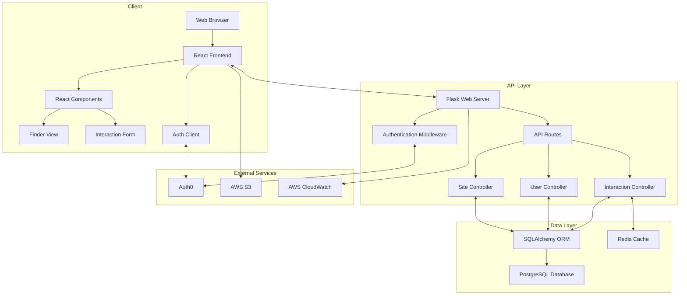
```mermaid
graph TD
    subgraph "Client"
        A[Web Browser] --> B[React Frontend]
        B --> C[React Components]
        C --> D[Finder View]
        C --> E[Interaction Form]
        B --> F[Auth Client]
    end
    
    subgraph "API Layer"
        G[Flask Web Server]
        G --> H[Authentication Middleware]
        G --> I[API Routes]
        I --> J[Interaction Controller]
        I --> K[User Controller]
        I --> L[Site Controller]
    end
    
    subgraph "Data Layer"
        M[SQLAlchemy ORM]
        M --> N[PostgreSQL Database]
        O[Redis Cache]
    end
    
    subgraph "External Services"
        P[Auth0]
        Q[AWS S3]
        R[AWS CloudWatch]
    end
    
    F <--> P
    B <--> G
    H <--> P
    J <--> M
    K <--> M
    L <--> M
    J <--> O
    G --> R
    B --> Q
```

### 3.7 DEPLOYMENT PIPELINE

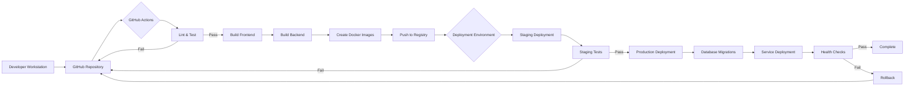
```mermaid
graph LR
    A[Developer Workstation] --> B[GitHub Repository]
    B --> C{GitHub Actions}
    
    C --> D[Lint & Test]
    D -->|Pass| E[Build Frontend]
    D -->|Fail| B
    
    E --> F[Build Backend]
    F --> G[Create Docker Images]
    G --> H[Push to Registry]
    
    H --> I{Deployment Environment}
    I --> J[Staging Deployment]
    J --> K[Staging Tests]
    K -->|Pass| L[Production Deployment]
    K -->|Fail| B
    
    L --> M[Database Migrations]
    M --> N[Service Deployment]
    N --> O[Health Checks]
    O -->|Pass| P[Complete]
    O -->|Fail| Q[Rollback]
    Q --> B
```

## 4. PROCESS FLOWCHART

### 4.1 SYSTEM WORKFLOWS

#### 4.1.1 Core Business Processes

##### User Authentication and Access Workflow

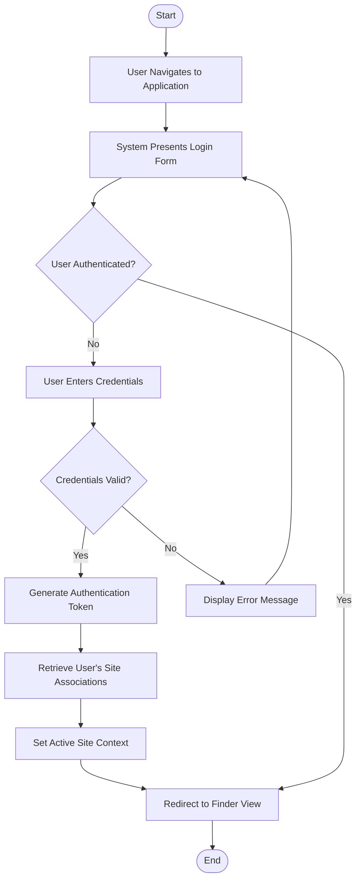
```mermaid
flowchart TD
    Start([Start]) --> A[User Navigates to Application]
    A --> B[System Presents Login Form]
    B --> C{User Authenticated?}
    C -->|No| D[User Enters Credentials]
    D --> E{Credentials Valid?}
    E -->|Yes| F[Generate Authentication Token]
    E -->|No| G[Display Error Message]
    G --> B
    F --> H[Retrieve User's Site Associations]
    H --> I[Set Active Site Context]
    I --> J[Redirect to Finder View]
    C -->|Yes| J
    J --> End([End])
```

##### Interaction Management Workflow

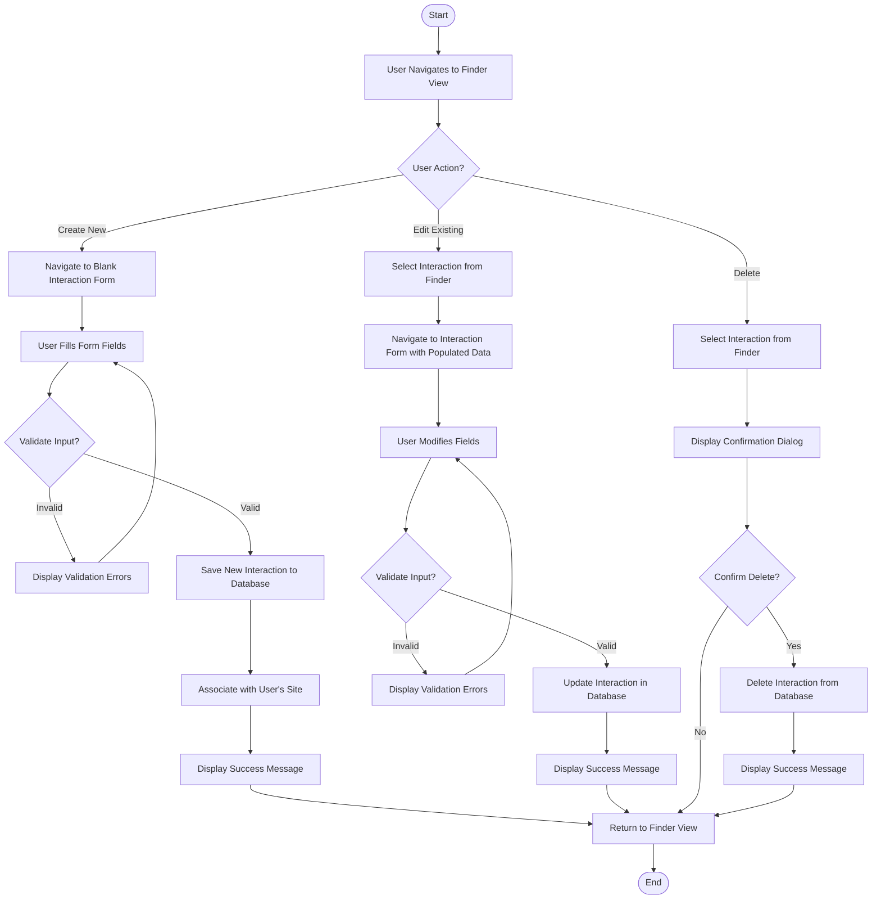
```mermaid
flowchart TD
    Start([Start]) --> A[User Navigates to Finder View]
    A --> B{User Action?}
    
    B -->|Create New| C[Navigate to Blank Interaction Form]
    C --> D[User Fills Form Fields]
    D --> E{Validate Input?}
    E -->|Invalid| F[Display Validation Errors]
    F --> D
    E -->|Valid| G[Save New Interaction to Database]
    G --> H[Associate with User's Site]
    H --> I[Display Success Message]
    I --> J[Return to Finder View]
    
    B -->|Edit Existing| K[Select Interaction from Finder]
    K --> L[Navigate to Interaction Form with Populated Data]
    L --> M[User Modifies Fields]
    M --> N{Validate Input?}
    N -->|Invalid| O[Display Validation Errors]
    O --> M
    N -->|Valid| P[Update Interaction in Database]
    P --> Q[Display Success Message]
    Q --> J
    
    B -->|Delete| R[Select Interaction from Finder]
    R --> S[Display Confirmation Dialog]
    S --> T{Confirm Delete?}
    T -->|No| J
    T -->|Yes| U[Delete Interaction from Database]
    U --> V[Display Success Message]
    V --> J
    
    J --> End([End])
```

##### Search and Filter Workflow

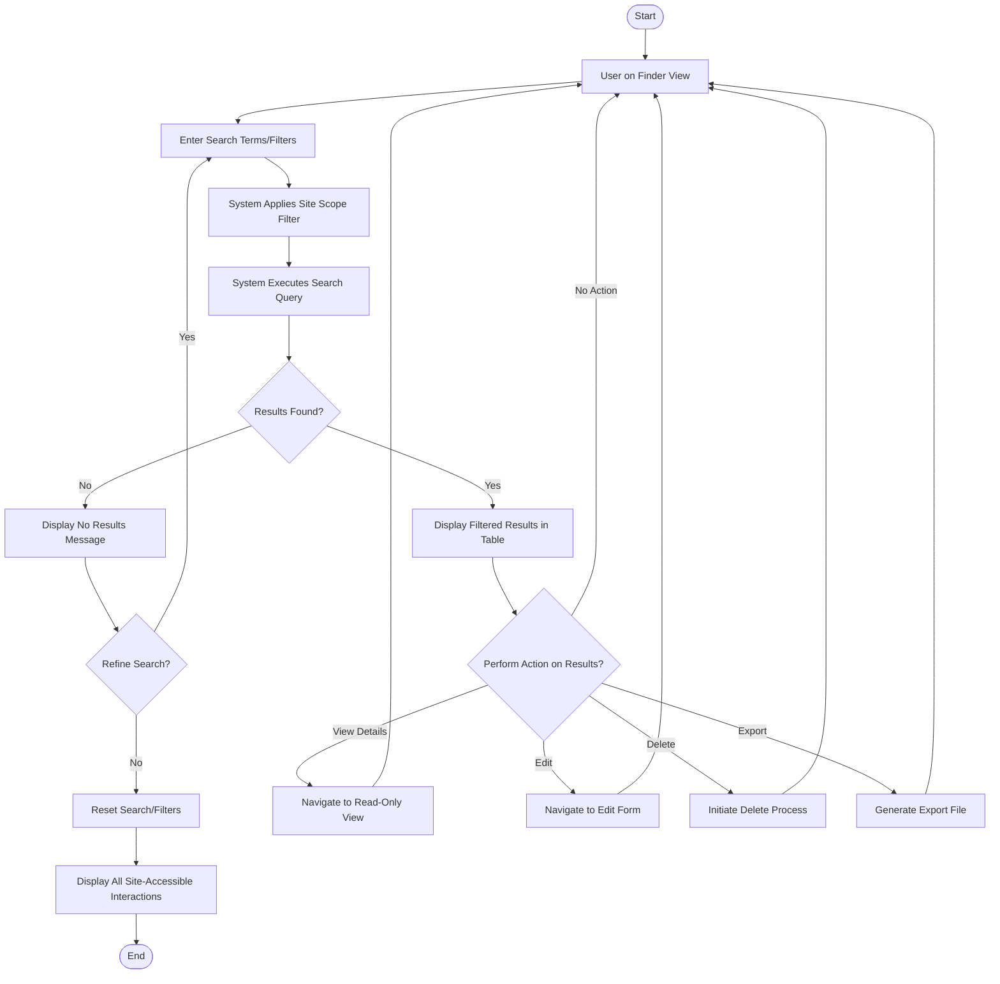
```mermaid
flowchart TD
    Start([Start]) --> A[User on Finder View]
    A --> B[Enter Search Terms/Filters]
    B --> C[System Applies Site Scope Filter]
    C --> D[System Executes Search Query]
    D --> E{Results Found?}
    E -->|Yes| F[Display Filtered Results in Table]
    E -->|No| G[Display No Results Message]
    G --> H{Refine Search?}
    H -->|Yes| B
    H -->|No| I[Reset Search/Filters]
    I --> J[Display All Site-Accessible Interactions]
    F --> K{Perform Action on Results?}
    K -->|View Details| L[Navigate to Read-Only View]
    K -->|Edit| M[Navigate to Edit Form]
    K -->|Delete| N[Initiate Delete Process]
    K -->|Export| O[Generate Export File]
    K -->|No Action| A
    L --> A
    M --> A
    N --> A
    O --> A
    J --> End([End])
```

#### 4.1.2 Integration Workflows

##### Authentication Integration Flow

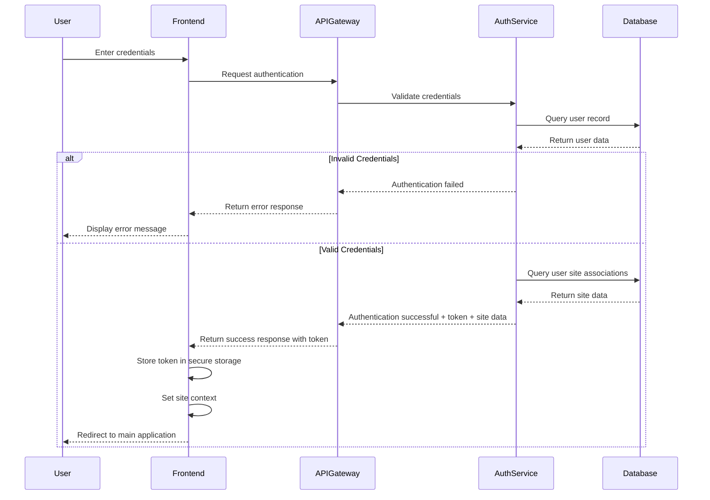
```mermaid
sequenceDiagram
    participant User
    participant Frontend
    participant APIGateway
    participant AuthService
    participant Database
    
    User->>Frontend: Enter credentials
    Frontend->>APIGateway: Request authentication
    APIGateway->>AuthService: Validate credentials
    AuthService->>Database: Query user record
    Database-->>AuthService: Return user data
    
    alt Invalid Credentials
        AuthService-->>APIGateway: Authentication failed
        APIGateway-->>Frontend: Return error response
        Frontend-->>User: Display error message
    else Valid Credentials
        AuthService->>Database: Query user site associations
        Database-->>AuthService: Return site data
        AuthService-->>APIGateway: Authentication successful + token + site data
        APIGateway-->>Frontend: Return success response with token
        Frontend->>Frontend: Store token in secure storage
        Frontend->>Frontend: Set site context
        Frontend-->>User: Redirect to main application
    end
```

##### Data Persistence Workflow

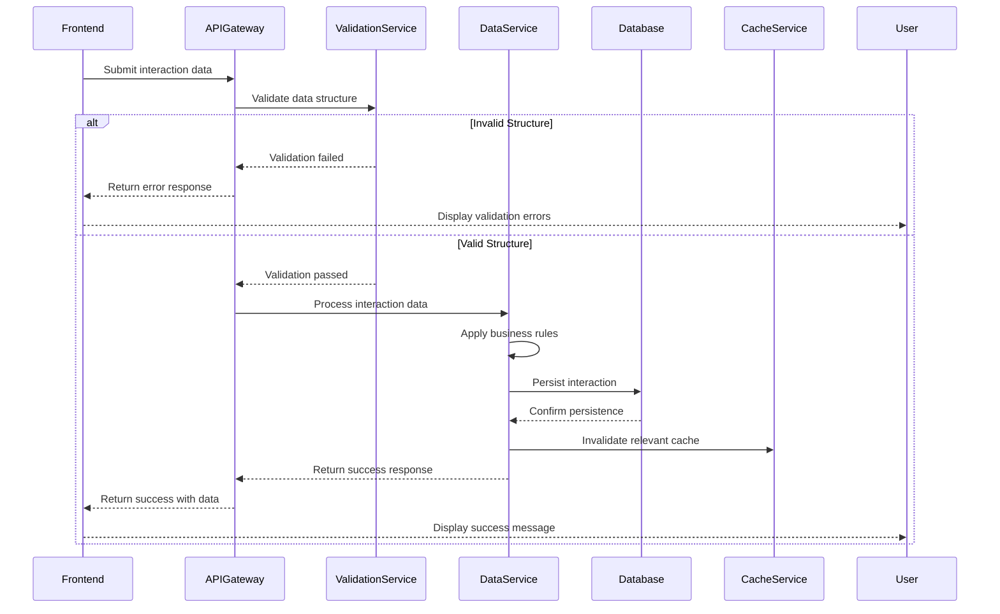
```mermaid
sequenceDiagram
    participant Frontend
    participant APIGateway
    participant ValidationService
    participant DataService
    participant Database
    participant CacheService
    
    Frontend->>APIGateway: Submit interaction data
    APIGateway->>ValidationService: Validate data structure
    
    alt Invalid Structure
        ValidationService-->>APIGateway: Validation failed
        APIGateway-->>Frontend: Return error response
        Frontend-->>User: Display validation errors
    else Valid Structure
        ValidationService-->>APIGateway: Validation passed
        APIGateway->>DataService: Process interaction data
        DataService->>DataService: Apply business rules
        DataService->>Database: Persist interaction
        Database-->>DataService: Confirm persistence
        DataService->>CacheService: Invalidate relevant cache
        DataService-->>APIGateway: Return success response
        APIGateway-->>Frontend: Return success with data
        Frontend-->>User: Display success message
    end
```

### 4.2 FLOWCHART REQUIREMENTS

#### 4.2.1 Authentication Workflow Requirements

| Process Step | Business Rules | Validation Requirements | Authorization | Error Handling |
|--------------|----------------|-------------------------|---------------|----------------|
| Present Login Form | N/A | N/A | None | Redirect to login if accessing protected route |
| Credential Submission | Max 5 failed attempts before lockout | Non-empty fields, minimum password length | None | Display specific error messages for invalid credentials |
| Token Generation | 24-hour expiration | N/A | Valid credentials | Regenerate on session timeout |
| Site Context Setting | User must have at least one site | Site must exist in system | User must be associated with site | Default to first available site if selected site is invalid |
| Access to Finder | N/A | Token must be valid | Valid token with site context | Redirect to login if token expired or invalid |

#### 4.2.2 Interaction Management Requirements

| Process Step | Business Rules | Validation Requirements | Authorization | Error Handling |
|--------------|----------------|-------------------------|---------------|----------------|
| Create Interaction | Auto-associate with user's site | All required fields present | User authenticated | Validation errors displayed inline |
| Edit Interaction | Maintain site association | All required fields valid | User has access to site | Cannot edit if no access to site |
| Delete Interaction | Soft delete with timestamp | Interaction must exist | User has access to site | Prevent deletion if referenced by other entities |
| View Interaction | Only show fields user has access to | N/A | User has access to site | Display limited data if partial access |
| Form Submission | Check for duplicate titles | Date range valid, end date after start date | User authenticated | Transaction rollback on failure |

#### 4.2.3 Search and Filter Requirements

| Process Step | Business Rules | Validation Requirements | Authorization | Error Handling |
|--------------|----------------|-------------------------|---------------|----------------|
| Search Execution | Always apply site scope | Sanitize search input | User has site access | Graceful timeout for long-running searches |
| Filter Application | Default sort by most recent | Valid field names for filtering | User has field access | Ignore invalid filters |
| Result Display | Paginate results (25 per page) | N/A | User has site access | Show message for empty results |
| Export Results | Limit to 1000 records per export | Valid export format selected | User has export permission | Timeout notification for large exports |
| Sort Operation | Support multiple field sorting | Valid sort fields | User has field access | Fallback to default sort if invalid |

### 4.3 TECHNICAL IMPLEMENTATION

#### 4.3.1 State Management

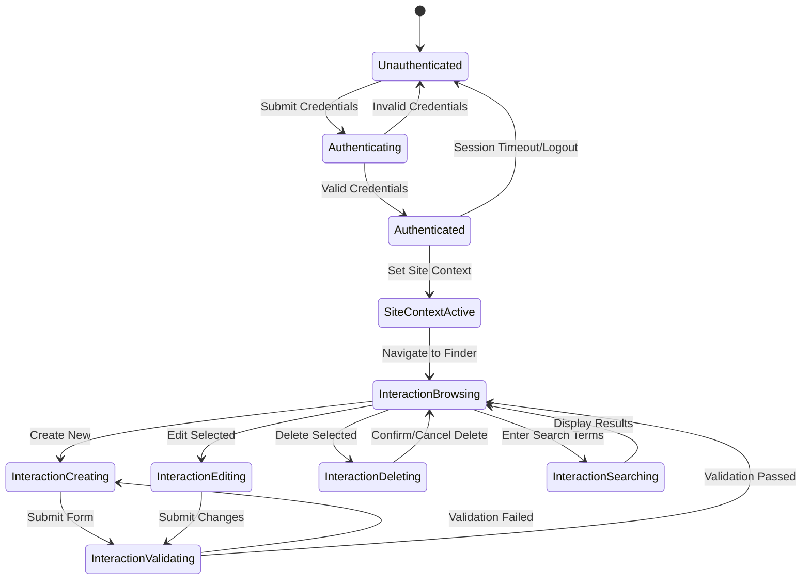
```mermaid
stateDiagram-v2
    [*] --> Unauthenticated
    Unauthenticated --> Authenticating: Submit Credentials
    Authenticating --> Authenticated: Valid Credentials
    Authenticating --> Unauthenticated: Invalid Credentials
    
    Authenticated --> SiteContextActive: Set Site Context
    SiteContextActive --> InteractionBrowsing: Navigate to Finder
    
    InteractionBrowsing --> InteractionCreating: Create New
    InteractionCreating --> InteractionValidating: Submit Form
    InteractionValidating --> InteractionCreating: Validation Failed
    InteractionValidating --> InteractionBrowsing: Validation Passed
    
    InteractionBrowsing --> InteractionEditing: Edit Selected
    InteractionEditing --> InteractionValidating: Submit Changes
    
    InteractionBrowsing --> InteractionDeleting: Delete Selected
    InteractionDeleting --> InteractionBrowsing: Confirm/Cancel Delete
    
    InteractionBrowsing --> InteractionSearching: Enter Search Terms
    InteractionSearching --> InteractionBrowsing: Display Results
    
    Authenticated --> Unauthenticated: Session Timeout/Logout
```

#### 4.3.2 Transaction Boundaries

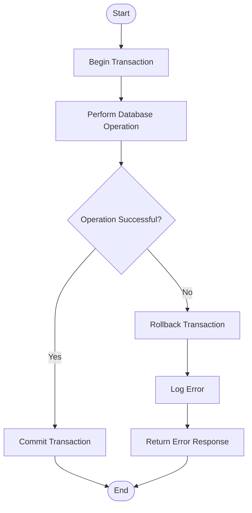
```mermaid
flowchart TD
    Start([Start]) --> A[Begin Transaction]
    A --> B[Perform Database Operation]
    B --> C{Operation Successful?}
    C -->|Yes| D[Commit Transaction]
    C -->|No| E[Rollback Transaction]
    D --> End([End])
    E --> F[Log Error]
    F --> G[Return Error Response]
    G --> End
```

#### 4.3.3 Error Handling Flow

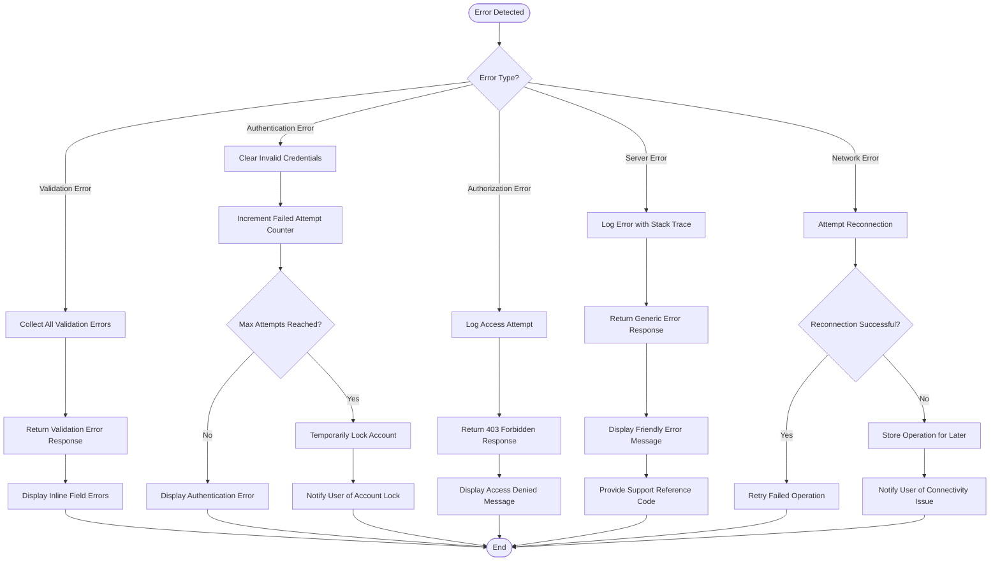
```mermaid
flowchart TD
    Start([Error Detected]) --> A{Error Type?}
    
    A -->|Validation Error| B[Collect All Validation Errors]
    B --> C[Return Validation Error Response]
    C --> D[Display Inline Field Errors]
    
    A -->|Authentication Error| E[Clear Invalid Credentials]
    E --> F[Increment Failed Attempt Counter]
    F --> G{Max Attempts Reached?}
    G -->|Yes| H[Temporarily Lock Account]
    G -->|No| I[Display Authentication Error]
    H --> J[Notify User of Account Lock]
    
    A -->|Authorization Error| K[Log Access Attempt]
    K --> L[Return 403 Forbidden Response]
    L --> M[Display Access Denied Message]
    
    A -->|Server Error| N[Log Error with Stack Trace]
    N --> O[Return Generic Error Response]
    O --> P[Display Friendly Error Message]
    P --> Q[Provide Support Reference Code]
    
    A -->|Network Error| R[Attempt Reconnection]
    R --> S{Reconnection Successful?}
    S -->|Yes| T[Retry Failed Operation]
    S -->|No| U[Store Operation for Later]
    U --> V[Notify User of Connectivity Issue]
    
    D --> End([End])
    I --> End
    J --> End
    M --> End
    Q --> End
    T --> End
    V --> End
```

### 4.4 REQUIRED DIAGRAMS

#### 4.4.1 High-Level System Workflow

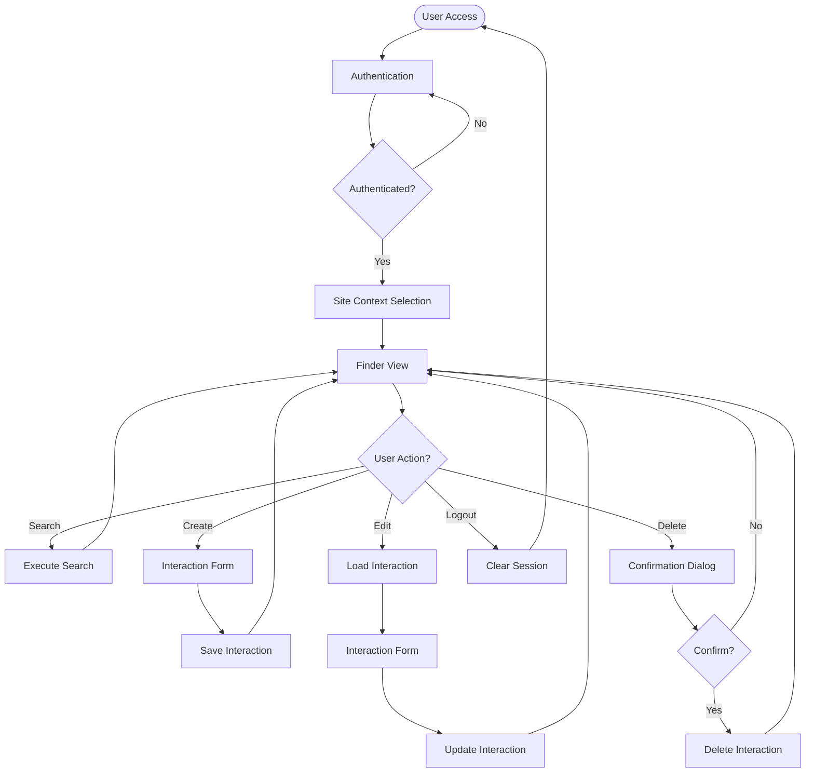
```mermaid
flowchart TD
    Start([User Access]) --> A[Authentication]
    A --> B{Authenticated?}
    B -->|No| A
    B -->|Yes| C[Site Context Selection]
    C --> D[Finder View]
    
    D --> E{User Action?}
    E -->|Search| F[Execute Search]
    F --> D
    
    E -->|Create| G[Interaction Form]
    G --> H[Save Interaction]
    H --> D
    
    E -->|Edit| I[Load Interaction]
    I --> J[Interaction Form]
    J --> K[Update Interaction]
    K --> D
    
    E -->|Delete| L[Confirmation Dialog]
    L --> M{Confirm?}
    M -->|Yes| N[Delete Interaction]
    M -->|No| D
    N --> D
    
    E -->|Logout| O[Clear Session]
    O --> Start
```

#### 4.4.2 Detailed Authentication Flow

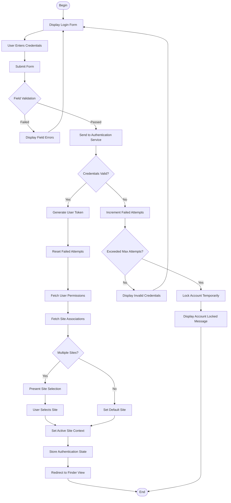
```mermaid
flowchart TD
    Start([Begin]) --> A[Display Login Form]
    A --> B[User Enters Credentials]
    B --> C[Submit Form]
    C --> D{Field Validation}
    D -->|Failed| E[Display Field Errors]
    E --> A
    D -->|Passed| F[Send to Authentication Service]
    F --> G{Credentials Valid?}
    G -->|No| H[Increment Failed Attempts]
    H --> I{Exceeded Max Attempts?}
    I -->|Yes| J[Lock Account Temporarily]
    J --> K[Display Account Locked Message]
    I -->|No| L[Display Invalid Credentials]
    L --> A
    G -->|Yes| M[Generate User Token]
    M --> N[Reset Failed Attempts]
    N --> O[Fetch User Permissions]
    O --> P[Fetch Site Associations]
    P --> Q{Multiple Sites?}
    Q -->|Yes| R[Present Site Selection]
    R --> S[User Selects Site]
    Q -->|No| T[Set Default Site]
    S --> U[Set Active Site Context]
    T --> U
    U --> V[Store Authentication State]
    V --> W[Redirect to Finder View]
    W --> End([End])
    K --> End
```

#### 4.4.3 Interaction CRUD Operations Flow

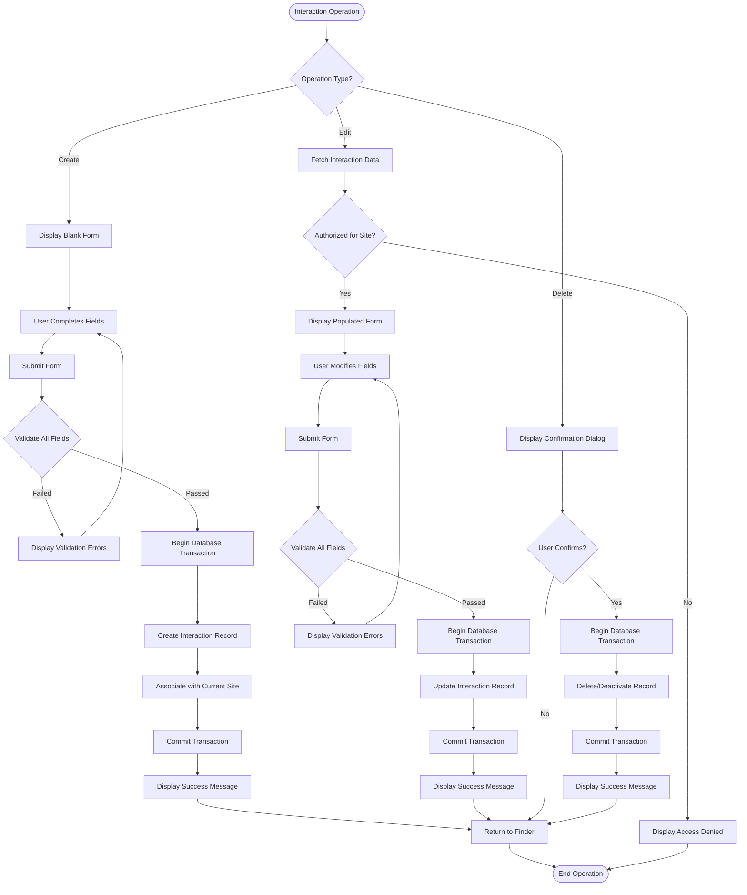
```mermaid
flowchart TD
    Start([Interaction Operation]) --> A{Operation Type?}
    
    A -->|Create| B[Display Blank Form]
    B --> C[User Completes Fields]
    C --> D[Submit Form]
    D --> E{Validate All Fields}
    E -->|Failed| F[Display Validation Errors]
    F --> C
    E -->|Passed| G[Begin Database Transaction]
    G --> H[Create Interaction Record]
    H --> I[Associate with Current Site]
    I --> J[Commit Transaction]
    J --> K[Display Success Message]
    K --> L[Return to Finder]
    
    A -->|Edit| M[Fetch Interaction Data]
    M --> N{Authorized for Site?}
    N -->|No| O[Display Access Denied]
    N -->|Yes| P[Display Populated Form]
    P --> Q[User Modifies Fields]
    Q --> R[Submit Form]
    R --> S{Validate All Fields}
    S -->|Failed| T[Display Validation Errors]
    T --> Q
    S -->|Passed| U[Begin Database Transaction]
    U --> V[Update Interaction Record]
    V --> W[Commit Transaction]
    W --> X[Display Success Message]
    X --> L
    
    A -->|Delete| Y[Display Confirmation Dialog]
    Y --> Z{User Confirms?}
    Z -->|No| L
    Z -->|Yes| AA[Begin Database Transaction]
    AA --> AB[Delete/Deactivate Record]
    AB --> AC[Commit Transaction]
    AC --> AD[Display Success Message]
    AD --> L
    
    L --> End([End Operation])
    O --> End
```

#### 4.4.4 Search and Filter Process Flow

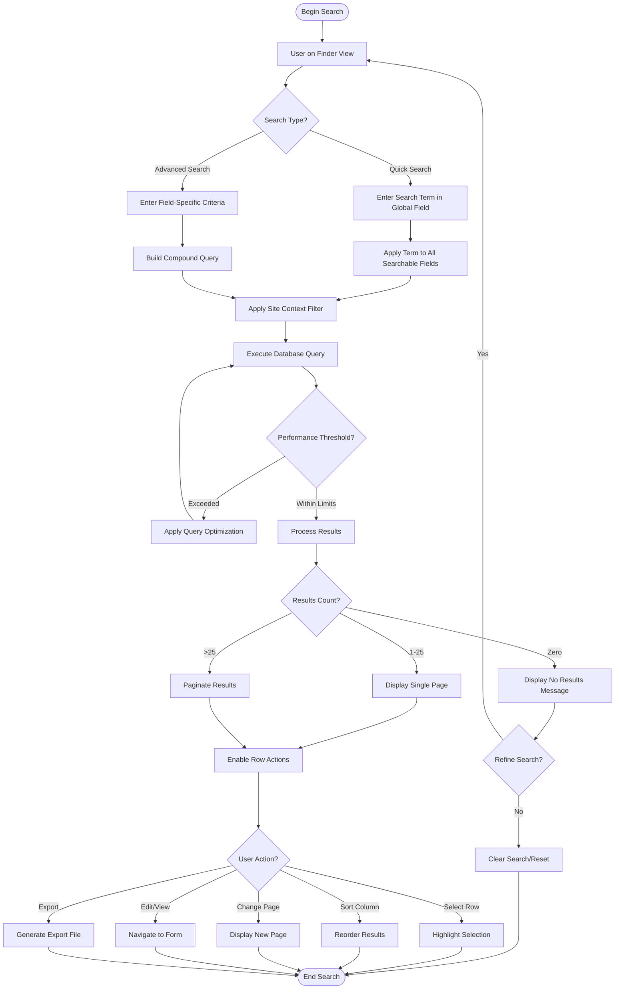
```mermaid
flowchart TD
    Start([Begin Search]) --> A[User on Finder View]
    A --> B{Search Type?}
    
    B -->|Quick Search| C[Enter Search Term in Global Field]
    C --> D[Apply Term to All Searchable Fields]
    
    B -->|Advanced Search| E[Enter Field-Specific Criteria]
    E --> F[Build Compound Query]
    
    D --> G[Apply Site Context Filter]
    F --> G
    
    G --> H[Execute Database Query]
    H --> I{Performance Threshold?}
    I -->|Exceeded| J[Apply Query Optimization]
    J --> H
    I -->|Within Limits| K[Process Results]
    
    K --> L{Results Count?}
    L -->|Zero| M[Display No Results Message]
    L -->|1-25| N[Display Single Page]
    L -->|>25| O[Paginate Results]
    
    M --> P{Refine Search?}
    P -->|Yes| A
    P -->|No| Q[Clear Search/Reset]
    
    N --> R[Enable Row Actions]
    O --> R
    
    R --> S{User Action?}
    S -->|Select Row| T[Highlight Selection]
    S -->|Sort Column| U[Reorder Results]
    S -->|Change Page| V[Display New Page]
    S -->|Edit/View| W[Navigate to Form]
    S -->|Export| X[Generate Export File]
    
    Q --> End([End Search])
    T --> End
    U --> End
    V --> End
    W --> End
    X --> End
```

#### 4.4.5 State Transition Diagram for Interaction Lifecycle

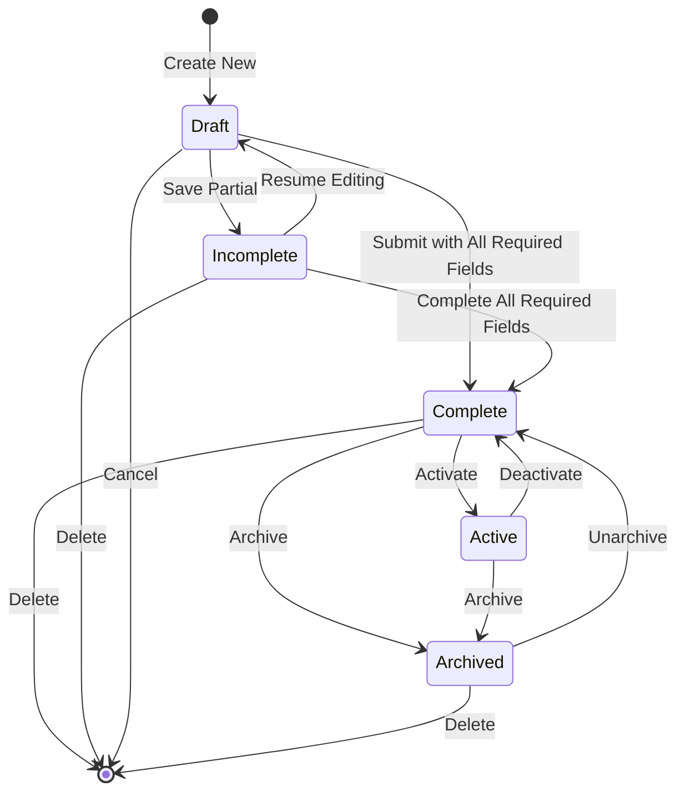
```mermaid
stateDiagram-v2
    [*] --> Draft: Create New
    
    Draft --> Incomplete: Save Partial
    Incomplete --> Draft: Resume Editing
    
    Draft --> Complete: Submit with All Required Fields
    Incomplete --> Complete: Complete All Required Fields
    
    Complete --> Active: Activate
    Active --> Complete: Deactivate
    
    Complete --> Archived: Archive
    Active --> Archived: Archive
    
    Archived --> Complete: Unarchive
    
    Complete --> [*]: Delete
    Incomplete --> [*]: Delete
    Draft --> [*]: Cancel
    Archived --> [*]: Delete
```

## 5. SYSTEM ARCHITECTURE

### 5.1 HIGH-LEVEL ARCHITECTURE

#### System Overview

The Interaction Management System follows a modern multi-tier web application architecture, organized into discrete functional layers that separate concerns while maintaining clear communication paths. The architecture employs a client-server model with:

- **Presentation Layer**: A React-based single-page application (SPA) providing the user interface
- **Application Layer**: A Flask-based RESTful API handling business logic and data operations
- **Data Layer**: A PostgreSQL database with a structured schema for storing interactions, users, and sites

The system adheres to the following key architectural principles:

- **Separation of Concerns**: Frontend and backend are decoupled, communicating only via defined API contracts
- **Site-Based Multi-Tenancy**: Data isolation occurs at the application layer through site-scoping filters
- **Stateless Backend**: Authentication state is maintained via tokens, allowing for horizontal scaling
- **Progressive Enhancement**: Core functionality works with minimal JavaScript, with enhanced features for modern browsers

System boundaries are clearly defined with the frontend communicating exclusively through the API gateway, which serves as the single entry point to the backend services.

#### Core Components Table

| Component Name | Primary Responsibility | Key Dependencies | Critical Considerations |
|----------------|------------------------|------------------|------------------------|
| Authentication Service | Manage user sessions and site access | Auth0, User/Site Database | Token security, session duration, site context preservation |
| Finder Component | Display and search interaction data | API Gateway, React Query | Search performance, pagination handling, data filtering |
| Interaction Form | Create and edit interaction records | Form validation library, API Gateway | Field validation, error handling, optimistic updates |
| API Gateway | Route requests, enforce authentication | Flask, JWT middleware | Rate limiting, request validation, error standardization |
| Interaction Service | Process interaction CRUD operations | Database, Validation Rules | Data integrity, transaction management, site-scoping |
| Site Context Manager | Maintain site-scoping for data access | User-Site associations | Consistent application across all data operations |
| Database Layer | Persist application data | PostgreSQL, SQLAlchemy | Data relationships, indexing strategy, query optimization |

#### Data Flow Description

The primary data flow begins with user authentication, where credentials are verified against the user database with site associations loaded into the session context. Once authenticated, the site context becomes a mandatory filter for all subsequent data operations.

For the Finder view, interaction data flows from the database through the API gateway, with the site context automatically applied as a filter at the service layer. Search parameters and pagination information flow from the frontend to the backend, with result sets returned as paginated JSON responses.

When creating or editing an interaction, form data flows from the frontend to the validation layer, which enforces business rules before persisting changes to the database. All interactions are automatically associated with the user's active site context.

The system employs a request-response pattern over HTTPS using JSON as the primary data exchange format. Authentication state is maintained via JWT tokens stored in secure browser storage, with the token included in the Authorization header of all API requests.

Key data transformation points include:
- Form submission normalization (handling date/time formats and timezones)
- Search query parsing and optimization
- Response formatting with pagination metadata

#### External Integration Points

| System Name | Integration Type | Data Exchange Pattern | Protocol/Format | SLA Requirements |
|-------------|------------------|------------------------|-----------------|-----------------|
| Auth0 | Authentication Provider | Request-Response | HTTPS/JSON | 99.9% availability, <500ms response time |
| AWS S3 | Static Asset Storage | Unidirectional | HTTPS | 99.99% availability, <100ms retrieval time |
| AWS CloudWatch | Logging/Monitoring | Unidirectional | HTTPS/JSON | 99.9% availability, <1s log ingestion |
| SendGrid | Email Notifications | Unidirectional | SMTP/HTTPS | 99.5% availability, <5min delivery time |

### 5.2 COMPONENT DETAILS

#### 5.2.1 Frontend Application

The frontend application is a React-based SPA responsible for presenting the user interface and managing client-side state. It consists of three main components:

- **Authentication Component**: Manages login process, token storage, and session state
- **Finder Component**: Renders the searchable table view with filtering and pagination
- **Interaction Form Component**: Handles creation and editing of interaction records

**Technologies and Frameworks**:
- React for component-based UI development
- React Router for client-side navigation
- React Query for data fetching and state management
- React Hook Form for form validation
- TailwindCSS for styling

**Key Interfaces**:
- REST API endpoints for data operations
- Browser Storage API for token persistence
- Window History API for navigation

**Data Persistence**:
- JWT tokens in secure browser storage
- Form state in React component state
- Query cache in React Query store

**Scaling Considerations**:
- Bundle splitting for improved load times
- Optimistic UI updates to reduce perceived latency
- Virtualized lists for large data sets

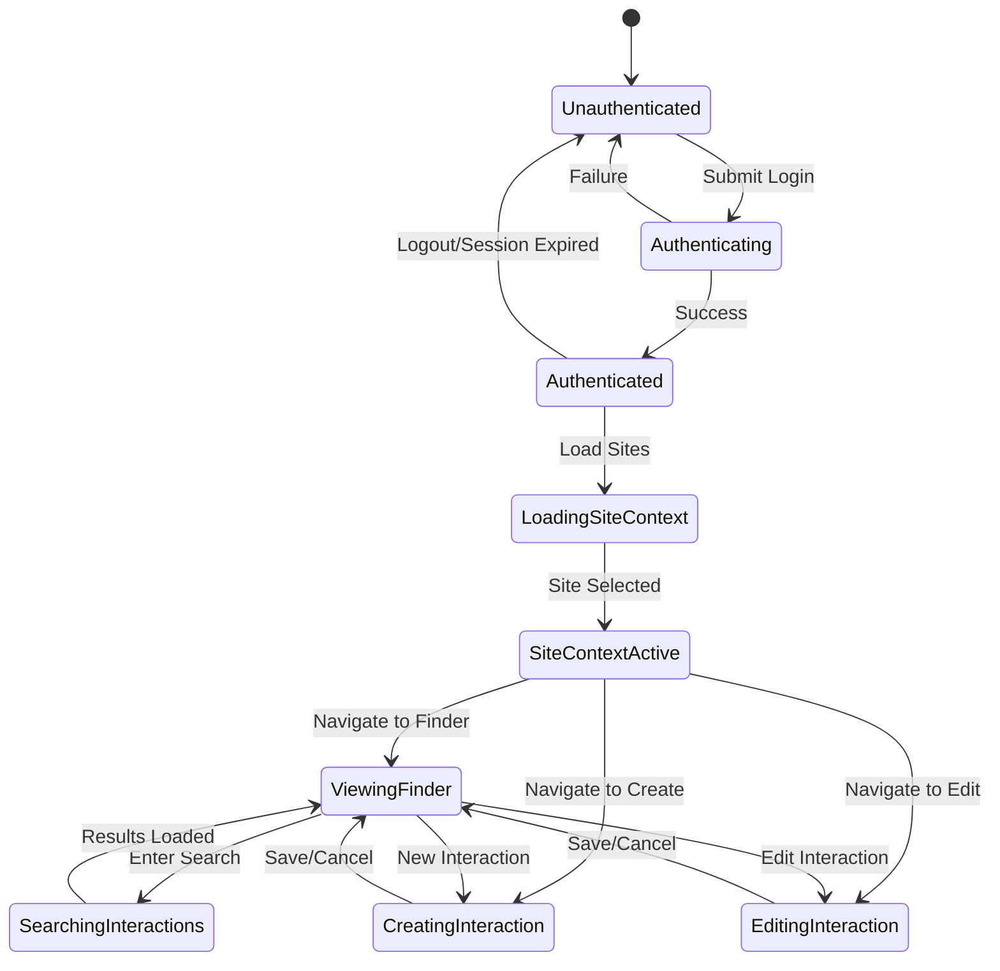
```mermaid
stateDiagram-v2
    [*] --> Unauthenticated
    Unauthenticated --> Authenticating: Submit Login
    Authenticating --> Authenticated: Success
    Authenticating --> Unauthenticated: Failure
    
    Authenticated --> LoadingSiteContext: Load Sites
    LoadingSiteContext --> SiteContextActive: Site Selected
    
    SiteContextActive --> ViewingFinder: Navigate to Finder
    SiteContextActive --> CreatingInteraction: Navigate to Create
    SiteContextActive --> EditingInteraction: Navigate to Edit
    
    ViewingFinder --> SearchingInteractions: Enter Search
    SearchingInteractions --> ViewingFinder: Results Loaded
    
    ViewingFinder --> CreatingInteraction: New Interaction
    ViewingFinder --> EditingInteraction: Edit Interaction
    
    CreatingInteraction --> ViewingFinder: Save/Cancel
    EditingInteraction --> ViewingFinder: Save/Cancel
    
    Authenticated --> Unauthenticated: Logout/Session Expired
```

#### 5.2.2 API Gateway

The API Gateway serves as the entry point for all client requests, handling authentication verification, request routing, and response formatting.

**Technologies and Frameworks**:
- Flask web framework
- Flask-JWT-Extended for token handling
- Flask-CORS for cross-origin support

**Key Interfaces**:
- RESTful endpoints for all data operations
- Authentication verification middleware
- Error handling middleware

**Data Persistence**:
- No direct data persistence (stateless)
- Relies on downstream services for data operations

**Scaling Considerations**:
- Horizontally scalable behind load balancer
- Rate limiting per user/IP
- Request caching for common queries

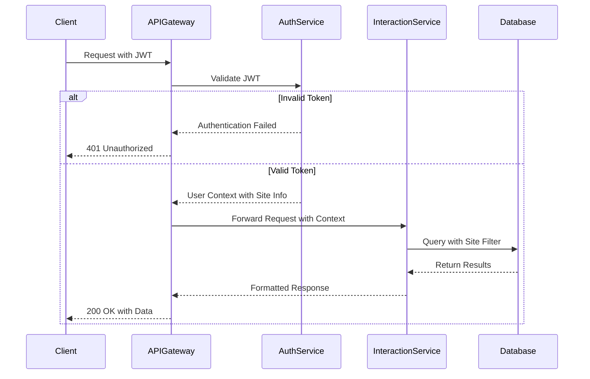
```mermaid
sequenceDiagram
    participant Client
    participant APIGateway
    participant AuthService
    participant InteractionService
    participant Database
    
    Client->>APIGateway: Request with JWT
    APIGateway->>AuthService: Validate JWT
    
    alt Invalid Token
        AuthService-->>APIGateway: Authentication Failed
        APIGateway-->>Client: 401 Unauthorized
    else Valid Token
        AuthService-->>APIGateway: User Context with Site Info
        APIGateway->>InteractionService: Forward Request with Context
        InteractionService->>Database: Query with Site Filter
        Database-->>InteractionService: Return Results
        InteractionService-->>APIGateway: Formatted Response
        APIGateway-->>Client: 200 OK with Data
    end
```

#### 5.2.3 Interaction Service

The Interaction Service handles all CRUD operations for interaction records, enforcing business rules, validation, and site-scoping.

**Technologies and Frameworks**:
- Python business logic layer
- SQLAlchemy ORM for database operations
- Marshmallow for data validation and serialization

**Key Interfaces**:
- Internal service methods for interaction operations
- Data validation rules
- Database transaction management

**Data Persistence**:
- PostgreSQL database for interaction records
- Redis cache for frequently accessed data

**Scaling Considerations**:
- Database connection pooling
- Query optimization for large result sets
- Caching strategy for repeated searches

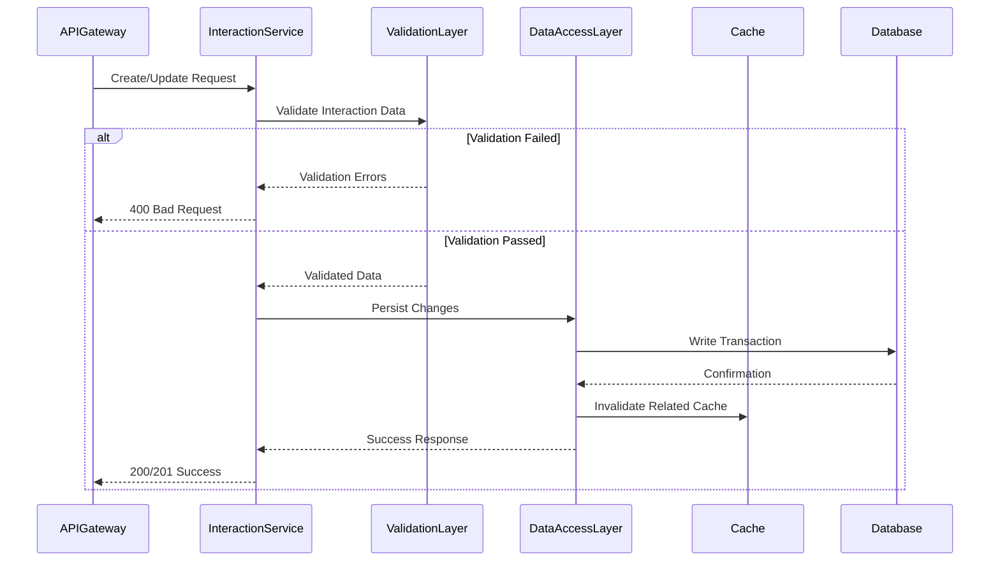
```mermaid
sequenceDiagram
    participant APIGateway
    participant InteractionService
    participant ValidationLayer
    participant DataAccessLayer
    participant Cache
    participant Database
    
    APIGateway->>InteractionService: Create/Update Request
    InteractionService->>ValidationLayer: Validate Interaction Data
    
    alt Validation Failed
        ValidationLayer-->>InteractionService: Validation Errors
        InteractionService-->>APIGateway: 400 Bad Request
    else Validation Passed
        ValidationLayer-->>InteractionService: Validated Data
        InteractionService->>DataAccessLayer: Persist Changes
        DataAccessLayer->>Database: Write Transaction
        Database-->>DataAccessLayer: Confirmation
        DataAccessLayer->>Cache: Invalidate Related Cache
        DataAccessLayer-->>InteractionService: Success Response
        InteractionService-->>APIGateway: 200/201 Success
    end
```

#### 5.2.4 Site Context Manager

The Site Context Manager ensures all data operations are properly scoped to the user's authorized sites, maintaining multi-tenant data isolation.

**Technologies and Frameworks**:
- Custom middleware implementation
- Integration with authentication system

**Key Interfaces**:
- Context injection into request pipeline
- Site selection and switching API

**Data Persistence**:
- Site context in user session
- Site-user relationships in database

**Scaling Considerations**:
- Minimal overhead for request processing
- Caching of user-site relationships

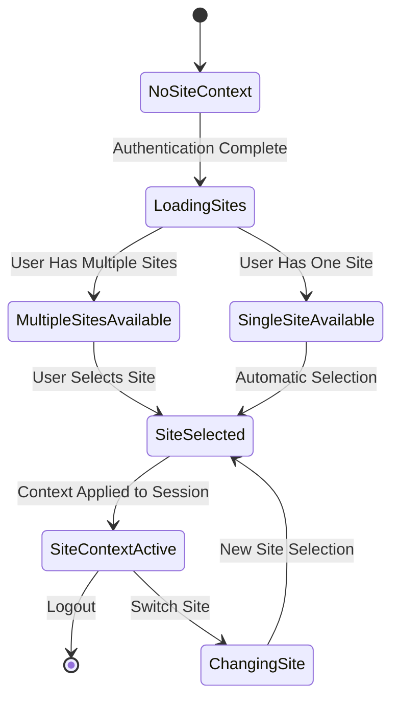
```mermaid
stateDiagram-v2
    [*] --> NoSiteContext
    NoSiteContext --> LoadingSites: Authentication Complete
    LoadingSites --> MultipleSitesAvailable: User Has Multiple Sites
    LoadingSites --> SingleSiteAvailable: User Has One Site
    
    MultipleSitesAvailable --> SiteSelected: User Selects Site
    SingleSiteAvailable --> SiteSelected: Automatic Selection
    
    SiteSelected --> SiteContextActive: Context Applied to Session
    SiteContextActive --> [*]: Logout
    
    SiteContextActive --> ChangingSite: Switch Site
    ChangingSite --> SiteSelected: New Site Selection
```

#### 5.2.5 Database Layer

The Database Layer provides structured storage for all application data with proper relationships between entities.

**Technologies and Frameworks**:
- PostgreSQL database
- SQLAlchemy ORM
- Alembic for migrations

**Key Interfaces**:
- SQL query interface
- ORM models for application entities

**Data Persistence**:
- User accounts and authentication data
- Site definitions and relationships
- Interaction records with metadata

**Scaling Considerations**:
- Indexing strategy for search performance
- Partitioning for large datasets
- Connection pooling for concurrent access

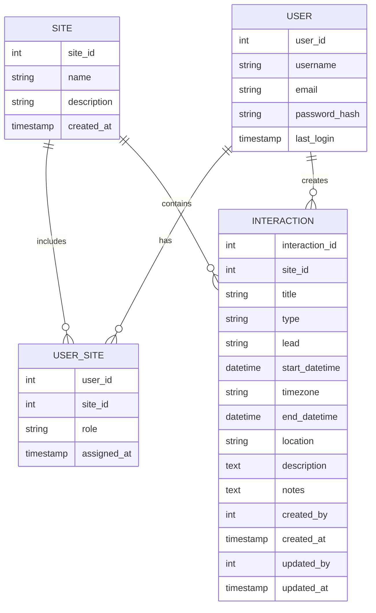
```mermaid
erDiagram
    SITE {
        int site_id
        string name
        string description
        timestamp created_at
    }
    
    USER {
        int user_id
        string username
        string email
        string password_hash
        timestamp last_login
    }
    
    USER_SITE {
        int user_id
        int site_id
        string role
        timestamp assigned_at
    }
    
    INTERACTION {
        int interaction_id
        int site_id
        string title
        string type
        string lead
        datetime start_datetime
        string timezone
        datetime end_datetime
        string location
        text description
        text notes
        int created_by
        timestamp created_at
        int updated_by
        timestamp updated_at
    }
    
    USER ||--o{ USER_SITE : has
    SITE ||--o{ USER_SITE : includes
    SITE ||--o{ INTERACTION : contains
    USER ||--o{ INTERACTION : creates
```

### 5.3 TECHNICAL DECISIONS

#### 5.3.1 Architecture Style Decisions

| Decision Area | Selected Approach | Alternatives Considered | Justification |
|---------------|-------------------|-------------------------|---------------|
| Overall Pattern | Multi-tier Web Application | Microservices, Monolith | The system's moderate complexity and clear separation of concerns makes a multi-tier approach optimal while avoiding microservice overhead |
| Frontend Architecture | React SPA | Server-rendered MVC, Multi-page application | Rich client-side interactions and form validation benefit from React's component model without requiring server roundtrips |
| API Design | RESTful API | GraphQL, RPC | RESTful architecture provides familiar patterns, good tooling support, and stateless scalability appropriate for the system's data operations |
| Data Storage | Relational Database | Document store, Key-value store | The structured nature of interactions and site-user relationships benefit from a relational model with referential integrity |

The multi-tier architecture with a React frontend, RESTful API, and relational database provides a balanced approach that addresses the system requirements while maintaining simplicity. This approach enables:

- Clear separation between presentation and business logic
- Independent scaling of frontend and backend components
- Familiar development patterns for the team
- Strong data integrity for relationships between interactions, users, and sites

```mermaid
graph TD
    subgraph "Alternative Architectures"
        A[Microservices] -->|Rejected| B{Decision Point}
        C[Monolith] -->|Rejected| B
        D[Multi-tier] -->|Selected| B
        
        B -->|Rationale| E[Appropriate complexity]
        B -->|Rationale| F[Clear separation of concerns]
        B -->|Rationale| G[Simplified deployment]
        B -->|Rationale| H[Adequate scalability]
    end
```

#### 5.3.2 Communication Pattern Choices

| Pattern | Implementation | Use Cases | Rationale |
|---------|----------------|-----------|-----------|
| Request-Response | RESTful API endpoints | All CRUD operations | Provides simple, stateless communication with well-defined status codes and error handling |
| Client-side State | React state and context | UI state, form data | Reduces server load for ephemeral UI states while maintaining responsive interface |
| Caching | API response caching, React Query | Repeated searches, reference data | Improves performance and reduces database load for common queries |
| Form Submission | Validated JSON payloads | Creating/editing interactions | Ensures data integrity with client and server validation |

The primary communication pattern is synchronous request-response over HTTPS, which aligns with the web application nature of the system. This approach was chosen over asynchronous messaging patterns due to:

- Immediate feedback requirements for user interactions
- Simplified error handling and recovery
- Reduced complexity in the overall architecture
- Direct alignment with RESTful API principles

#### 5.3.3 Data Storage Solution Rationale

PostgreSQL was selected as the primary data store due to its robust support for:

- Complex data relationships (users to sites to interactions)
- Advanced searching capabilities needed for the Finder
- Strong data integrity guarantees
- Mature ecosystem and tooling

The decision to use a relational database over NoSQL alternatives was driven by:

- The well-defined, stable structure of interaction records
- The importance of referential integrity for site-scoping
- The need for complex multi-field searches
- The value of ACID transactions for data consistency

```mermaid
graph TD
    subgraph "Database Selection Process"
        A[Data Structure Analysis] --> B{Schema Stable?}
        B -->|Yes| C[Consider Relational]
        B -->|No| D[Consider NoSQL]
        
        C --> E{Relationship Complexity}
        E -->|High| F[Relational Preferred]
        E -->|Low| G[Either Viable]
        
        H[Search Requirements] --> I{Complex Queries?}
        I -->|Yes| J[Relational Advantage]
        I -->|No| K[Either Viable]
        
        L[Transaction Needs] --> M{ACID Required?}
        M -->|Yes| N[Relational Required]
        M -->|No| O[Either Viable]
        
        F --> P[PostgreSQL Selected]
        J --> P
        N --> P
    end
```

#### 5.3.4 Caching Strategy Justification

| Cache Type | Implementation | Purpose | Considerations |
|------------|----------------|---------|----------------|
| API Response | Redis TTL cache | Reduce database load for common searches | Cache invalidation on data changes |
| UI State | React Query | Maintain UI responsiveness | Client-side memory considerations |
| Authentication | JWT token | Reduce authentication overhead | Security and token expiration |
| Reference Data | In-memory application cache | Improve performance for static data | Refresh mechanism for updates |

The caching strategy emphasizes a balance between performance and data freshness. Redis was selected for server-side caching due to:

- Support for complex data structures
- Configurable expiration policies
- Cluster support for scaling
- Atomic operations for cache management

Client-side caching using React Query provides:
- Reduced API calls for repeated data
- Automatic background refreshing
- Configurable stale-time policies
- Optimistic UI updates

#### 5.3.5 Security Mechanism Selection

| Security Aspect | Implementation | Purpose | Justification |
|-----------------|----------------|---------|---------------|
| Authentication | JWT tokens | Verify user identity | Stateless nature supports horizontal scaling |
| Authorization | Site-scoped middleware | Enforce data access boundaries | Consistent enforcement at service layer |
| Transport Security | HTTPS | Protect data in transit | Industry standard encryption |
| Input Validation | Client and server validation | Prevent injection attacks | Defense in depth approach |
| CSRF Protection | Anti-forgery tokens | Prevent cross-site request forgery | Critical for form submissions |

The security architecture employs defense in depth with multiple layers of protection. JWT was selected for authentication because:

- It eliminates the need for server-side session storage
- It's self-contained with all necessary information
- It allows for stateless horizontal scaling
- It provides built-in expiration mechanisms

Site-scoping is implemented in middleware to ensure consistent application across all data operations, with no possibility of bypassing this critical security control.

### 5.4 CROSS-CUTTING CONCERNS

#### 5.4.1 Monitoring and Observability Approach

The system implements a comprehensive monitoring strategy focused on:

- **Application Health**: Regular health check endpoints exposing system status
- **Performance Metrics**: Response times, database query performance, and cache hit rates
- **Error Rates**: Tracking of application errors by type and component
- **User Activity**: Anonymized usage patterns and interaction statistics

Monitoring is implemented through AWS CloudWatch with custom dashboards providing visibility into:

- System-wide health indicators
- Component-specific performance metrics
- Error trends and anomalies
- User engagement patterns

Alerts are configured for:
- API response time exceeding thresholds
- Elevated error rates
- Authentication failures above baseline
- Database connection issues

#### 5.4.2 Logging and Tracing Strategy

| Log Category | Information Captured | Retention Period | Access Control |
|--------------|----------------------|------------------|----------------|
| Application Logs | Component operations, performance, errors | 30 days | Operations team |
| Security Logs | Authentication events, authorization failures | 90 days | Security team |
| Audit Logs | Data modifications, sensitive operations | 1 year | Compliance team |
| Access Logs | API calls, resource access | 30 days | Operations team |

The logging strategy implements structured logging with consistent fields across all components:

- Timestamp in ISO 8601 format
- Log level (INFO, WARN, ERROR, DEBUG)
- Component identifier
- Operation context
- User ID (where applicable)
- Site context (where applicable)
- Correlation ID for request tracing
- Message details

Log data is centralized in CloudWatch Logs with appropriate retention policies and access controls. Request tracing is implemented using correlation IDs that flow through all system components, enabling end-to-end visibility of request processing.

#### 5.4.3 Error Handling Patterns

The system implements a consistent error handling strategy across all components:

- **Frontend**: Graceful degradation with informative user messages
- **API Gateway**: Standardized error response format
- **Service Layer**: Categorized exceptions with appropriate HTTP status codes
- **Data Layer**: Transaction management with proper rollback

Error responses follow a standardized format:
```json
{
  "error": {
    "code": "VALIDATION_ERROR",
    "message": "The request contains invalid data",
    "details": [
      {"field": "start_date", "issue": "Must be before end_date"}
    ],
    "requestId": "abc-123-xyz"
  }
}
```

```mermaid
flowchart TD
    A[Error Detected] --> B{Error Type}
    
    B -->|Validation Error| C[Return 400 Bad Request]
    C --> D[Include Field-Specific Details]
    
    B -->|Authentication Error| E[Return 401 Unauthorized]
    E --> F[Clear Invalid Credentials]
    
    B -->|Authorization Error| G[Return 403 Forbidden]
    G --> H[Log Access Attempt]
    
    B -->|Not Found| I[Return 404 Not Found]
    I --> J[Suggest Alternative Resources]
    
    B -->|Server Error| K[Return 500 Internal Server Error]
    K --> L[Log Detailed Error]
    K --> M[Alert Operations Team]
    
    D --> N[Log Validation Failure]
    F --> N
    H --> N
    J --> N
    
    N --> O[Return Standardized Error Response]
    M --> O
```

#### 5.4.4 Authentication and Authorization Framework

The authentication and authorization framework is built around:

- **Authentication**: JWT-based user verification with Auth0 integration
- **Site Context**: Multi-tenant data isolation through site association
- **Permission Model**: Role-based access within sites

The authentication flow consists of:
1. User submits credentials to Auth0
2. Auth0 validates credentials and returns JWT
3. Frontend stores JWT securely
4. JWT is included in all API requests
5. API Gateway validates JWT and extracts user information
6. Site context is established based on user's site associations
7. All subsequent data operations are filtered by site context

The site-scoping mechanism ensures that:
- Users can only access interactions from their associated sites
- Data queries automatically include site filters
- Cross-site data access attempts are prevented and logged
- Site context changes require re-authentication of permissions

#### 5.4.5 Performance Requirements and SLAs

| Metric | Target | Measurement Method | Remediation Strategy |
|--------|--------|-------------------|----------------------|
| Page Load Time | < 2 seconds | Real User Monitoring | Performance optimization, CDN caching |
| API Response Time | < 500ms (95th percentile) | API Gateway metrics | Query optimization, caching, scaling |
| Search Performance | < 1 second for typical queries | Custom timing metrics | Index optimization, query refinement |
| System Availability | 99.9% uptime | Health check monitoring | Redundancy, auto-scaling, automated recovery |
| Authentication Response | < 300ms | Auth service metrics | Connection pooling, token caching |

The performance strategy focuses on:
- Efficient database queries with proper indexing
- Strategic caching at multiple levels
- Asynchronous loading of non-critical data
- Optimized frontend bundle size
- CDN delivery of static assets

#### 5.4.6 Disaster Recovery Procedures

The disaster recovery strategy ensures business continuity through:

- **Data Backup**: Automated daily database backups with point-in-time recovery
- **Configuration Backup**: Infrastructure as Code templates in version control
- **Recovery Procedures**: Documented, tested recovery processes
- **Recovery Objectives**:
  - Recovery Point Objective (RPO): 24 hours
  - Recovery Time Objective (RTO): 4 hours

Key recovery procedures include:
1. Database restoration from latest backup
2. Application deployment from version-controlled artifacts
3. Configuration restoration from IaC templates
4. Verification of system integrity and functionality
5. DNS failover to restored environment

Regular disaster recovery testing ensures procedures remain effective as the system evolves.

## 6. SYSTEM COMPONENTS DESIGN

### 6.1 FRONTEND COMPONENTS

#### 6.1.1 Authentication Components

| Component | Purpose | Responsibilities |
|-----------|---------|------------------|
| LoginPage | Provide user authentication interface | Display login form, submit credentials, handle authentication errors |
| AuthProvider | Manage authentication state | Store authentication token, provide auth context to components, handle auth state changes |
| SiteSelector | Enable selection of active site | Display available sites for user, set active site context |
| PrivateRoute | Protect authenticated routes | Redirect unauthenticated users to login page, verify site access permissions |

**Key Interfaces:**
- `login(username, password)`: Authenticates user credentials
- `logout()`: Terminates user session
- `getCurrentUser()`: Returns authenticated user details
- `setSiteContext(siteId)`: Updates active site selection
- `hasAccess(siteId)`: Verifies user's site access permission

**Dependencies:**
- Authentication API endpoints
- Secure token storage
- React Router for route protection

#### 6.1.2 Finder Components

| Component | Purpose | Responsibilities |
|-----------|---------|------------------|
| FinderPage | Container for Interaction finder | Manage search state, handle filtering requests, coordinate subcomponents |
| SearchBar | Enable free-text search | Capture search terms, submit search queries, display search status |
| InteractionTable | Display tabular interaction data | Render interaction records, handle sorting, support row selection |
| TableFilters | Provide field-specific filtering | Manage per-column filter criteria, apply combined filters |
| Pagination | Enable navigation through results | Display page controls, handle page size adjustments, show result counts |

**Key Interfaces:**
- `searchInteractions(criteria)`: Performs search based on parameters
- `applyFilters(filterObject)`: Applies column-specific filters
- `sortBy(column, direction)`: Changes table sort order
- `selectInteraction(id)`: Handles row selection for edit/view
- `changePage(pageNumber)`: Navigates to specific result page

**Dependencies:**
- Interaction API endpoints
- React Query for data fetching and caching
- Auth context for site-scoping

#### 6.1.3 Interaction Form Components

| Component | Purpose | Responsibilities |
|-----------|---------|------------------|
| InteractionFormPage | Container for interaction form | Coordinate form components, handle form submission, manage form state |
| InteractionForm | Manage form fields and validation | Render form inputs, validate field values, track dirty state |
| DateTimeSelector | Handle date/time inputs | Provide date/time selection, manage timezone conversion, validate date ranges |
| FormTextField | Render text input fields | Handle text input formatting, validation, and error display |
| FormActions | Provide form action buttons | Handle save, cancel, and other form actions |

**Key Interfaces:**
- `createInteraction(data)`: Creates new interaction record
- `updateInteraction(id, data)`: Updates existing interaction
- `validateForm()`: Performs client-side validation
- `resetForm()`: Clears form state
- `loadInteraction(id)`: Fetches interaction for editing

**Dependencies:**
- Form validation library
- Date/time handling utilities
- Interaction API endpoints
- Auth context for site association

#### 6.1.4 Navigation Components

| Component | Purpose | Responsibilities |
|-----------|---------|------------------|
| MainNavigation | Primary navigation container | Render navigation links, show active route, manage responsive behavior |
| SiteHeader | Display site context and user info | Show current site, user information, site selection control |
| ActionBar | Context-specific action buttons | Display action buttons based on current view, handle action clicks |
| Breadcrumbs | Show navigation hierarchy | Display current location in application, provide navigation shortcuts |

**Key Interfaces:**
- `navigate(route)`: Changes current application route
- `getCurrentRoute()`: Returns active route information
- `getAvailableActions()`: Returns context-specific actions
- `performAction(actionId)`: Executes specific navigation action

**Dependencies:**
- React Router for navigation
- Auth context for user information
- Site context for current site

### 6.2 BACKEND COMPONENTS

#### 6.2.1 Authentication Services

| Component | Purpose | Responsibilities |
|-----------|---------|------------------|
| AuthenticationController | Handle auth API requests | Process login requests, validate credentials, generate tokens |
| TokenService | Manage JWT tokens | Create, validate, and refresh authentication tokens |
| UserService | User data operations | Retrieve user details, manage user associations |
| SiteAccessService | Handle site permissions | Verify user site access, manage site associations |

**Key Endpoints:**
- `POST /api/auth/login`: Authenticate user credentials
- `POST /api/auth/logout`: Invalidate user session
- `GET /api/auth/me`: Retrieve current user details
- `GET /api/auth/sites`: List sites accessible to current user
- `POST /api/auth/site`: Set active site context

**Data Models:**
- `User`: Username, password hash, email, status
- `Site`: Site ID, name, description
- `UserSite`: User-to-site association with role

#### 6.2.2 Interaction Services

| Component | Purpose | Responsibilities |
|-----------|---------|------------------|
| InteractionController | Handle interaction API requests | Process CRUD operations for interactions, validate requests |
| InteractionRepository | Data access for interactions | Perform database operations, apply site filters |
| SearchService | Handle complex searches | Process search criteria, optimize queries, format results |
| ValidationService | Validate interaction data | Enforce business rules, validate field formats and constraints |

**Key Endpoints:**
- `GET /api/interactions`: List/search interactions (with filters)
- `GET /api/interactions/{id}`: Retrieve single interaction
- `POST /api/interactions`: Create new interaction
- `PUT /api/interactions/{id}`: Update existing interaction
- `DELETE /api/interactions/{id}`: Delete interaction

**Data Models:**
- `Interaction`: All interaction fields plus metadata (created by, modified by, timestamps)
- `InteractionType`: Type options for interactions

#### 6.2.3 Site Management Services

| Component | Purpose | Responsibilities |
|-----------|---------|------------------|
| SiteController | Handle site API requests | Process site management operations |
| SiteRepository | Data access for sites | Perform site database operations |
| SiteContextFilter | Apply site context to requests | Ensure all data operations respect site boundaries |

**Key Endpoints:**
- `GET /api/sites`: List available sites
- `GET /api/sites/{id}`: Retrieve site details
- `GET /api/sites/{id}/users`: List users for a site

**Data Models:**
- `Site`: Site information
- `SiteSettings`: Configuration for specific sites

#### 6.2.4 Database Models

```mermaid
classDiagram
    class User {
        +int id
        +string username
        +string email
        +string passwordHash
        +datetime lastLogin
        +boolean active
        +getSites()
    }
    
    class Site {
        +int id
        +string name
        +string description
        +boolean active
        +getUsers()
        +getInteractions()
    }
    
    class UserSite {
        +int userId
        +int siteId
        +string role
        +datetime assignedDate
    }
    
    class Interaction {
        +int id
        +int siteId
        +string title
        +string type
        +string lead
        +datetime startDateTime
        +string timezone
        +datetime endDateTime
        +string location
        +string description
        +string notes
        +int createdBy
        +datetime createdAt
        +int updatedBy
        +datetime updatedAt
    }
    
    User "1" -- "many" UserSite
    Site "1" -- "many" UserSite
    Site "1" -- "many" Interaction
    User "1" -- "many" Interaction : creates
```

### 6.3 COMPONENT INTERACTION

#### 6.3.1 Authentication Flow

```mermaid
sequenceDiagram
    participant User
    participant LoginComponent
    participant AuthProvider
    participant APIGateway
    participant AuthService
    participant TokenService
    participant UserService
    
    User->>LoginComponent: Enter credentials
    LoginComponent->>AuthProvider: login(username, password)
    AuthProvider->>APIGateway: POST /api/auth/login
    APIGateway->>AuthService: validateCredentials(username, password)
    AuthService->>UserService: findUserByUsername(username)
    UserService-->>AuthService: user data
    AuthService->>AuthService: verifyPassword(password, hash)
    AuthService->>TokenService: generateToken(userId)
    TokenService-->>AuthService: JWT token
    AuthService-->>APIGateway: authentication result + token
    APIGateway-->>AuthProvider: response with token
    AuthProvider->>AuthProvider: storeToken()
    AuthProvider->>APIGateway: GET /api/auth/sites
    APIGateway->>UserService: getUserSites(userId)
    UserService-->>APIGateway: available sites
    APIGateway-->>AuthProvider: site list
    AuthProvider->>AuthProvider: setSiteContext(firstSiteId)
    AuthProvider-->>LoginComponent: authentication success
    LoginComponent-->>User: redirect to Finder
```

#### 6.3.2 Finder Interaction Flow

```mermaid
sequenceDiagram
    participant User
    participant FinderPage
    participant SearchBar
    participant InteractionTable
    participant APIGateway
    participant InteractionController
    participant SearchService
    participant SiteContextFilter
    
    User->>SearchBar: Enter search term
    SearchBar->>FinderPage: onSearch(term)
    FinderPage->>APIGateway: GET /api/interactions?search=term
    APIGateway->>SiteContextFilter: apply site context
    SiteContextFilter->>InteractionController: getInteractions(siteId, params)
    InteractionController->>SearchService: search(criteria)
    SearchService-->>InteractionController: search results
    InteractionController-->>APIGateway: filtered interactions
    APIGateway-->>FinderPage: interaction list
    FinderPage->>InteractionTable: updateData(interactions)
    InteractionTable-->>User: display filtered results
    
    User->>InteractionTable: Click sort header
    InteractionTable->>FinderPage: sortBy(column, direction)
    FinderPage->>APIGateway: GET /api/interactions?sort=column&direction=asc
    APIGateway->>SiteContextFilter: apply site context
    SiteContextFilter->>InteractionController: getInteractions(siteId, params)
    InteractionController-->>APIGateway: sorted interactions
    APIGateway-->>FinderPage: sorted interaction list
    FinderPage->>InteractionTable: updateData(interactions)
    InteractionTable-->>User: display sorted results
```

#### 6.3.3 Interaction Form Flow

```mermaid
sequenceDiagram
    participant User
    participant FinderPage
    participant InteractionFormPage
    participant InteractionForm
    participant APIGateway
    participant InteractionController
    participant ValidationService
    
    %% Create New Flow
    User->>FinderPage: Click "New Interaction"
    FinderPage->>InteractionFormPage: navigate(new)
    InteractionFormPage->>InteractionForm: initializeForm()
    InteractionForm-->>User: Display empty form
    
    User->>InteractionForm: Fill form fields
    User->>InteractionForm: Click Save
    InteractionForm->>InteractionFormPage: saveInteraction(formData)
    InteractionFormPage->>APIGateway: POST /api/interactions
    APIGateway->>InteractionController: createInteraction(data)
    InteractionController->>ValidationService: validate(data)
    
    alt Validation Failed
        ValidationService-->>InteractionController: validation errors
        InteractionController-->>APIGateway: 400 Bad Request
        APIGateway-->>InteractionFormPage: validation errors
        InteractionFormPage->>InteractionForm: showErrors(errors)
        InteractionForm-->>User: Display field errors
    else Validation Passed
        ValidationService-->>InteractionController: validated data
        InteractionController->>InteractionController: persist(interaction)
        InteractionController-->>APIGateway: 201 Created
        APIGateway-->>InteractionFormPage: success response
        InteractionFormPage->>FinderPage: navigate(finder)
        FinderPage-->>User: Show updated finder
    end
    
    %% Edit Flow
    User->>InteractionTable: Click on row
    InteractionTable->>FinderPage: editInteraction(id)
    FinderPage->>InteractionFormPage: navigate(edit, id)
    InteractionFormPage->>APIGateway: GET /api/interactions/{id}
    APIGateway->>InteractionController: getInteraction(id)
    InteractionController-->>APIGateway: interaction data
    APIGateway-->>InteractionFormPage: interaction data
    InteractionFormPage->>InteractionForm: setFormData(data)
    InteractionForm-->>User: Display populated form
```

### 6.4 COMPONENT SPECIFICATIONS

#### 6.4.1 Authentication Component Specifications

**LoginPage Component:**
```typescript
interface LoginPageProps {
  onLoginSuccess: () => void;
  redirectPath?: string;
}

interface LoginFormData {
  username: string;
  password: string;
}

// Core methods
login(formData: LoginFormData): Promise<void>;
handleLoginError(error: ApiError): void;
redirectAfterLogin(): void;
```

**AuthProvider Component:**
```typescript
interface AuthContextData {
  isAuthenticated: boolean;
  user: UserDetails | null;
  currentSite: SiteInfo | null;
  login: (username: string, password: string) => Promise<void>;
  logout: () => Promise<void>;
  setSiteContext: (siteId: number) => Promise<void>;
}

interface UserDetails {
  id: number;
  username: string;
  email: string;
  sites: SiteInfo[];
}

interface SiteInfo {
  id: number;
  name: string;
  role: string;
}

// Core methods
login(username: string, password: string): Promise<void>;
logout(): Promise<void>;
getCurrentUser(): Promise<UserDetails>;
setSiteContext(siteId: number): Promise<void>;
hasAccess(siteId: number): boolean;
```

#### 6.4.2 Finder Component Specifications

**FinderPage Component:**
```typescript
interface FinderPageProps {
  defaultSearchTerm?: string;
  defaultFilters?: FilterCriteria;
}

interface FilterCriteria {
  [field: string]: any;
}

interface SearchState {
  term: string;
  filters: FilterCriteria;
  sort: {
    field: string;
    direction: 'asc' | 'desc';
  };
  page: number;
  pageSize: number;
}

// Core methods
searchInteractions(criteria: SearchState): Promise<SearchResult>;
applyFilters(filters: FilterCriteria): void;
sortBy(field: string, direction: 'asc' | 'desc'): void;
changePage(page: number): void;
changePageSize(size: number): void;
editInteraction(id: number): void;
createNewInteraction(): void;
```

**InteractionTable Component:**
```typescript
interface InteractionTableProps {
  data: Interaction[];
  isLoading: boolean;
  onSort: (field: string, direction: 'asc' | 'desc') => void;
  onRowClick: (id: number) => void;
  sortField: string;
  sortDirection: 'asc' | 'desc';
}

interface Interaction {
  id: number;
  title: string;
  type: string;
  lead: string;
  startDateTime: string;
  timezone: string;
  endDateTime: string;
  location: string;
  description: string;
  notes: string;
  createdAt: string;
  updatedAt: string;
}

// Core methods
handleSort(field: string): void;
handleRowClick(id: number): void;
renderCell(interaction: Interaction, field: string): React.ReactNode;
```

**SearchBar Component:**
```typescript
interface SearchBarProps {
  initialValue?: string;
  onSearch: (term: string) => void;
  placeholder?: string;
}

// Core methods
handleSearchInputChange(event: React.ChangeEvent<HTMLInputElement>): void;
handleSearchSubmit(event: React.FormEvent): void;
clearSearch(): void;
```

#### 6.4.3 Interaction Form Component Specifications

**InteractionFormPage Component:**
```typescript
interface InteractionFormPageProps {
  id?: number; // If present, edit mode; if absent, create mode
}

// Core methods
loadInteraction(id: number): Promise<Interaction>;
saveInteraction(data: InteractionFormData): Promise<void>;
handleValidationErrors(errors: ValidationError[]): void;
cancelEdit(): void;
```

**InteractionForm Component:**
```typescript
interface InteractionFormProps {
  initialData?: Interaction;
  onSubmit: (data: InteractionFormData) => Promise<void>;
  onCancel: () => void;
  isSubmitting: boolean;
  validationErrors?: ValidationError[];
}

interface InteractionFormData {
  title: string;
  type: string;
  lead: string;
  startDateTime: string;
  timezone: string;
  endDateTime: string;
  location: string;
  description: string;
  notes: string;
}

interface ValidationError {
  field: string;
  message: string;
}

// Core methods
handleSubmit(event: React.FormEvent): void;
handleChange(event: React.ChangeEvent<HTMLInputElement>): void;
validateForm(): ValidationError[];
resetForm(): void;
isDirty(): boolean;
```

**DateTimeSelector Component:**
```typescript
interface DateTimeSelectorProps {
  startDate: Date | null;
  endDate: Date | null;
  timezone: string;
  onStartDateChange: (date: Date | null) => void;
  onEndDateChange: (date: Date | null) => void;
  onTimezoneChange: (timezone: string) => void;
  error?: string;
}

// Core methods
handleStartDateChange(date: Date | null): void;
handleEndDateChange(date: Date | null): void;
handleTimezoneChange(event: React.ChangeEvent<HTMLSelectElement>): void;
validateDateRange(start: Date | null, end: Date | null): boolean;
```

#### 6.4.4 Backend Service Specifications

**AuthenticationController:**
```typescript
// API Endpoints
POST /api/auth/login
Request: { username: string, password: string }
Response: { token: string, user: UserDetails }

GET /api/auth/me
Request: Headers: { Authorization: Bearer {token} }
Response: { user: UserDetails }

GET /api/auth/sites
Request: Headers: { Authorization: Bearer {token} }
Response: { sites: SiteInfo[] }

POST /api/auth/site
Request: { siteId: number }
Response: { success: boolean, currentSite: SiteInfo }

POST /api/auth/logout
Request: Headers: { Authorization: Bearer {token} }
Response: { success: boolean }
```

**InteractionController:**
```typescript
// API Endpoints
GET /api/interactions
Request: Query parameters: { search?: string, sort?: string, direction?: 'asc'|'desc', page?: number, pageSize?: number }
Response: { interactions: Interaction[], total: number, page: number, pageSize: number }

GET /api/interactions/{id}
Request: Path parameter: id
Response: { interaction: Interaction }

POST /api/interactions
Request: InteractionFormData
Response: { success: boolean, interaction: Interaction }

PUT /api/interactions/{id}
Request: Path parameter: id, Body: InteractionFormData
Response: { success: boolean, interaction: Interaction }

DELETE /api/interactions/{id}
Request: Path parameter: id
Response: { success: boolean }
```

**ValidationService:**
```typescript
interface ValidationRules {
  [field: string]: {
    required?: boolean;
    minLength?: number;
    maxLength?: number;
    pattern?: RegExp;
    custom?: (value: any, allValues: any) => boolean | string;
  };
}

// Core methods
validate(data: any, rules: ValidationRules): ValidationError[];
validateField(field: string, value: any, rules: ValidationRules[field]): string | null;
```

### 6.5 COMPONENT INTERACTION PATTERNS

#### 6.5.1 Event-Based Communication

Components communicate through a combination of:
- Props and callbacks for parent-child communication
- Context API for sharing global state (auth, site context)
- Custom events for cross-component communication

**Example: Form Submission Pattern**
```typescript
// Parent component (InteractionFormPage)
const handleSubmit = async (formData) => {
  setSubmitting(true);
  try {
    await saveInteraction(formData);
    showNotification('success', 'Interaction saved successfully');
    navigate('/finder');
  } catch (error) {
    setValidationErrors(error.validationErrors || []);
    showNotification('error', 'Failed to save interaction');
  } finally {
    setSubmitting(false);
  }
};

// Child component (InteractionForm)
<form onSubmit={(e) => {
  e.preventDefault();
  onSubmit(formState);
}}>
  {/* Form fields */}
  <button type="submit" disabled={isSubmitting}>Save</button>
</form>
```

#### 6.5.2 Data Flow Patterns

The application follows a unidirectional data flow pattern:
1. User interactions trigger events
2. Events are handled by container components
3. Container components update state or call APIs
4. State changes propagate down to presentation components
5. Presentation components re-render with new data

**Example: Search Flow**
```typescript
// SearchBar component emits search event
const handleSubmit = (e) => {
  e.preventDefault();
  onSearch(searchTerm);
};

// FinderPage container handles event
const handleSearch = (term) => {
  setSearchState(prev => ({...prev, term, page: 1}));
};

// Effect hook triggers API call when search state changes
useEffect(() => {
  const fetchData = async () => {
    setLoading(true);
    try {
      const result = await searchInteractions(searchState);
      setInteractions(result.interactions);
      setTotalResults(result.total);
    } catch (error) {
      setError(error.message);
    } finally {
      setLoading(false);
    }
  };
  
  fetchData();
}, [searchState]);

// Data flows down to presentation component
<InteractionTable 
  data={interactions}
  isLoading={loading}
  error={error}
  onSort={handleSort}
  onRowClick={handleRowClick}
/>
```

### 6.6 API CONTRACT SPECIFICATIONS

#### 6.6.1 Authentication Endpoints

```yaml
/api/auth/login:
  post:
    tags:
      - Authentication
    summary: Authenticate user
    requestBody:
      required: true
      content:
        application/json:
          schema:
            type: object
            properties:
              username:
                type: string
              password:
                type: string
            required:
              - username
              - password
    responses:
      200:
        description: Authentication successful
        content:
          application/json:
            schema:
              type: object
              properties:
                token:
                  type: string
                user:
                  $ref: '#/components/schemas/UserDetails'
      401:
        description: Authentication failed
        content:
          application/json:
            schema:
              $ref: '#/components/schemas/Error'
```

#### 6.6.2 Interaction Endpoints

```yaml
/api/interactions:
  get:
    tags:
      - Interactions
    summary: List or search interactions
    parameters:
      - name: search
        in: query
        required: false
        schema:
          type: string
      - name: sort
        in: query
        required: false
        schema:
          type: string
      - name: direction
        in: query
        required: false
        schema:
          type: string
          enum: [asc, desc]
      - name: page
        in: query
        required: false
        schema:
          type: integer
      - name: pageSize
        in: query
        required: false
        schema:
          type: integer
    responses:
      200:
        description: List of interactions
        content:
          application/json:
            schema:
              type: object
              properties:
                interactions:
                  type: array
                  items:
                    $ref: '#/components/schemas/Interaction'
                total:
                  type: integer
                page:
                  type: integer
                pageSize:
                  type: integer
  post:
    tags:
      - Interactions
    summary: Create new interaction
    requestBody:
      required: true
      content:
        application/json:
          schema:
            $ref: '#/components/schemas/InteractionInput'
    responses:
      201:
        description: Interaction created
        content:
          application/json:
            schema:
              type: object
              properties:
                success:
                  type: boolean
                interaction:
                  $ref: '#/components/schemas/Interaction'
      400:
        description: Validation failed
        content:
          application/json:
            schema:
              $ref: '#/components/schemas/ValidationError'
```

### 6.7 ERROR HANDLING SPECIFICATIONS

#### 6.7.1 Frontend Error Handling

```typescript
// API client with error handling
const apiClient = {
  async request(endpoint, options = {}) {
    try {
      const response = await fetch(`/api/${endpoint}`, {
        ...options,
        headers: {
          'Content-Type': 'application/json',
          Authorization: `Bearer ${getToken()}`,
          ...options.headers,
        },
      });
      
      const data = await response.json();
      
      if (!response.ok) {
        // Handle specific error types
        if (response.status === 401) {
          // Authentication error
          authEventBus.emit('unauthenticated');
          throw new AuthenticationError(data.error);
        }
        
        if (response.status === 403) {
          // Authorization error
          throw new AuthorizationError(data.error);
        }
        
        if (response.status === 400 && data.validationErrors) {
          // Validation error
          throw new ValidationError(data.validationErrors);
        }
        
        // Generic error
        throw new ApiError(data.error || 'An unknown error occurred');
      }
      
      return data;
    } catch (error) {
      // Network or parsing errors
      if (!(error instanceof ApiError)) {
        console.error('API Request failed:', error);
        throw new ApiError('Network error or server unavailable');
      }
      throw error;
    }
  }
};
```

#### 6.7.2 Backend Error Handling

```typescript
// Error middleware
const errorHandler = (err, req, res, next) => {
  // Log the error
  logger.error({
    message: err.message,
    stack: err.stack,
    requestId: req.id,
    url: req.originalUrl,
    method: req.method,
    userId: req.user?.id,
    siteId: req.siteContext?.id
  });
  
  // Determine response status code
  let statusCode = err.statusCode || 500;
  
  // Format the response
  const errorResponse = {
    error: {
      message: statusCode === 500 
        ? 'An unexpected error occurred' 
        : err.message,
      code: err.code || 'INTERNAL_ERROR',
      requestId: req.id
    }
  };
  
  // Add validation errors if present
  if (err.validationErrors) {
    errorResponse.validationErrors = err.validationErrors;
  }
  
  // Send response
  res.status(statusCode).json(errorResponse);
};
```

## 6.1 CORE SERVICES ARCHITECTURE

While this Interaction Management System does not require a full microservices architecture due to its moderate complexity and cohesive domain model, it adopts a service-oriented approach within a monolithic deployment to ensure maintainability, scalability, and resilience.

### SERVICE COMPONENTS

#### Service Boundaries and Responsibilities

| Service | Core Responsibilities | Data Domain |
|---------|------------------------|-------------|
| Authentication Service | User authentication, token management, session handling | Users, credentials |
| Site Context Service | Site association management, multi-tenancy enforcement | Sites, user-site relationships |
| Interaction Service | CRUD operations for interactions, search capability | Interactions |
| Finder Service | Search optimization, result formatting, pagination | Query processing |

```mermaid
graph TD
    subgraph "Monolithic Application"
        A[Authentication Service] --> B[Site Context Service]
        B --> C[Interaction Service]
        C --> D[Finder Service]
        
        E[Web Server] --> A
        E --> F[API Gateway]
        F --> B
        F --> C
        F --> D
    end
```

#### Inter-Service Communication Patterns

Services communicate through direct method calls within the monolith, using the following patterns:

| Pattern | Implementation | Usage |
|---------|---------------|-------|
| Request-Response | Synchronous method calls | Primary pattern for all service interactions |
| Observer Pattern | Event listeners | For cross-cutting concerns like logging and security |
| Chain of Responsibility | Middleware pipeline | Request processing and cross-cutting concerns |

```mermaid
sequenceDiagram
    participant Client
    participant APIGateway
    participant AuthService
    participant SiteContextService
    participant InteractionService
    
    Client->>APIGateway: Request with auth token
    APIGateway->>AuthService: Validate token
    AuthService-->>APIGateway: User details
    APIGateway->>SiteContextService: Get site context
    SiteContextService-->>APIGateway: Active site context
    APIGateway->>InteractionService: Request with user & site context
    InteractionService-->>APIGateway: Response
    APIGateway-->>Client: Final response
```

#### Service Discovery and Load Balancing

For the initial deployment, service discovery is handled through direct component references within the monolith. As the application scales:

| Component | Strategy | Implementation |
|-----------|---------|----------------|
| Load Balancer | Round-robin for web tier | NGINX or cloud load balancer |
| Database Connection | Connection pooling | PgBouncer with min/max pool sizes |
| Static Assets | CDN distribution | AWS CloudFront or similar CDN |

#### Circuit Breaker and Retry Mechanisms

While full circuit breakers aren't necessary in a monolithic system, we implement protective patterns:

| Mechanism | Purpose | Implementation |
|-----------|---------|----------------|
| Database Timeouts | Prevent hanging connections | SQL query timeouts (3s default) |
| Request Timeouts | Prevent long-running requests | API request limits (30s default) |
| Graceful Degradation | Handle component failures | Feature flags for non-critical functionality |

### SCALABILITY DESIGN

#### Scaling Approach

| Resource | Scaling Strategy | Trigger Metrics |
|----------|------------------|----------------|
| Web Tier | Horizontal scaling | CPU > 70%, Memory > 80%, Request queue > 100 |
| Database | Vertical scaling with read replicas | CPU > 60%, Connection count > 80% max, Disk I/O > 80% |
| Caching | Memory allocation increases | Cache eviction rate > 10%, Hit ratio < 80% |

```mermaid
graph TD
    subgraph "Load Balancing Tier"
        LB[Load Balancer]
    end
    
    subgraph "Application Tier"
        A1[App Instance 1]
        A2[App Instance 2]
        A3[App Instance 3]
    end
    
    subgraph "Database Tier"
        DB[Primary DB]
        RR1[Read Replica 1]
        RR2[Read Replica 2]
    end
    
    subgraph "Caching Tier"
        C[Redis Cache]
    end
    
    LB --> A1
    LB --> A2
    LB --> A3
    
    A1 --> DB
    A2 --> DB
    A3 --> DB
    
    A1 --> C
    A2 --> C
    A3 --> C
    
    DB --> RR1
    DB --> RR2
    
    A1 -.-> RR1
    A2 -.-> RR1
    A3 -.-> RR2
```

#### Resource Allocation Strategy

| Component | Initial Allocation | Scaling Increment | Maximum Size |
|-----------|-------------------|-------------------|--------------|
| Web Server | 2 vCPU, 4GB RAM | +2 vCPU, +4GB RAM | 8 vCPU, 16GB RAM |
| Database | 4 vCPU, 8GB RAM | +2 vCPU, +4GB RAM | 16 vCPU, 32GB RAM |
| Cache | 2GB memory | +2GB memory | 16GB memory |

#### Performance Optimization Techniques

| Technique | Implementation | Performance Impact |
|-----------|---------------|-------------------|
| Query Optimization | Indexed search fields, query analyzing | 50-80% reduction in search latency |
| Response Caching | Redis TTL caching for finder results | 70-90% reduction in repeat query time |
| Connection Pooling | Database connection reuse | Reduced connection overhead by 40-60% |
| Static Asset Optimization | Minification, compression, CDN | 60-80% reduction in page load time |

### RESILIENCE PATTERNS

#### Fault Tolerance Mechanisms

| Mechanism | Implementation | Recovery Capability |
|-----------|---------------|-------------------|
| Graceful Degradation | Feature toggles for non-critical functions | Service continues with reduced functionality |
| Timeouts | Configurable timeouts for all external calls | Prevents cascade failures |
| Bulkhead Pattern | Resource pools for critical operations | Isolates failures to specific components |

#### Disaster Recovery Procedures

| Scenario | Recovery Approach | Recovery Time Objective |
|----------|------------------|-------------------------|
| Application Failure | Auto-scaling group replacement | < 5 minutes |
| Database Failure | Replica promotion | < 15 minutes |
| Region Failure | Multi-region deployment (future) | < 1 hour |

```mermaid
stateDiagram-v2
    [*] --> Normal
    
    Normal --> Degraded: Component Failure
    Degraded --> Normal: Self Healing
    
    Normal --> Recovery: Major Failure
    Recovery --> Normal: Restore Complete
    
    Degraded --> Recovery: Escalation
    
    Recovery --> Failover: Recovery Failed
    Failover --> Normal: Failover Complete
```

#### Data Redundancy Approach

The system implements a multi-layered data protection strategy:

| Layer | Mechanism | Recovery Capability |
|-------|-----------|-------------------|
| Database | Point-in-time backups (every 6 hours) | Recovery to any point within retention period |
| Transaction Logs | Continuous backup | Recovery to specific transaction |
| Read Replicas | Synchronized copies | Immediate promotion to primary |
| Database Snapshots | Daily full backups | Complete restoration capability |

#### Service Degradation Policies

When the system encounters resource constraints or component failures, it implements the following degradation policies:

| Resource | Degradation Approach | User Impact |
|----------|---------------------|------------|
| Database | Read-only mode for non-critical operations | Temporary inability to create/edit interactions |
| Search | Simplified search algorithm | Reduced search accuracy, longer result lists |
| Authentication | Extended token validity | Reduced security but continued access |
| UI Components | Progressive enhancement fallback | Simplified UI with core functionality preserved |

This architecture balances simplicity with resilience, allowing the system to scale appropriately for its requirements while maintaining high availability and performance.

## 6.2 DATABASE DESIGN

### SCHEMA DESIGN

#### Entity Relationships

```mermaid
erDiagram
    USERS {
        int user_id PK
        string username
        string password_hash
        string email
        datetime last_login
        boolean is_active
    }
    
    SITES {
        int site_id PK
        string name
        string description
        boolean is_active
    }
    
    USER_SITE_MAPPING {
        int mapping_id PK
        int user_id FK
        int site_id FK
        string role
        datetime assigned_at
    }
    
    INTERACTIONS {
        int interaction_id PK
        int site_id FK
        string title
        string type
        string lead
        datetime start_datetime
        string timezone
        datetime end_datetime
        string location
        text description
        text notes
        int created_by FK
        datetime created_at
        int updated_by FK
        datetime updated_at
    }
    
    USERS ||--o{ USER_SITE_MAPPING : "belongs to"
    SITES ||--o{ USER_SITE_MAPPING : "has"
    SITES ||--o{ INTERACTIONS : "contains"
    USERS ||--o{ INTERACTIONS : "creates/updates"
```

#### Data Models and Structures

**Users Table**

| Column Name | Data Type | Constraints | Description |
|-------------|-----------|-------------|-------------|
| user_id | INTEGER | PRIMARY KEY, AUTO INCREMENT | Unique identifier for users |
| username | VARCHAR(50) | UNIQUE, NOT NULL | Username for login |
| password_hash | VARCHAR(255) | NOT NULL | Hashed password for authentication |
| email | VARCHAR(100) | UNIQUE, NOT NULL | User's email address |
| last_login | TIMESTAMP | NULL | When the user last logged in |
| is_active | BOOLEAN | NOT NULL, DEFAULT TRUE | Whether the user account is active |

**Sites Table**

| Column Name | Data Type | Constraints | Description |
|-------------|-----------|-------------|-------------|
| site_id | INTEGER | PRIMARY KEY, AUTO INCREMENT | Unique identifier for sites |
| name | VARCHAR(100) | UNIQUE, NOT NULL | Site name |
| description | TEXT | NULL | Description of the site |
| is_active | BOOLEAN | NOT NULL, DEFAULT TRUE | Whether the site is active |

**User_Site_Mapping Table**

| Column Name | Data Type | Constraints | Description |
|-------------|-----------|-------------|-------------|
| mapping_id | INTEGER | PRIMARY KEY, AUTO INCREMENT | Unique identifier for mapping |
| user_id | INTEGER | FOREIGN KEY (users), NOT NULL | Reference to user |
| site_id | INTEGER | FOREIGN KEY (sites), NOT NULL | Reference to site |
| role | VARCHAR(50) | NOT NULL | User's role at the site |
| assigned_at | TIMESTAMP | NOT NULL, DEFAULT CURRENT_TIMESTAMP | When user was assigned to site |

**Interactions Table**

| Column Name | Data Type | Constraints | Description |
|-------------|-----------|-------------|-------------|
| interaction_id | INTEGER | PRIMARY KEY, AUTO INCREMENT | Unique identifier for interactions |
| site_id | INTEGER | FOREIGN KEY (sites), NOT NULL | Site this interaction belongs to |
| title | VARCHAR(255) | NOT NULL | Title of the interaction |
| type | VARCHAR(50) | NOT NULL | Type of interaction |
| lead | VARCHAR(100) | NOT NULL | Person leading the interaction |
| start_datetime | TIMESTAMP | NOT NULL | Start date and time |
| timezone | VARCHAR(50) | NOT NULL | Timezone for the interaction |
| end_datetime | TIMESTAMP | NOT NULL | End date and time |
| location | VARCHAR(255) | NULL | Location of the interaction |
| description | TEXT | NULL | Detailed description |
| notes | TEXT | NULL | Additional notes |
| created_by | INTEGER | FOREIGN KEY (users), NOT NULL | User who created the record |
| created_at | TIMESTAMP | NOT NULL, DEFAULT CURRENT_TIMESTAMP | Creation timestamp |
| updated_by | INTEGER | FOREIGN KEY (users), NULL | User who last updated the record |
| updated_at | TIMESTAMP | NULL | Last update timestamp |

#### Indexing Strategy

| Table | Index Name | Columns | Type | Purpose |
|-------|------------|---------|------|---------|
| USERS | pk_users | user_id | PRIMARY KEY | Unique identifier lookup |
| USERS | idx_users_username | username | UNIQUE | Authentication lookups |
| USERS | idx_users_email | email | UNIQUE | User lookups by email |
| SITES | pk_sites | site_id | PRIMARY KEY | Unique identifier lookup |
| SITES | idx_sites_name | name | UNIQUE | Site lookups by name |
| USER_SITE_MAPPING | pk_user_site | mapping_id | PRIMARY KEY | Unique identifier lookup |
| USER_SITE_MAPPING | idx_user_site_user | user_id, site_id | COMPOSITE | Fast user's sites lookup |
| USER_SITE_MAPPING | idx_user_site_site | site_id | BTREE | Find users in a site |
| INTERACTIONS | pk_interactions | interaction_id | PRIMARY KEY | Unique identifier lookup |
| INTERACTIONS | idx_interactions_site | site_id | BTREE | Site-scoped filtering |
| INTERACTIONS | idx_interactions_title | title | BTREE | Title search in Finder |
| INTERACTIONS | idx_interactions_type | type | BTREE | Type filtering in Finder |
| INTERACTIONS | idx_interactions_lead | lead | BTREE | Lead person search |
| INTERACTIONS | idx_interactions_dates | start_datetime, end_datetime | BTREE | Date range filtering |
| INTERACTIONS | ftidx_interactions_text | title, description, notes | FULLTEXT | Free text search for Finder |

#### Partitioning Approach

For the initial deployment with moderate data volume, partitioning is not implemented. However, the design supports future partitioning strategies:

| Partitioning Strategy | Implementation | When to Apply |
|------------------------|----------------|--------------|
| Site-Based Partitioning | Partition INTERACTIONS table by site_id | When system exceeds 100+ sites |
| Time-Based Partitioning | Partition INTERACTIONS by date ranges | When historical data exceeds 1M records |
| Functional Partitioning | Separate active vs. archived interactions | When archive records exceed 70% of total |

#### Replication Configuration

```mermaid
graph TD
    subgraph "Primary Database"
        PDB[Primary PostgreSQL]
    end
    
    subgraph "Read Replicas"
        RR1[Read Replica 1]
        RR2[Read Replica 2]
    end
    
    PDB -->|Async Replication| RR1
    PDB -->|Async Replication| RR2
    
    subgraph "Application Servers"
        AS1[App Server 1]
        AS2[App Server 2]
    end
    
    AS1 -->|Writes| PDB
    AS2 -->|Writes| PDB
    AS1 -.->|Reads| RR1
    AS2 -.->|Reads| RR2
```

Replication is configured with:
- Primary database handling all write operations
- Read replicas used for search and finder operations
- Asynchronous replication with minimal lag (<1 second)
- Automatic failover in case of primary failure

#### Backup Architecture

```mermaid
graph TD
    subgraph "Database Layer"
        PDB[Primary Database]
    end
    
    subgraph "Backup Processes"
        FB[Full Backup - Daily]
        IB[Incremental Backup - Hourly]
        WAL[WAL Archiving - Continuous]
    end
    
    subgraph "Storage Locations"
        PS[Primary Storage]
        OS[Offsite Storage]
        CS[Cloud Storage]
    end
    
    PDB -->|Daily Process| FB
    PDB -->|Hourly Process| IB
    PDB -->|Streaming| WAL
    
    FB -->|Store| PS
    IB -->|Store| PS
    WAL -->|Archive| PS
    
    PS -->|Weekly Sync| OS
    PS -->|Daily Sync| CS
```

### DATA MANAGEMENT

#### Migration Procedures

| Migration Type | Tool | Process | Validation |
|----------------|------|---------|------------|
| Schema Migrations | Alembic | Version-controlled migration scripts | Pre/post-validation tests |
| Data Migrations | Custom Python scripts | ETL process with transaction batching | Row count and checksum validation |
| Reference Data | SQL scripts in version control | CI/CD pipeline execution | Automated validation suite |
| Emergency Fixes | Controlled manual process | Peer-reviewed SQL with rollback plan | Manual testing and verification |

Migrations follow a forward-only approach, with new migrations created to correct issues rather than rolling back changes.

#### Versioning Strategy

Database schema versioning follows semantic versioning (MAJOR.MINOR.PATCH) with:

| Version Component | Meaning | Example Changes |
|-------------------|---------|----------------|
| MAJOR | Breaking schema changes | Table renames, column removals |
| MINOR | Backward-compatible additions | New tables, new columns with defaults |
| PATCH | Non-structural changes | Index additions, column comment updates |

Current schema version is stored in a dedicated metadata table and verified during application startup.

#### Archival Policies

| Data Type | Archival Threshold | Storage Method | Access Method |
|-----------|-------------------|----------------|---------------|
| Interactions | 2 years inactive | Archive tables with same schema | Read-only through Finder |
| Audit Logs | 1 year old | Compressed storage | Admin-only tools |
| System Logs | 90 days old | Aggregated summaries | Reporting dashboards |
| Deleted Records | 30 days after deletion | Soft-delete with recovery option | Admin restoration tool |

Archival processes run during maintenance windows and include verification steps to ensure data integrity.

#### Data Storage and Retrieval Mechanisms

```mermaid
graph LR
    subgraph "Client Layer"
        A[Finder Component]
        B[Form Component]
    end
    
    subgraph "API Layer"
        C[Search API]
        D[CRUD API]
    end
    
    subgraph "Data Access Layer"
        E[Query Builder]
        F[Repository Classes]
    end
    
    subgraph "Database Layer"
        G[PostgreSQL]
        H[Redis Cache]
    end
    
    A -->|Search Request| C
    B -->|Save/Update| D
    
    C -->|Build Query| E
    D -->|Entity Operations| F
    
    E -->|Execute| G
    F -->|Execute| G
    
    E -.->|Cache Results| H
    E -.->|Check Cache| H
```

Storage and retrieval strategies include:
- ORM (SQLAlchemy) for structured entity operations
- Query Builder for complex finder searches
- Connection pooling for efficient database connections
- Pagination for large result sets (25 records per page)

#### Caching Policies

| Cache Type | Implementation | TTL | Invalidation Trigger |
|------------|----------------|-----|----------------------|
| Query Results | Redis | 5 minutes | Related data modifications |
| Lookup Data | Application memory | 1 hour | Admin changes to reference data |
| Authentication | Redis | 24 hours | Password change, manual logout |
| User Permissions | Redis | 15 minutes | Role/site assignment changes |

### COMPLIANCE CONSIDERATIONS

#### Data Retention Rules

| Data Category | Retention Period | Handling After Period |
|---------------|------------------|----------------------|
| Active Interactions | Indefinite | N/A - Retained while active |
| Archived Interactions | 5 years | Permanent deletion |
| Deleted Interactions | 30 days | Permanent deletion |
| User Activity Logs | 1 year | Anonymized archival |
| Authentication Logs | 2 years | Permanent deletion |

Retention policies are enforced through automated cleanup processes that run on a scheduled basis.

#### Backup and Fault Tolerance Policies

| Aspect | Policy | Implementation |
|--------|--------|----------------|
| Recovery Point Objective | 1 hour maximum data loss | Hourly backups + WAL archiving |
| Recovery Time Objective | 4 hours to restore service | Standby replicas with automated failover |
| Backup Retention | 30 days of daily backups | Automated lifecycle management |
| Backup Verification | Weekly restoration tests | Automated restore to test environment |
| Disaster Recovery | Cross-region redundancy | Secondary region standby infrastructure |

#### Privacy Controls

| Privacy Feature | Implementation | Purpose |
|-----------------|----------------|---------|
| Data Encryption | TDE (Transparent Data Encryption) | Protect sensitive data at rest |
| Data Masking | View-based masking for sensitive fields | Limit exposure of PII in reports |
| Anonymization | Data transformation procedures | Support GDPR right to be forgotten |
| Access Logging | Comprehensive audit trail | Track all access to sensitive data |

The system is designed to comply with GDPR, CCPA, and similar data protection regulations by implementing privacy by design principles.

#### Audit Mechanisms

| Audit Type | Captured Information | Retention |
|------------|----------------------|-----------|
| Data Modifications | Who, what, when, old/new values | 2 years |
| Access Attempts | User, timestamp, resource, success/failure | 1 year |
| Schema Changes | Change details, performer, timestamp | 5 years |
| Admin Actions | Action details, performer, affected resources | 3 years |

Audit data is stored in dedicated audit tables with tamper-evident controls to prevent modification.

#### Access Controls

| Access Level | Implementation | Controls |
|--------------|----------------|----------|
| Database Level | Role-based access control | Separate roles for app connections, admin, reporting |
| Application Level | Row-level security based on site context | Enforced in all queries via security policies |
| Field Level | Column grants and view restrictions | Sensitive data visible only to authorized roles |
| API Level | JWT-based authorization with site claims | Validates access rights for all operations |

### PERFORMANCE OPTIMIZATION

#### Query Optimization Patterns

| Pattern | Implementation | Benefit |
|---------|----------------|---------|
| Indexed Search | Compound indexes for common search patterns | 10-100x faster search operations |
| Query Rewriting | CTE-based complex queries | Improved query plan optimization |
| Join Reduction | Strategic denormalization for read-heavy data | Reduced query complexity |
| Result Limiting | Cursor-based pagination | Consistent performance with large datasets |
| Execution Plans | Stored execution plans for common queries | Reduced query compilation overhead |

#### Caching Strategy

```mermaid
graph TD
    A[Client Request] --> B{Cache Check}
    B -->|Cache Hit| C[Return Cached Result]
    B -->|Cache Miss| D[Execute Query]
    D --> E[Process Result]
    E --> F[Store in Cache]
    F --> G[Return Result]
    C --> H[Client Receives Response]
    G --> H
    
    I[Data Change] --> J[Invalidate Related Cache]
```

The caching strategy employs:
- Multi-level caching (application, distributed, database)
- Targeted invalidation on data changes
- Cache warming for predictable high-volume queries
- Time-to-live (TTL) settings based on data volatility

#### Connection Pooling

| Pool Parameter | Value | Rationale |
|----------------|-------|-----------|
| Minimum Pool Size | 5 connections | Ensure responsiveness during low traffic |
| Maximum Pool Size | 20 connections per instance | Balance resource usage with concurrency |
| Connection Timeout | 30 seconds | Prevent hanging operations |
| Idle Timeout | 10 minutes | Resource reclamation while maintaining readiness |
| Connection Lifespan | 30 minutes | Prevent connection staleness |

Connection pooling is implemented using HikariCP (for Java applications) or pgBouncer (for PostgreSQL) to optimize database connection management.

#### Read/Write Splitting

| Operation Type | Database Target | Routing Logic |
|----------------|-----------------|--------------|
| Write Operations | Primary instance | Direct routing for all data changes |
| Finder Searches | Read replicas | Load-balanced across available replicas |
| Form Data Loading | Read replicas | With replica consistency verification |
| Reporting Queries | Dedicated reporting replicas | Isolated to prevent impact on application |

Read/write splitting is implemented at the application level, with awareness of replication lag to ensure consistency when needed.

#### Batch Processing Approach

| Process Type | Batch Size | Scheduling | Monitoring |
|--------------|------------|------------|------------|
| Data Imports | 1000 records per transaction | Off-peak hours | Progress tracking with checkpoints |
| Archiving | 5000 records per job | Weekly maintenance window | Completion notification |
| Index Rebuilds | Table-by-table | Monthly rotation | Performance impact assessment |
| Statistics Updates | Full database | Weekly | Automated verification |

Batch processes use:
- Chunked processing to minimize transaction size
- Background workers to avoid impact on user operations
- Throttling to control database load
- Resumable operations in case of interruption

## 6.3 INTEGRATION ARCHITECTURE

### 6.3.1 API DESIGN

The Interaction Management System exposes a set of RESTful APIs that enable the frontend to communicate with the backend services. These APIs follow consistent design patterns to ensure maintainability and scalability.

#### Protocol Specifications

| Aspect | Specification |
|--------|---------------|
| Transport Protocol | HTTPS exclusively |
| Data Format | JSON (application/json) |
| HTTP Methods | GET, POST, PUT, DELETE |
| Status Codes | Standard HTTP status codes (200, 201, 400, 401, 403, 404, 500) |

The API follows REST principles with resource-oriented endpoints:

```
/api/auth/*           - Authentication operations
/api/interactions     - Interaction management
/api/sites           - Site management
```

#### Authentication Methods

Authentication is implemented using JWT (JSON Web Tokens) with the following characteristics:

| Aspect | Implementation |
|--------|----------------|
| Token Format | JWT with RS256 signature |
| Token Delivery | Bearer token in Authorization header |
| Token Lifetime | 24 hours for regular use |
| Refresh Mechanism | Sliding expiration with refresh tokens |

```mermaid
sequenceDiagram
    participant Client
    participant API
    participant Auth0
    participant Backend
    
    Client->>API: Login Request (username/password)
    API->>Auth0: Authenticate Credentials
    Auth0-->>API: JWT Token + User Info
    API-->>Client: Return JWT Token
    
    Client->>API: Request with Bearer Token
    API->>API: Validate Token
    API->>Backend: Forward Request with User Context
    Backend-->>API: Response
    API-->>Client: Protected Resource
```

#### Authorization Framework

The authorization framework implements site-scoping as a core security mechanism:

| Mechanism | Implementation |
|-----------|----------------|
| Site Scoping | JWT claims include authorized site IDs |
| Access Control | Middleware enforces site-based data segmentation |
| Role-Based Access | User roles determine permitted operations |

All data access passes through the site context middleware, which enforces access control at the API level.

#### Rate Limiting Strategy

| Aspect | Implementation |
|--------|----------------|
| Limit Basis | Per user and per IP address |
| Default Limit | 100 requests per minute |
| Authentication Routes | 10 attempts per minute |
| Write Operations | 30 requests per minute |
| Response Format | X-RateLimit-* headers in responses |

Rate limiting helps prevent abuse and ensures system stability. When limits are exceeded, the API returns 429 (Too Many Requests) with a Retry-After header.

#### Versioning Approach

API versioning follows URL path prefixing:

| Version | URL Pattern | Status |
|---------|-------------|--------|
| v1 | /api/v1/* | Current stable version |
| Latest | /api/* | Alias to current version |

Versioning strategy ensures backward compatibility while allowing for future enhancements:
- Major version changes (v1 → v2) may include breaking changes
- Minor updates maintain backward compatibility within the same major version
- Deprecated endpoints remain available for a minimum of 6 months

#### Documentation Standards

| Documentation Aspect | Standard |
|---------------------|-----------|
| API Specification | OpenAPI 3.0 |
| Documentation Format | Swagger UI interface |
| Code Examples | Provided for all endpoints |
| Error Responses | Documented for all possible error cases |

```mermaid
graph TD
    A[API Documentation] --> B[OpenAPI Specification]
    B --> C[Swagger UI]
    B --> D[Generated Client Libraries]
    A --> E[API Reference]
    E --> F[Endpoint Documentation]
    E --> G[Authentication Guide]
    E --> H[Example Requests/Responses]
```

### 6.3.2 MESSAGE PROCESSING

#### Event Processing Patterns

The system implements a lightweight event-based architecture for internal communication:

| Event Type | Purpose | Consumers |
|------------|---------|-----------|
| InteractionCreated | Notify of new interactions | Caching system, Notification service |
| InteractionUpdated | Propagate interaction changes | Caching system, Search indexer |
| InteractionDeleted | Trigger cleanup processes | Caching system, Search indexer |
| UserSiteChanged | Update user's site permissions | Authorization cache |

```mermaid
graph LR
    A[Interaction Service] -->|Publishes| B[Event Bus]
    B -->|InteractionCreated| C[Cache Invalidator]
    B -->|InteractionUpdated| D[Search Indexer]
    B -->|InteractionDeleted| C
    B -->|InteractionDeleted| D
    E[User Service] -->|Publishes| B
    B -->|UserSiteChanged| F[Auth Cache]
```

#### Message Queue Architecture

For asynchronous processing requirements, the system uses a simple message queue architecture:

| Queue | Purpose | Processing Pattern |
|-------|---------|-------------------|
| SearchIndexQueue | Deferred search index updates | Batch processing |
| NotificationQueue | User and system notifications | Real-time processing |
| ExportQueue | Report generation and exports | Background processing |

```mermaid
sequenceDiagram
    participant Client
    participant API
    participant Service
    participant Queue
    participant Worker
    
    Client->>API: Request Export
    API->>Service: Process Request
    Service->>Queue: Queue Export Job
    Service-->>API: Return Job ID
    API-->>Client: Export Confirmation
    
    Queue->>Worker: Dequeue Job
    Worker->>Worker: Generate Export
    Worker->>Service: Update Job Status
    Service->>Client: Send Notification
```

#### Stream Processing Design

The system uses minimal stream processing, focusing on real-time notifications for collaborative features:

| Stream | Purpose | Implementation |
|--------|---------|----------------|
| UserActivity | Track active users per site | Redis pub/sub |
| SystemAlerts | Broadcast system status messages | WebSocket events |

#### Batch Processing Flows

The following batch operations ensure system efficiency:

| Process | Schedule | Implementation |
|---------|----------|----------------|
| SearchIndexing | Every 15 minutes | Incremental updates to search indexes |
| CacheRefresh | Daily | Rebuilding of frequently used caches |
| DataArchiving | Weekly | Moving old interactions to archive storage |
| ReportGeneration | Scheduled + On-demand | Generation of interaction reports |

```mermaid
graph TD
    subgraph "Batch Processing Scheduler"
        A[Scheduler Service]
        A -->|Daily| B[Cache Refresh Job]
        A -->|Weekly| C[Data Archiving Job]
        A -->|15 min| D[Search Index Job]
    end
    
    B --> E[Redis Cache]
    C --> F[Database]
    D --> G[Search Index]
```

#### Error Handling Strategy

The message processing system implements a robust error handling strategy:

| Error Type | Handling Approach | Recovery Mechanism |
|------------|-------------------|-------------------|
| Transient Failures | Retry with exponential backoff | Automatic retry up to 3 times |
| Permanent Failures | Route to dead-letter queue | Admin notification for manual handling |
| Validation Errors | Reject and log | Error reporting dashboards |
| System Exceptions | Circuit breaker pattern | Service degradation with graceful fallback |

```mermaid
stateDiagram-v2
    [*] --> Processing
    Processing --> Success: Message Processed
    Processing --> RetryQueue: Transient Error
    RetryQueue --> Processing: Retry Attempt
    RetryQueue --> DeadLetterQueue: Max Retries Exceeded
    Processing --> DeadLetterQueue: Permanent Error
    DeadLetterQueue --> [*]: Manual Intervention
    Success --> [*]
```

### 6.3.3 EXTERNAL SYSTEMS

#### Third-Party Integration Patterns

The system integrates with the following third-party services:

| Service | Purpose | Integration Pattern |
|---------|---------|---------------------|
| Auth0 | Authentication provider | Delegated authentication |
| AWS S3 | Static asset storage | Direct API integration |
| AWS CloudWatch | Logging and monitoring | Asynchronous logging |
| SendGrid | Email notifications | Fire-and-forget messaging |

#### Legacy System Interfaces

No legacy system integrations are required for this implementation.

#### API Gateway Configuration

The API Gateway serves as the single entry point for all client requests:

```mermaid
graph TD
    A[Client Applications] --> B[API Gateway]
    B --> C[Authentication Service]
    B --> D[Interaction Service]
    B --> E[Site Service]
    
    B -.->|Authentication| F[Auth0]
    B -.->|Logging| G[CloudWatch]
    
    subgraph "Security Layer"
        H[JWT Validation]
        I[Rate Limiting]
        J[Site Context Filter]
    end
    
    B --> H
    H --> I
    I --> J
    J --> C
    J --> D
    J --> E
```

The API Gateway implements:
- Request routing to appropriate services
- Cross-cutting concerns (authentication, logging)
- Response formatting and error handling
- CORS support for browser clients

#### External Service Contracts

| Service | Contract Type | SLA Requirements | Fallback Strategy |
|---------|--------------|------------------|-------------------|
| Auth0 | OAuth 2.0/OIDC | 99.9% availability | Local credential caching |
| AWS S3 | AWS SDK/REST | 99.99% availability | Local storage failover |
| AWS CloudWatch | AWS SDK | 99.9% availability | Local logging with batch upload |
| SendGrid | REST API | 99.5% availability | Message queuing with retry |

```mermaid
sequenceDiagram
    participant App as Application
    participant Gateway as API Gateway
    participant Auth as Auth0
    participant Email as SendGrid
    
    Note over App,Gateway: Authentication Flow
    App->>Gateway: Login Request
    Gateway->>Auth: Authenticate User
    Auth-->>Gateway: JWT Token
    Gateway-->>App: Authentication Response
    
    Note over App,Gateway: Notification Flow
    App->>Gateway: Create Interaction
    Gateway->>Gateway: Process Request
    Gateway->>Email: Send Notification
    Email-->>Gateway: Delivery Receipt
    Gateway-->>App: Interaction Created Response
```

### 6.3.4 API CONTRACTS

#### Core API Endpoints

| Endpoint | Method | Purpose | Request/Response |
|----------|--------|---------|------------------|
| /api/auth/login | POST | User authentication | Request: credentials<br>Response: JWT token + user info |
| /api/auth/sites | GET | List available sites | Response: Array of user's accessible sites |
| /api/interactions | GET | List/search interactions | Request: Query params (search, filters)<br>Response: Paginated interactions |
| /api/interactions | POST | Create interaction | Request: Interaction data<br>Response: Created interaction |
| /api/interactions/{id} | GET | Get single interaction | Response: Interaction details |
| /api/interactions/{id} | PUT | Update interaction | Request: Updated data<br>Response: Updated interaction |
| /api/interactions/{id} | DELETE | Delete interaction | Response: Success confirmation |

#### Standard Response Format

All API responses follow a consistent format:

```json
{
  "status": "success",
  "data": {
    // Resource-specific data
  },
  "meta": {
    "pagination": {
      "page": 1,
      "pageSize": 25,
      "totalPages": 10,
      "totalRecords": 243
    }
  }
}
```

Error responses use:

```json
{
  "status": "error",
  "error": {
    "code": "VALIDATION_ERROR",
    "message": "The request contains invalid data",
    "details": [
      {"field": "startDateTime", "message": "Must be a valid date"}
    ]
  }
}
```

### 6.3.5 INTEGRATION TESTING

| Test Category | Testing Approach | Tools |
|---------------|------------------|-------|
| API Contract Testing | Automated tests verifying API specifications | Postman, Jest |
| Integration Testing | End-to-end scenarios testing service interactions | Cypress |
| External Service Testing | Mocked services for testing integration points | WireMock |
| Performance Testing | Load testing on integration points | JMeter |

```mermaid
graph TD
    A[Integration Tests] --> B[API Contract Tests]
    A --> C[Service Integration Tests]
    A --> D[External Integration Tests]
    A --> E[End-to-End Tests]
    
    B --> F[Continuous Integration]
    C --> F
    D --> F
    E --> F
    
    F --> G[Test Reports]
    F --> H[Coverage Analysis]
```

## 6.4 SECURITY ARCHITECTURE

### AUTHENTICATION FRAMEWORK

The authentication system provides secure identity verification while maintaining a streamlined user experience for the Interaction Management System.

#### Identity Management

| Component | Implementation | Description |
|-----------|----------------|-------------|
| User Store | Database-backed user repository | Securely stores user credentials and profile information with site associations |
| Authentication Service | JWT-based authentication | Validates credentials and issues secure tokens for authenticated sessions |
| Account Management | Self-service and admin interfaces | Provides functionality for password resets and account maintenance |

#### Multi-factor Authentication

For this system, standard username/password authentication will be implemented initially, with infrastructure support for adding MFA in future releases if required.

```mermaid
flowchart TD
    A[User] --> B[Username/Password]
    B --> C{Credentials Valid?}
    C -->|Yes| D[Generate JWT Token]
    C -->|No| E[Authentication Failed]
    D --> F[Return Token to Client]
    E --> G[Show Error Message]
```

#### Session Management

| Aspect | Implementation | Details |
|--------|----------------|---------|
| Session Format | JWT Tokens | Stateless authentication with signed tokens containing user identity and site context |
| Token Lifetime | 24 hours | Configurable expiration with sliding renewal for active users |
| Token Storage | Browser secure storage | Tokens stored in HttpOnly cookies or secure browser storage |
| Session Termination | Explicit logout and timeout | Sessions end on logout or after configured inactivity period |

#### Token Handling

```mermaid
sequenceDiagram
    participant User
    participant Client
    participant API
    participant AuthService
    
    User->>Client: Enter credentials
    Client->>API: POST /api/auth/login
    API->>AuthService: Verify credentials
    AuthService->>AuthService: Generate JWT with site context
    AuthService->>API: Return JWT token
    API->>Client: Store JWT securely
    
    Note over Client,API: For subsequent requests
    Client->>API: Request with Authorization header
    API->>API: Validate JWT
    API->>API: Extract user & site context
    API->>Client: Response with authorized data
```

#### Password Policies

| Policy | Requirement | Enforcement Point |
|--------|-------------|-------------------|
| Complexity | Minimum 8 characters, mix of uppercase, lowercase, numbers and symbols | Registration and password change forms |
| History | No reuse of previous 5 passwords | Password change process |
| Expiration | 90-day password rotation | Automated expiration enforcement |
| Failed Attempts | Account lockout after 5 consecutive failures | Authentication service |

### AUTHORIZATION SYSTEM

The authorization system enforces site-based multi-tenancy and role-based access control for all system resources.

#### Role-Based Access Control

| Role | Description | Permissions |
|------|-------------|-------------|
| Administrator | Site-level administrator | Full access to interactions and user management within assigned sites |
| Editor | Standard user with edit rights | View, create, edit interactions within assigned sites |
| Viewer | Read-only access | View-only access to interactions within assigned sites |

Access control is applied at both the API and UI levels to ensure consistent policy enforcement.

#### Permission Management

```mermaid
flowchart TD
    A[User Request] --> B[Authentication Check]
    B --> C{Authenticated?}
    C -->|No| D[Redirect to Login]
    C -->|Yes| E[Load User Context]
    E --> F[Load Site Access]
    F --> G{Has Site Access?}
    G -->|No| H[Access Denied]
    G -->|Yes| I[Load Role Permissions]
    I --> J{Has Required Permission?}
    J -->|No| H
    J -->|Yes| K[Access Granted]
    K --> L[Apply Data Filters]
    L --> M[Return Authorized Data]
```

Permission management is centralized in the authorization service, which verifies:
1. User authentication status
2. Site membership
3. Role-based action permissions
4. Resource-level access rights

#### Resource Authorization

| Resource | Authorization Check | Implementation |
|----------|---------------------|----------------|
| Interactions | Site-scoped with role checks | Enforced at service layer with database filtering |
| User Management | Administrator-only within site | Role-based menu visibility with service-layer enforcement |
| Site Configuration | Global administrators only | Separate permission set with explicit checks |

#### Policy Enforcement Points

| Layer | Enforcement Mechanism | Purpose |
|-------|----------------------|---------|
| UI | Component rendering based on permissions | Prevent display of unauthorized actions |
| API Gateway | JWT validation and role checks | Block unauthorized requests before processing |
| Service Layer | Site context filtering | Ensure data access respects site boundaries |
| Database | Row-level security (optional) | Provide additional defense-in-depth |

#### Audit Logging

All security-relevant events are logged with the following information:

| Event Type | Logged Information | Retention Period |
|------------|-------------------|------------------|
| Authentication | User ID, timestamp, success/failure, IP address | 90 days |
| Authorization Failures | User ID, resource requested, timestamp | 90 days |
| Admin Actions | User ID, action performed, affected resource, timestamp | 1 year |
| Data Modifications | User ID, record ID, modification type, timestamp | 1 year |

```mermaid
sequenceDiagram
    participant Client
    participant API
    participant AuthService
    participant DataService
    participant AuditService
    
    Client->>API: Request (with JWT)
    API->>AuthService: Validate request
    AuthService->>AuthService: Check permissions
    AuthService->>API: Authorization result
    
    alt Authorized
        API->>DataService: Process request
        DataService->>AuditService: Log successful action
        DataService->>API: Return result
        API->>Client: Success response
    else Unauthorized
        AuthService->>AuditService: Log authorization failure
        API->>Client: 403 Forbidden
    end
```

### DATA PROTECTION

The application implements comprehensive data protection measures to safeguard interaction data throughout its lifecycle.

#### Encryption Standards

| Data State | Encryption Standard | Implementation |
|------------|---------------------|----------------|
| Data in Transit | TLS 1.2+ | HTTPS for all communications |
| Data at Rest | AES-256 | Database-level encryption |
| Sensitive Fields | Field-level encryption | Additional protection for specific fields |

#### Key Management

Key management follows industry best practices:
- Separation of duties for key access
- Regular key rotation (annually or upon security events)
- Secure key storage using environment-specific key vaults
- Key backup procedures with secure recovery mechanisms

#### Data Masking Rules

| Data Type | Masking Approach | Visibility |
|-----------|------------------|------------|
| User Credentials | One-way hashing (bcrypt) | Never exposed |
| Sensitive Interaction Data | Role-based access control | Visible only to authorized roles |

#### Secure Communication

All system communications use the following security controls:

| Communication Path | Security Control | Implementation |
|-------------------|------------------|----------------|
| Client-Server | TLS 1.2+ | HTTPS with strong cipher suites |
| API Parameters | Input validation | Server-side validation with sanitization |
| API Responses | Output encoding | Prevention of injection attacks |
| Cookies | HttpOnly, Secure flags | Protection against XSS attacks |

#### Compliance Controls

The system implements controls to meet common security compliance requirements:

| Compliance Area | Implementation | Verification |
|-----------------|----------------|-------------|
| Authentication | Strong password policies | Regular security testing |
| Access Control | Role-based permissions with site isolation | Access reviews and audit logs |
| Data Protection | Encryption and secure handling | Security scans and penetration testing |
| Audit Logging | Comprehensive event capture | Log reviews and retention policies |

### SECURITY ZONES

```mermaid
graph TD
    subgraph "Public Zone"
        A[User Browser]
        B[Login Page]
    end
    
    subgraph "Authentication Zone"
        C[Authentication Service]
        D[User Directory]
    end
    
    subgraph "Application Zone"
        E[API Gateway]
        F[Interaction Services]
        G[Site Services]
    end
    
    subgraph "Data Zone"
        H[Database]
        I[File Storage]
    end
    
    A <--> B
    B <--> C
    C <--> D
    C <--> E
    E <--> F
    E <--> G
    F <--> H
    G <--> H
    F <--> I
```

The system is divided into distinct security zones with different trust levels and access controls:

1. **Public Zone**: Accessible to unauthenticated users, limited to login functionality
2. **Authentication Zone**: Handles credential verification and token issuance
3. **Application Zone**: Contains business logic and APIs, accessible only with valid authentication
4. **Data Zone**: Most restricted zone, accessible only through application services

### SECURITY CONTROL MATRIX

| Security Control | Public Zone | Authentication Zone | Application Zone | Data Zone |
|------------------|-------------|---------------------|-----------------|-----------|
| Authentication | Anonymous Access | Credential Validation | Token Validation | No Direct Access |
| Authorization | None | Basic Identity Verification | Full RBAC | Service-level Access |
| Encryption | TLS | TLS + Token Encryption | TLS | TLS + Data Encryption |
| Logging | Access Logging | Full Authentication Logging | Operation Logging | Data Access Logging |
| Monitoring | Basic Rate Limiting | Failed Attempt Monitoring | Activity Monitoring | Query Monitoring |

This layered security approach ensures defense-in-depth, with each zone implementing appropriate security controls for its sensitivity level.

## 6.5 MONITORING AND OBSERVABILITY

### 6.5.1 MONITORING INFRASTRUCTURE

The Interaction Management System implements a comprehensive monitoring infrastructure to ensure system health, performance, and reliability. This infrastructure consists of multiple layers designed to provide visibility into all aspects of the application.

#### Metrics Collection

| Metric Category | Collection Method | Retention | Purpose |
|-----------------|-------------------|-----------|---------|
| System Metrics | CloudWatch Agents | 30 days | Track server resource utilization |
| Application Metrics | Custom instrumentation | 90 days | Measure application performance |
| Database Metrics | PostgreSQL monitoring | 30 days | Monitor database health and performance |
| User Activity | Application events | 180 days | Track usage patterns and adoption |

Metrics collection is implemented using a push model, with application components sending metrics to the centralized CloudWatch service at regular intervals (15-second default). The metrics pipeline includes:

- Client-side performance tracking for UI operations
- Server-side timing for API endpoints and database queries
- Infrastructure metrics for server and container health
- Business metrics for feature usage and interaction statistics

#### Log Aggregation

The system implements structured logging with centralized aggregation:

| Log Type | Source | Format | Retention |
|----------|--------|--------|-----------|
| Application Logs | Web/API servers | JSON structured | 30 days |
| Access Logs | Web servers | Combined format | 90 days |
| Security Logs | Auth services | JSON structured | 180 days |
| Database Logs | PostgreSQL | Standard PG format | 14 days |

The logging architecture uses:
- Standard logging levels (DEBUG, INFO, WARN, ERROR, FATAL)
- Correlation IDs to track requests across components
- Structured JSON format with consistent field names
- Centralized storage in CloudWatch Logs
- Log groups organized by environment and component

#### Distributed Tracing

For this application scale, a lightweight distributed tracing approach is implemented:

| Tracing Aspect | Implementation | Purpose |
|----------------|----------------|---------|
| Request Tracing | Correlation IDs | Track request flow across components |
| Performance Traces | Custom annotations | Identify bottlenecks in critical paths |
| Error Tracing | Breadcrumb captures | Reconstruct error scenarios |

Each incoming request is assigned a unique correlation ID that is passed through all components, enabling end-to-end visibility of request processing.

#### Alert Management

The alert management system provides timely notification of system issues:

| Alert Category | Channels | Urgency Levels | Response Time |
|----------------|----------|---------------|---------------|
| Infrastructure | Email, SMS | High, Medium, Low | 15min, 1hr, 4hr |
| Application | Email, SMS | High, Medium, Low | 15min, 1hr, 4hr |
| Security | Email, SMS, Phone | Critical, High | 5min, 30min |
| Business | Email | Medium, Low | 2hr, 8hr |

Alerts are configured with appropriate thresholds to minimize false positives while ensuring timely detection of actual issues. Alert fatigue is managed through:
- Alert correlation to reduce duplicate notifications
- Context-rich alert messages with actionable information
- Adjustable thresholds based on historical patterns
- Muting during maintenance windows

#### Dashboard Design

The monitoring system includes purpose-built dashboards for different stakeholders:

| Dashboard | Audience | Content | Refresh Rate |
|-----------|----------|---------|-------------|
| Operations | IT Operations | System health, resources | 1 minute |
| Application | Developers | API performance, errors | 5 minutes |
| Security | Security Team | Auth attempts, anomalies | 15 minutes |
| Business | Management | Usage metrics, adoption | 1 hour |

```mermaid
graph TD
    subgraph "Data Sources"
        A[Application Logs]
        B[System Metrics]
        C[Database Metrics]
        D[User Activity Events]
        E[Security Events]
    end
    
    subgraph "Collection Layer"
        F[CloudWatch Agents]
        G[Structured Logging]
        H[Custom Instrumentation]
    end
    
    subgraph "Storage Layer"
        I[CloudWatch Logs]
        J[CloudWatch Metrics]
        K[S3 Archive]
    end
    
    subgraph "Processing Layer"
        L[Log Insights]
        M[Metric Alarms]
        N[Anomaly Detection]
    end
    
    subgraph "Presentation Layer"
        O[Operations Dashboard]
        P[Developer Dashboard]
        Q[Management Dashboard]
        R[Security Dashboard]
    end
    
    A --> G
    B --> F
    C --> F
    C --> H
    D --> G
    E --> G
    
    F --> J
    G --> I
    H --> J
    
    I --> L
    I -.-> K
    J --> M
    J --> N
    
    L --> O
    L --> P
    L --> R
    M --> O
    M --> P
    N --> R
    L --> Q
    J --> Q
```

### 6.5.2 OBSERVABILITY PATTERNS

#### Health Checks

The system implements multi-level health checks to verify component status:

| Health Check | Endpoint | Frequency | Verification |
|--------------|----------|-----------|-------------|
| Basic Liveness | /health | 30 seconds | Service responds |
| Database Connectivity | /health/db | 1 minute | DB connection test |
| Authentication Service | /health/auth | 1 minute | Auth service check |
| Storage Service | /health/storage | 5 minutes | Storage access test |

Health checks are designed to be lightweight and non-intrusive, with minimal impact on system performance. They return standardized responses with:
- Status (UP/DOWN/DEGRADED)
- Component-specific details
- Response time measurements
- Version information (where appropriate)

#### Performance Metrics

Key performance metrics are tracked to ensure the system meets performance objectives:

| Metric | Description | Target | Critical Threshold |
|--------|-------------|--------|-------------------|
| API Response Time | Average time to process API requests | < 200ms | > 500ms |
| Database Query Time | Average time for DB operations | < 100ms | > 300ms |
| Page Load Time | Time to interactive for web pages | < 2s | > 5s |
| Search Performance | Time to return search results | < 500ms | > 2s |

These metrics are collected at both the system level (for overall health) and per-endpoint level (for detailed analysis). Performance monitoring includes:
- Percentile measurements (p50, p90, p99) for accurate assessment
- Baseline comparisons to identify gradual degradation
- Historical trending to correlate with system changes
- Resource utilization correlation (CPU, memory, etc.)

#### Business Metrics

Business metrics provide insights into system usage and adoption:

| Metric | Description | Purpose | Stakeholder |
|--------|-------------|---------|-------------|
| Active Users | Daily/monthly active users | Adoption tracking | Management |
| Interactions Created | New interactions per day/site | Usage measurement | Management |
| Search Volume | Searches performed per day | Feature utilization | Product Team |
| Edit Frequency | Updates to existing records | Data maintenance | Operations |

Business metrics are displayed on dedicated dashboards with trend analysis and filtering by site to provide context-specific insights.

#### SLA Monitoring

SLA monitoring ensures the system meets its performance and availability targets:

| SLA Category | Metric | Target | Measurement Method |
|--------------|--------|--------|-------------------|
| Availability | System uptime | 99.9% | Health check success rate |
| Performance | API response time | 95% < 500ms | Response time percentiles |
| Reliability | Error rate | < 0.1% | Failed requests / total |
| Data Integrity | Data loss incidents | 0 | Audit log verification |

SLA compliance is measured and reported monthly, with automated alerts for potential SLA breaches before they impact compliance.

#### Capacity Tracking

Capacity metrics are monitored to ensure sufficient resources and plan for growth:

| Resource | Metrics | Warning Threshold | Critical Threshold |
|----------|---------|-------------------|-------------------|
| Database | Storage, connections, query volume | 70% | 85% |
| Application Servers | CPU, memory, request queue | 75% | 90% |
| Cache | Memory usage, eviction rate | 80% | 95% |
| Storage | Used space, I/O operations | 70% | 85% |

Capacity planning uses trend analysis to forecast resource needs based on:
- User growth projections
- Data volume increase rates
- Peak usage patterns
- Seasonal variations

```mermaid
graph TD
    subgraph "User Experience"
        A[Page Load Time]
        B[UI Responsiveness]
        C[Search Performance]
        D[Form Submission Time]
    end
    
    subgraph "API Layer"
        E[Request Rate]
        F[Response Time]
        G[Error Rate]
        H[Authentication Time]
    end
    
    subgraph "Database Layer"
        I[Query Performance]
        J[Connection Count]
        K[Transaction Rate]
        L[Lock Contention]
    end
    
    subgraph "Infrastructure"
        M[CPU Utilization]
        N[Memory Usage]
        O[Disk I/O]
        P[Network Throughput]
    end
    
    A --> E
    B --> F
    C --> I
    D --> G
    
    E --> M
    F --> I
    G --> L
    H --> J
    
    I --> M
    I --> O
    J --> N
    K --> P
    L --> O
```

### 6.5.3 INCIDENT RESPONSE

#### Alert Routing

The system implements a structured alert routing workflow to ensure proper handling of incidents:

| Alert Severity | Initial Notification | Escalation Path | Response Time |
|----------------|----------------------|-----------------|---------------|
| Critical | On-call team (SMS+Call) | Team Lead → Manager | 15 minutes |
| High | On-call team (SMS) | Team Lead | 30 minutes |
| Medium | Developer team (Email) | Team Lead if unresolved | 2 hours |
| Low | Monitoring dashboard | None | Next business day |

Alerts include context-rich information:
- Alert description and severity
- Affected component and environment
- Metric values and thresholds
- Link to relevant dashboard
- Suggested initial troubleshooting steps

#### Escalation Procedures

The escalation framework ensures that incidents receive appropriate attention:

```mermaid
graph TD
    A[Automated Alert] --> B{Initial Response?}
    B -->|Yes| C[Incident Handler]
    B -->|No, 15min| D[Team Lead]
    
    C --> E{Resolved in SLA?}
    E -->|Yes| F[Resolution & Documentation]
    E -->|No| D
    
    D --> G{Resolved in SLA?}
    G -->|Yes| F
    G -->|No| H[Engineering Manager]
    
    H --> I{Business Impact?}
    I -->|High| J[Executive Escalation]
    I -->|Low/Medium| K[Extended Resolution Team]
    
    K --> F
    J --> F
```

Escalation procedures include defined handoff processes:
- Incident summary documentation
- Current status and attempted solutions
- Required resources for resolution
- Business impact assessment

#### Runbooks

Standardized runbooks guide the response to common incidents:

| Incident Type | Runbook Contents | Automation Level |
|---------------|------------------|------------------|
| API Performance | Diagnosis steps, query analysis | Semi-automated |
| Database Issues | Connection, query, storage checks | Partially automated |
| Authentication Failures | Token validation, service checks | Manual with tools |
| Data Access Errors | Permission checks, site-scoping | Manual with tools |

Runbooks are maintained in a centralized knowledge base, with regular reviews and updates based on incident learnings.

#### Post-Mortem Processes

The post-mortem process documents incidents and drives improvements:

| Phase | Activities | Timeframe | Outcomes |
|-------|------------|-----------|----------|
| Documentation | Incident timeline, impact, response | 1 day post-resolution | Incident report |
| Analysis | Root cause determination | 3 days post-resolution | Causal analysis |
| Action Planning | Prevention and improvement measures | 1 week post-resolution | Action plan |
| Implementation | Execute improvement actions | Based on priority | System enhancements |

Post-mortems follow a blameless approach focusing on:
- Systemic issues rather than individual mistakes
- Process improvements to prevent recurrence
- Knowledge sharing across teams
- Verification of effectiveness

#### Improvement Tracking

Continuous improvement is tracked through a dedicated process:

```mermaid
graph TD
    A[Incident Post-Mortem] --> B[Improvement Actions]
    C[Monitoring Gaps] --> B
    D[Performance Analysis] --> B
    E[User Feedback] --> B
    
    B --> F[Prioritization]
    F --> G[Implementation Planning]
    G --> H[Execution]
    H --> I[Verification]
    I --> J[Documentation]
    
    J --> K{Effective?}
    K -->|Yes| L[Close Action]
    K -->|No| M[Reassess]
    M --> B
```

Improvement tracking includes:
- Centralized database of improvement actions
- Regular review of pending improvements
- Effectiveness measurements
- Trend analysis to identify systemic issues

### 6.5.4 KEY DASHBOARDS

The monitoring system includes the following key dashboards:

#### Operations Dashboard

```mermaid
graph TD
    subgraph "System Health"
        A[Overall Status]
        B[Component Status]
        C[Recent Alerts]
        D[Active Incidents]
    end
    
    subgraph "Performance"
        E[API Response Times]
        F[Database Metrics]
        G[Error Rates]
        H[Resource Utilization]
    end
    
    subgraph "Capacity"
        I[Server Load]
        J[Database Storage]
        K[Connection Pools]
        L[Cache Usage]
    end
    
    subgraph "Activity"
        M[Request Volume]
        N[Active Users]
        O[Peak Usage Times]
        P[Data Growth]
    end
```

#### Developer Dashboard

```mermaid
graph TD
    subgraph "API Performance"
        A[Endpoint Response Times]
        B[Slowest Endpoints]
        C[Error Distribution]
        D[Request Volume]
    end
    
    subgraph "Database"
        E[Query Performance]
        F[Slowest Queries]
        G[Index Usage]
        H[Lock Contention]
    end
    
    subgraph "Exceptions"
        I[Error Count by Type]
        J[Exception Timeline]
        K[Stack Trace Analysis]
        L[Error Distribution by Site]
    end
    
    subgraph "User Experience"
        M[Page Load Times]
        N[Client-Side Errors]
        O[Form Submission Times]
        P[Search Performance]
    end
```

#### Management Dashboard

```mermaid
graph TD
    subgraph "System Health"
        A[SLA Compliance]
        B[Uptime Statistics]
        C[Incident Summary]
        D[Resolution Times]
    end
    
    subgraph "Usage Metrics"
        E[Active Users Trend]
        F[Site Activity]
        G[Feature Adoption]
        H[Growth Metrics]
    end
    
    subgraph "Data Insights"
        I[Interaction Volume]
        J[Popular Interaction Types]
        K[User Engagement]
        L[Site Comparison]
    end
    
    subgraph "Capacity Planning"
        M[Resource Forecasts]
        N[Growth Projections]
        O[Cost Metrics]
        P[Scaling Events]
    end
```

### 6.5.5 ALERT THRESHOLDS AND SLAs

#### Performance Alert Thresholds

| Metric | Warning Threshold | Critical Threshold | Evaluation Period |
|--------|-------------------|-------------------|-------------------|
| API Response Time | > 300ms avg over 5min | > 500ms avg over 5min | 5 minutes |
| Database Query Time | > 200ms avg over 5min | > 400ms avg over 5min | 5 minutes |
| Error Rate | > 1% of requests | > 5% of requests | 5 minutes |
| Authentication Time | > 500ms avg over 5min | > 1s avg over 5min | 5 minutes |

#### Resource Alert Thresholds

| Resource | Warning Threshold | Critical Threshold | Evaluation Period |
|----------|-------------------|-------------------|-------------------|
| CPU Usage | > 70% for 10min | > 85% for 5min | 5 minutes |
| Memory Usage | > 75% for 10min | > 90% for 5min | 5 minutes |
| Disk Space | > 70% used | > 85% used | 15 minutes |
| Connection Pool | > 70% utilized | > 90% utilized | 5 minutes |

#### Business Alert Thresholds

| Metric | Warning Threshold | Critical Threshold | Evaluation Period |
|--------|-------------------|-------------------|-------------------|
| Failed Logins | > 20% rate over 15min | > 40% rate over 5min | 5 minutes |
| Form Submission Errors | > 10% rate over 30min | > 25% rate over 10min | 10 minutes |
| Search Failures | > 5% rate over 30min | > 15% rate over 10min | 10 minutes |

#### Service Level Agreements

| Service | Metric | SLA Target | Measurement Window |
|---------|--------|------------|-------------------|
| System Availability | Uptime | 99.9% | Monthly |
| API Performance | Response Time | 95% < 500ms | Daily |
| Search Performance | Response Time | 95% < 1s | Daily |
| Form Submission | Success Rate | 99.5% | Daily |

The Interaction Management System's monitoring and observability framework is designed to provide comprehensive visibility into system health, performance, and usage patterns. By implementing proactive monitoring, detailed metrics collection, and structured incident response procedures, the system ensures reliable operation and enables continuous improvement based on operational data.

## 6.6 TESTING STRATEGY

### TESTING APPROACH

#### Unit Testing

| Aspect | Implementation Details |
|--------|------------------------|
| Testing Frameworks | **Frontend**: Jest + React Testing Library<br>**Backend**: pytest with unittest |
| Test Organization | Tests mirror application structure with parallel test directories:<br>- `/frontend/src/components/__tests__/`<br>- `/frontend/src/services/__tests__/`<br>- `/backend/tests/unit/` |
| Mocking Strategy | **Frontend**: Mock API calls with Jest mock functions and MSW<br>**Backend**: Use pytest monkeypatch and unittest.mock |
| Coverage Requirements | 80% code coverage for critical components:<br>- Authentication<br>- Site-scoping<br>- Interaction CRUD operations |

**Test Naming Conventions:**
- Frontend: `describe('ComponentName', () => { it('should do something', () => {...}) })`
- Backend: `test_function_name_expected_behavior`

**Test Data Management:**
```javascript
// Frontend test fixture example
const mockInteraction = {
  id: 1,
  title: "Test Interaction",
  type: "Meeting",
  lead: "John Doe",
  startDateTime: "2023-08-15T09:00:00",
  timezone: "America/New_York",
  endDateTime: "2023-08-15T10:00:00",
  location: "Conference Room A",
  description: "Test description",
  notes: "Test notes"
};
```

```python
# Backend test fixture example
@pytest.fixture
def sample_interaction():
    return {
        "title": "Test Interaction",
        "type": "Meeting",
        "lead": "John Doe",
        "start_datetime": "2023-08-15T09:00:00",
        "timezone": "America/New_York",
        "end_datetime": "2023-08-15T10:00:00",
        "location": "Conference Room A",
        "description": "Test description",
        "notes": "Test notes"
    }
```

#### Integration Testing

| Aspect | Implementation Details |
|--------|------------------------|
| Service Integration | Test interaction between services with focused integration tests<br>- Auth service + Site context<br>- Interaction service + Database |
| API Testing | Use SuperTest (Node) for frontend API tests<br>Use pytest-flask for backend API endpoint testing |
| Database Integration | Test database operations with real PostgreSQL test database<br>Use pytest-postgresql for temporary test databases |
| External Service Mocking | Use WireMock for third-party services (Auth0, AWS services) |

**Test Environment Management:**
- Dedicated test database with automated setup/teardown
- Docker containers for isolated testing environments
- Test-specific configuration with environment variables

```python
# Example of a backend API integration test
def test_create_interaction_api(client, auth_token, sample_interaction):
    response = client.post(
        "/api/interactions",
        json=sample_interaction,
        headers={"Authorization": f"Bearer {auth_token}"}
    )
    assert response.status_code == 201
    assert "id" in response.json
    assert response.json["title"] == sample_interaction["title"]
```

#### End-to-End Testing

| Aspect | Implementation Details |
|--------|------------------------|
| E2E Test Scenarios | 1. User login and authentication<br>2. Viewing interactions in the Finder<br>3. Searching/filtering interactions<br>4. Creating a new interaction<br>5. Editing an existing interaction<br>6. Site context switching |
| UI Automation | Cypress for browser automation<br>Page Object Model pattern for UI element management |
| Test Data Setup | Seeded test database with predefined interactions<br>API calls for dynamic test data creation |
| Performance Testing | Lighthouse for frontend performance<br>k6 for API load testing<br>Baseline response times: API < 300ms, page load < 2s |

**Cross-Browser Testing Strategy:**

| Browser | Version | Testing Frequency |
|---------|---------|------------------|
| Chrome | Latest, Latest-1 | Every build |
| Firefox | Latest | Every build |
| Safari | Latest | Weekly |
| Edge | Latest | Weekly |

```javascript
// Example Cypress E2E test
describe('Interaction Management', () => {
  beforeEach(() => {
    cy.login('testuser', 'password');
  });

  it('should create a new interaction', () => {
    cy.visit('/finder');
    cy.get('[data-testid="new-interaction-button"]').click();
    cy.get('[data-testid="title-input"]').type('New Test Interaction');
    cy.get('[data-testid="type-select"]').select('Meeting');
    cy.get('[data-testid="lead-input"]').type('Jane Smith');
    // Fill other required fields...
    cy.get('[data-testid="save-button"]').click();
    cy.get('[data-testid="success-message"]').should('be.visible');
    cy.get('[data-testid="finder-table"]').should('contain', 'New Test Interaction');
  });
});
```

### TEST AUTOMATION

| Aspect | Implementation |
|--------|---------------|
| CI/CD Integration | GitHub Actions workflows for automated testing<br>Tests run on pull requests and main branch commits |
| Test Triggers | Pull requests: Unit + Integration tests<br>Main branch: All tests including E2E<br>Nightly: Full test suite + performance tests |
| Parallel Execution | Jest parallel test execution for frontend<br>pytest-xdist for parallel backend testing<br>Cypress parallel execution for E2E tests |
| Reporting | HTML reports for all test types<br>JUnit XML for CI integration<br>Test result dashboards in CloudWatch |

**Failed Test Handling:**
```mermaid
flowchart TD
    A[Test Failure] --> B{Failure Type}
    B -->|Known Issue| C[Tag with Issue #]
    B -->|New Issue| D[Create Bug Report]
    B -->|Flaky Test| E[Mark as Flaky]
    C --> F[Continue Build with Warning]
    D --> G[Fail Build]
    E --> H[Retry Test 3x]
    H -->|Still Fails| I[Quarantine Test]
    H -->|Passes| J[Log Warning]
    I --> K[Create Flaky Test Ticket]
    J --> F
    K --> F
```

**Flaky Test Management:**
- Automatic identification of inconsistent tests
- Quarantine system for unreliable tests
- Dedicated time in sprints to address flaky tests
- Required root cause analysis for flaky test fixes

### QUALITY METRICS

| Metric | Target | Measurement Tool | Enforcement |
|--------|--------|------------------|------------|
| Code Coverage | 80% overall<br>90% for critical paths | Jest/pytest coverage<br>SonarQube | PR quality gate |
| Test Success Rate | 100% for all merged code | CI test reports | Block merge on failure |
| UI Performance | Lighthouse score ≥ 90 | Lighthouse CI | Warning threshold |
| API Performance | 95% of requests < 300ms<br>99% < 500ms | k6, CloudWatch | Alert threshold |
| Accessibility | WCAG 2.1 AA compliance | axe-core, Lighthouse | PR quality gate |

**Quality Gates:**

| Stage | Gate Requirements |
|-------|------------------|
| PR Submission | - Lint checks pass<br>- Unit tests pass<br>- No security vulnerabilities |
| PR Approval | - Integration tests pass<br>- Code coverage thresholds met<br>- SonarQube quality gate passed |
| Release | - E2E tests pass<br>- Performance tests within thresholds<br>- Security scan passed |

### TEST ENVIRONMENT ARCHITECTURE

```mermaid
graph TD
    subgraph "CI Environment"
        A[GitHub Actions Runner]
        B[Unit Tests]
        C[Integration Tests]
        D[E2E Tests]
        E[Performance Tests]
    end
    
    subgraph "Test Databases"
        F[Test PostgreSQL]
        G[Test Redis Cache]
    end
    
    subgraph "Mock Services"
        H[Auth0 Mock]
        I[S3 Mock]
        J[Email Service Mock]
    end
    
    subgraph "Monitoring"
        K[Test Results Dashboard]
        L[Coverage Reports]
        M[Performance Metrics]
    end
    
    A --> B
    A --> C
    A --> D
    A --> E
    
    B -.-> F
    C --> F
    C --> G
    D --> F
    D --> G
    
    C -.-> H
    C -.-> I
    C -.-> J
    D --> H
    D --> I
    D --> J
    
    B --> K
    C --> K
    D --> K
    E --> K
    
    B --> L
    C --> L
    
    D --> M
    E --> M
```

### TEST EXECUTION FLOW

```mermaid
flowchart TD
    A[Developer Commits Code] --> B[Pre-commit Hooks]
    B -->|Lint & Format| C[Local Tests]
    C -->|Success| D[Push to Branch]
    D --> E[CI Pipeline Triggered]
    
    E --> F[Unit Tests]
    F -->|Fail| G[Fix Issues]
    G --> A
    F -->|Pass| H[Integration Tests]
    
    H -->|Fail| G
    H -->|Pass| I[Build Artifacts]
    I --> J[Deploy to Test Environment]
    J --> K[E2E Tests]
    
    K -->|Fail| G
    K -->|Pass| L[Performance Tests]
    L -->|Fail| M[Performance Optimization]
    M --> A
    L -->|Pass| N[Security Scans]
    
    N -->|Fail| O[Security Fixes]
    O --> A
    N -->|Pass| P[Ready for Review/Merge]
```

### TEST DATA FLOW

```mermaid
flowchart TD
    A[Test Data Sources] --> B[Static Test Fixtures]
    A --> C[Test Data Factories]
    A --> D[Database Seeders]
    
    B --> E[Unit Tests]
    C --> E
    C --> F[Integration Tests]
    D --> F
    D --> G[E2E Tests]
    
    subgraph "Test Data Management"
        H[Setup Phase]
        I[Test Execution]
        J[Validation Phase]
        K[Teardown Phase]
    end
    
    E --> H
    F --> H
    G --> H
    
    H --> I
    I --> J
    J --> K
    
    K --> L[Clean Database State]
    K --> M[Reset Mocks]
    K --> N[Clear Cache]
```

### SECURITY TESTING

| Security Test Type | Tools | Frequency | Focus Areas |
|-------------------|-------|-----------|-------------|
| Static Analysis | SonarQube, ESLint security rules | Every build | Code vulnerabilities, secure coding practices |
| Dependency Scanning | OWASP Dependency Check, npm audit | Daily | Vulnerable dependencies |
| Authentication Testing | Custom test suite | Every build | Login flows, token handling, site context |
| Authorization Testing | Role-based test suite | Weekly | Permission enforcement, site-scoping |
| Penetration Testing | OWASP ZAP | Monthly | API security, common vulnerabilities |

**Security Test Matrix:**

| Component | OWASP Top 10 Coverage | Test Methods |
|-----------|------------------------|--------------|
| Authentication | A2, A7, A10 | Automated tests for login failures, token validation, session handling |
| Site Context | A1, A5 | Permission boundary tests, cross-site access attempts |
| API Endpoints | A1, A3, A6, A9 | Input validation tests, injection attempts, rate limiting tests |
| Data Storage | A3, A7 | Encryption verification, sensitive data exposure tests |

### TEST RESOURCE REQUIREMENTS

| Environment | Specifications | Purpose |
|-------------|---------------|---------|
| Unit/Integration | 4 vCPU, 8GB RAM | Fast feedback for developers |
| E2E Testing | 8 vCPU, 16GB RAM | Browser automation resource needs |
| Performance Testing | 8 vCPU, 16GB RAM | Load generation and metrics collection |

**Estimated Test Execution Times:**

| Test Type | Estimated Duration | Resources |
|-----------|-------------------|-----------|
| Unit Tests | 3-5 minutes | Low |
| Integration Tests | 8-12 minutes | Medium |
| E2E Tests | 15-20 minutes | High |
| Performance Tests | 30-45 minutes | Very High |
| Full Test Suite | 60-90 minutes | High |

### SPECIAL TESTING CONSIDERATIONS

#### Timezone Testing

Since the Interaction entity includes timezone data, special testing is required:

| Test Scenario | Implementation |
|---------------|----------------|
| Cross-timezone creation | Test creating interactions in various timezones |
| Timezone display | Verify correct timezone rendering in UI |
| Timezone conversion | Test date/time conversions across timezones |
| DST transitions | Test interactions that span Daylight Saving transitions |

#### Multi-Site Testing

The site-scoping feature requires specific testing approaches:

| Test Scenario | Implementation |
|---------------|----------------|
| Site isolation | Verify users can only see their site's interactions |
| Cross-site prevention | Attempt to access other sites' data via API manipulation |
| Site switching | Test UI and data refresh when changing sites |
| Multi-site users | Test experience for users with access to multiple sites |

#### Search Functionality Testing

The Finder's search capability requires comprehensive testing:

| Search Test | Implementation |
|-------------|----------------|
| Field-specific search | Test searching by each individual field |
| Combined filters | Test multiple simultaneous search criteria |
| Special characters | Test handling of special characters in search terms |
| Large result sets | Test pagination and performance with large data volumes |
| Empty results | Test appropriate handling of searches with no matches |

## 7. USER INTERFACE DESIGN

### 7.1 DESIGN PRINCIPLES

The Interaction Management System follows these core design principles:

1. **Simplicity**: Clean interfaces focused on the task at hand
2. **Consistency**: Common patterns and behaviors across all screens
3. **Responsiveness**: Optimized for different screen sizes
4. **Accessibility**: WCAG 2.1 AA compliant design elements
5. **Contextual Awareness**: Clear indicators of site context and user state

### 7.2 NAVIGATION STRUCTURE

```
+------------------+
| Top Level        |
+------------------+
| - Login          |
| - Finder (Home)  |
| - Add/Edit Form  |
| - User Profile   |
| - Site Selection |
+------------------+
```

### 7.3 KEY COMPONENTS

#### Key to ASCII Components
```
+-------------------+---------------------------------------------+
| Symbol            | Represents                                  |
+-------------------+---------------------------------------------+
| [....]            | Text input field                            |
| [v]               | Dropdown select                             |
| [ ]               | Checkbox                                    |
| [Button]          | Button                                      |
| [@]               | User profile                                |
| [#]               | Menu                                        |
| [?]               | Help/information                            |
| [+]               | Add/create                                  |
| [<] [>]           | Navigation/pagination                       |
| [x]               | Close/delete                                |
| [!]               | Alert/warning                               |
| [i]               | Information                                 |
| [=]               | Settings                                    |
+-------------------+---------------------------------------------+
```

### 7.4 WIREFRAMES

#### 7.4.1 Login Page

```
+----------------------------------------------------------------+
|                     Interaction Management                      |
+----------------------------------------------------------------+
|                                                                |
|                                                                |
|                                                                |
|     +------------------------------------------------------+   |
|     |                       Login                          |   |
|     +------------------------------------------------------+   |
|     |                                                      |   |
|     |  Username:                                           |   |
|     |  [...................................]               |   |
|     |                                                      |   |
|     |  Password:                                           |   |
|     |  [...................................]               |   |
|     |                                                      |   |
|     |  [!] Invalid credentials                             |   |
|     |                                                      |   |
|     |  [Log In]                       [Forgot Password?]   |   |
|     |                                                      |   |
|     +------------------------------------------------------+   |
|                                                                |
|                                                                |
+----------------------------------------------------------------+
```

**Component Details:**
- Username field: Required text input
- Password field: Masked password input
- Alert message: Appears only on authentication errors
- Login button: Primary action, submits credentials
- Forgot Password link: Secondary action for password recovery

**Interactions:**
1. User enters credentials
2. On submit, system validates against authentication service
3. If valid, redirects to Finder or Site Selection (for multi-site users)
4. If invalid, displays error message

#### 7.4.2 Site Selection Page

```
+----------------------------------------------------------------+
|                     Interaction Management        [@User] [=]   |
+----------------------------------------------------------------+
|                                                                |
|                                                                |
|     +------------------------------------------------------+   |
|     |                   Select a Site                      |   |
|     +------------------------------------------------------+   |
|     |                                                      |   |
|     |  Please select a site to continue:                   |   |
|     |                                                      |   |
|     |  +------------------------------------------------+  |   |
|     |  | [v] Choose Site                              ▼ |  |   |
|     |  +------------------------------------------------+  |   |
|     |                                                      |   |
|     |  [ ] Set as default site                             |   |
|     |                                                      |   |
|     |  [Continue]                        [Log Out]         |   |
|     |                                                      |   |
|     +------------------------------------------------------+   |
|                                                                |
|                                                                |
+----------------------------------------------------------------+
```

**Component Details:**
- Site dropdown: Lists all sites user has access to
- Default checkbox: Option to set selected site as default
- Continue button: Confirms selection and navigates to Finder
- Logout button: Exits the application

**Interactions:**
1. Displayed after login for users with access to multiple sites
2. User selects a site from the dropdown
3. Optionally sets as default for future sessions
4. System sets site context for the session
5. On continue, redirects to Finder with selected site context

#### 7.4.3 Finder (Main Table View)

```
+----------------------------------------------------------------+
|                     Interaction Management        [@User] [=]   |
+----------------------------------------------------------------+
| Site: Marketing [v]         [+] New Interaction    [?] Help    |
+----------------------------------------------------------------+
| [......................] [Search]  [Advanced Filters]           |
+----------------------------------------------------------------+
| Interactions (125 total)                  Page 1 of 6 [<] [>]  |
+----------------------------------------------------------------+
| Title        | Type    | Lead     | Date/Time       | Location |
+-----------------------------------------------------------------------------+
| | Client Meeting | Meeting | J. Smith | 08/15/23 10:00 | Conference Room A | [Edit] |
+-----------------------------------------------------------------------------+
| | Team Update    | Update  | A. Jones | 08/16/23 14:30 | Virtual          | [Edit] |
+-----------------------------------------------------------------------------+
| | Project Kickoff| Meeting | R. Davis | 08/17/23 09:00 | Meeting Room B   | [Edit] |
+-----------------------------------------------------------------------------+
| | Client Call    | Call    | J. Smith | 08/17/23 13:00 | Phone            | [Edit] |
+-----------------------------------------------------------------------------+
| | Status Review  | Review  | M. Wilson| 08/18/23 11:00 | Conference Room C| [Edit] |
+-----------------------------------------------------------------------------+
| | Training       | Training| P. Garcia| 08/21/23 09:30 | Training Room    | [Edit] |
+-----------------------------------------------------------------------------+
|                                                                |
| Items per page: [25 v]                                         |
+----------------------------------------------------------------+
```

**Component Details:**
- Site selector: Dropdown for switching between authorized sites
- New Interaction button: Creates a new interaction record
- Search bar: Global search across all fields
- Advanced Filters: Expands to show field-specific filters
- Table columns: All main Interaction fields with sortable headers
- Edit buttons: Per-row action to edit the specific interaction
- Pagination controls: Navigate between pages of results

**Interactions:**
1. User can search by typing in the search bar
2. Clicking column headers sorts by that column
3. Clicking [Edit] navigates to Edit form for that Interaction
4. Clicking [+] New Interaction navigates to empty Add form
5. Changing site context refreshes table with site-specific data
6. Pagination controls navigate through result pages

#### 7.4.4 Advanced Filters Panel (Expanded)

```
+----------------------------------------------------------------+
|                     Interaction Management        [@User] [=]   |
+----------------------------------------------------------------+
| Site: Marketing [v]         [+] New Interaction    [?] Help    |
+----------------------------------------------------------------+
| [......................] [Search]  [Advanced Filters ▼]         |
+----------------------------------------------------------------+
| Filter by:                                                     |
| Title: [................]  Type: [Meeting v]  Lead: [.......] |
| Date Range: [08/15/2023] to [08/31/2023]  Timezone: [EST v]   |
| Location: [................]                                   |
| [Apply Filters]   [Clear All]                                  |
+----------------------------------------------------------------+
| Interactions (28 filtered from 125)            Page 1 of 2 [<] [>] |
+----------------------------------------------------------------+
| Title        | Type    | Lead     | Date/Time       | Location |
+-----------------------------------------------------------------------------+
| | Client Meeting | Meeting | J. Smith | 08/15/23 10:00 | Conference Room A | [Edit] |
+-----------------------------------------------------------------------------+
| | Project Kickoff| Meeting | R. Davis | 08/17/23 09:00 | Meeting Room B   | [Edit] |
+-----------------------------------------------------------------------------+
| | Board Meeting  | Meeting | A. Jones | 08/22/23 15:00 | Conference Room C| [Edit] |
+-----------------------------------------------------------------------------+
| | Strategy Meeting| Meeting| M. Wilson| 08/25/23 11:00 | Conference Room A| [Edit] |
+-----------------------------------------------------------------------------+
| | Client Review  | Meeting | J. Smith | 08/30/23 10:30 | Meeting Room B   | [Edit] |
+-----------------------------------------------------------------------------+
|                                                                |
| Items per page: [25 v]                                         |
+----------------------------------------------------------------+
```

**Component Details:**
- Field-specific filters: Input fields/dropdowns for each Interaction property
- Date range picker: Start and end date selectors
- Apply Filters button: Executes the filter operation
- Clear All button: Resets all filter values
- Results counter: Shows filtered results vs. total

**Interactions:**
1. User can set multiple filter criteria simultaneously
2. Applying filters narrows down table results
3. Clear All resets to unfiltered view
4. Filter panel can be collapsed to return to standard view

#### 7.4.5 Interaction Form (Add/Edit)

```
+----------------------------------------------------------------+
|                     Interaction Management        [@User] [=]   |
+----------------------------------------------------------------+
| Site: Marketing [v]                               [?] Help     |
+----------------------------------------------------------------+
| [<] Back to Finder   |   Edit Interaction                      |
+----------------------------------------------------------------+
|                                                                |
| Title: [Client Quarterly Review...........................]    |
|                                                                |
| Type: [Meeting v]           Lead: [James Smith.............]  |
|                                                                |
| Start Date/Time:                   End Date/Time:              |
| [08/22/2023] [14:00] Timezone: [EST v]  [08/22/2023] [16:00]  |
|                                                                |
| Location: [Conference Room A...........................]        |
|                                                                |
| Description:                                                   |
| [................................................................|
| ..................................................................|
| ..................................................................|
| ..................................................................]|
|                                                                |
| Notes:                                                         |
| [................................................................|
| ..................................................................|
| ..................................................................]|
|                                                                |
| [Save]    [Save & New]    [Cancel]    [Delete]                 |
|                                                                |
+----------------------------------------------------------------+
```

**Component Details:**
- Form fields: One for each Interaction property
- Type dropdown: Predefined Interaction types
- Date/time pickers: Calendar and time selection with timezone
- Text areas: Multi-line inputs for Description and Notes
- Action buttons: Save, Save & New, Cancel, Delete
- Back link: Returns to Finder view

**Interactions:**
1. For Edit mode, form loads with existing data
2. For Add mode, form starts with empty fields
3. Required fields are validated before submission
4. "Save" updates and returns to Finder
5. "Save & New" saves and clears form for another entry
6. "Cancel" returns to Finder without saving
7. "Delete" (edit mode only) removes the interaction after confirmation

#### 7.4.6 Delete Confirmation Dialog

```
+----------------------------------------------------------------+
|                     Interaction Management        [@User] [=]   |
+----------------------------------------------------------------+
| Site: Marketing [v]                               [?] Help     |
+----------------------------------------------------------------+
| [<] Back to Finder   |   Edit Interaction                      |
+----------------------------------------------------------------+
|                                                                |
|      +----------------------------------------------------+    |
|      |                  Confirm Delete                    |    |
|      +----------------------------------------------------+    |
|      |                                                    |    |
|      | [!] Are you sure you want to delete this interaction?   |
|      |                                                    |    |
|      | "Client Quarterly Review"                          |    |
|      |                                                    |    |
|      | This action cannot be undone.                      |    |
|      |                                                    |    |
|      | [Delete]                              [Cancel]     |    |
|      |                                                    |    |
|      +----------------------------------------------------+    |
|                                                                |
+----------------------------------------------------------------+
```

**Component Details:**
- Warning icon: Visual indicator of destructive action
- Interaction title: Confirms which item will be deleted
- Warning text: Explains the permanence of the action
- Action buttons: Confirm Delete or Cancel

**Interactions:**
1. Appears when Delete is clicked on Edit form
2. Delete button removes the interaction and returns to Finder
3. Cancel button returns to the Edit form without changes

#### 7.4.7 Top Navigation Bar Components

```
+----------------------------------------------------------------+
|                     Interaction Management        [@User] [=]   |
| +------------------------------------------------------------+ |
| | Current Site: Marketing                              [v]   | |
| | +-----------------------+                                  | |
| | | Available Sites:      |                                  | |
| | | ( ) Marketing         |                                  | |
| | | ( ) Sales             |                                  | |
| | | ( ) Support           |                                  | |
| | | [Switch Site]         |                                  | |
| | +-----------------------+                                  | |
| +------------------------------------------------------------+ |
|                                                                |
| +-----------------+                                            |
| | [@] User Profile|                                            |
| | John Smith      |                                            |
| | john@example.com|                                            |
| | [My Profile]    |                                            |
| | [Log Out]       |                                            |
| +-----------------+                                            |
|                                                                |
+----------------------------------------------------------------+
```

**Component Details:**
- Site dropdown: Expands to show available sites with switch option
- User menu: Expands to show profile options and logout

**Interactions:**
1. Clicking site dropdown shows available sites
2. Selecting a different site and clicking "Switch Site" changes context
3. Clicking user profile icon shows user menu
4. "My Profile" navigates to user profile page
5. "Log Out" ends the session and returns to login page

### 7.5 RESPONSIVE BEHAVIOR

The interface will adapt to different screen sizes using the following breakpoints:

| Breakpoint | Screen Width | Layout Adjustments |
|------------|--------------|-------------------|
| Desktop    | > 1200px     | Full layout as shown in wireframes |
| Tablet     | 768px-1199px | Compressed table, fewer visible columns |
| Mobile     | < 767px      | Stacked layout, collapsible sections |

#### 7.5.1 Mobile View - Finder

```
+--------------------------------+
| Interaction Management     [#] |
+--------------------------------+
| Site: Marketing [v]            |
+--------------------------------+
| [............] [Search]        |
+--------------------------------+
| [+] New   [Filters]   [Sort v] |
+--------------------------------+
| Interactions (125)             |
+--------------------------------+
| Client Meeting                 |
| Type: Meeting                  |
| Lead: J. Smith                 |
| Date: 08/15/23 10:00          |
| Location: Conference Room A    |
| [Edit]                         |
+--------------------------------+
| Team Update                    |
| Type: Update                   |
| Lead: A. Jones                 |
| Date: 08/16/23 14:30          |
| Location: Virtual              |
| [Edit]                         |
+--------------------------------+
| Page 1 of 6    [<]    [>]      |
+--------------------------------+
```

### 7.6 UI STATES

#### 7.6.1 Form Validation States

```
+--------------------------------+
| Valid field:                   |
| Title: [Client Meeting      ] |
+--------------------------------+
| Invalid field with error:      |
| Title: [                    ] |
| [!] Title is required          |
+--------------------------------+
| Disabled field:               |
| Site: [Marketing          ] |
+--------------------------------+
```

#### 7.6.2 Loading States

```
+--------------------------------+
| Loading Indicator:             |
|                                |
|          [====]                |
|     Loading Interactions...    |
|                                |
+--------------------------------+
```

#### 7.6.3 Empty States

```
+--------------------------------+
| No Results Found               |
|                                |
| [i] No interactions match your |
|     search criteria.           |
|                                |
| [Clear Filters]                |
+--------------------------------+
```

### 7.7 ACCESSIBILITY CONSIDERATIONS

| Element | Accessibility Feature |
|---------|----------------------|
| Buttons | Keyboard focus states, clear labels |
| Forms | Associated labels, error descriptions |
| Tables | Proper headers, row/column relationships |
| Colors | Sufficient contrast ratios (min 4.5:1) |
| Images | Alt text for all informational images |

The interface will support screen readers through proper ARIA attributes and semantic HTML structure.

### 7.8 INTERACTION PATTERNS

| Pattern | Implementation |
|---------|---------------|
| Form Submission | Inline validation, error messages by fields |
| Search | Auto-search after typing pause (500ms) |
| Sorting | Click column headers, visual indicators of sort direction |
| Pagination | Next/previous and page number controls |
| Confirmation | Explicit confirmation for destructive actions |
| Site Context | Persistent indicator of current site |

# 8. INFRASTRUCTURE

## 8.1 DEPLOYMENT ENVIRONMENT

### 8.1.1 Target Environment Assessment

| Aspect | Details |
|--------|---------|
| Environment Type | Cloud-based (AWS preferred) |
| Geographic Distribution | Single region with multi-AZ deployment for high availability |
| Regulatory Requirements | Standard web application compliance (no special industry regulations) |

**Resource Requirements:**

| Resource Type | Development | Staging | Production |
|---------------|------------|---------|------------|
| Compute | 2 vCPUs | 2 vCPUs | 4 vCPUs, Auto-scaling (2-6 instances) |
| Memory | 4 GB RAM | 4 GB RAM | 8 GB RAM per instance |
| Storage | 20 GB SSD | 50 GB SSD | 100 GB SSD + 500 GB Database |
| Network | 1 Gbps | 1 Gbps | 1 Gbps with load balancing |

The system's moderate user base and data volume make it well-suited for a cloud environment, with appropriate scaling capabilities to handle peak loads during business hours. The multi-site functionality requires data isolation but not necessarily geographic distribution of infrastructure.

### 8.1.2 Environment Management

**Infrastructure as Code Strategy:**

| Component | Tool | Purpose |
|-----------|------|---------|
| Infrastructure Definition | Terraform | Define AWS resources with version-controlled configuration |
| Configuration Management | AWS SSM Parameter Store | Manage environment-specific configuration |
| Secret Management | AWS Secrets Manager | Secure storage of database credentials and API keys |

**Environment Promotion Strategy:**

```mermaid
graph LR
    A[Development] -->|Manual Approval| B[Staging]
    B -->|Manual Approval| C[Production]
    C -->|Hotfix Path| C
    A -->|Hotfix Path| B
```

**Backup and Disaster Recovery:**

| Asset | Backup Frequency | Retention Period | Recovery Time Objective |
|-------|------------------|------------------|-------------------------|
| Database | Daily full, 6-hour incremental | 30 days | 4 hours |
| Application Config | With each deployment | 90 days | 1 hour |
| User Content | Real-time replication | 30 days | 1 hour |

## 8.2 CLOUD SERVICES

### 8.2.1 Cloud Provider Selection

Amazon Web Services (AWS) has been selected as the cloud provider due to:
- Comprehensive service offerings aligned with application requirements
- Strong database and container orchestration capabilities
- Cost-effective scaling options for web applications
- Robust security features and compliance certifications

### 8.2.2 Core Services Configuration

| Service | Purpose | Configuration |
|---------|---------|---------------|
| Amazon RDS for PostgreSQL | Primary database | db.t3.medium (2 vCPU, 4 GB), Multi-AZ |
| Amazon ElastiCache | Caching layer | cache.t3.small, Redis engine |
| Amazon ECS | Container orchestration | Fargate serverless compute |
| Amazon S3 | Static asset storage | Standard tier with CloudFront CDN |

### 8.2.3 High Availability Design

```mermaid
graph TD
    subgraph "AWS Cloud Region"
        subgraph "Availability Zone A"
            A1[Web/API Container]
            B1[ElastiCache Node]
            C1[RDS Primary]
        end
        
        subgraph "Availability Zone B"
            A2[Web/API Container]
            B2[ElastiCache Node]
            C2[RDS Standby]
        end
        
        subgraph "Availability Zone C"
            A3[Web/API Container]
            B3[ElastiCache Node]
        end
        
        LB[Load Balancer]
        CDN[CloudFront CDN]
        S3[S3 Static Assets]
        
        CDN --> S3
        LB --> A1
        LB --> A2
        LB --> A3
        
        A1 --> B1
        A2 --> B1
        A3 --> B1
        
        A1 --> B2
        A2 --> B2
        A3 --> B2
        
        A1 --> B3
        A2 --> B3
        A3 --> B3
        
        A1 --> C1
        A2 --> C1
        A3 --> C1
        
        C1 --> C2
    end
    
    Users --> CDN
    Users --> LB
```

### 8.2.4 Cost Optimization Strategy

| Strategy | Implementation | Estimated Savings |
|----------|----------------|-------------------|
| Reserved Instances | 1-year commitment for baseline capacity | ~30% over on-demand |
| Auto-scaling | Scale down during off-hours (nights/weekends) | ~40% compute reduction |
| Storage Tiering | Transition older data to lower-cost storage | ~15% storage costs |

**Monthly Cost Estimate:**

| Component | Development | Staging | Production |
|-----------|------------|---------|------------|
| Compute | $50-100 | $100-150 | $250-450 |
| Database | $25-50 | $50-100 | $250-350 |
| Storage/CDN | $10-25 | $25-50 | $50-100 |
| Other Services | $25-50 | $50-75 | $100-150 |
| **Total** | **$110-225** | **$225-375** | **$650-1,050** |

## 8.3 CONTAINERIZATION

### 8.3.1 Container Strategy

The application will use Docker containers to ensure consistent deployment across environments and simplify scaling operations.

| Component | Base Image | Image Size Target |
|-----------|------------|------------------|
| Frontend | node:18-alpine | < 150 MB |
| Backend API | python:3.11-slim | < 200 MB |
| Database | PostgreSQL 15.3 (RDS managed) | N/A |

### 8.3.2 Container Configuration

**Image Versioning:**

```
{component}-{semantic_version}-{environment}-{git_short_hash}
Example: frontend-1.2.3-prod-a7b3c9d
```

**Security Scanning Process:**

```mermaid
flowchart TD
    A[Build Container Image] --> B[Scan with Trivy]
    B --> C{Vulnerabilities?}
    C -->|Critical/High| D[Fix Required]
    C -->|Medium/Low| E[Document and Review]
    C -->|None| F[Approve for Deployment]
    D --> A
    E --> G{Approved?}
    G -->|Yes| F
    G -->|No| D
```

## 8.4 ORCHESTRATION

### 8.4.1 Orchestration Platform Configuration

Amazon ECS with Fargate has been selected as the orchestration platform for its serverless nature, which reduces operational overhead while providing robust container management.

| Component | Specification | Scaling Policy |
|-----------|--------------|----------------|
| Frontend Service | 0.5 vCPU, 1 GB RAM | 2-6 instances, CPU > 70% |
| Backend API | 1 vCPU, 2 GB RAM | 2-6 instances, CPU > 70% |
| Task Scheduler | 0.25 vCPU, 0.5 GB RAM | Single instance |

### 8.4.2 Service Deployment Strategy

The system will use blue-green deployment to minimize downtime during updates:

```mermaid
graph TD
subgraph "Current Production"
    A[Blue Environment]
end

subgraph "New Version"
    B[Green Environment]
end

C[Load Balancer]

C -->|All Traffic| A
C -.->|Health Checks| B

D[Deploy New Version] --> B
E[Verify Health] --> F{Healthy?}
F -->|Yes| G[Switch Traffic]
F -->|No| H[Rollback]

G --> I[Load Balancer now routes all traffic to Green]
H --> J[Troubleshoot Issues]
```

### 8.4.3 Resource Allocation Policies

| Resource | Allocation Strategy | Monitoring Metric |
|----------|---------------------|------------------|
| CPU | Request: 70% of limit | CPU Utilization |
| Memory | Request: 80% of limit | Memory Utilization |
| Network | No specific limit | Network Throughput |

## 8.5 CI/CD PIPELINE

### 8.5.1 Build Pipeline

```mermaid
flowchart TD
    A[Developer Commit] --> B[GitHub Repo]
    B --> C{Branch Type?}
    C -->|Feature Branch| D[Run Unit Tests]
    C -->|Main Branch| D
    C -->|Release Branch| D
    
    D --> E{Tests Pass?}
    E -->|No| F[Notify Developer]
    E -->|Yes| G[Static Code Analysis]
    
    G --> H{Quality Gates?}
    H -->|No| F
    H -->|Yes| I[Build Docker Images]
    
    I --> J[Security Scan]
    J --> K{Scan Pass?}
    K -->|No| F
    K -->|Yes| L[Push to Registry]
    
    L --> M{Branch Type?}
    M -->|Feature Branch| N[Deploy to Dev]
    M -->|Main Branch| O[Deploy to Staging]
    M -->|Release Branch| P[Ready for Production]
```

**Quality Gates:**

| Stage | Gate Requirements |
|-------|------------------|
| Unit Testing | 100% pass rate, 80% code coverage |
| Static Analysis | No high/critical issues |
| Security Scan | No high/critical vulnerabilities |
| Integration Tests | 100% pass rate on deployment |

### 8.5.2 Deployment Pipeline

| Environment | Deployment Trigger | Approval Process |
|-------------|-------------------|------------------|
| Development | Automatic on commit | None required |
| Staging | Automatic on main branch merge | Tech lead review |
| Production | Manual trigger | Product owner approval |

**Rollback Procedure:**

```mermaid
sequenceDiagram
    participant Monitoring as Monitoring System
    participant Pipeline as CI/CD Pipeline
    participant LB as Load Balancer
    participant Blue as Blue Environment
    participant Green as Green Environment
    
    Note over Green: Active Environment
    
    Monitoring->>Pipeline: Alert: Error Rate > 5%
    Pipeline->>Pipeline: Initiate Rollback Process
    Pipeline->>LB: Revert Traffic to Previous Version
    LB->>Blue: Route 100% Traffic
    Pipeline->>Green: Keep Running for Investigation
    Pipeline->>Monitoring: Reset Alerts
    Pipeline->>Pipeline: Create Incident Report
```

## 8.6 INFRASTRUCTURE MONITORING

### 8.6.1 Monitoring Strategy

The monitoring strategy employs a multi-layered approach to ensure comprehensive visibility into system health and performance.

| Layer | Tools | Key Metrics |
|-------|-------|------------|
| Infrastructure | CloudWatch, AWS Health Dashboard | CPU, Memory, Disk, Network |
| Application | CloudWatch Application Insights, X-Ray | Response Time, Error Rate, Request Count |
| Business | Custom CloudWatch Dashboards | Active Users, Interactions Created/Updated |

### 8.6.2 Alerting Configuration

```mermaid
flowchart TD
    A[Monitoring System] --> B{Alert Severity}
    
    B -->|Critical| C[Immediate PagerDuty Alert]
    B -->|High| D[Email + Slack Alert]
    B -->|Medium| E[Slack Notification]
    B -->|Low| F[Daily Digest Email]
    
    C --> G[SRE Team Response]
    D --> H[On-call Engineer]
    E --> I[Team Awareness]
    F --> J[Regular Review]
```

**Alert Thresholds:**

| Metric | Warning | Critical | Action |
|--------|---------|----------|--------|
| CPU Utilization | > 70% for 10 min | > 90% for 5 min | Auto-scale, Alert |
| Memory Usage | > 75% for 10 min | > 90% for 5 min | Alert, Investigate |
| API Error Rate | > 1% for 5 min | > 5% for 2 min | Alert, Rollback |
| Response Time | > 500ms for 5 min | > 1s for 2 min | Alert, Investigate |

### 8.6.3 Cost Monitoring

Costs will be monitored and optimized using:
- AWS Cost Explorer with monthly reviews
- Resource tagging for cost allocation
- Budget alerts at 80% of monthly forecast
- Rightsizing recommendations based on utilization

## 8.7 NETWORK ARCHITECTURE

### 8.7.1 Network Design

```mermaid
graph TD
    A[Internet] --> B[CloudFront]
    A --> C[Application Load Balancer]
    
    B --> D[S3 - Static Assets]
    C --> E[Web/API Service]
    
    E --> F[ElastiCache]
    E --> G[RDS Database]
    
    subgraph "VPC"
        subgraph "Public Subnet"
            C
        end
        
        subgraph "Private Subnet - Application Tier"
            E
        end
        
        subgraph "Private Subnet - Data Tier"
            F
            G
        end
    end
    
    H[AWS WAF] --> C
    I[Security Groups] --> E
    I --> F
    I --> G
```

### 8.7.2 Network Security

| Security Layer | Implementation | Purpose |
|----------------|----------------|---------|
| Edge Protection | AWS WAF, Shield | Protect against DDoS and common web exploits |
| Traffic Encryption | TLS 1.2+ with modern ciphers | Protect data in transit |
| Network Isolation | VPC with private subnets | Limit direct access to resources |
| Access Control | Security Groups, NACLs | Restrict traffic between tiers |

## 8.8 EXTERNAL DEPENDENCIES

| Dependency | Purpose | Version Requirement | SLA Requirement |
|------------|---------|---------------------|-----------------|
| Auth0 | Authentication service | Latest stable | 99.9% uptime |
| AWS Services | Infrastructure | As specified | Standard AWS SLA |
| SendGrid | Email notifications | API v3+ | 99.5% uptime |
| NPM/PyPI | Package repositories | N/A | N/A |

## 8.9 ENVIRONMENT PROVISIONING

### 8.9.1 Provisioning Workflow

```mermaid
flowchart TD
    A[Terraform Code] --> B[Plan Environment]
    B --> C{Approved?}
    C -->|No| D[Revise Code]
    D --> B
    C -->|Yes| E[Apply Infrastructure]
    E --> F[Configure Environment]
    F --> G[Deploy Initial Version]
    G --> H[Verify Deployment]
    H --> I{Successful?}
    I -->|No| J[Troubleshoot]
    J --> F
    I -->|Yes| K[Document Environment]
    K --> L[Hand Over to Operations]
```

### 8.9.2 Resource Sizing Guidelines

| Component | Sizing Basis | Scaling Trigger |
|-----------|-------------|-----------------|
| Web/API | 50 concurrent users per vCPU | Response time > 200ms |
| Database | 100 interactions/second per vCPU | CPU > 70%, Connections > 80% |
| Cache | 25% of active dataset size | Eviction rate > 0% |

## 8.10 DISASTER RECOVERY PLAN

| Scenario | Recovery Procedure | RTO | RPO |
|----------|-------------------|-----|-----|
| Instance Failure | Auto-scaling replacement | 5 minutes | 0 minutes |
| Availability Zone Failure | Multi-AZ failover | 15 minutes | 0 minutes |
| Region Failure | Cross-region recovery (manual) | 4 hours | 15 minutes |
| Data Corruption | Point-in-time recovery | 1 hour | Varies by backup |

The disaster recovery plan will be tested quarterly through tabletop exercises and annually through a full simulation.

# APPENDICES

## ADDITIONAL TECHNICAL INFORMATION

### Site-Scoping Implementation Details

The site-scoping mechanism is a critical security feature that enforces data isolation between different organizational sites. Below are the technical details of its implementation:

| Implementation Layer | Mechanism | Description |
|----------------------|-----------|-------------|
| Database | Foreign Key Constraint | Each Interaction record contains a mandatory site_id field with a foreign key constraint to the Sites table |
| Application Service | Filter Injection | The SiteContextFilter middleware automatically injects site_id filters into all database queries |
| JWT Token | Claims-Based | JWT tokens contain a "sites" claim listing all site IDs the user has access to |
| UI | Context Provider | React Context API maintains the current site context throughout the application |

The site-scoping process follows this sequence:

1. During authentication, the system retrieves all sites associated with the user
2. The user selects an active site (or default is applied)
3. The active site ID is stored in the application session context
4. All data operations automatically include a WHERE clause filtering by the active site_id
5. UI components only display options relevant to the current site context

### Authentication Flow Technical Details

```mermaid
sequenceDiagram
    participant User
    participant Client as Frontend Client
    participant API as API Gateway
    participant Auth as Auth Service
    participant DB as User Database
    
    User->>Client: Enter credentials
    Client->>API: POST /api/auth/login {username, password}
    API->>Auth: Validate credentials
    Auth->>DB: Query user record
    DB-->>Auth: Return user data + password hash
    Auth->>Auth: Verify password
    
    alt Invalid Credentials
        Auth-->>API: Authentication failed
        API-->>Client: 401 Unauthorized
        Client-->>User: Show error message
    else Valid Credentials
        Auth->>DB: Query user site associations
        DB-->>Auth: Return site access data
        Auth->>Auth: Generate JWT token with:
            note right of Auth: - User identifier
            note right of Auth: - Site access list
            note right of Auth: - Expiration (24hr)
            note right of Auth: - Roles/permissions
        Auth-->>API: Return authentication data
        API-->>Client: Return JWT + initial site context
        Client->>Client: Store JWT in secure storage
        Client->>Client: Set default site context
        Client-->>User: Redirect to Finder
    end
```

The JWT token structure consists of:

| Section | Contains | Purpose |
|---------|----------|---------|
| Header | Token type, algorithm | Identifies JWT and signing method |
| Payload | User ID, sites, permissions, expiration | Contains authorization claims |
| Signature | HMAC of header and payload | Ensures token integrity |

### Database Migration Strategy

For managing database schema evolution, the system implements a forward-only migration approach using Alembic with the following principles:

| Migration Type | Handling Approach | Example |
|----------------|-------------------|---------|
| Schema Changes | Incremental migrations | Adding columns, creating indexes |
| Data Migrations | Separate migration scripts | Transforming existing data |
| Constraint Changes | Two-phase change process | Adding not-null constraints |
| Critical Changes | Zero-downtime patterns | Table renames through views |

Each migration follows this workflow:

1. Developer creates new migration script using Alembic revision command
2. Migration is peer-reviewed and tested in development environment
3. Migration is applied to staging environment for integration testing
4. Migration is applied to production during scheduled maintenance window
5. Rollback plan is documented for each migration

### Performance Optimization Techniques

| Component | Optimization Technique | Implementation |
|-----------|------------------------|----------------|
| Database Queries | Strategic Indexing | Compound indexes on frequently searched fields:<br>- (site_id, type)<br>- (site_id, lead)<br>- (site_id, start_datetime, end_datetime) |
| API Responses | Conditional Fetching | GraphQL-like field selection parameter to fetch only needed fields |
| Frontend Assets | Code Splitting | Lazy-loading routes and components using React.lazy and import() |
| Search Operations | Materialized Views | Precalculated views for common search patterns |

## GLOSSARY

| Term | Definition |
|------|------------|
| Interaction | The primary data entity in the system representing a structured record of communication or engagement, containing fields such as title, type, lead, dates, location, description, and notes. |
| Finder | The searchable table interface that displays Interaction records with filtering and sorting capabilities. |
| Interaction Form | The user interface component for creating and editing Interaction records. |
| Site | An organizational unit that contains a collection of users and interactions, providing a boundary for data access. |
| Site Context | The currently selected site that determines which data a user can access and where new records are created. |
| Site-Scoping | The security mechanism that restricts data access based on a user's site associations. |
| Multi-tenancy | The architectural approach where a single instance of the application serves multiple customer organizations (sites) while keeping their data isolated. |
| Token-based Authentication | An authentication method where the server generates a signed token (JWT) upon successful login, which the client includes in subsequent requests to verify identity. |
| JWT | JSON Web Token, a compact, URL-safe means of representing claims to be transferred between two parties, used for authentication and authorization. |
| Row-level Security | A database security feature that restricts which rows a user can access, implemented in this system through application-level filtering by site_id. |

## ACRONYMS

| Acronym | Full Form | Context |
|---------|-----------|---------|
| API | Application Programming Interface | The interface allowing the frontend to communicate with the backend services |
| CRUD | Create, Read, Update, Delete | The four basic operations performed on database records |
| JWT | JSON Web Token | Token format used for authentication and authorization |
| SPA | Single Page Application | The frontend application architecture using React |
| ORM | Object-Relational Mapping | Technique for converting data between incompatible type systems (SQLAlchemy) |
| UI | User Interface | The visual elements with which users interact |
| SLA | Service Level Agreement | A commitment between the service provider and client about service quality |
| RTO | Recovery Time Objective | Maximum acceptable time to restore service after an incident |
| RPO | Recovery Point Objective | Maximum acceptable data loss measured in time |
| CI/CD | Continuous Integration/Continuous Deployment | Automated processes for code integration, testing, and deployment |
| TDE | Transparent Data Encryption | Database encryption method that protects data at rest |
| WAF | Web Application Firewall | Security tool that filters and monitors HTTP requests |
| VPC | Virtual Private Cloud | Isolated cloud network environment |
| NACL | Network Access Control List | Network-level security for controlling traffic in and out of subnets |
| CDN | Content Delivery Network | Distributed server network for delivering static content efficiently |
| RBAC | Role-Based Access Control | Method of restricting system access to authorized users based on roles |
| WCAG | Web Content Accessibility Guidelines | Standards for making web content accessible to people with disabilities |
| TLS | Transport Layer Security | Cryptographic protocol for secure communications |
| CSRF | Cross-Site Request Forgery | Type of attack where unauthorized commands are executed by authenticated user |
| XSS | Cross-Site Scripting | Type of security vulnerability in web applications |