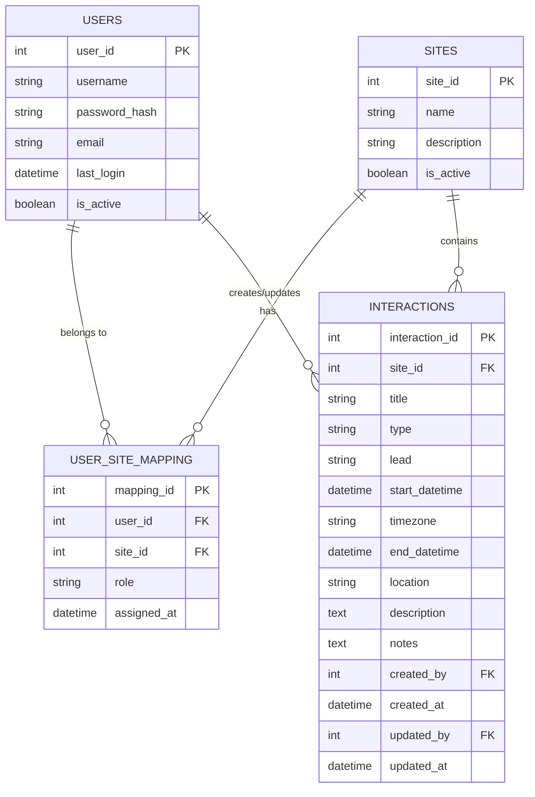
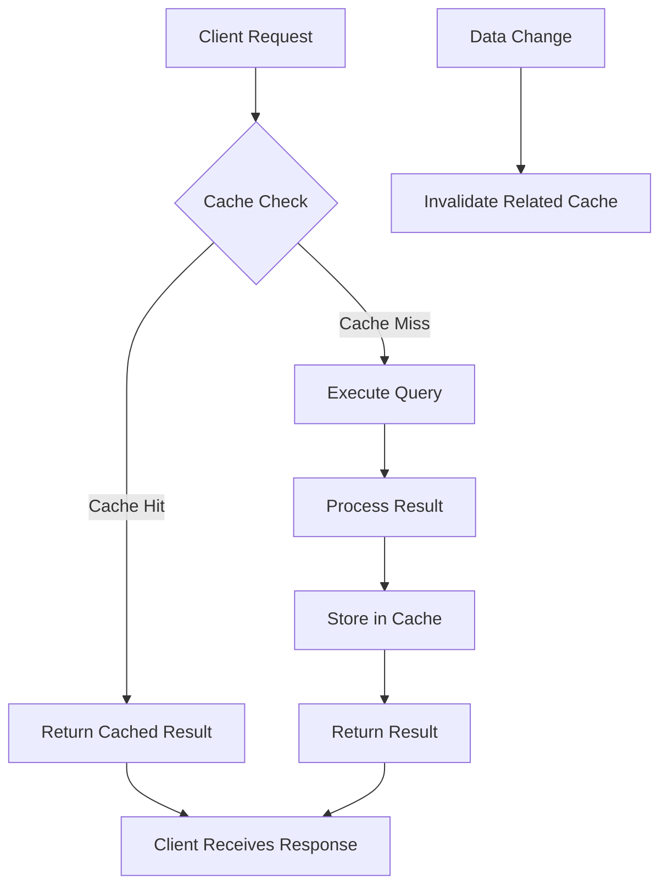
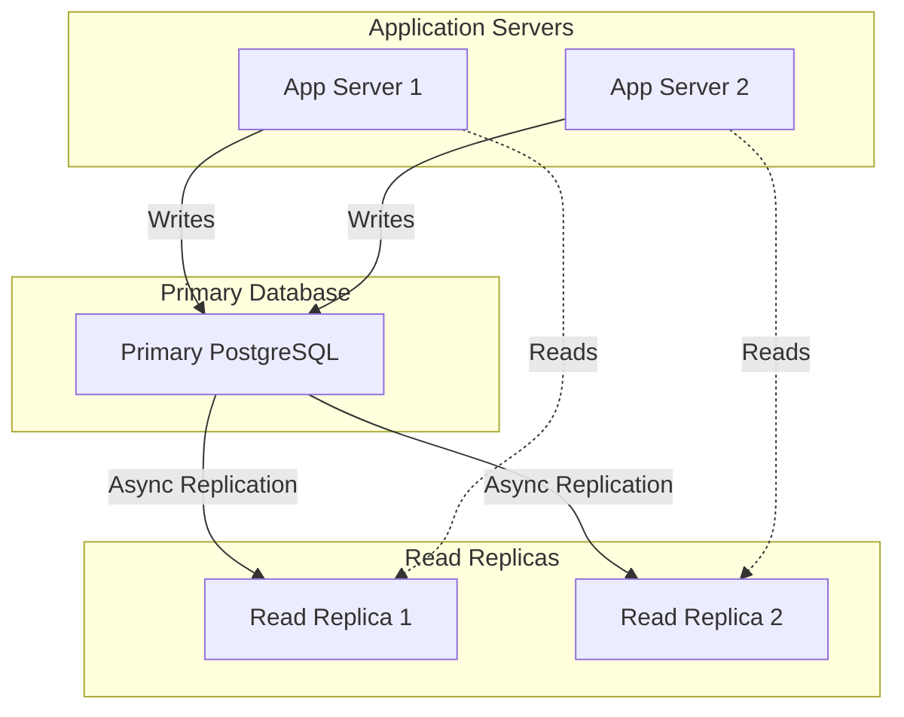
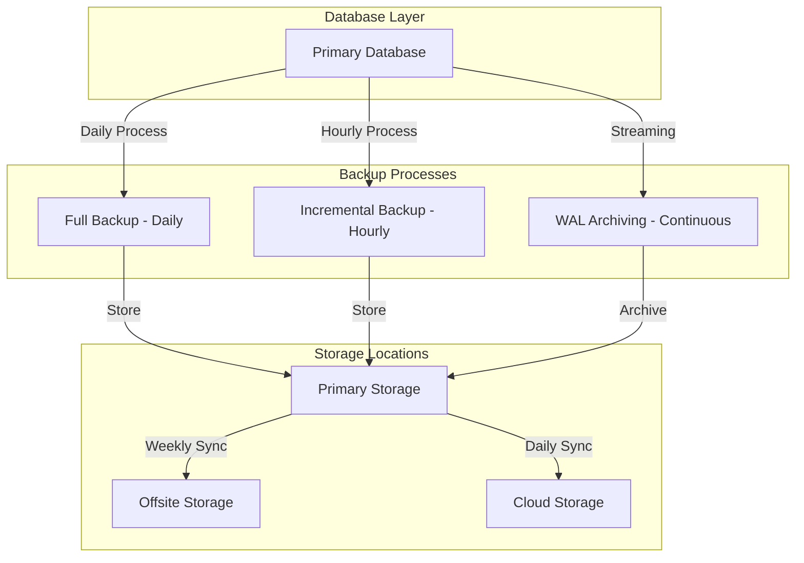

# Database Architecture

## 1. Introduction

This document describes the database architecture for the Interaction Management System. The system uses PostgreSQL 15.3 as its primary database, providing robust support for the relational model with excellent data integrity features, complex query capabilities, and performance optimizations necessary for the application's requirements.

### 1.1 Database Selection Rationale

PostgreSQL was selected for the following reasons:

- **Structured Data Model**: The Interaction entity has a well-defined structure that benefits from a relational schema
- **Complex Query Support**: Advanced searching capabilities needed for the Finder component
- **Relational Integrity**: The site-scoping feature benefits from foreign key constraints and referential integrity
- **Robust Ecosystem**: Mature tooling, excellent documentation, and wide industry adoption
- **Performance**: Support for complex indexing strategies and query optimization

## 2. Schema Design

### 2.1 Entity-Relationship Diagram

The database consists of four primary entities with the following relationships:

### 2.2 Table Specifications

#### 2.2.1 Users Table

| Column Name | Data Type | Constraints | Description |
|-------------|-----------|-------------|-------------|
| user_id | INTEGER | PRIMARY KEY, AUTO INCREMENT | Unique identifier for users |
| username | VARCHAR(50) | UNIQUE, NOT NULL | Username for login |
| password_hash | VARCHAR(255) | NOT NULL | Hashed password for authentication |
| email | VARCHAR(100) | UNIQUE, NOT NULL | User's email address |
| last_login | TIMESTAMP | NULL | When the user last logged in |
| is_active | BOOLEAN | NOT NULL, DEFAULT TRUE | Whether the user account is active |

#### 2.2.2 Sites Table

| Column Name | Data Type | Constraints | Description |
|-------------|-----------|-------------|-------------|
| site_id | INTEGER | PRIMARY KEY, AUTO INCREMENT | Unique identifier for sites |
| name | VARCHAR(100) | UNIQUE, NOT NULL | Site name |
| description | TEXT | NULL | Description of the site |
| is_active | BOOLEAN | NOT NULL, DEFAULT TRUE | Whether the site is active |

#### 2.2.3 User_Site_Mapping Table

| Column Name | Data Type | Constraints | Description |
|-------------|-----------|-------------|-------------|
| mapping_id | INTEGER | PRIMARY KEY, AUTO INCREMENT | Unique identifier for mapping |
| user_id | INTEGER | FOREIGN KEY (users), NOT NULL | Reference to user |
| site_id | INTEGER | FOREIGN KEY (sites), NOT NULL | Reference to site |
| role | VARCHAR(50) | NOT NULL | User's role at the site |
| assigned_at | TIMESTAMP | NOT NULL, DEFAULT CURRENT_TIMESTAMP | When user was assigned to site |

#### 2.2.4 Interactions Table

| Column Name | Data Type | Constraints | Description |
|-------------|-----------|-------------|-------------|
| interaction_id | INTEGER | PRIMARY KEY, AUTO INCREMENT | Unique identifier for interactions |
| site_id | INTEGER | FOREIGN KEY (sites), NOT NULL | Site this interaction belongs to |
| title | VARCHAR(255) | NOT NULL | Title of the interaction |
| type | VARCHAR(50) | NOT NULL | Type of interaction |
| lead | VARCHAR(100) | NOT NULL | Person leading the interaction |
| start_datetime | TIMESTAMP | NOT NULL | Start date and time |
| timezone | VARCHAR(50) | NOT NULL | Timezone for the interaction |
| end_datetime | TIMESTAMP | NOT NULL | End date and time |
| location | VARCHAR(255) | NULL | Location of the interaction |
| description | TEXT | NULL | Detailed description |
| notes | TEXT | NULL | Additional notes |
| created_by | INTEGER | FOREIGN KEY (users), NOT NULL | User who created the record |
| created_at | TIMESTAMP | NOT NULL, DEFAULT CURRENT_TIMESTAMP | Creation timestamp |
| updated_by | INTEGER | FOREIGN KEY (users), NULL | User who last updated the record |
| updated_at | TIMESTAMP | NULL | Last update timestamp |

### 2.3 Multi-Site Data Model

The database schema implements a multi-tenant architecture through site-scoping, which:

1. Associates users with one or more sites through the USER_SITE_MAPPING table
2. Assigns roles to users within each site context
3. Links every interaction record to exactly one site
4. Enforces data isolation through foreign key constraints and application-level filtering

This approach enables:
- Organizations to maintain separate sets of interaction data
- Users to have different access levels across multiple sites
- Clean data separation without database-level partitioning
- Efficient querying within a site context

## 3. Indexing Strategy

### 3.1 Index Specifications

| Table | Index Name | Columns | Type | Purpose |
|-------|------------|---------|------|---------|
| USERS | pk_users | user_id | PRIMARY KEY | Unique identifier lookup |
| USERS | idx_users_username | username | UNIQUE | Authentication lookups |
| USERS | idx_users_email | email | UNIQUE | User lookups by email |
| SITES | pk_sites | site_id | PRIMARY KEY | Unique identifier lookup |
| SITES | idx_sites_name | name | UNIQUE | Site lookups by name |
| USER_SITE_MAPPING | pk_user_site | mapping_id | PRIMARY KEY | Unique identifier lookup |
| USER_SITE_MAPPING | idx_user_site_user | user_id, site_id | COMPOSITE | Fast user's sites lookup |
| USER_SITE_MAPPING | idx_user_site_site | site_id | BTREE | Find users in a site |
| INTERACTIONS | pk_interactions | interaction_id | PRIMARY KEY | Unique identifier lookup |
| INTERACTIONS | idx_interactions_site | site_id | BTREE | Site-scoped filtering |
| INTERACTIONS | idx_interactions_title | title | BTREE | Title search in Finder |
| INTERACTIONS | idx_interactions_type | type | BTREE | Type filtering in Finder |
| INTERACTIONS | idx_interactions_lead | lead | BTREE | Lead person search |
| INTERACTIONS | idx_interactions_dates | start_datetime, end_datetime | BTREE | Date range filtering |
| INTERACTIONS | ftidx_interactions_text | title, description, notes | FULLTEXT | Free text search for Finder |

### 3.2 Indexing Considerations

- **Site-First Indexing**: The `site_id` field appears first in composite indexes to optimize site-scoped queries
- **Search Optimization**: Indexes are designed to support the common search patterns in the Finder component
- **Full-Text Search**: PostgreSQL's full-text search capabilities are used for free-text searching across multiple fields
- **Index Maintenance**: Regular index statistics updates are scheduled during low-traffic periods
- **Monitoring**: Index usage statistics are monitored to identify unused or inefficient indexes

## 4. Data Management

### 4.1 Migration Procedures

| Migration Type | Tool | Process | Validation |
|----------------|------|---------|------------|
| Schema Migrations | Alembic | Version-controlled migration scripts | Pre/post-validation tests |
| Data Migrations | Custom Python scripts | ETL process with transaction batching | Row count and checksum validation |
| Reference Data | SQL scripts in version control | CI/CD pipeline execution | Automated validation suite |
| Emergency Fixes | Controlled manual process | Peer-reviewed SQL with rollback plan | Manual testing and verification |

Migrations follow a forward-only approach, with new migrations created to correct issues rather than rolling back changes.

### 4.2 Versioning Strategy

Database schema versioning follows semantic versioning (MAJOR.MINOR.PATCH) with:

| Version Component | Meaning | Example Changes |
|-------------------|---------|----------------|
| MAJOR | Breaking schema changes | Table renames, column removals |
| MINOR | Backward-compatible additions | New tables, new columns with defaults |
| PATCH | Non-structural changes | Index additions, column comment updates |

Current schema version is stored in a dedicated metadata table and verified during application startup.

### 4.3 Archival Policies

| Data Type | Archival Threshold | Storage Method | Access Method |
|-----------|-------------------|----------------|---------------|
| Interactions | 2 years inactive | Archive tables with same schema | Read-only through Finder |
| Audit Logs | 1 year old | Compressed storage | Admin-only tools |
| System Logs | 90 days old | Aggregated summaries | Reporting dashboards |
| Deleted Records | 30 days after deletion | Soft-delete with recovery option | Admin restoration tool |

Archival processes run during maintenance windows and include verification steps to ensure data integrity.

## 5. Performance Optimization

### 5.1 Query Optimization Patterns

| Pattern | Implementation | Benefit |
|---------|----------------|---------|
| Indexed Search | Compound indexes for common search patterns | 10-100x faster search operations |
| Query Rewriting | CTE-based complex queries | Improved query plan optimization |
| Join Reduction | Strategic denormalization for read-heavy data | Reduced query complexity |
| Result Limiting | Cursor-based pagination | Consistent performance with large datasets |
| Execution Plans | Stored execution plans for common queries | Reduced query compilation overhead |

### 5.2 Caching Strategy

The system implements a multi-layered caching approach:

| Cache Type | Implementation | TTL | Invalidation Trigger |
|------------|----------------|-----|----------------------|
| Query Results | Redis | 5 minutes | Related data modifications |
| Lookup Data | Application memory | 1 hour | Admin changes to reference data |
| Authentication | Redis | 24 hours | Password change, manual logout |
| User Permissions | Redis | 15 minutes | Role/site assignment changes |

### 5.3 Connection Pooling

| Pool Parameter | Value | Rationale |
|----------------|-------|-----------|
| Minimum Pool Size | 5 connections | Ensure responsiveness during low traffic |
| Maximum Pool Size | 20 connections per instance | Balance resource usage with concurrency |
| Connection Timeout | 30 seconds | Prevent hanging operations |
| Idle Timeout | 10 minutes | Resource reclamation while maintaining readiness |
| Connection Lifespan | 30 minutes | Prevent connection staleness |

Connection pooling is implemented using HikariCP (for Java applications) or pgBouncer (for PostgreSQL) to optimize database connection management.

### 5.4 Read/Write Splitting

| Operation Type | Database Target | Routing Logic |
|----------------|-----------------|--------------|
| Write Operations | Primary instance | Direct routing for all data changes |
| Finder Searches | Read replicas | Load-balanced across available replicas |
| Form Data Loading | Read replicas | With replica consistency verification |
| Reporting Queries | Dedicated reporting replicas | Isolated to prevent impact on application |

Read/write splitting is implemented at the application level, with awareness of replication lag to ensure consistency when needed.

## 6. Compliance and Security

### 6.1 Data Retention Rules

| Data Category | Retention Period | Handling After Period |
|---------------|------------------|----------------------|
| Active Interactions | Indefinite | N/A - Retained while active |
| Archived Interactions | 5 years | Permanent deletion |
| Deleted Interactions | 30 days | Permanent deletion |
| User Activity Logs | 1 year | Anonymized archival |
| Authentication Logs | 2 years | Permanent deletion |

### 6.2 Backup and Fault Tolerance

| Aspect | Policy | Implementation |
|--------|--------|----------------|
| Recovery Point Objective | 1 hour maximum data loss | Hourly backups + WAL archiving |
| Recovery Time Objective | 4 hours to restore service | Standby replicas with automated failover |
| Backup Retention | 30 days of daily backups | Automated lifecycle management |
| Backup Verification | Weekly restoration tests | Automated restore to test environment |
| Disaster Recovery | Cross-region redundancy | Secondary region standby infrastructure |

### 6.3 Privacy Controls

| Privacy Feature | Implementation | Purpose |
|-----------------|----------------|---------|
| Data Encryption | TDE (Transparent Data Encryption) | Protect sensitive data at rest |
| Data Masking | View-based masking for sensitive fields | Limit exposure of PII in reports |
| Anonymization | Data transformation procedures | Support GDPR right to be forgotten |
| Access Logging | Comprehensive audit trail | Track all access to sensitive data |

### 6.4 Audit Mechanisms

| Audit Type | Captured Information | Retention |
|------------|----------------------|-----------|
| Data Modifications | Who, what, when, old/new values | 2 years |
| Access Attempts | User, timestamp, resource, success/failure | 1 year |
| Schema Changes | Change details, performer, timestamp | 5 years |
| Admin Actions | Action details, performer, affected resources | 3 years |

## 7. Replication and Backup

### 7.1 Replication Configuration

Replication is configured with:
- Primary database handling all write operations
- Read replicas used for search and finder operations
- Asynchronous replication with minimal lag (<1 second)
- Automatic failover in case of primary failure

### 7.2 Backup Architecture

## 8. Future Considerations

### 8.1 Partitioning Strategy

For the initial deployment with moderate data volume, partitioning is not implemented. However, the design supports future partitioning strategies:

| Partitioning Strategy | Implementation | When to Apply |
|------------------------|----------------|--------------|
| Site-Based Partitioning | Partition INTERACTIONS table by site_id | When system exceeds 100+ sites |
| Time-Based Partitioning | Partition INTERACTIONS by date ranges | When historical data exceeds 1M records |
| Functional Partitioning | Separate active vs. archived interactions | When archive records exceed 70% of total |

### 8.2 Scaling Considerations

As the system grows, several scaling strategies are planned:

1. **Vertical Scaling**: Increase database resources (CPU, memory) for initial growth
2. **Read Scaling**: Add read replicas as search volume increases
3. **Functional Splitting**: Separate reporting/analytics database for complex queries
4. **Sharding**: Implement application-level sharding based on site_id for extreme scale

## 9. Conclusion

The PostgreSQL database architecture provides a robust foundation for the Interaction Management System with strong support for the multi-site data model, complex searching capabilities, and performance optimization features. The design balances current needs with future scalability, while ensuring data integrity, security, and compliance requirements are met.