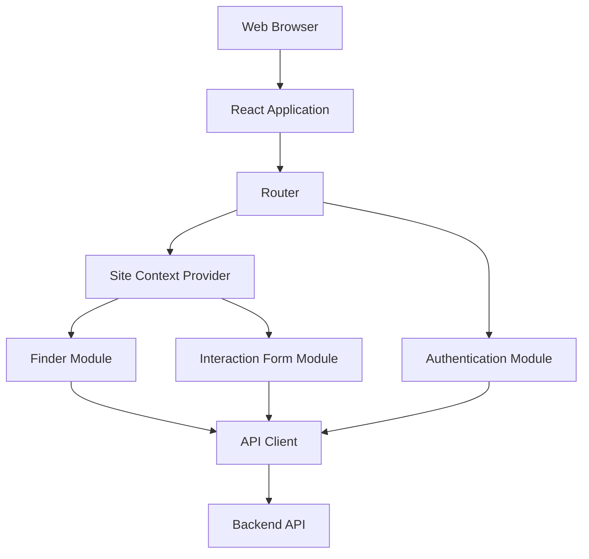
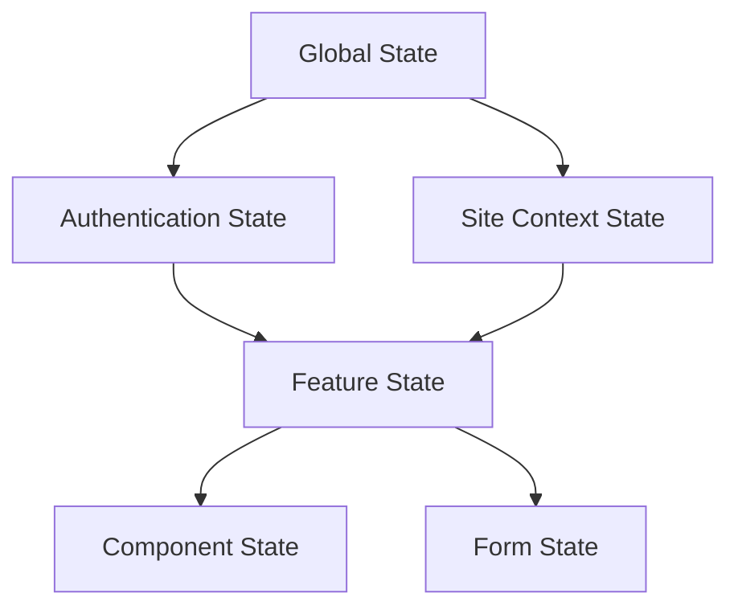
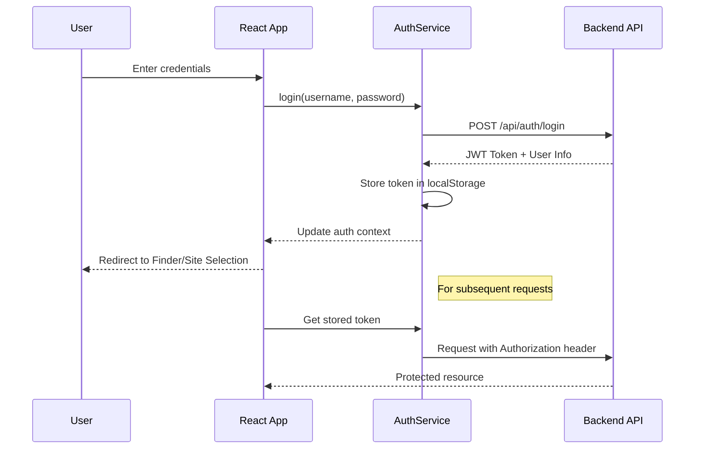

# Frontend Architecture Documentation
## Interaction Management System

## 1. Overview

The Interaction Management System frontend is built as a modern, component-based Single Page Application (SPA) using React. The architecture follows a modular approach with clear separation of concerns, enabling maintainable code organization and scalable feature development.

The frontend serves as the presentation layer of the system, providing:
- A secure authentication interface
- A searchable table view ("Finder") for Interaction records
- An add/edit form for Interaction management
- Site context management for multi-tenant data access

### 1.1 Architecture Principles

The frontend architecture adheres to the following principles:

| Principle | Implementation |
|-----------|----------------|
| Component-Based | Modular React components with clearly defined responsibilities |
| Unidirectional Data Flow | State flows down, events flow up through the component hierarchy |
| Separation of Concerns | Components separated into presentational and container types |
| Type Safety | TypeScript throughout to ensure robust type checking |
| Responsive Design | TailwindCSS for mobile-first, responsive UI implementation |
| Accessibility | WCAG 2.1 AA compliant components and practices |

### 1.2 High-Level Architecture



## 2. Technology Stack

### 2.1 Core Technologies

| Technology | Version | Purpose | Justification |
|------------|---------|---------|---------------|
| React | 18.2.0 | UI component library | Enables efficient component-based architecture for interactive Finder and form interfaces |
| TypeScript | 4.9.5 | Type-safe JavaScript | Provides compile-time type checking, improved developer experience, and code reliability |
| TailwindCSS | 3.3.3 | Utility-first CSS framework | Facilitates rapid UI development with consistent styling and responsive design |
| React Router | 6.14.2 | Client-side routing | Manages navigation between views without page reloads for a seamless SPA experience |
| React Query | 4.29.5 | Data fetching and caching | Simplifies API interactions with automatic caching, background refreshing, and state management |
| React Hook Form | 7.45.1 | Form state management | Provides efficient form validation and state management with minimal re-renders |
| date-fns | 2.30.0 | Date manipulation | Handles date/time formatting and timezone management for Interaction records |
| Axios | 1.4.0 | HTTP client | Performs API requests with interceptors for authentication and error handling |

### 2.2 Development Tools

| Tool | Version | Purpose |
|------|---------|---------|
| Vite | 4.3.9 | Build tool and development server |
| ESLint | 8.46.0 | Code quality and style enforcement |
| Prettier | 2.8.8 | Code formatting |
| Jest | 29.5.0 | Unit testing |
| React Testing Library | 14.0.0 | Component testing |
| MSW (Mock Service Worker) | 1.2.2 | API mocking for tests and development |
| Cypress | 12.16.0 | End-to-end testing |

## 3. Application Structure

The frontend codebase follows a feature-based organization pattern:

```
src/
├── assets/                 # Static assets (images, fonts)
├── components/             # Shared UI components
│   ├── common/             # Generic UI elements
│   ├── layout/             # Layout components
│   └── [feature]/          # Feature-specific components
├── contexts/               # React contexts for state sharing
├── features/               # Feature modules
│   ├── auth/               # Authentication feature
│   ├── finder/             # Interaction finder feature
│   ├── interaction-form/   # Interaction form feature
│   └── site-context/       # Site management feature
├── hooks/                  # Custom React hooks
├── pages/                  # Page components
├── services/               # API services and external integrations
│   ├── api/                # API client and endpoints
│   └── auth/               # Authentication service
├── store/                  # Global state management
├── types/                  # TypeScript type definitions
├── utils/                  # Utility functions
├── App.tsx                 # Root component
├── main.tsx                # Application entry point
└── vite-env.d.ts          # Vite type declarations
```

### 3.1 Component Architecture

Components follow a consistent architecture divided into:

| Component Type | Purpose | Example |
|----------------|---------|---------|
| Presentational Components | Render UI based on props | `Button`, `InputField`, `InteractionCard` |
| Container Components | Manage state and data flow | `FinderContainer`, `InteractionFormContainer` |
| Layout Components | Define page structure | `AppLayout`, `AuthLayout` |
| Page Components | Represent routes | `FinderPage`, `InteractionFormPage` |
| Context Providers | Provide shared state | `AuthProvider`, `SiteContextProvider` |

Each component follows this structure:
- Component file (TSX)
- Types file (TS)
- Hooks file (TS)
- Test file (TSX)
- Index file for exports

## 4. State Management

### 4.1 State Management Hierarchy

The application implements a multi-layered state management approach:



### 4.2 State Management Technologies

| State Type | Technology | Purpose |
|------------|------------|---------|
| Global App State | React Context API | Authentication, site context |
| Server State | React Query | API data caching and synchronization |
| Form State | React Hook Form | Form field values and validation |
| UI State | React useState/useReducer | Component-specific state |

### 4.3 Key State Objects

#### Authentication State
```typescript
interface AuthState {
  isAuthenticated: boolean;
  user: User | null;
  token: string | null;
  isLoading: boolean;
  error: string | null;
}

interface User {
  id: number;
  username: string;
  email: string;
  sites: Site[];
}
```

#### Site Context State
```typescript
interface SiteContextState {
  currentSite: Site | null;
  availableSites: Site[];
  isLoading: boolean;
  error: string | null;
}

interface Site {
  id: number;
  name: string;
  description: string;
  role: string;
}
```

#### Finder State
```typescript
interface FinderState {
  searchTerm: string;
  filters: Record<string, any>;
  sortField: string;
  sortDirection: 'asc' | 'desc';
  page: number;
  pageSize: number;
}
```

#### Interaction Form State
```typescript
interface InteractionFormState {
  title: string;
  type: string;
  lead: string;
  startDateTime: string;
  timezone: string;
  endDateTime: string;
  location: string;
  description: string;
  notes: string;
}
```

## 5. Routing Structure

### 5.1 Route Configuration

The application uses React Router 6 for declarative routing:

```typescript
// src/App.tsx
import { BrowserRouter, Routes, Route } from 'react-router-dom';

function App() {
  return (
    <BrowserRouter>
      <Routes>
        {/* Public routes */}
        <Route path="/login" element={<LoginPage />} />
        <Route path="/forgot-password" element={<ForgotPasswordPage />} />
        
        {/* Protected routes */}
        <Route element={<PrivateRoute />}>
          <Route path="/" element={<Navigate to="/finder" />} />
          <Route path="/site-selection" element={<SiteSelectionPage />} />
          <Route path="/finder" element={<FinderPage />} />
          <Route path="/interactions/new" element={<InteractionFormPage />} />
          <Route path="/interactions/:id" element={<InteractionFormPage />} />
          <Route path="/profile" element={<ProfilePage />} />
        </Route>
        
        {/* Fallback */}
        <Route path="*" element={<NotFoundPage />} />
      </Routes>
    </BrowserRouter>
  );
}
```

### 5.2 Route Protection

Protected routes use a `PrivateRoute` component to enforce authentication:

```typescript
// src/components/common/PrivateRoute.tsx
import { Navigate, Outlet } from 'react-router-dom';
import { useAuth } from '@/hooks/useAuth';

function PrivateRoute() {
  const { isAuthenticated, isLoading } = useAuth();
  
  if (isLoading) {
    return <LoadingSpinner />;
  }
  
  return isAuthenticated ? <Outlet /> : <Navigate to="/login" />;
}
```

### 5.3 Navigation Guards

Navigation guards enforce site context requirements:

```typescript
// src/features/site-context/SiteGuard.tsx
import { Navigate, Outlet } from 'react-router-dom';
import { useSiteContext } from '@/hooks/useSiteContext';

function SiteGuard() {
  const { currentSite, isLoading } = useSiteContext();
  
  if (isLoading) {
    return <LoadingSpinner />;
  }
  
  return currentSite ? <Outlet /> : <Navigate to="/site-selection" />;
}
```

## 6. Authentication & Authorization

### 6.1 Authentication Flow

The frontend implements JWT-based authentication with the following workflow:



### 6.2 Token Management

JWT tokens are stored securely and managed using an authentication service:

```typescript
// src/services/auth/authService.ts
import axios from 'axios';

const TOKEN_KEY = 'auth_token';

export const authService = {
  // Login and store token
  async login(username: string, password: string) {
    const response = await axios.post('/api/auth/login', { username, password });
    const { token, user } = response.data;
    localStorage.setItem(TOKEN_KEY, token);
    return { token, user };
  },
  
  // Logout and clear token
  logout() {
    localStorage.removeItem(TOKEN_KEY);
  },
  
  // Get current token
  getToken() {
    return localStorage.getItem(TOKEN_KEY);
  },
  
  // Check if user is authenticated
  isAuthenticated() {
    return !!this.getToken();
  }
};
```

### 6.3 Authorization Context

The Auth Provider maintains the authentication state for the application:

```typescript
// src/contexts/AuthContext.tsx
import { createContext, useReducer, useEffect } from 'react';
import { authService } from '@/services/auth/authService';

export const AuthContext = createContext<AuthContextType | undefined>(undefined);

export function AuthProvider({ children }: { children: React.ReactNode }) {
  const [state, dispatch] = useReducer(authReducer, {
    isAuthenticated: false,
    user: null,
    token: null,
    isLoading: true,
    error: null
  });
  
  useEffect(() => {
    // Initialize auth state from stored token
    const initializeAuth = async () => {
      try {
        const token = authService.getToken();
        if (token) {
          // Validate token and get user info
          const user = await authService.getUserInfo();
          dispatch({ type: 'AUTH_SUCCESS', payload: { token, user } });
        } else {
          dispatch({ type: 'AUTH_LOGOUT' });
        }
      } catch (error) {
        dispatch({ type: 'AUTH_ERROR', payload: error.message });
        authService.logout();
      } finally {
        dispatch({ type: 'AUTH_LOADED' });
      }
    };
    
    initializeAuth();
  }, []);
  
  // Auth actions
  const login = async (username: string, password: string) => {
    dispatch({ type: 'AUTH_LOADING' });
    try {
      const { token, user } = await authService.login(username, password);
      dispatch({ type: 'AUTH_SUCCESS', payload: { token, user } });
      return user;
    } catch (error) {
      dispatch({ type: 'AUTH_ERROR', payload: error.message });
      throw error;
    }
  };
  
  const logout = () => {
    authService.logout();
    dispatch({ type: 'AUTH_LOGOUT' });
  };
  
  return (
    <AuthContext.Provider value={{ ...state, login, logout }}>
      {children}
    </AuthContext.Provider>
  );
}
```

### 6.4 Site Context Implementation

The Site Context Provider manages the current site selection:

```typescript
// src/contexts/SiteContext.tsx
import { createContext, useState, useEffect } from 'react';
import { useAuth } from '@/hooks/useAuth';
import { siteService } from '@/services/api/siteService';

export const SiteContext = createContext<SiteContextType | undefined>(undefined);

export function SiteProvider({ children }: { children: React.ReactNode }) {
  const { user, isAuthenticated } = useAuth();
  const [state, setState] = useState<SiteContextState>({
    currentSite: null,
    availableSites: [],
    isLoading: true,
    error: null
  });
  
  useEffect(() => {
    if (isAuthenticated && user) {
      setState(prev => ({ ...prev, availableSites: user.sites, isLoading: false }));
      
      // Set default site if available
      if (user.sites.length > 0) {
        // Check for stored preference
        const storedSiteId = localStorage.getItem('current_site_id');
        const defaultSite = storedSiteId 
          ? user.sites.find(site => site.id.toString() === storedSiteId)
          : user.sites[0];
        
        if (defaultSite) {
          setCurrentSite(defaultSite);
        }
      }
    } else {
      setState({
        currentSite: null,
        availableSites: [],
        isLoading: false,
        error: null
      });
    }
  }, [isAuthenticated, user]);
  
  const setCurrentSite = async (site: Site) => {
    try {
      // Update server-side site context
      await siteService.setCurrentSite(site.id);
      
      // Store preference locally
      localStorage.setItem('current_site_id', site.id.toString());
      
      // Update context state
      setState(prev => ({ ...prev, currentSite: site }));
    } catch (error) {
      setState(prev => ({ ...prev, error: error.message }));
    }
  };
  
  return (
    <SiteContext.Provider value={{ ...state, setCurrentSite }}>
      {children}
    </SiteContext.Provider>
  );
}
```

## 7. API Integration

### 7.1 API Client

A centralized API client handles all backend communication:

```typescript
// src/services/api/apiClient.ts
import axios, { AxiosInstance, AxiosRequestConfig, AxiosResponse, AxiosError } from 'axios';
import { authService } from '@/services/auth/authService';

// Create axios instance
const apiClient: AxiosInstance = axios.create({
  baseURL: import.meta.env.VITE_API_BASE_URL || '/api',
  headers: {
    'Content-Type': 'application/json'
  }
});

// Request interceptor for authentication
apiClient.interceptors.request.use(
  (config: AxiosRequestConfig) => {
    const token = authService.getToken();
    if (token && config.headers) {
      config.headers.Authorization = `Bearer ${token}`;
    }
    return config;
  },
  (error: AxiosError) => Promise.reject(error)
);

// Response interceptor for error handling
apiClient.interceptors.response.use(
  (response: AxiosResponse) => response,
  (error: AxiosError) => {
    // Handle authentication errors
    if (error.response?.status === 401) {
      authService.logout();
      window.location.href = '/login';
    }
    
    // Handle other errors
    return Promise.reject(error);
  }
);

export default apiClient;
```

### 7.2 API Services

Feature-specific API services encapsulate endpoint interactions:

```typescript
// src/services/api/interactionService.ts
import apiClient from './apiClient';
import { InteractionFormState, InteractionResponse, SearchParams } from '@/types';

export const interactionService = {
  // Get interactions with search/filter/pagination
  async getInteractions(params: SearchParams): Promise<{
    interactions: InteractionResponse[];
    total: number;
    page: number;
    pageSize: number;
  }> {
    const response = await apiClient.get('/interactions', { params });
    return response.data;
  },
  
  // Get single interaction by ID
  async getInteraction(id: number): Promise<InteractionResponse> {
    const response = await apiClient.get(`/interactions/${id}`);
    return response.data.interaction;
  },
  
  // Create new interaction
  async createInteraction(data: InteractionFormState): Promise<InteractionResponse> {
    const response = await apiClient.post('/interactions', data);
    return response.data.interaction;
  },
  
  // Update existing interaction
  async updateInteraction(id: number, data: InteractionFormState): Promise<InteractionResponse> {
    const response = await apiClient.put(`/interactions/${id}`, data);
    return response.data.interaction;
  },
  
  // Delete interaction
  async deleteInteraction(id: number): Promise<boolean> {
    const response = await apiClient.delete(`/interactions/${id}`);
    return response.data.success;
  }
};
```

### 7.3 React Query Integration

React Query manages API state with automatic caching and refetching:

```typescript
// src/features/finder/hooks/useInteractions.ts
import { useQuery } from '@tanstack/react-query';
import { interactionService } from '@/services/api/interactionService';
import { SearchParams } from '@/types';

export function useInteractions(params: SearchParams) {
  return useQuery(
    ['interactions', params],
    () => interactionService.getInteractions(params),
    {
      keepPreviousData: true,
      staleTime: 5 * 60 * 1000, // 5 minutes
      refetchOnWindowFocus: true
    }
  );
}

// src/features/interaction-form/hooks/useInteraction.ts
import { useQuery } from '@tanstack/react-query';
import { interactionService } from '@/services/api/interactionService';

export function useInteraction(id: number | undefined) {
  return useQuery(
    ['interaction', id],
    () => id ? interactionService.getInteraction(id) : null,
    {
      enabled: !!id,
      staleTime: 5 * 60 * 1000 // 5 minutes
    }
  );
}

// src/features/interaction-form/hooks/useInteractionMutation.ts
import { useMutation, useQueryClient } from '@tanstack/react-query';
import { interactionService } from '@/services/api/interactionService';
import { InteractionFormState } from '@/types';

export function useCreateInteraction() {
  const queryClient = useQueryClient();
  
  return useMutation(
    (data: InteractionFormState) => interactionService.createInteraction(data),
    {
      onSuccess: () => {
        // Invalidate interactions list to trigger refetch
        queryClient.invalidateQueries(['interactions']);
      }
    }
  );
}

export function useUpdateInteraction(id: number) {
  const queryClient = useQueryClient();
  
  return useMutation(
    (data: InteractionFormState) => interactionService.updateInteraction(id, data),
    {
      onSuccess: (data) => {
        // Update queries
        queryClient.invalidateQueries(['interactions']);
        queryClient.setQueryData(['interaction', id], data);
      }
    }
  );
}

export function useDeleteInteraction() {
  const queryClient = useQueryClient();
  
  return useMutation(
    (id: number) => interactionService.deleteInteraction(id),
    {
      onSuccess: () => {
        queryClient.invalidateQueries(['interactions']);
      }
    }
  );
}
```

## 8. Finder Implementation

### 8.1 Component Structure

The Finder feature is structured as follows:

```
src/features/finder/
├── components/
│   ├── FinderTable.tsx         # Table display component
│   ├── SearchBar.tsx           # Search input component
│   ├── FilterPanel.tsx         # Advanced filtering panel
│   ├── TablePagination.tsx     # Pagination controls
│   └── TableActions.tsx        # Row action buttons
├── hooks/
│   ├── useInteractions.ts      # Data fetching hook
│   ├── useFinderState.ts       # Finder state management
│   └── useTableColumns.ts      # Column configuration
├── types/
│   └── index.ts                # Finder-specific types
└── index.ts                    # Feature exports
```

### 8.2 Finder Page Implementation

```typescript
// src/pages/FinderPage.tsx
import { useState } from 'react';
import { useNavigate } from 'react-router-dom';
import { AppLayout } from '@/components/layout';
import { FinderTable, SearchBar, FilterPanel, TablePagination } from '@/features/finder/components';
import { useInteractions } from '@/features/finder/hooks';
import { useSiteContext } from '@/hooks/useSiteContext';
import { Button } from '@/components/common';

function FinderPage() {
  const navigate = useNavigate();
  const { currentSite } = useSiteContext();
  const [showFilters, setShowFilters] = useState(false);
  
  // Finder state
  const [searchParams, setSearchParams] = useState({
    search: '',
    page: 1,
    pageSize: 25,
    sort: 'startDateTime',
    direction: 'desc' as 'asc' | 'desc',
    filters: {}
  });
  
  // Fetch interactions with current parameters
  const { data, isLoading, error } = useInteractions(searchParams);
  
  // Event handlers
  const handleSearch = (term: string) => {
    setSearchParams(prev => ({ ...prev, search: term, page: 1 }));
  };
  
  const handleSort = (field: string) => {
    setSearchParams(prev => ({
      ...prev,
      sort: field,
      direction: prev.sort === field && prev.direction === 'asc' ? 'desc' : 'asc'
    }));
  };
  
  const handlePageChange = (page: number) => {
    setSearchParams(prev => ({ ...prev, page }));
  };
  
  const handlePageSizeChange = (pageSize: number) => {
    setSearchParams(prev => ({ ...prev, pageSize, page: 1 }));
  };
  
  const handleFilterChange = (filters: Record<string, any>) => {
    setSearchParams(prev => ({ ...prev, filters, page: 1 }));
  };
  
  const handleRowClick = (id: number) => {
    navigate(`/interactions/${id}`);
  };
  
  const handleCreateNew = () => {
    navigate('/interactions/new');
  };
  
  return (
    <AppLayout>
      <div className="p-4">
        <div className="flex justify-between items-center mb-4">
          <h1 className="text-2xl font-bold">Interactions</h1>
          <Button onClick={handleCreateNew} variant="primary">
            New Interaction
          </Button>
        </div>
        
        <div className="mb-4">
          <div className="flex gap-2">
            <SearchBar 
              value={searchParams.search}
              onSearch={handleSearch}
              placeholder="Search interactions..."
              className="flex-grow"
            />
            <Button 
              onClick={() => setShowFilters(prev => !prev)}
              variant="secondary"
            >
              {showFilters ? 'Hide Filters' : 'Advanced Filters'}
            </Button>
          </div>
          
          {showFilters && (
            <FilterPanel
              filters={searchParams.filters}
              onChange={handleFilterChange}
              className="mt-2"
            />
          )}
        </div>
        
        {error ? (
          <div className="text-red-500">Error loading interactions: {error.message}</div>
        ) : (
          <>
            <FinderTable
              data={data?.interactions || []}
              isLoading={isLoading}
              sortField={searchParams.sort}
              sortDirection={searchParams.direction}
              onSort={handleSort}
              onRowClick={handleRowClick}
            />
            
            <div className="mt-4 flex items-center justify-between">
              <div>
                {data && (
                  <span className="text-sm text-gray-500">
                    Showing {data.interactions.length} of {data.total} interactions
                  </span>
                )}
              </div>
              
              <TablePagination
                currentPage={searchParams.page}
                pageSize={searchParams.pageSize}
                totalItems={data?.total || 0}
                onPageChange={handlePageChange}
                onPageSizeChange={handlePageSizeChange}
              />
            </div>
          </>
        )}
      </div>
    </AppLayout>
  );
}

export default FinderPage;
```

### 8.3 Finder Table Component

```typescript
// src/features/finder/components/FinderTable.tsx
import { InteractionResponse } from '@/types';
import { format } from 'date-fns';
import { Spinner } from '@/components/common';

interface FinderTableProps {
  data: InteractionResponse[];
  isLoading: boolean;
  sortField: string;
  sortDirection: 'asc' | 'desc';
  onSort: (field: string) => void;
  onRowClick: (id: number) => void;
}

export function FinderTable({
  data,
  isLoading,
  sortField,
  sortDirection,
  onSort,
  onRowClick
}: FinderTableProps) {
  // Render sort indicator
  const renderSortIndicator = (field: string) => {
    if (sortField !== field) return null;
    return sortDirection === 'asc' ? ' ↑' : ' ↓';
  };
  
  // Format date display
  const formatDate = (dateString: string, timezone: string) => {
    const date = new Date(dateString);
    return format(date, 'MM/dd/yyyy hh:mm a');
  };
  
  if (isLoading) {
    return <div className="flex justify-center p-8"><Spinner size="lg" /></div>;
  }
  
  if (data.length === 0) {
    return (
      <div className="text-center p-8 bg-gray-50 rounded">
        <p className="text-gray-500">No interactions found.</p>
      </div>
    );
  }
  
  return (
    <div className="overflow-x-auto">
      <table className="min-w-full bg-white border border-gray-200">
        <thead>
          <tr className="bg-gray-100">
            <th 
              className="px-4 py-2 text-left cursor-pointer"
              onClick={() => onSort('title')}
            >
              Title{renderSortIndicator('title')}
            </th>
            <th 
              className="px-4 py-2 text-left cursor-pointer"
              onClick={() => onSort('type')}
            >
              Type{renderSortIndicator('type')}
            </th>
            <th 
              className="px-4 py-2 text-left cursor-pointer"
              onClick={() => onSort('lead')}
            >
              Lead{renderSortIndicator('lead')}
            </th>
            <th 
              className="px-4 py-2 text-left cursor-pointer"
              onClick={() => onSort('startDateTime')}
            >
              Date/Time{renderSortIndicator('startDateTime')}
            </th>
            <th 
              className="px-4 py-2 text-left cursor-pointer"
              onClick={() => onSort('location')}
            >
              Location{renderSortIndicator('location')}
            </th>
            <th className="px-4 py-2 text-left">Actions</th>
          </tr>
        </thead>
        <tbody>
          {data.map((interaction) => (
            <tr 
              key={interaction.id}
              className="border-t border-gray-200 hover:bg-gray-50 cursor-pointer"
              onClick={() => onRowClick(interaction.id)}
            >
              <td className="px-4 py-2">{interaction.title}</td>
              <td className="px-4 py-2">{interaction.type}</td>
              <td className="px-4 py-2">{interaction.lead}</td>
              <td className="px-4 py-2">
                {formatDate(interaction.startDateTime, interaction.timezone)}
              </td>
              <td className="px-4 py-2">{interaction.location}</td>
              <td className="px-4 py-2">
                <button 
                  className="text-blue-500 hover:text-blue-700"
                  onClick={(e) => {
                    e.stopPropagation();
                    onRowClick(interaction.id);
                  }}
                >
                  Edit
                </button>
              </td>
            </tr>
          ))}
        </tbody>
      </table>
    </div>
  );
}
```

## 9. Interaction Form Implementation

### 9.1 Component Structure

The Interaction Form feature is structured as follows:

```
src/features/interaction-form/
├── components/
│   ├── InteractionForm.tsx     # Main form component
│   ├── DateTimeField.tsx       # Custom date/time input
│   ├── FormSection.tsx         # Form section wrapper
│   └── DeleteConfirmation.tsx  # Delete confirmation modal
├── hooks/
│   ├── useInteraction.ts       # Fetch single interaction
│   ├── useInteractionMutation.ts # Create/update/delete mutations
│   └── useFormValidation.ts    # Form validation logic
├── types/
│   └── index.ts                # Form-specific types
└── index.ts                    # Feature exports
```

### 9.2 Interaction Form Page

```typescript
// src/pages/InteractionFormPage.tsx
import { useState } from 'react';
import { useParams, useNavigate } from 'react-router-dom';
import { AppLayout } from '@/components/layout';
import { InteractionForm, DeleteConfirmation } from '@/features/interaction-form/components';
import { useInteraction, useCreateInteraction, useUpdateInteraction, useDeleteInteraction } from '@/features/interaction-form/hooks';
import { useSiteContext } from '@/hooks/useSiteContext';
import { Button, Spinner } from '@/components/common';
import { InteractionFormState } from '@/types';

function InteractionFormPage() {
  const { id } = useParams<{ id: string }>();
  const interactionId = id ? parseInt(id, 10) : undefined;
  const isEditMode = !!interactionId;
  const navigate = useNavigate();
  const { currentSite } = useSiteContext();
  const [showDeleteModal, setShowDeleteModal] = useState(false);
  
  // Fetch interaction data for edit mode
  const { 
    data: interaction,
    isLoading: isLoadingInteraction,
    error: loadError
  } = useInteraction(interactionId);
  
  // Mutations for create/update/delete
  const createMutation = useCreateInteraction();
  const updateMutation = isEditMode ? useUpdateInteraction(interactionId) : null;
  const deleteMutation = useDeleteInteraction();
  
  // Combined loading and error states
  const isLoading = isLoadingInteraction || 
    createMutation.isLoading || 
    (updateMutation?.isLoading || false) || 
    deleteMutation.isLoading;
    
  const error = loadError || 
    createMutation.error || 
    updateMutation?.error || 
    deleteMutation.error;
  
  // Form submission handler
  const handleSubmit = async (formData: InteractionFormState) => {
    try {
      if (isEditMode && updateMutation) {
        await updateMutation.mutateAsync(formData);
      } else {
        await createMutation.mutateAsync(formData);
      }
      navigate('/finder');
    } catch (err) {
      // Error handling in mutations
    }
  };
  
  // Delete handler
  const handleDelete = async () => {
    if (!interactionId) return;
    
    try {
      await deleteMutation.mutateAsync(interactionId);
      navigate('/finder');
    } catch (err) {
      // Error handling in mutation
    }
  };
  
  const handleCancel = () => {
    navigate('/finder');
  };
  
  if (isLoadingInteraction) {
    return (
      <AppLayout>
        <div className="flex justify-center items-center h-64">
          <Spinner size="lg" />
        </div>
      </AppLayout>
    );
  }
  
  if (loadError) {
    return (
      <AppLayout>
        <div className="p-4 text-red-500">
          Error loading interaction: {loadError.message}
        </div>
      </AppLayout>
    );
  }
  
  return (
    <AppLayout>
      <div className="p-4">
        <div className="flex items-center justify-between mb-4">
          <div className="flex items-center">
            <Button
              variant="link"
              onClick={handleCancel}
              className="mr-2"
            >
              ← Back to Finder
            </Button>
            <h1 className="text-2xl font-bold">
              {isEditMode ? 'Edit Interaction' : 'New Interaction'}
            </h1>
          </div>
          
          {isEditMode && (
            <Button
              variant="danger"
              onClick={() => setShowDeleteModal(true)}
            >
              Delete
            </Button>
          )}
        </div>
        
        {error && (
          <div className="mb-4 p-2 bg-red-100 text-red-700 rounded">
            {error.message}
          </div>
        )}
        
        <InteractionForm
          initialData={interaction}
          onSubmit={handleSubmit}
          onCancel={handleCancel}
          isSubmitting={isLoading}
        />
        
        {showDeleteModal && (
          <DeleteConfirmation
            interactionTitle={interaction?.title || ''}
            isDeleting={deleteMutation.isLoading}
            onConfirm={handleDelete}
            onCancel={() => setShowDeleteModal(false)}
          />
        )}
      </div>
    </AppLayout>
  );
}

export default InteractionFormPage;
```

### 9.3 Interaction Form Component

```typescript
// src/features/interaction-form/components/InteractionForm.tsx
import { useForm } from 'react-hook-form';
import { DateTimeField } from './DateTimeField';
import { FormSection } from './FormSection';
import { Button, TextField, SelectField, TextAreaField } from '@/components/common';
import { InteractionFormState, InteractionResponse } from '@/types';
import { useSiteContext } from '@/hooks/useSiteContext';

// Interaction types
const INTERACTION_TYPES = [
  { value: 'Meeting', label: 'Meeting' },
  { value: 'Call', label: 'Call' },
  { value: 'Email', label: 'Email' },
  { value: 'Update', label: 'Update' },
  { value: 'Review', label: 'Review' },
  { value: 'Training', label: 'Training' }
];

// Timezone options
const TIMEZONE_OPTIONS = [
  { value: 'America/New_York', label: 'Eastern Time (ET)' },
  { value: 'America/Chicago', label: 'Central Time (CT)' },
  { value: 'America/Denver', label: 'Mountain Time (MT)' },
  { value: 'America/Los_Angeles', label: 'Pacific Time (PT)' },
  { value: 'America/Anchorage', label: 'Alaska Time (AKT)' },
  { value: 'Pacific/Honolulu', label: 'Hawaii Time (HT)' },
  { value: 'UTC', label: 'Universal Time (UTC)' }
];

interface InteractionFormProps {
  initialData?: InteractionResponse | null;
  onSubmit: (data: InteractionFormState) => Promise<void>;
  onCancel: () => void;
  isSubmitting: boolean;
}

export function InteractionForm({
  initialData,
  onSubmit,
  onCancel,
  isSubmitting
}: InteractionFormProps) {
  const { currentSite } = useSiteContext();
  
  // Initialize form with default values or existing data
  const {
    register,
    handleSubmit,
    control,
    formState: { errors, isDirty }
  } = useForm<InteractionFormState>({
    defaultValues: initialData || {
      title: '',
      type: 'Meeting',
      lead: '',
      startDateTime: new Date().toISOString(),
      timezone: 'America/New_York',
      endDateTime: new Date(Date.now() + 3600000).toISOString(), // 1 hour later
      location: '',
      description: '',
      notes: ''
    }
  });
  
  const onFormSubmit = (data: InteractionFormState) => {
    onSubmit(data);
  };
  
  return (
    <form onSubmit={handleSubmit(onFormSubmit)} className="space-y-6">
      <FormSection title="Basic Information">
        <TextField
          label="Title"
          {...register('title', { required: 'Title is required' })}
          error={errors.title?.message}
          disabled={isSubmitting}
          className="col-span-2"
        />
        
        <SelectField
          label="Type"
          {...register('type', { required: 'Type is required' })}
          options={INTERACTION_TYPES}
          error={errors.type?.message}
          disabled={isSubmitting}
        />
        
        <TextField
          label="Lead"
          {...register('lead', { required: 'Lead is required' })}
          error={errors.lead?.message}
          disabled={isSubmitting}
        />
      </FormSection>
      
      <FormSection title="Date and Time">
        <DateTimeField
          control={control}
          startDateName="startDateTime"
          endDateName="endDateTime"
          timezoneName="timezone"
          timezoneOptions={TIMEZONE_OPTIONS}
          errors={errors}
          disabled={isSubmitting}
        />
        
        <TextField
          label="Location"
          {...register('location')}
          error={errors.location?.message}
          disabled={isSubmitting}
          className="col-span-2"
        />
      </FormSection>
      
      <FormSection title="Details">
        <TextAreaField
          label="Description"
          {...register('description', { required: 'Description is required' })}
          error={errors.description?.message}
          disabled={isSubmitting}
          rows={4}
          className="col-span-2"
        />
        
        <TextAreaField
          label="Notes"
          {...register('notes')}
          error={errors.notes?.message}
          disabled={isSubmitting}
          rows={4}
          className="col-span-2"
        />
      </FormSection>
      
      <div className="flex gap-3 justify-end">
        <Button
          type="button"
          variant="secondary"
          onClick={onCancel}
          disabled={isSubmitting}
        >
          Cancel
        </Button>
        
        <Button
          type="submit"
          variant="primary"
          disabled={isSubmitting || !isDirty}
          isLoading={isSubmitting}
        >
          {initialData ? 'Update Interaction' : 'Create Interaction'}
        </Button>
      </div>
    </form>
  );
}
```

### 9.4 Delete Confirmation Component

```typescript
// src/features/interaction-form/components/DeleteConfirmation.tsx
import { Modal, Button } from '@/components/common';

interface DeleteConfirmationProps {
  interactionTitle: string;
  isDeleting: boolean;
  onConfirm: () => void;
  onCancel: () => void;
}

export function DeleteConfirmation({
  interactionTitle,
  isDeleting,
  onConfirm,
  onCancel
}: DeleteConfirmationProps) {
  return (
    <Modal isOpen onClose={onCancel}>
      <div className="p-6">
        <div className="flex items-center text-red-500 mb-4">
          <svg
            xmlns="http://www.w3.org/2000/svg"
            className="h-6 w-6 mr-2"
            fill="none"
            viewBox="0 0 24 24"
            stroke="currentColor"
          >
            <path
              strokeLinecap="round"
              strokeLinejoin="round"
              strokeWidth={2}
              d="M12 9v2m0 4h.01m-6.938 4h13.856c1.54 0 2.502-1.667 1.732-3L13.732 4c-.77-1.333-2.694-1.333-3.464 0L3.34 16c-.77 1.333.192 3 1.732 3z"
            />
          </svg>
          <h2 className="text-xl font-bold">Confirm Delete</h2>
        </div>
        
        <p className="mb-4">
          Are you sure you want to delete the interaction:
        </p>
        
        <p className="font-medium mb-4 p-2 bg-gray-100 rounded">
          "{interactionTitle}"
        </p>
        
        <p className="mb-6 text-gray-600">
          This action cannot be undone.
        </p>
        
        <div className="flex justify-end gap-3">
          <Button
            variant="secondary"
            onClick={onCancel}
            disabled={isDeleting}
          >
            Cancel
          </Button>
          
          <Button
            variant="danger"
            onClick={onConfirm}
            isLoading={isDeleting}
            disabled={isDeleting}
          >
            Delete
          </Button>
        </div>
      </div>
    </Modal>
  );
}
```

## 10. Date/Time Handling

### 10.1 Date and Time Component

```typescript
// src/features/interaction-form/components/DateTimeField.tsx
import { Controller } from 'react-hook-form';
import { format, parse } from 'date-fns';
import { SelectField } from '@/components/common';

interface DateTimeFieldProps {
  control: any;
  startDateName: string;
  endDateName: string;
  timezoneName: string;
  timezoneOptions: { value: string; label: string }[];
  errors: Record<string, any>;
  disabled?: boolean;
}

export function DateTimeField({
  control,
  startDateName,
  endDateName,
  timezoneName,
  timezoneOptions,
  errors,
  disabled = false
}: DateTimeFieldProps) {
  return (
    <div className="grid grid-cols-2 gap-4 col-span-2">
      <div>
        <label className="block text-sm font-medium text-gray-700 mb-1">
          Start Date/Time
        </label>
        <div className="grid grid-cols-2 gap-2">
          <Controller
            name={startDateName}
            control={control}
            rules={{ required: 'Start date is required' }}
            render={({ field }) => (
              <input
                type="date"
                value={format(new Date(field.value), 'yyyy-MM-dd')}
                onChange={(e) => {
                  const dateStr = e.target.value;
                  const timeStr = format(new Date(field.value), 'HH:mm');
                  const newDate = parse(
                    `${dateStr} ${timeStr}`,
                    'yyyy-MM-dd HH:mm',
                    new Date()
                  );
                  field.onChange(newDate.toISOString());
                }}
                disabled={disabled}
                className="block w-full rounded-md border-gray-300 shadow-sm focus:border-blue-500 focus:ring-1 focus:ring-blue-500"
              />
            )}
          />
          <Controller
            name={startDateName}
            control={control}
            render={({ field }) => (
              <input
                type="time"
                value={format(new Date(field.value), 'HH:mm')}
                onChange={(e) => {
                  const dateStr = format(new Date(field.value), 'yyyy-MM-dd');
                  const timeStr = e.target.value;
                  const newDate = parse(
                    `${dateStr} ${timeStr}`,
                    'yyyy-MM-dd HH:mm',
                    new Date()
                  );
                  field.onChange(newDate.toISOString());
                }}
                disabled={disabled}
                className="block w-full rounded-md border-gray-300 shadow-sm focus:border-blue-500 focus:ring-1 focus:ring-blue-500"
              />
            )}
          />
        </div>
        {errors[startDateName] && (
          <p className="mt-1 text-sm text-red-600">
            {errors[startDateName].message}
          </p>
        )}
      </div>
      
      <div>
        <label className="block text-sm font-medium text-gray-700 mb-1">
          End Date/Time
        </label>
        <div className="grid grid-cols-2 gap-2">
          <Controller
            name={endDateName}
            control={control}
            rules={{ 
              required: 'End date is required',
              validate: (value, formValues) => {
                return new Date(value) > new Date(formValues[startDateName]) || 
                  'End date must be after start date';
              }
            }}
            render={({ field }) => (
              <input
                type="date"
                value={format(new Date(field.value), 'yyyy-MM-dd')}
                onChange={(e) => {
                  const dateStr = e.target.value;
                  const timeStr = format(new Date(field.value), 'HH:mm');
                  const newDate = parse(
                    `${dateStr} ${timeStr}`,
                    'yyyy-MM-dd HH:mm',
                    new Date()
                  );
                  field.onChange(newDate.toISOString());
                }}
                disabled={disabled}
                className="block w-full rounded-md border-gray-300 shadow-sm focus:border-blue-500 focus:ring-1 focus:ring-blue-500"
              />
            )}
          />
          <Controller
            name={endDateName}
            control={control}
            render={({ field }) => (
              <input
                type="time"
                value={format(new Date(field.value), 'HH:mm')}
                onChange={(e) => {
                  const dateStr = format(new Date(field.value), 'yyyy-MM-dd');
                  const timeStr = e.target.value;
                  const newDate = parse(
                    `${dateStr} ${timeStr}`,
                    'yyyy-MM-dd HH:mm',
                    new Date()
                  );
                  field.onChange(newDate.toISOString());
                }}
                disabled={disabled}
                className="block w-full rounded-md border-gray-300 shadow-sm focus:border-blue-500 focus:ring-1 focus:ring-blue-500"
              />
            )}
          />
        </div>
        {errors[endDateName] && (
          <p className="mt-1 text-sm text-red-600">
            {errors[endDateName].message}
          </p>
        )}
      </div>
      
      <div className="col-span-2">
        <Controller
          name={timezoneName}
          control={control}
          rules={{ required: 'Timezone is required' }}
          render={({ field }) => (
            <SelectField
              label="Timezone"
              value={field.value}
              onChange={field.onChange}
              options={timezoneOptions}
              error={errors[timezoneName]?.message}
              disabled={disabled}
            />
          )}
        />
      </div>
    </div>
  );
}
```

### 10.2 Date Utility Functions

```typescript
// src/utils/dateUtils.ts
import { format, parse, formatDistance } from 'date-fns';
import { zonedTimeToUtc, utcToZonedTime } from 'date-fns-tz';

/**
 * Formats a date string for display
 */
export const formatDate = (
  dateString: string,
  formatString: string = 'MM/dd/yyyy'
): string => {
  try {
    const date = new Date(dateString);
    return format(date, formatString);
  } catch (error) {
    console.error('Error formatting date:', error);
    return dateString;
  }
};

/**
 * Formats a date and time for display with timezone
 */
export const formatDateTime = (
  dateString: string,
  timezone: string,
  formatString: string = 'MM/dd/yyyy hh:mm a'
): string => {
  try {
    const date = new Date(dateString);
    const zonedDate = utcToZonedTime(date, timezone);
    return format(zonedDate, formatString);
  } catch (error) {
    console.error('Error formatting date/time:', error);
    return dateString;
  }
};

/**
 * Converts a local date/time to UTC based on timezone
 */
export const toUtcDateTime = (
  dateString: string,
  timeString: string,
  timezone: string
): string => {
  try {
    const localDateTimeStr = `${dateString} ${timeString}`;
    const localDateTime = parse(localDateTimeStr, 'yyyy-MM-dd HH:mm', new Date());
    const utcDateTime = zonedTimeToUtc(localDateTime, timezone);
    return utcDateTime.toISOString();
  } catch (error) {
    console.error('Error converting to UTC:', error);
    return new Date().toISOString();
  }
};

/**
 * Returns a relative time string (e.g., "2 days ago")
 */
export const getRelativeTimeString = (dateString: string): string => {
  try {
    const date = new Date(dateString);
    return formatDistance(date, new Date(), { addSuffix: true });
  } catch (error) {
    console.error('Error getting relative time:', error);
    return dateString;
  }
};
```

## 11. Error Handling

### 11.1 Global Error Boundary

```typescript
// src/components/common/ErrorBoundary.tsx
import React, { Component, ErrorInfo, ReactNode } from 'react';
import { Button } from './Button';

interface ErrorBoundaryProps {
  children: ReactNode;
  fallback?: ReactNode;
}

interface ErrorBoundaryState {
  hasError: boolean;
  error: Error | null;
}

export class ErrorBoundary extends Component<ErrorBoundaryProps, ErrorBoundaryState> {
  constructor(props: ErrorBoundaryProps) {
    super(props);
    this.state = {
      hasError: false,
      error: null
    };
  }
  
  static getDerivedStateFromError(error: Error): ErrorBoundaryState {
    return {
      hasError: true,
      error
    };
  }
  
  componentDidCatch(error: Error, errorInfo: ErrorInfo): void {
    // Log error to monitoring service
    console.error('Error caught by boundary:', error, errorInfo);
  }
  
  handleReset = (): void => {
    this.setState({
      hasError: false,
      error: null
    });
  };
  
  render(): ReactNode {
    if (this.state.hasError) {
      // Custom fallback UI
      if (this.props.fallback) {
        return this.props.fallback;
      }
      
      // Default fallback UI
      return (
        <div className="min-h-screen flex items-center justify-center bg-gray-50">
          <div className="max-w-md w-full p-6 bg-white rounded-lg shadow-md">
            <div className="flex items-center justify-center text-red-500 mb-4">
              <svg
                xmlns="http://www.w3.org/2000/svg"
                className="h-12 w-12"
                fill="none"
                viewBox="0 0 24 24"
                stroke="currentColor"
              >
                <path
                  strokeLinecap="round"
                  strokeLinejoin="round"
                  strokeWidth={2}
                  d="M12 8v4m0 4h.01M21 12a9 9 0 11-18 0 9 9 0 0118 0z"
                />
              </svg>
            </div>
            <h2 className="text-xl font-bold text-center mb-4">
              Something went wrong
            </h2>
            <p className="text-gray-600 mb-6 text-center">
              An unexpected error occurred. Please try again or contact support if the problem persists.
            </p>
            {this.state.error && (
              <div className="mb-6 p-3 bg-gray-100 rounded overflow-auto text-sm">
                <p className="font-medium">Error:</p>
                <p className="text-red-600">{this.state.error.message}</p>
              </div>
            )}
            <div className="flex justify-center">
              <Button variant="primary" onClick={this.handleReset}>
                Try Again
              </Button>
            </div>
          </div>
        </div>
      );
    }
    
    return this.props.children;
  }
}
```

### 11.2 API Error Handling

```typescript
// src/services/api/apiErrors.ts
export class ApiError extends Error {
  public status: number;
  public data: any;
  
  constructor(message: string, status: number, data?: any) {
    super(message);
    this.name = 'ApiError';
    this.status = status;
    this.data = data;
  }
  
  static fromAxiosError(error: any): ApiError {
    if (error.response) {
      // Server responded with an error status code
      const message = error.response.data?.error?.message || error.message || 'An error occurred';
      return new ApiError(message, error.response.status, error.response.data);
    } else if (error.request) {
      // Request was made but no response received
      return new ApiError('No response from server', 0);
    } else {
      // Error in setting up the request
      return new ApiError(error.message || 'Request failed', 0);
    }
  }
}

export class ValidationError extends ApiError {
  public validationErrors: Record<string, string[]>;
  
  constructor(message: string, validationErrors: Record<string, string[]>) {
    super(message, 400);
    this.name = 'ValidationError';
    this.validationErrors = validationErrors;
  }
  
  static fromApiError(apiError: ApiError): ValidationError | null {
    if (apiError.status === 400 && apiError.data?.validationErrors) {
      return new ValidationError(
        apiError.message,
        apiError.data.validationErrors
      );
    }
    return null;
  }
}

export class AuthenticationError extends ApiError {
  constructor(message: string = 'Authentication failed') {
    super(message, 401);
    this.name = 'AuthenticationError';
  }
}

export class AuthorizationError extends ApiError {
  constructor(message: string = 'You do not have permission to perform this action') {
    super(message, 403);
    this.name = 'AuthorizationError';
  }
}

export class NotFoundError extends ApiError {
  constructor(message: string = 'Resource not found') {
    super(message, 404);
    this.name = 'NotFoundError';
  }
}
```

## 12. Accessibility

### 12.1 Accessibility Principles

The frontend implements accessibility following WCAG 2.1 AA standards with these key features:

- Semantic HTML structure
- Proper keyboard navigation
- ARIA attributes for complex components
- Color contrast compliance
- Screen reader compatibility
- Focus management

### 12.2 Common Accessibility Hooks

```typescript
// src/hooks/useA11y.ts
import { useRef, useEffect } from 'react';

/**
 * Trap focus within a container for modals and dialogs
 */
export function useFocusTrap(isActive: boolean = true) {
  const containerRef = useRef<HTMLDivElement>(null);
  
  useEffect(() => {
    if (!isActive || !containerRef.current) return;
    
    const container = containerRef.current;
    const focusableElements = container.querySelectorAll(
      'button, [href], input, select, textarea, [tabindex]:not([tabindex="-1"])'
    );
    
    const firstElement = focusableElements[0] as HTMLElement;
    const lastElement = focusableElements[focusableElements.length - 1] as HTMLElement;
    
    const handleTabKey = (e: KeyboardEvent) => {
      if (e.key !== 'Tab') return;
      
      if (e.shiftKey) {
        if (document.activeElement === firstElement) {
          e.preventDefault();
          lastElement.focus();
        }
      } else {
        if (document.activeElement === lastElement) {
          e.preventDefault();
          firstElement.focus();
        }
      }
    };
    
    const handleEscapeKey = (e: KeyboardEvent) => {
      if (e.key === 'Escape' && isActive) {
        document.dispatchEvent(new CustomEvent('dialog-close'));
      }
    };
    
    // Set initial focus
    if (firstElement) {
      firstElement.focus();
    }
    
    // Add event listeners
    document.addEventListener('keydown', handleTabKey);
    document.addEventListener('keydown', handleEscapeKey);
    
    // Clean up
    return () => {
      document.removeEventListener('keydown', handleTabKey);
      document.removeEventListener('keydown', handleEscapeKey);
    };
  }, [isActive]);
  
  return containerRef;
}

/**
 * Announce messages to screen readers
 */
export function useAnnounce() {
  const announceRef = useRef<HTMLDivElement>(null);
  
  const announce = (message: string, politeness: 'assertive' | 'polite' = 'polite') => {
    if (!announceRef.current) return;
    
    announceRef.current.textContent = '';
    announceRef.current.setAttribute('aria-live', politeness);
    
    // Use setTimeout to ensure the announcement is made
    setTimeout(() => {
      if (announceRef.current) {
        announceRef.current.textContent = message;
      }
    }, 50);
  };
  
  return { announceRef, announce };
}
```

### 12.3 Accessible Modal Component

```typescript
// src/components/common/Modal.tsx
import { useEffect, useRef } from 'react';
import { createPortal } from 'react-dom';
import { useFocusTrap } from '@/hooks/useA11y';

interface ModalProps {
  isOpen: boolean;
  onClose: () => void;
  children: React.ReactNode;
  title?: string;
}

export function Modal({ isOpen, onClose, children, title }: ModalProps) {
  const modalRef = useRef<HTMLDivElement>(null);
  const focusTrapRef = useFocusTrap(isOpen);
  
  // Handle ESC key
  useEffect(() => {
    const handleEscape = (e: KeyboardEvent) => {
      if (e.key === 'Escape' && isOpen) {
        onClose();
      }
    };
    
    document.addEventListener('keydown', handleEscape);
    
    return () => {
      document.removeEventListener('keydown', handleEscape);
    };
  }, [isOpen, onClose]);
  
  // Handle outside click
  useEffect(() => {
    const handleOutsideClick = (e: MouseEvent) => {
      if (
        modalRef.current &&
        !modalRef.current.contains(e.target as Node) &&
        isOpen
      ) {
        onClose();
      }
    };
    
    document.addEventListener('mousedown', handleOutsideClick);
    
    return () => {
      document.removeEventListener('mousedown', handleOutsideClick);
    };
  }, [isOpen, onClose]);
  
  // Prevent body scroll when modal is open
  useEffect(() => {
    if (isOpen) {
      document.body.style.overflow = 'hidden';
    } else {
      document.body.style.overflow = '';
    }
    
    return () => {
      document.body.style.overflow = '';
    };
  }, [isOpen]);
  
  if (!isOpen) return null;
  
  return createPortal(
    <div
      className="fixed inset-0 z-50 flex items-center justify-center overflow-y-auto bg-black bg-opacity-50"
      aria-modal="true"
      role="dialog"
      aria-labelledby={title ? 'modal-title' : undefined}
    >
      <div 
        ref={modalRef}
        className="relative bg-white rounded-lg shadow-xl max-w-md w-full mx-4"
        ref={focusTrapRef}
      >
        {title && (
          <div className="px-6 py-4 border-b border-gray-200">
            <h2 id="modal-title" className="text-xl font-semibold">
              {title}
            </h2>
          </div>
        )}
        
        <button
          type="button"
          className="absolute top-4 right-4 text-gray-400 hover:text-gray-500"
          onClick={onClose}
          aria-label="Close modal"
        >
          <svg
            xmlns="http://www.w3.org/2000/svg"
            className="h-6 w-6"
            fill="none"
            viewBox="0 0 24 24"
            stroke="currentColor"
          >
            <path
              strokeLinecap="round"
              strokeLinejoin="round"
              strokeWidth={2}
              d="M6 18L18 6M6 6l12 12"
            />
          </svg>
        </button>
        
        {children}
      </div>
    </div>,
    document.body
  );
}
```

## 13. Performance Optimization

### 13.1 Optimization Techniques

The frontend incorporates the following performance optimization strategies:

1. **Code Splitting**: Lazy loading routes and components to reduce initial bundle size
2. **Memoization**: Using React.memo, useMemo, and useCallback to prevent unnecessary renders
3. **Virtualization**: Using virtualized lists for large datasets in the Finder
4. **Image Optimization**: Optimizing images and using proper sizing
5. **API Caching**: Using React Query to cache API responses
6. **Tree Shaking**: Enabling proper tree shaking for bundle size reduction

### 13.2 Performance-Related Hooks

```typescript
// src/hooks/usePerformance.ts
import { useCallback, useEffect, useRef } from 'react';

/**
 * Debounce a function call
 */
export function useDebounce<T extends (...args: any[]) => any>(
  callback: T,
  delay: number
): (...args: Parameters<T>) => void {
  const timeoutRef = useRef<NodeJS.Timeout | null>(null);
  
  const debouncedCallback = useCallback(
    (...args: Parameters<T>) => {
      if (timeoutRef.current) {
        clearTimeout(timeoutRef.current);
      }
      
      timeoutRef.current = setTimeout(() => {
        callback(...args);
      }, delay);
    },
    [callback, delay]
  );
  
  useEffect(() => {
    return () => {
      if (timeoutRef.current) {
        clearTimeout(timeoutRef.current);
      }
    };
  }, []);
  
  return debouncedCallback;
}

/**
 * Throttle a function call
 */
export function useThrottle<T extends (...args: any[]) => any>(
  callback: T,
  limit: number
): (...args: Parameters<T>) => void {
  const lastRunRef = useRef<number>(0);
  const timeoutRef = useRef<NodeJS.Timeout | null>(null);
  
  const throttledCallback = useCallback(
    (...args: Parameters<T>) => {
      const now = Date.now();
      
      if (now - lastRunRef.current >= limit) {
        callback(...args);
        lastRunRef.current = now;
      } else {
        if (timeoutRef.current) {
          clearTimeout(timeoutRef.current);
        }
        
        timeoutRef.current = setTimeout(() => {
          callback(...args);
          lastRunRef.current = Date.now();
        }, limit - (now - lastRunRef.current));
      }
    },
    [callback, limit]
  );
  
  useEffect(() => {
    return () => {
      if (timeoutRef.current) {
        clearTimeout(timeoutRef.current);
      }
    };
  }, []);
  
  return throttledCallback;
}

/**
 * Measure component render time
 */
export function useRenderTime(componentName: string): void {
  const startTimeRef = useRef<number>(0);
  
  useEffect(() => {
    startTimeRef.current = performance.now();
    
    return () => {
      const endTime = performance.now();
      const renderTime = endTime - startTimeRef.current;
      console.log(`[Performance] ${componentName} rendered in ${renderTime.toFixed(2)}ms`);
    };
  }, [componentName]);
}
```

### 13.3 React.lazy Implementation

```typescript
// src/App.tsx
import React, { Suspense, lazy } from 'react';
import { BrowserRouter, Routes, Route } from 'react-router-dom';
import { LoadingSpinner } from '@/components/common';
import { AuthProvider, SiteProvider } from '@/contexts';
import { PrivateRoute, SiteGuard } from '@/components/auth';

// Lazy-loaded components
const LoginPage = lazy(() => import('@/pages/LoginPage'));
const SiteSelectionPage = lazy(() => import('@/pages/SiteSelectionPage'));
const FinderPage = lazy(() => import('@/pages/FinderPage'));
const InteractionFormPage = lazy(() => import('@/pages/InteractionFormPage'));
const ProfilePage = lazy(() => import('@/pages/ProfilePage'));
const NotFoundPage = lazy(() => import('@/pages/NotFoundPage'));

function App() {
  return (
    <AuthProvider>
      <SiteProvider>
        <BrowserRouter>
          <Suspense fallback={<LoadingSpinner size="lg" fullScreen />}>
            <Routes>
              {/* Public routes */}
              <Route path="/login" element={<LoginPage />} />
              
              {/* Protected routes */}
              <Route element={<PrivateRoute />}>
                <Route path="/site-selection" element={<SiteSelectionPage />} />
                
                {/* Site context required */}
                <Route element={<SiteGuard />}>
                  <Route path="/" element={<FinderPage />} />
                  <Route path="/finder" element={<FinderPage />} />
                  <Route path="/interactions/new" element={<InteractionFormPage />} />
                  <Route path="/interactions/:id" element={<InteractionFormPage />} />
                </Route>
                
                <Route path="/profile" element={<ProfilePage />} />
              </Route>
              
              {/* Fallback */}
              <Route path="*" element={<NotFoundPage />} />
            </Routes>
          </Suspense>
        </BrowserRouter>
      </SiteProvider>
    </AuthProvider>
  );
}

export default App;
```

## 14. Testing Strategy

### 14.1 Testing Approach

The frontend testing strategy includes:

1. **Unit Tests**: Testing individual components and utilities
2. **Integration Tests**: Testing component interactions
3. **E2E Tests**: Testing full user flows

### 14.2 Testing Implementation

```typescript
// src/components/common/Button.test.tsx - Unit Test Example
import { render, screen, fireEvent } from '@testing-library/react';
import { Button } from './Button';

describe('Button Component', () => {
  it('renders correctly with default props', () => {
    render(<Button>Click Me</Button>);
    expect(screen.getByRole('button')).toHaveTextContent('Click Me');
    expect(screen.getByRole('button')).toHaveClass('bg-blue-500');
  });
  
  it('applies different styles based on variant prop', () => {
    const { rerender } = render(<Button variant="secondary">Secondary</Button>);
    expect(screen.getByRole('button')).toHaveClass('bg-gray-200');
    
    rerender(<Button variant="danger">Danger</Button>);
    expect(screen.getByRole('button')).toHaveClass('bg-red-500');
  });
  
  it('is disabled when disabled prop is true', () => {
    render(<Button disabled>Disabled</Button>);
    expect(screen.getByRole('button')).toBeDisabled();
  });
  
  it('shows loading state when isLoading is true', () => {
    render(<Button isLoading>Loading</Button>);
    expect(screen.getByRole('button')).toBeDisabled();
    expect(screen.getByTestId('loading-spinner')).toBeInTheDocument();
  });
  
  it('calls onClick handler when clicked', () => {
    const handleClick = jest.fn();
    render(<Button onClick={handleClick}>Click Me</Button>);
    fireEvent.click(screen.getByRole('button'));
    expect(handleClick).toHaveBeenCalledTimes(1);
  });
});

// src/features/finder/components/FinderTable.test.tsx - Integration Test Example
import { render, screen, fireEvent } from '@testing-library/react';
import { FinderTable } from './FinderTable';

// Mock data
const mockInteractions = [
  {
    id: 1,
    title: 'Test Meeting',
    type: 'Meeting',
    lead: 'John Doe',
    startDateTime: '2023-08-15T10:00:00Z',
    timezone: 'America/New_York',
    endDateTime: '2023-08-15T11:00:00Z',
    location: 'Conference Room A',
    description: 'Test description',
    notes: 'Test notes',
    createdAt: '2023-08-10T10:00:00Z',
    updatedAt: '2023-08-10T10:00:00Z'
  },
  // Additional mock data...
];

describe('FinderTable Component', () => {
  it('renders table with correct data', () => {
    render(
      <FinderTable
        data={mockInteractions}
        isLoading={false}
        sortField="title"
        sortDirection="asc"
        onSort={jest.fn()}
        onRowClick={jest.fn()}
      />
    );
    
    expect(screen.getByText('Test Meeting')).toBeInTheDocument();
    expect(screen.getByText('John Doe')).toBeInTheDocument();
    expect(screen.getByText('Conference Room A')).toBeInTheDocument();
  });
  
  it('shows loading spinner when isLoading is true', () => {
    render(
      <FinderTable
        data={[]}
        isLoading={true}
        sortField="title"
        sortDirection="asc"
        onSort={jest.fn()}
        onRowClick={jest.fn()}
      />
    );
    
    expect(screen.getByTestId('loading-spinner')).toBeInTheDocument();
  });
  
  it('shows empty state when no data is provided', () => {
    render(
      <FinderTable
        data={[]}
        isLoading={false}
        sortField="title"
        sortDirection="asc"
        onSort={jest.fn()}
        onRowClick={jest.fn()}
      />
    );
    
    expect(screen.getByText('No interactions found.')).toBeInTheDocument();
  });
  
  it('calls onSort when header is clicked', () => {
    const handleSort = jest.fn();
    render(
      <FinderTable
        data={mockInteractions}
        isLoading={false}
        sortField="title"
        sortDirection="asc"
        onSort={handleSort}
        onRowClick={jest.fn()}
      />
    );
    
    fireEvent.click(screen.getByText('Title↑'));
    expect(handleSort).toHaveBeenCalledWith('title');
  });
  
  it('calls onRowClick when row is clicked', () => {
    const handleRowClick = jest.fn();
    render(
      <FinderTable
        data={mockInteractions}
        isLoading={false}
        sortField="title"
        sortDirection="asc"
        onSort={jest.fn()}
        onRowClick={handleRowClick}
      />
    );
    
    fireEvent.click(screen.getByText('Test Meeting'));
    expect(handleRowClick).toHaveBeenCalledWith(1);
  });
});
```

## 15. Conclusion

The frontend architecture of the Interaction Management System is designed with scalability, maintainability, and usability in mind. By leveraging modern React patterns, TypeScript for type safety, and a robust component architecture, the system provides a solid foundation for future development.

Key architectural decisions include:
- Feature-based code organization for scalability
- React Context API for global state management
- React Query for efficient API data management
- React Hook Form for form state and validation
- Comprehensive error handling strategy
- Accessibility-first component design
- Performance optimization techniques

This architecture supports all the required functionality, including:
- Secure authentication with JWT tokens
- Site-scoped data access for multi-tenancy
- Interactive Finder with searching and filtering
- Comprehensive Interaction form for data management
- Timezone-aware date handling

The frontend implementation aligns with the overall system architecture, providing a seamless user experience while maintaining security, performance, and maintainability.