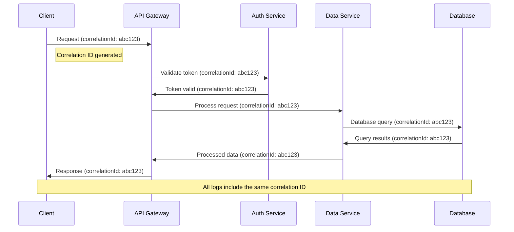
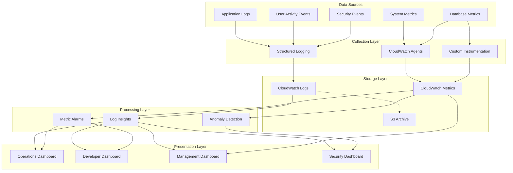
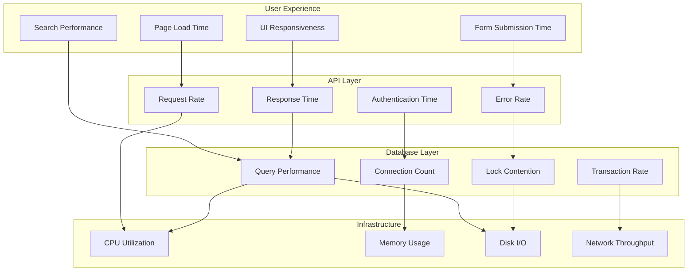
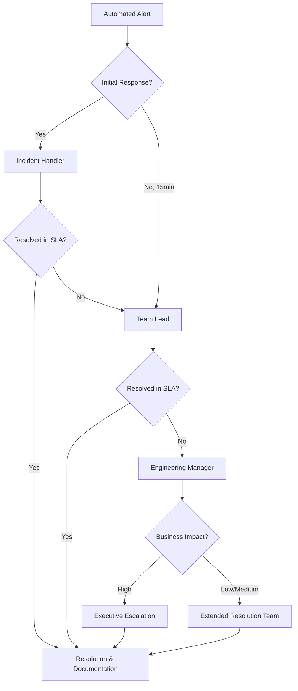
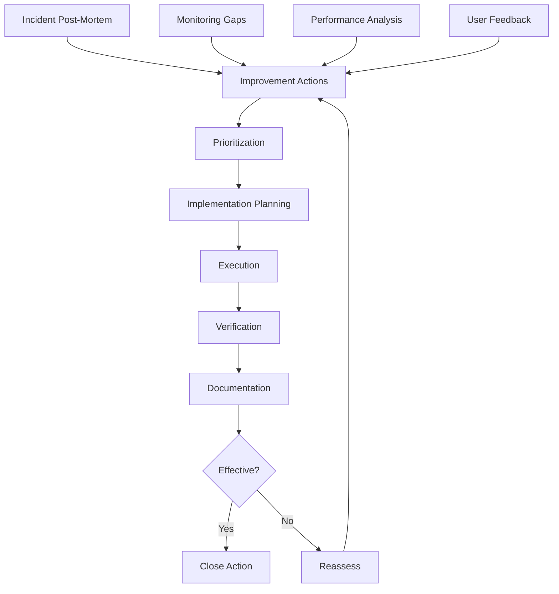
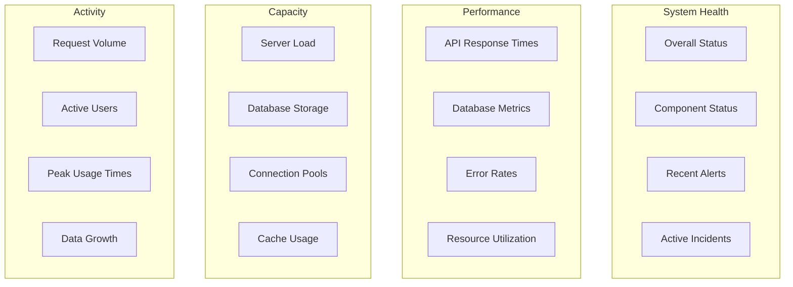
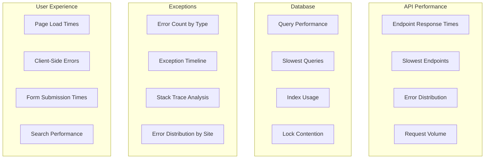
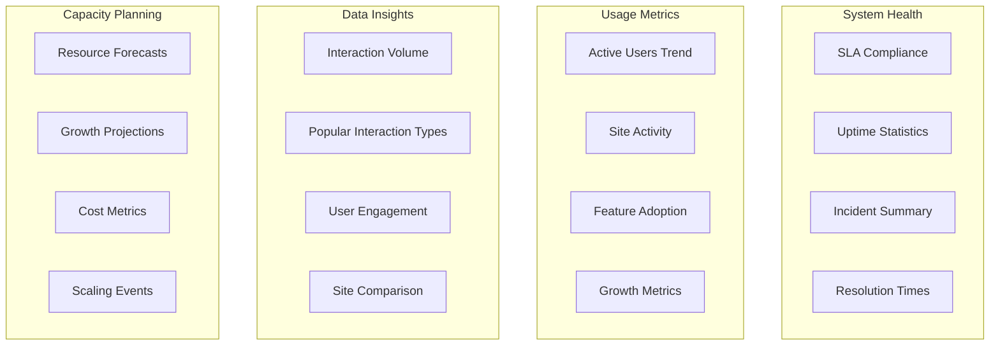
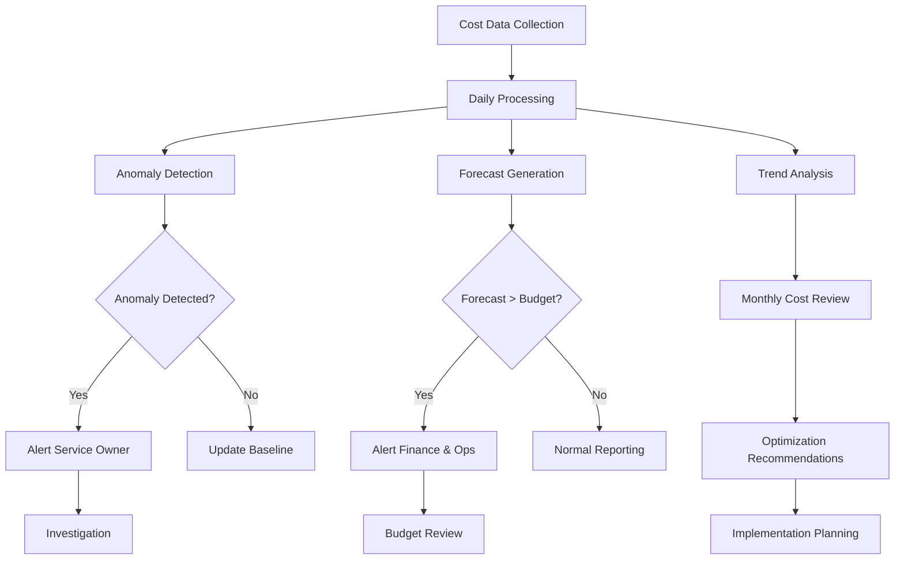

# Monitoring and Observability Architecture

## 1. Introduction

### 1.1 Purpose
This document describes the monitoring and observability architecture for the Interaction Management System. It outlines the strategies, tools, and practices for collecting metrics, logs, and traces; setting up alerts; and responding to incidents. The goal is to ensure the system's reliability, performance, and security through comprehensive monitoring and well-defined response procedures.

### 1.2 Scope
This document covers:
- Metrics collection and log aggregation infrastructure
- Health checks and performance monitoring patterns
- Incident response and escalation procedures
- Dashboard configurations for different stakeholders
- Alert thresholds and Service Level Agreements (SLAs)
- Cost monitoring and optimization strategies

### 1.3 Related Documents
- Infrastructure Deployment Guide
- Operations Runbook
- Disaster Recovery Plan
- Security Monitoring Guidelines

## 2. Monitoring Infrastructure

### 2.1 Metrics Collection

The Interaction Management System implements a multi-layered metrics collection approach to provide comprehensive visibility into all aspects of the application.

| Metric Category | Collection Method | Retention | Purpose |
|-----------------|-------------------|-----------|---------|
| System Metrics | CloudWatch Agents | 30 days | Track server resource utilization |
| Application Metrics | Custom instrumentation | 90 days | Measure application performance |
| Database Metrics | PostgreSQL monitoring | 30 days | Monitor database health and performance |
| User Activity | Application events | 180 days | Track usage patterns and adoption |

Metrics collection follows a push model, with application components sending metrics to the centralized CloudWatch service at regular intervals (15-second default). The metrics pipeline includes:

- Client-side performance tracking for UI operations
- Server-side timing for API endpoints and database queries
- Infrastructure metrics for server and container health
- Business metrics for feature usage and interaction statistics

#### 2.1.1 Key Metrics by Component

**Frontend Application:**
- Page load time
- Time to interactive
- Client-side error count
- API request time
- Search execution time
- UI rendering time

**API Layer:**
- Request rate (requests per second)
- Response time (p50, p90, p99 percentiles)
- Error rate by endpoint
- Authentication time
- Database query time

**Database Layer:**
- Query execution time
- Connection pool utilization
- Deadlock count
- Index usage statistics
- Transaction rate
- Disk I/O operations

**Infrastructure:**
- CPU utilization
- Memory usage
- Disk space utilization
- Network throughput
- Container restart count
- Load balancer metrics

### 2.2 Log Aggregation

The system implements structured logging with centralized aggregation to enable efficient troubleshooting and analysis.

| Log Type | Source | Format | Retention |
|----------|--------|--------|-----------|
| Application Logs | Web/API servers | JSON structured | 30 days |
| Access Logs | Web servers | Combined format | 90 days |
| Security Logs | Auth services | JSON structured | 180 days |
| Database Logs | PostgreSQL | Standard PG format | 14 days |

The logging architecture uses:
- Standard logging levels (DEBUG, INFO, WARN, ERROR, FATAL)
- Correlation IDs to track requests across components
- Structured JSON format with consistent field names
- Centralized storage in CloudWatch Logs
- Log groups organized by environment and component

#### 2.2.1 Standard Log Fields

All application logs include the following standard fields:

```json
{
  "timestamp": "2023-08-15T10:23:45.678Z",
  "level": "INFO",
  "component": "InteractionService",
  "correlationId": "abc-123-xyz",
  "userId": "user-456",
  "siteId": "site-789",
  "message": "Created new interaction",
  "details": {
    "interactionId": "int-101112",
    "operationType": "CREATE"
  }
}
```

### 2.3 Distributed Tracing

For this application scale, a lightweight distributed tracing approach is implemented to track request flows across system components.

| Tracing Aspect | Implementation | Purpose |
|----------------|----------------|---------|
| Request Tracing | Correlation IDs | Track request flow across components |
| Performance Traces | Custom annotations | Identify bottlenecks in critical paths |
| Error Tracing | Breadcrumb captures | Reconstruct error scenarios |

Each incoming request is assigned a unique correlation ID that is passed through all components, enabling end-to-end visibility of request processing.



### 2.4 Alert Management

The alert management system provides timely notification of system issues based on severity and impact.

| Alert Category | Channels | Urgency Levels | Response Time |
|----------------|----------|---------------|---------------|
| Infrastructure | Email, SMS | High, Medium, Low | 15min, 1hr, 4hr |
| Application | Email, SMS | High, Medium, Low | 15min, 1hr, 4hr |
| Security | Email, SMS, Phone | Critical, High | 5min, 30min |
| Business | Email | Medium, Low | 2hr, 8hr |

Alerts are configured with appropriate thresholds to minimize false positives while ensuring timely detection of actual issues. Alert fatigue is managed through:
- Alert correlation to reduce duplicate notifications
- Context-rich alert messages with actionable information
- Adjustable thresholds based on historical patterns
- Muting during maintenance windows

#### 2.4.1 Alert Format

All alerts include the following information:

```
[SEVERITY] Alert: {short_description}

System: {component_name}
Environment: {environment}
Time: {timestamp}
Details: {detailed_description}

Metric: {metric_name}
Current Value: {current_value}
Threshold: {threshold_value}

Suggested Action: {troubleshooting_steps}
Dashboard: {dashboard_link}
Runbook: {runbook_link}
```

### 2.5 Dashboard Design

The monitoring system includes purpose-built dashboards for different stakeholders to provide relevant insights for their specific needs.

| Dashboard | Audience | Content | Refresh Rate |
|-----------|----------|---------|-------------|
| Operations | IT Operations | System health, resources | 1 minute |
| Application | Developers | API performance, errors | 5 minutes |
| Security | Security Team | Auth attempts, anomalies | 15 minutes |
| Business | Management | Usage metrics, adoption | 1 hour |



## 3. Observability Patterns

### 3.1 Health Checks

The system implements multi-level health checks to verify component status and availability.

| Health Check | Endpoint | Frequency | Verification |
|--------------|----------|-----------|-------------|
| Basic Liveness | /health | 30 seconds | Service responds |
| Database Connectivity | /health/db | 1 minute | DB connection test |
| Authentication Service | /health/auth | 1 minute | Auth service check |
| Storage Service | /health/storage | 5 minutes | Storage access test |

Health checks are designed to be lightweight and non-intrusive, with minimal impact on system performance. They return standardized responses with:
- Status (UP/DOWN/DEGRADED)
- Component-specific details
- Response time measurements
- Version information (where appropriate)

#### 3.1.1 Health Check Response Format

```json
{
  "status": "UP",
  "timestamp": "2023-08-15T10:30:45Z",
  "components": [
    {
      "name": "api",
      "status": "UP",
      "details": {
        "version": "1.2.3",
        "responseTime": "42ms"
      }
    },
    {
      "name": "database",
      "status": "UP",
      "details": {
        "responseTime": "56ms",
        "connections": "5/20"
      }
    },
    {
      "name": "auth",
      "status": "UP",
      "details": {
        "responseTime": "38ms"
      }
    }
  ]
}
```

### 3.2 Performance Metrics

Key performance metrics are tracked to ensure the system meets its performance objectives and to identify potential issues before they impact users.

| Metric | Description | Target | Critical Threshold |
|--------|-------------|--------|-------------------|
| API Response Time | Average time to process API requests | < 200ms | > 500ms |
| Database Query Time | Average time for DB operations | < 100ms | > 300ms |
| Page Load Time | Time to interactive for web pages | < 2s | > 5s |
| Search Performance | Time to return search results | < 500ms | > 2s |

These metrics are collected at both the system level (for overall health) and per-endpoint level (for detailed analysis). Performance monitoring includes:
- Percentile measurements (p50, p90, p99) for accurate assessment
- Baseline comparisons to identify gradual degradation
- Historical trending to correlate with system changes
- Resource utilization correlation (CPU, memory, etc.)

### 3.3 Business Metrics

Business metrics provide insights into system usage and adoption, helping stakeholders understand how the system is being used.

| Metric | Description | Purpose | Stakeholder |
|--------|-------------|---------|-------------|
| Active Users | Daily/monthly active users | Adoption tracking | Management |
| Interactions Created | New interactions per day/site | Usage measurement | Management |
| Search Volume | Searches performed per day | Feature utilization | Product Team |
| Edit Frequency | Updates to existing records | Data maintenance | Operations |

Business metrics are displayed on dedicated dashboards with trend analysis and filtering by site to provide context-specific insights.

### 3.4 SLA Monitoring

SLA monitoring ensures the system meets its performance and availability targets defined in service level agreements.

| SLA Category | Metric | Target | Measurement Method |
|--------------|--------|--------|-------------------|
| Availability | System uptime | 99.9% | Health check success rate |
| Performance | API response time | 95% < 500ms | Response time percentiles |
| Reliability | Error rate | < 0.1% | Failed requests / total |
| Data Integrity | Data loss incidents | 0 | Audit log verification |

SLA compliance is measured and reported monthly, with automated alerts for potential SLA breaches before they impact compliance.

### 3.5 Capacity Tracking

Capacity metrics are monitored to ensure sufficient resources and plan for growth, preventing resource constraints that could affect performance.

| Resource | Metrics | Warning Threshold | Critical Threshold |
|----------|---------|-------------------|-------------------|
| Database | Storage, connections, query volume | 70% | 85% |
| Application Servers | CPU, memory, request queue | 75% | 90% |
| Cache | Memory usage, eviction rate | 80% | 95% |
| Storage | Used space, I/O operations | 70% | 85% |

Capacity planning uses trend analysis to forecast resource needs based on:
- User growth projections
- Data volume increase rates
- Peak usage patterns
- Seasonal variations



## 4. Incident Response

### 4.1 Alert Routing

The system implements a structured alert routing workflow to ensure proper handling of incidents based on their severity and impact.

| Alert Severity | Initial Notification | Escalation Path | Response Time |
|----------------|----------------------|-----------------|---------------|
| Critical | On-call team (SMS+Call) | Team Lead → Manager | 15 minutes |
| High | On-call team (SMS) | Team Lead | 30 minutes |
| Medium | Developer team (Email) | Team Lead if unresolved | 2 hours |
| Low | Monitoring dashboard | None | Next business day |

Alerts include context-rich information:
- Alert description and severity
- Affected component and environment
- Metric values and thresholds
- Link to relevant dashboard
- Suggested initial troubleshooting steps

### 4.2 Escalation Procedures

The escalation framework ensures that incidents receive appropriate attention based on their severity and duration.



Escalation procedures include defined handoff processes:
- Incident summary documentation
- Current status and attempted solutions
- Required resources for resolution
- Business impact assessment

### 4.3 Runbooks

Standardized runbooks guide the response to common incidents, ensuring consistent and efficient incident handling.

| Incident Type | Runbook Contents | Automation Level |
|---------------|------------------|------------------|
| API Performance | Diagnosis steps, query analysis | Semi-automated |
| Database Issues | Connection, query, storage checks | Partially automated |
| Authentication Failures | Token validation, service checks | Manual with tools |
| Data Access Errors | Permission checks, site-scoping | Manual with tools |

Runbooks are maintained in a centralized knowledge base, with regular reviews and updates based on incident learnings.

#### 4.3.1 Runbook Example - API Performance Issue

```
# API Performance Degradation Runbook

## Initial Assessment
1. Check API response time metrics in CloudWatch
2. Verify if issue affects all endpoints or specific ones
3. Check database query performance
4. Check system resource utilization (CPU, memory)

## Diagnostic Steps
1. Review recent changes deployed to the system
2. Examine application logs for errors or warnings
3. Check database connection pool status
4. Analyze slow query logs for problematic queries

## Resolution Steps
1. If specific endpoint: Apply query optimization or caching
2. If database connection pool saturated: Increase pool size
3. If resource constrained: Scale up instance or add instances
4. If code issue identified: Implement hotfix

## Validation
1. Verify API response times return to normal levels
2. Monitor for 15 minutes to ensure stability
3. Document findings and resolution

## Prevention
1. Create ticket for long-term optimizations if needed
2. Update monitoring thresholds if appropriate
3. Document lessons learned for knowledge sharing
```

### 4.4 Post-Mortem Processes

The post-mortem process documents incidents and drives improvements to prevent recurrence.

| Phase | Activities | Timeframe | Outcomes |
|-------|------------|-----------|----------|
| Documentation | Incident timeline, impact, response | 1 day post-resolution | Incident report |
| Analysis | Root cause determination | 3 days post-resolution | Causal analysis |
| Action Planning | Prevention and improvement measures | 1 week post-resolution | Action plan |
| Implementation | Execute improvement actions | Based on priority | System enhancements |

Post-mortems follow a blameless approach focusing on:
- Systemic issues rather than individual mistakes
- Process improvements to prevent recurrence
- Knowledge sharing across teams
- Verification of effectiveness

#### 4.4.1 Post-Mortem Template

```
# Incident Post-Mortem Report

## Incident Summary
- Date/Time: [Date and time incident began]
- Duration: [How long the incident lasted]
- Impact: [Description of user/business impact]
- Severity: [Critical/High/Medium/Low]

## Timeline
- [Timestamp] - [Event description]
- [Timestamp] - [Event description]
- [Timestamp] - [Event description]
- [Timestamp] - Resolution implemented

## Root Cause
[Detailed explanation of what caused the incident]

## Detection
- How was the incident detected?
- Was monitoring effective?
- Were alerts appropriate and timely?

## Response
- What went well in the response?
- What could have been improved?
- Were runbooks effective?

## Resolution
- Actions taken to resolve the incident
- Time to resolution
- Verification steps

## Preventative Measures
1. [Action item 1]
2. [Action item 2]
3. [Action item 3]

## Lessons Learned
- [Key takeaway 1]
- [Key takeaway 2]
- [Key takeaway 3]
```

### 4.5 Improvement Tracking

Continuous improvement is tracked through a dedicated process to ensure that lessons learned from incidents lead to actual system enhancements.



Improvement tracking includes:
- Centralized database of improvement actions
- Regular review of pending improvements
- Effectiveness measurements
- Trend analysis to identify systemic issues

## 5. Dashboards

### 5.1 Operations Dashboard

The Operations Dashboard provides a comprehensive view of system health and performance for IT operations staff.



**Key Metrics:**
- System uptime and availability
- Response times by service
- Error rates by service and endpoint
- Resource utilization (CPU, memory, disk, network)
- Active user count
- Request volume

### 5.2 Developer Dashboard

The Developer Dashboard focuses on application performance, code-level issues, and debugging information for the development team.



**Key Metrics:**
- API response times by endpoint
- Slowest database queries
- Error counts by type and location
- Client-side performance metrics
- Search response times
- Form submission success/failure rates

### 5.3 Management Dashboard

The Management Dashboard provides business-oriented metrics and SLA tracking for management stakeholders.



**Key Metrics:**
- SLA compliance percentages
- Monthly active users
- Interaction creation/update volume
- Feature usage statistics
- Cost per transaction
- Growth trends by site

## 6. Alerting

### 6.1 Performance Alert Thresholds

| Metric | Warning Threshold | Critical Threshold | Evaluation Period |
|--------|-------------------|-------------------|-------------------|
| API Response Time | > 300ms avg over 5min | > 500ms avg over 5min | 5 minutes |
| Database Query Time | > 200ms avg over 5min | > 400ms avg over 5min | 5 minutes |
| Error Rate | > 1% of requests | > 5% of requests | 5 minutes |
| Authentication Time | > 500ms avg over 5min | > 1s avg over 5min | 5 minutes |

### 6.2 Resource Alert Thresholds

| Resource | Warning Threshold | Critical Threshold | Evaluation Period |
|----------|-------------------|-------------------|-------------------|
| CPU Usage | > 70% for 10min | > 85% for 5min | 5 minutes |
| Memory Usage | > 75% for 10min | > 90% for 5min | 5 minutes |
| Disk Space | > 70% used | > 85% used | 15 minutes |
| Connection Pool | > 70% utilized | > 90% utilized | 5 minutes |

### 6.3 Business Alert Thresholds

| Metric | Warning Threshold | Critical Threshold | Evaluation Period |
|--------|-------------------|-------------------|-------------------|
| Failed Logins | > 20% rate over 15min | > 40% rate over 5min | 5 minutes |
| Form Submission Errors | > 10% rate over 30min | > 25% rate over 10min | 10 minutes |
| Search Failures | > 5% rate over 30min | > 15% rate over 10min | 10 minutes |

### 6.4 Service Level Agreements

| Service | Metric | SLA Target | Measurement Window |
|---------|--------|------------|-------------------|
| System Availability | Uptime | 99.9% | Monthly |
| API Performance | Response Time | 95% < 500ms | Daily |
| Search Performance | Response Time | 95% < 1s | Daily |
| Form Submission | Success Rate | 99.5% | Daily |

## 7. Cost Monitoring

### 7.1 Cost Tracking

The system implements cost monitoring to ensure efficient resource utilization and prevent unexpected expenses.

| Component | Tracking Method | Reporting Frequency |
|-----------|-----------------|---------------------|
| AWS Resources | AWS Cost Explorer | Daily and Monthly |
| Third-party Services | Expense Management System | Monthly |
| Development Resources | Time Tracking System | Weekly |

All resources are tagged with:
- Environment (dev, staging, prod)
- Component (frontend, backend, database)
- Cost center
- Project name

### 7.2 Optimization Strategies

| Strategy | Implementation | Estimated Savings |
|----------|----------------|-------------------|
| Reserved Instances | 1-year commitment for baseline capacity | ~30% over on-demand |
| Auto-scaling | Scale down during off-hours (nights/weekends) | ~40% compute reduction |
| Storage Tiering | Transition older data to lower-cost storage | ~15% storage costs |
| Performance Optimization | Query tuning, caching, code efficiency | ~20% resource reduction |

### 7.3 Budget Alerts

| Budget Type | Alert Threshold | Notification Channel | Response Action |
|-------------|-----------------|----------------------|-----------------|
| Monthly AWS | 80% of forecast | Email to Finance & Ops | Review usage patterns |
| Monthly AWS | 100% of forecast | Email, SMS to Ops Lead | Implement cost controls |
| Per-Service | 120% of average | Email to Service Owner | Investigate anomalies |
| Projected Overage | Any forecast overage | Email to Management | Adjust budget or usage |

