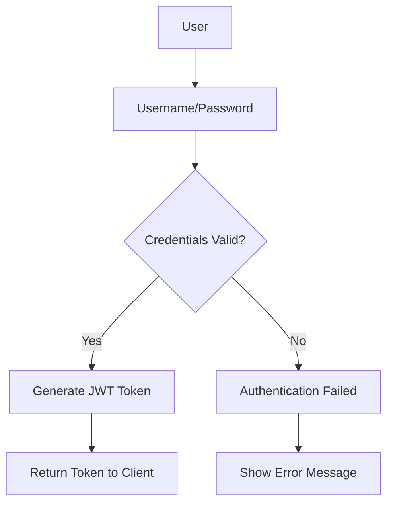
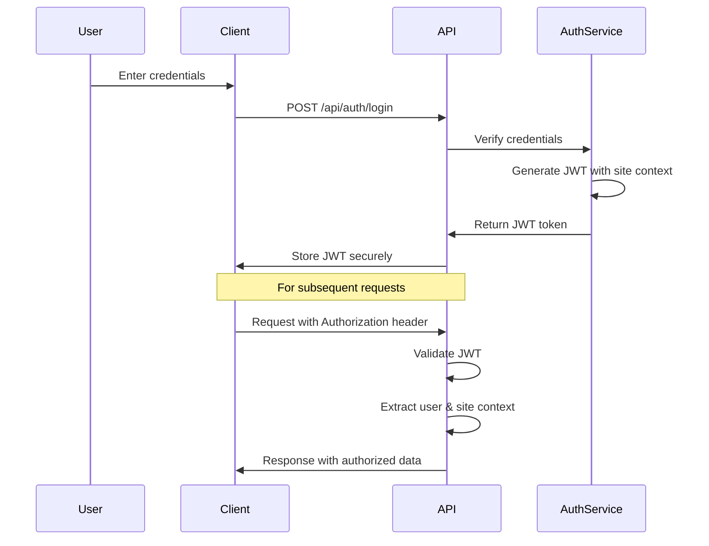
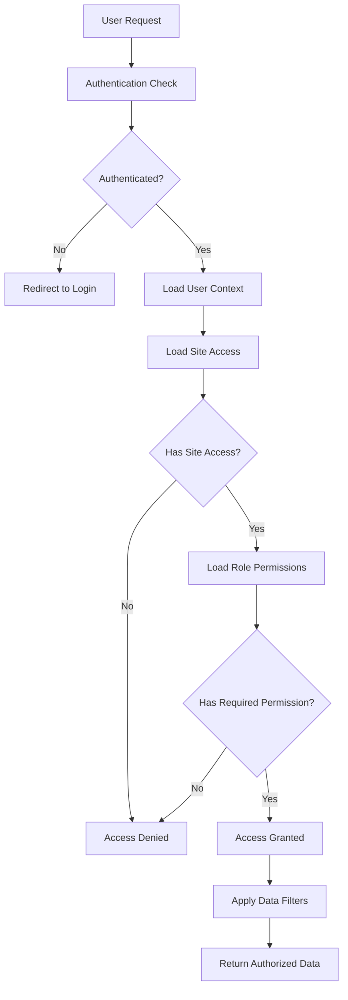
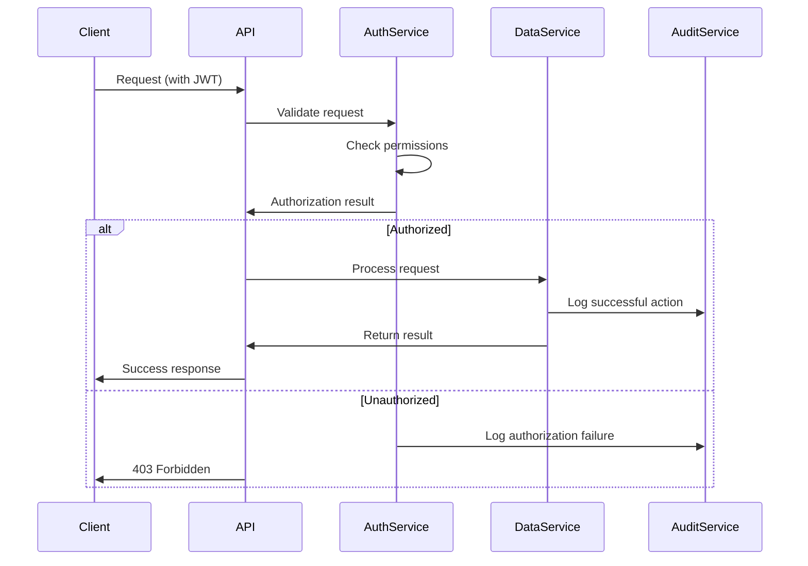
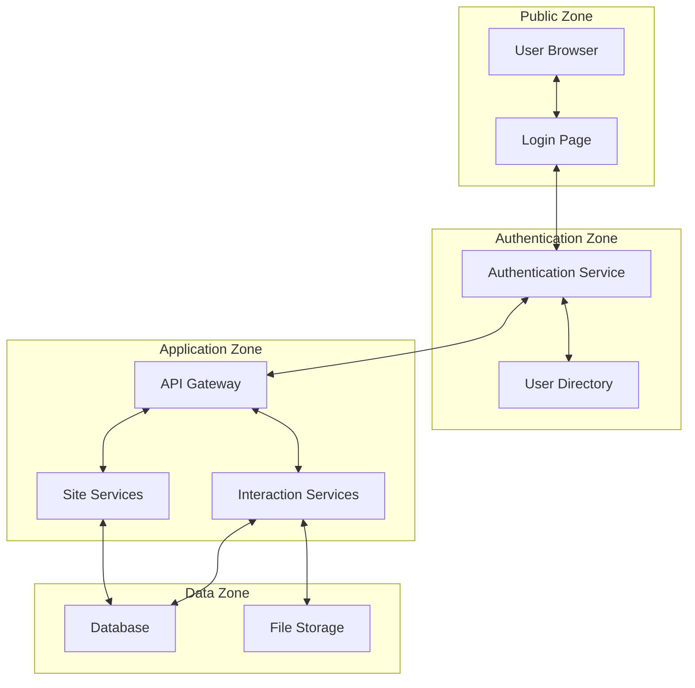

# SECURITY ARCHITECTURE

This document outlines the security architecture of the Interaction Management System, detailing the approaches, mechanisms, and technologies used to ensure data protection, user authentication, and proper authorization. This document is self-contained but works in conjunction with other architecture documents that implement these security principles.

## AUTHENTICATION FRAMEWORK

The authentication system provides secure identity verification while maintaining a streamlined user experience for the Interaction Management System.

### Identity Management

The system implements a comprehensive identity management approach with the following components:

| Component | Implementation | Description |
|-----------|----------------|-------------|
| User Store | Database-backed user repository | Securely stores user credentials and profile information with site associations |
| Authentication Service | JWT-based authentication // JSON Web Tokens RFC 7519 | Validates credentials and issues secure tokens for authenticated sessions |
| Account Management | Self-service and admin interfaces | Provides functionality for password resets and account maintenance |

### Multi-factor Authentication

For this system, standard username/password authentication will be implemented initially, with infrastructure support for adding MFA in future releases if required.

### Session Management

| Aspect | Implementation | Details |
|--------|----------------|--------|
| Session Format | JWT Tokens // JSON Web Tokens RFC 7519 | Stateless authentication with signed tokens containing user identity and site context |
| Token Lifetime | 24 hours | Configurable expiration with sliding renewal for active users |
| Token Storage | Browser secure storage | Tokens stored in HttpOnly cookies or secure browser storage |
| Session Termination | Explicit logout and timeout | Sessions end on logout or after configured inactivity period |

### Token Handling

### Password Policies

| Policy | Requirement | Enforcement Point |
|--------|-------------|-------------------|
| Complexity | Minimum 8 characters, mix of uppercase, lowercase, numbers and symbols | Registration and password change forms |
| History | No reuse of previous 5 passwords | Password change process |
| Expiration | 90-day password rotation | Automated expiration enforcement |
| Failed Attempts | Account lockout after 5 consecutive failures | Authentication service |

## AUTHORIZATION SYSTEM

The authorization system enforces site-based multi-tenancy and role-based access control for all system resources.

### Role-Based Access Control

| Role | Description | Permissions |
|------|-------------|-------------|
| Administrator | Site-level administrator | Full access to interactions and user management within assigned sites |
| Editor | Standard user with edit rights | View, create, edit interactions within assigned sites |
| Viewer | Read-only access | View-only access to interactions within assigned sites |

### Permission Management

Permission management is centralized in the authorization service, which verifies:
1. User authentication status
2. Site membership
3. Role-based action permissions
4. Resource-level access rights

### Resource Authorization

| Resource | Authorization Check | Implementation |
|----------|---------------------|----------------|
| Interactions | Site-scoped with role checks | Enforced at service layer with database filtering |
| User Management | Administrator-only within site | Role-based menu visibility with service-layer enforcement |
| Site Configuration | Global administrators only | Separate permission set with explicit checks |

### Policy Enforcement Points

| Layer | Enforcement Mechanism | Purpose |
|-------|----------------------|----------|
| UI | Component rendering based on permissions | Prevent display of unauthorized actions |
| API Gateway | JWT validation and role checks // JSON Web Tokens RFC 7519 | Block unauthorized requests before processing |
| Service Layer | Site context filtering | Ensure data access respects site boundaries |
| Database | Row-level security (optional) | Provide additional defense-in-depth |

### Audit Logging

All security-relevant events are logged with the following information:

| Event Type | Logged Information | Retention Period |
|------------|-------------------|------------------|
| Authentication | User ID, timestamp, success/failure, IP address | 90 days |
| Authorization Failures | User ID, resource requested, timestamp | 90 days |
| Admin Actions | User ID, action performed, affected resource, timestamp | 1 year |
| Data Modifications | User ID, record ID, modification type, timestamp | 1 year |

## DATA PROTECTION

The application implements comprehensive data protection measures to safeguard interaction data throughout its lifecycle.

### Encryption Standards

| Data State | Encryption Standard | Implementation |
|------------|---------------------|----------------|
| Data in Transit | TLS 1.2+ // Transport Layer Security 1.2+ | HTTPS for all communications |
| Data at Rest | AES-256 // Advanced Encryption Standard 256-bit | Database-level encryption |
| Sensitive Fields | Field-level encryption | Additional protection for specific fields |

### Key Management

Key management follows industry best practices:
- Separation of duties for key access
- Regular key rotation (annually or upon security events)
- Secure key storage using environment-specific key vaults
- Key backup procedures with secure recovery mechanisms

### Data Masking Rules

| Data Type | Masking Approach | Visibility |
|-----------|------------------|------------|
| User Credentials | One-way hashing (bcrypt) | Never exposed |
| Sensitive Interaction Data | Role-based access control | Visible only to authorized roles |

### Secure Communication

All system communications use the following security controls:

| Communication Path | Security Control | Implementation |
|-------------------|------------------|----------------|
| Client-Server | TLS 1.2+ // Transport Layer Security 1.2+ | HTTPS with strong cipher suites |
| API Parameters | Input validation | Server-side validation with sanitization |
| API Responses | Output encoding | Prevention of injection attacks |
| Cookies | HttpOnly, Secure flags | Protection against XSS attacks |

### Compliance Controls

The system implements controls to meet common security compliance requirements:

| Compliance Area | Implementation | Verification |
|-----------------|----------------|---------------|
| Authentication | Strong password policies | Regular security testing |
| Access Control | Role-based permissions with site isolation | Access reviews and audit logs |
| Data Protection | Encryption and secure handling | Security scans and penetration testing |
| Audit Logging | Comprehensive event capture | Log reviews and retention policies |

## SECURITY ZONES

The system is divided into distinct security zones with different trust levels and access controls:

1. **Public Zone**: Accessible to unauthenticated users, limited to login functionality
2. **Authentication Zone**: Handles credential verification and token issuance
3. **Application Zone**: Contains business logic and APIs, accessible only with valid authentication
4. **Data Zone**: Most restricted zone, accessible only through application services

### SECURITY CONTROL MATRIX

| Security Control | Public Zone | Authentication Zone | Application Zone | Data Zone |
|------------------|-------------|---------------------|-----------------|------------|
| Authentication | Anonymous Access | Credential Validation | Token Validation // JSON Web Tokens RFC 7519 | No Direct Access |
| Authorization | None | Basic Identity Verification | Full RBAC | Service-level Access |
| Encryption | TLS // Transport Layer Security 1.2+ | TLS // Transport Layer Security 1.2+ + Token Encryption | TLS // Transport Layer Security 1.2+ | TLS // Transport Layer Security 1.2+ + Data Encryption |
| Logging | Access Logging | Full Authentication Logging | Operation Logging | Data Access Logging |
| Monitoring | Basic Rate Limiting | Failed Attempt Monitoring | Activity Monitoring | Query Monitoring |

This layered security approach ensures defense-in-depth, with each zone implementing appropriate security controls for its sensitivity level.

## SYSTEM SECURITY COMPONENTS

The Interaction Management System implements security through several key architectural components:

1. **Authentication Service**: Manages user authentication, token issuance, and validation
2. **Site Context Middleware**: Enforces data isolation based on site associations
3. **Authorization Service**: Validates permissions based on user roles within sites
4. **Encryption Layer**: Protects sensitive data at rest and in transit
5. **Audit Logging Service**: Records security-relevant events for accountability

These components work together to create a comprehensive security architecture that protects the system at multiple levels while enabling the required business functionality.

## BACKEND SECURITY IMPLEMENTATION

The backend implements the security architecture described in this document through several key components:

1. **JWT Middleware**: Validates authentication tokens on all protected routes // JSON Web Tokens RFC 7519
2. **Site Context Filter**: Automatically applies site-scoping to all database queries
3. **Permission Validators**: Function decorators that enforce role-based permissions
4. **Database Security**: Implements row-level security through application logic
5. **Encryption Services**: Provides utilities for field-level encryption where needed

This implementation ensures consistent application of security controls across all backend services and endpoints.