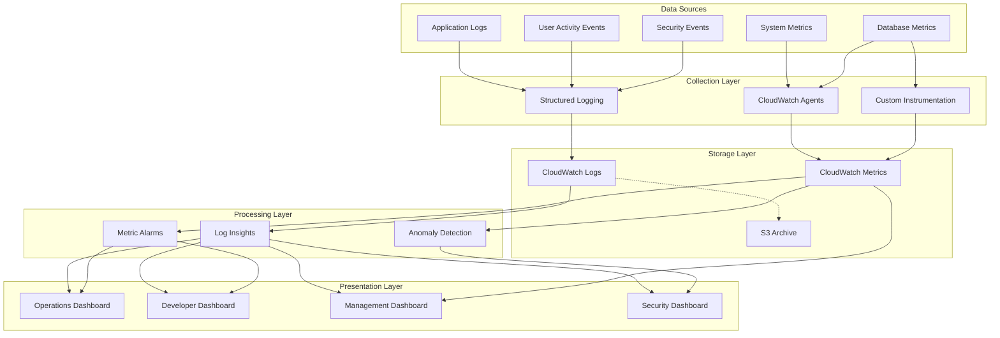
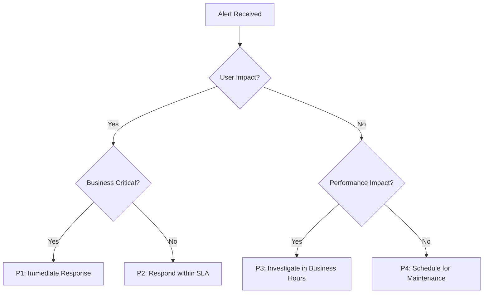
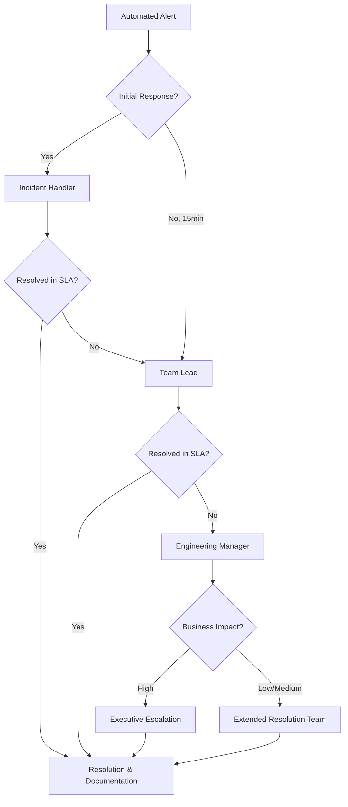
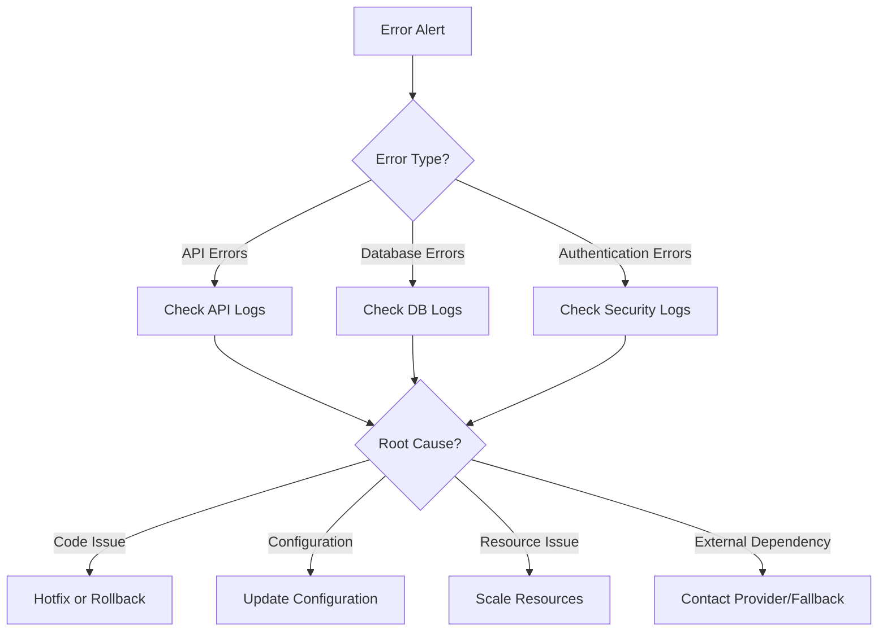
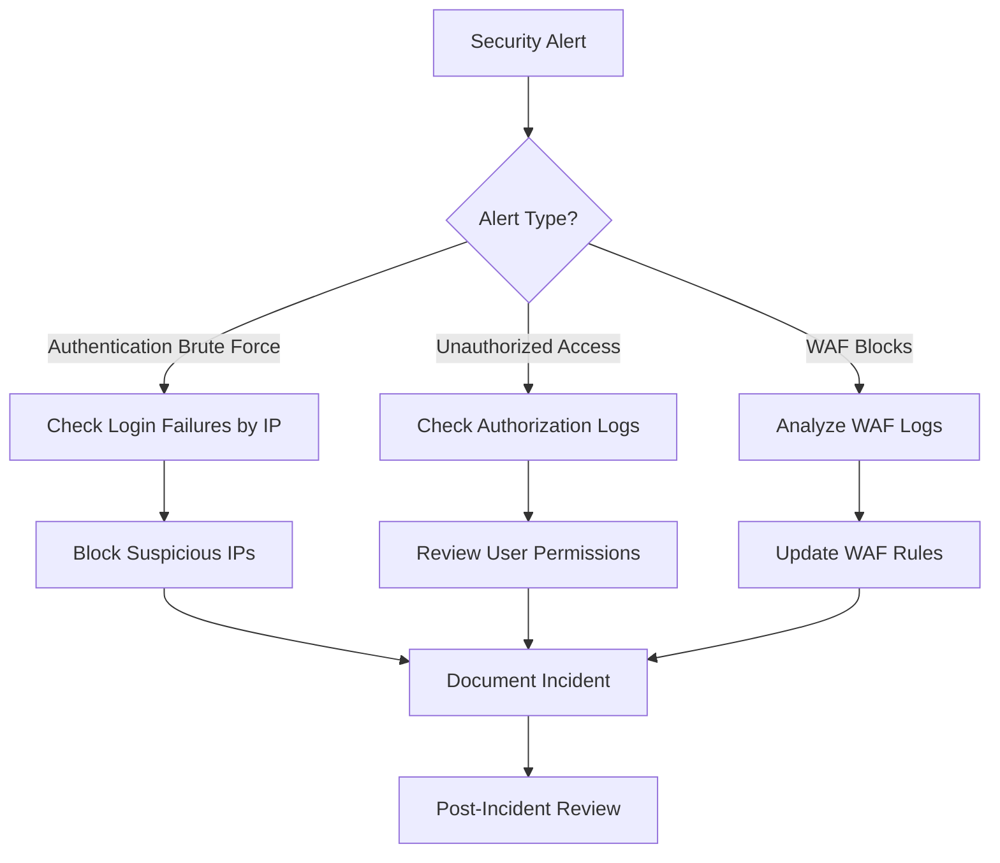

# Monitoring Guide

This guide provides comprehensive information on the monitoring infrastructure for the Interaction Management System. It covers how to use dashboards, understand metrics and logs, configure alerts, respond to incidents, and troubleshoot issues using monitoring data.

## Monitoring Overview

The Interaction Management System employs a multi-layered monitoring approach to ensure reliability, performance, and security across all system components.

### Monitoring Architecture

The monitoring infrastructure is built on AWS CloudWatch with PagerDuty integration for alerting and incident management:

- **Metrics Collection**: System, application, database, and user activity metrics collected via CloudWatch agents and custom instrumentation
- **Log Aggregation**: Centralized collection of application, access, and security logs using structured JSON format with correlation IDs
- **Distributed Tracing**: Request tracking across components using correlation IDs
- **Alert Management**: Tiered alerting system with different urgency levels and response times
- **Dashboards**: Purpose-built dashboards for different stakeholders (operations, developers, management, security)

The monitoring architecture follows these data flows:



### Monitoring Components

The monitoring system consists of the following key components:

1. **CloudWatch Metrics**: Collects and analyzes numeric data about system and application performance
2. **CloudWatch Logs**: Centralizes logs from all application components with structured logging
3. **CloudWatch Alarms**: Monitors metrics and triggers alerts when thresholds are exceeded
4. **CloudWatch Dashboards**: Provides visualization of metrics for different stakeholders
5. **PagerDuty Integration**: Manages alert notifications and incident response workflows

## Accessing Monitoring Dashboards

CloudWatch dashboards provide a visual representation of system and application metrics organized by functional areas.

### How to Access CloudWatch Dashboards

1. Log in to the AWS Management Console
2. Navigate to CloudWatch service
3. Select "Dashboards" from the left navigation panel
4. Select the appropriate dashboard from the list:
   - `InteractionManagement-{environment}-Operations`
   - `InteractionManagement-{environment}-Application`
   - `InteractionManagement-{environment}-Database`
   - `InteractionManagement-{environment}-Security`

Where `{environment}` is one of:
- `dev` - Development environment
- `staging` - Staging/testing environment
- `prod` - Production environment

### Operations Dashboard

The Operations Dashboard provides a high-level overview of system health and resources, designed for the operations team.

**Key Sections:**
- **System Health**: Overall status, component status, active alarms, and recent incidents
- **Performance**: API response times, database metrics, error rates, and resource utilization
- **Capacity**: Server load, database storage, connection pools, and cache usage
- **Activity**: Request volume, active users, peak usage times, and data growth

**Important Widgets:**
- **Active Alarms**: Shows currently triggered alarms requiring attention
- **Load Balancer Host Health**: Displays healthy vs. unhealthy hosts
- **Component CPU Utilization**: Shows CPU usage across ECS, RDS, and ElastiCache
- **API Response Times**: Tracks average, p90, and p99 response times
- **Error Rates**: Monitors percentage of requests resulting in errors


### Application Dashboard

The Application Dashboard focuses on application performance and errors, designed for developers.

**Key Sections:**
- **API Performance**: Endpoint response times, slowest endpoints, request volume, and error distribution
- **Database**: Query performance, connection counts, and slow queries
- **Exceptions**: Error counts by type, exception timeline, stack trace analysis, and error distribution by site
- **User Experience**: Page load times, client-side errors, form submission times, and search performance

**Important Widgets:**
- **Endpoint Response Times**: Shows response times for different API endpoints
- **Error Count by Type**: Breaks down errors by category (validation, authentication, etc.)
- **Client-Side Errors**: Tracks JavaScript, resource loading, and network errors in the browser
- **Search Performance**: Monitors basic and advanced search response times

### Database Dashboard

The Database Dashboard monitors database health, performance, and capacity, designed for database administrators and operations teams.

**Key Sections:**
- **RDS Metrics**: CPU, memory, storage, connections, IOPS, and latency
- **ElastiCache Metrics**: CPU, memory, cache hits/misses, connections, and evictions
- **Connection Pool Metrics**: Active connections, idle connections, and connection wait time
- **Database Health Overview**: Combined view of critical database metrics

**Important Widgets:**
- **RDS Connections**: Shows active database connections with warning thresholds
- **RDS Latency**: Tracks read and write latency
- **Cache Hits/Misses**: Monitors cache efficiency
- **Database Query Duration**: Tracks average and maximum query execution times

### Security Dashboard

The Security Dashboard monitors security-related metrics and events, designed for the security team.

**Key Sections:**
- **Authentication Metrics**: Login attempts, success rates, and failures
- **Authorization Metrics**: Site access denials, permission denials, and cross-site attempts
- **WAF Security**: Blocked requests, allowed requests, and rate limiting
- **Network Security**: VPC security group blocks and rejected connections

**Important Widgets:**
- **Authentication Failure Rate**: Shows percentage of failed login attempts
- **JWT Token Operations**: Tracks token generation, validation, and rejection
- **Cross-Site Access Attempts**: Monitors attempts to access unauthorized sites
- **Security Alarms**: Shows active security-related alarms

## Understanding Metrics and Logs

The monitoring system collects various metrics and logs to provide comprehensive visibility into the system's health and performance.

### System Metrics

System metrics provide insights into infrastructure resources and utilization.

| Metric | Description | Source | Thresholds |
|--------|-------------|--------|------------|
| CPU Utilization | Percentage of CPU resources used | ECS, RDS, ElastiCache | Warning: >70%<br>Critical: >85% |
| Memory Utilization | Percentage of memory resources used | ECS, RDS, ElastiCache | Warning: >75%<br>Critical: >90% |
| Disk Space Utilization | Percentage of storage space used | RDS | Warning: >70%<br>Critical: >85% |
| Network Throughput | Network traffic in/out | ECS, RDS | Context-dependent |

**Example Query for CPU Utilization Alert:**
```
SELECT AVG(CPUUtilization) 
FROM AWS/ECS 
WHERE ClusterName = 'interaction-management-cluster' 
AND ServiceName = 'interaction-management-service'
GROUP BY ServiceName, ClusterName
```

### Application Metrics

Application metrics track API and application performance.

| Metric | Description | Source | Thresholds |
|--------|-------------|--------|------------|
| API Response Time | Time to process API requests | Custom metrics | Warning: >300ms<br>Critical: >500ms |
| Error Rate | Percentage of requests resulting in errors | ALB, Custom metrics | Warning: >1%<br>Critical: >5% |
| Request Count | Number of API requests | ALB, Custom metrics | N/A (tracking) |
| Authentication Time | Time to process authentication | Custom metrics | Warning: >500ms<br>Critical: >1s |
| Search Response Time | Time to execute search queries | Custom metrics | Warning: >500ms<br>Critical: >1s |

**Example Query for Error Rate Alert:**
```
SELECT SUM(HTTPCode_Target_5XX_Count) / SUM(RequestCount) * 100 AS ErrorRate 
FROM AWS/ApplicationELB 
WHERE LoadBalancer = 'interaction-management-alb'
```

### Database Metrics

Database metrics monitor database performance and capacity.

| Metric | Description | Source | Thresholds |
|--------|-------------|--------|------------|
| Query Performance | Read/write latency | RDS | Warning: >20ms<br>Critical: >50ms |
| Connection Count | Active database connections | RDS | Warning: >70% of max<br>Critical: >90% of max |
| Storage Space | Available storage | RDS | Warning: <30% free<br>Critical: <15% free |
| Cache Hit Ratio | Percentage of cache hits vs. misses | ElastiCache | Warning: <80% |
| Evictions | Cache eviction rate | ElastiCache | Warning: Any evictions |

**Example Query for Database Connection Alert:**
```
SELECT AVG(DatabaseConnections) 
FROM AWS/RDS 
WHERE DBInstanceIdentifier = 'interaction-management-db'
```

### Security Metrics

Security metrics track authentication, authorization, and potential security incidents.

| Metric | Description | Source | Thresholds |
|--------|-------------|--------|------------|
| Login Failure Rate | Percentage of failed login attempts | Custom metrics | Warning: >20%<br>Critical: >40% |
| Authentication Failures | Count of failed authentications | Custom metrics | Warning: >10 in 5min<br>Critical: >30 in 5min |
| Site Access Denied | Count of site access denials | Custom metrics | Warning: >10 in 15min |
| Cross-Site Attempts | Count of cross-site access attempts | Custom metrics | Critical: >5 in 5min |
| WAF Blocks | Count of requests blocked by WAF | WAF | Warning: >50 in 5min<br>Critical: >100 in 5min |

**Example Query for Login Failure Rate Alert:**
```
SELECT SUM(LoginFailures) / SUM(LoginAttempts) * 100 AS FailureRate 
FROM Custom/Auth
```

### Log Analysis

The system generates structured logs for application events, access, and security events.

**Common Log Types:**

| Log Type | Location | Retention | Purpose |
|----------|----------|-----------|---------|
| Application Logs | `/interaction-management-system/{env}/application` | 30 days (prod) | Application events, errors, and performance |
| API Access Logs | `/interaction-management-system/{env}/api-access` | 90 days (prod) | API requests, responses, and timing |
| Security Logs | `/interaction-management-system/{env}/security` | 180 days (prod) | Authentication, authorization, and security events |

**Using CloudWatch Logs Insights:**

1. Navigate to CloudWatch → Logs → Logs Insights
2. Select the appropriate log group(s)
3. Enter a query using CloudWatch Logs Insights syntax
4. Set the appropriate time range
5. Run the query and analyze results

**Example Queries:**

Finding authentication failures:
```
fields @timestamp, @message
| filter @message like /Authentication failed/
| sort @timestamp desc
| limit 20
```

Analyzing slow API requests:
```
fields @timestamp, @message, endpoint, duration
| filter duration > 1000
| sort duration desc
| limit 20
```

Tracking errors by type:
```
fields @timestamp, level, message, exception, component
| filter level = "ERROR"
| stats count() by exception
| sort count() desc
```

## Configuring Alerts

The alert system is designed to notify the appropriate teams when metrics exceed defined thresholds.

### CloudWatch Alarms

CloudWatch alarms monitor metrics and trigger notifications when thresholds are exceeded.

**Creating a New Alarm:**

1. Navigate to CloudWatch → Alarms → All Alarms
2. Click "Create alarm"
3. Select the metric to monitor
4. Define the conditions (threshold, evaluation periods)
5. Configure actions (SNS topics for notifications)
6. Add alarm name and description
7. Review and create

**Example Alarm Configurations:**

API Response Time Critical Alarm:
```
Metric: api_response_time
Namespace: InteractionManagementSystem
Dimensions: endpoint=interactions
Statistic: Average
Period: 120 seconds
Threshold: > 500ms
Evaluation Periods: 1
Alarm Actions: critical_topic_arn
```

Database Connection Warning Alarm:
```
Metric: DatabaseConnections
Namespace: AWS/RDS
Dimensions: DBInstanceIdentifier=interaction-management-db
Statistic: Average
Period: 300 seconds
Threshold: > (max_connections * 0.7)
Evaluation Periods: 2
Alarm Actions: warning_topic_arn
```

### PagerDuty Integration

PagerDuty is integrated with CloudWatch for alert management and incident response.

**PagerDuty Service Configuration:**

The system has the following PagerDuty services configured:

| Service | Purpose | Escalation Policy | Alert Severity |
|---------|---------|-------------------|----------------|
| Critical Infrastructure | System-critical alerts requiring immediate attention | Critical (15 min) | High |
| Application Errors | Application errors affecting system functionality | High (30 min) | High |
| Database Alerts | Database performance and capacity issues | Medium (2 hours) | Low |
| Performance Alerts | Non-critical performance warnings | Low (next business day) | Low |

**Modifying PagerDuty Configuration:**

1. Log in to PagerDuty
2. Navigate to Services
3. Select the appropriate service
4. Modify settings as needed (escalation policies, notification rules)
5. Save changes

**Testing the Integration:**

To test the PagerDuty integration:
1. Create a test alarm in CloudWatch
2. Trigger the alarm manually
3. Verify the alert is received in PagerDuty
4. Resolve the alert in PagerDuty
5. Delete the test alarm

### Alert Thresholds

Alert thresholds are configured to balance timely notification of issues with minimizing false alarms.

**Performance Alert Thresholds:**

| Metric | Warning | Critical | Evaluation Period |
|--------|---------|----------|-------------------|
| API Response Time | > 300ms avg over 5min | > 500ms avg over 5min | 5 minutes |
| Database Query Time | > 200ms avg over 5min | > 400ms avg over 5min | 5 minutes |
| Error Rate | > 1% of requests | > 5% of requests | 5 minutes |
| Authentication Time | > 500ms avg over 5min | > 1s avg over 5min | 5 minutes |

**Resource Alert Thresholds:**

| Resource | Warning | Critical | Evaluation Period |
|----------|---------|----------|-------------------|
| CPU Usage | > 70% for 10min | > 85% for 5min | 5 minutes |
| Memory Usage | > 75% for 10min | > 90% for 5min | 5 minutes |
| Disk Space | > 70% used | > 85% used | 15 minutes |
| Connection Pool | > 70% utilized | > 90% utilized | 5 minutes |

**Adjusting Thresholds:**

When adjusting thresholds, consider:
- Historical performance patterns
- Business impact of false positives vs. missed issues
- Service Level Agreements (SLAs)
- Resource growth patterns

### Notification Channels

Alert notifications are delivered through multiple channels based on severity.

**Notification Configuration:**

| Severity | Channels | Recipients | Hours |
|----------|----------|------------|-------|
| Critical | PagerDuty → SMS, Phone | On-call team | 24/7 |
| High | PagerDuty → SMS, Email | On-call team | 24/7 |
| Medium | PagerDuty → Email | Development team | Business hours |
| Low | Email | Relevant team | Business hours |

**Adding Notification Recipients:**

1. Navigate to CloudWatch → Alarms → All Alarms
2. Select the SNS topic used for notifications
3. Click "Edit" and add subscription details
4. Confirm the subscription via the confirmation email

## Incident Response Process

The incident response process provides a structured approach to handling alerts and resolving issues.

### Alert Triage

When an alert is triggered, follow these steps to assess and prioritize:

1. **Acknowledge the alert** in PagerDuty to prevent escalation
2. **Assess severity** based on:
   - System impact (user-facing vs. internal)
   - Scope (isolated vs. system-wide)
   - Business criticality
3. **Check related metrics and logs** in CloudWatch to understand the context
4. **Determine initial response** based on severity:
   - Critical/High: Immediate investigation and remediation
   - Medium: Investigation during business hours
   - Low: Schedule for next maintenance window

**Triage Decision Tree:**



### Escalation Procedures

If the incident cannot be resolved by the initial responder, follow the escalation process:

**Escalation Path:**



**Escalation Time Frames:**

| Severity | Initial Response | First Escalation | Second Escalation |
|----------|------------------|------------------|-------------------|
| Critical | 15 minutes | 30 minutes | 1 hour |
| High | 30 minutes | 1 hour | 2 hours |
| Medium | 2 hours | 4 hours | 8 hours |
| Low | Next business day | N/A | N/A |

**Escalation Contact Information:**

| Role | Contact Method | Hours |
|------|---------------|-------|
| On-call Engineer | PagerDuty (SMS + Phone) | 24/7 |
| Team Lead | PagerDuty (SMS + Phone) | 24/7 |
| Engineering Manager | PagerDuty (SMS), Phone | Business hours, On-call for critical |
| Executive | Phone | Critical incidents only |

### Incident Documentation

Proper documentation is essential for tracking incidents and improving response procedures.

**During the Incident:**

1. Create an incident ticket in the tracking system
2. Document ongoing investigation steps and findings
3. Record remediation actions taken
4. Update stakeholders on status and ETA

**Incident Documentation Template:**

```
## Incident Details
- Date/Time: [When incident began]
- Duration: [How long it lasted]
- Severity: [Critical/High/Medium/Low]
- Services Affected: [List of affected services]
- Impact: [Description of user/business impact]

## Timeline
- [Timestamp] - [Event/Action]
- [Timestamp] - [Event/Action]
- [Timestamp] - Resolution

## Root Cause
[Description of what caused the incident]

## Resolution
[Description of how the incident was resolved]

## Action Items
- [Action item 1]
- [Action item 2]
```

### Post-Mortem Analysis

After an incident is resolved, conduct a post-mortem analysis to prevent recurrence:

**Post-Mortem Process:**

1. **Schedule a post-mortem meeting** (within 1-3 days of resolution)
2. **Prepare a detailed timeline** of the incident
3. **Identify root cause(s)** using techniques like 5 Whys
4. **Determine corrective actions** to prevent recurrence
5. **Assign ownership** for each action item
6. **Schedule follow-up** to verify implementation

**Post-Mortem Template:**

```
# Incident Post-Mortem

## Incident Summary
- Date/Time: [Date and time incident began]
- Duration: [How long the incident lasted]
- Impact: [Description of user/business impact]
- Severity: [Critical/High/Medium/Low]

## Timeline
- [Timestamp] - [Event description]
- [Timestamp] - [Event description]
- [Timestamp] - Resolution implemented

## Root Cause
[Detailed explanation of what caused the incident]

## Detection
- How was the incident detected?
- Was monitoring effective?
- Were alerts appropriate and timely?

## Response
- What went well in the response?
- What could have been improved?
- Were runbooks effective?

## Prevention
1. [Action item 1]
2. [Action item 2]
3. [Action item 3]

## Lessons Learned
- [Key takeaway 1]
- [Key takeaway 2]
```

**Blameless Culture:**

Post-mortems follow a blameless approach focusing on:
- Systemic issues rather than individual mistakes
- Process improvements to prevent recurrence
- Knowledge sharing across teams
- Verification of effectiveness

## Troubleshooting with Monitoring

Monitoring data is a valuable resource for troubleshooting issues in the system.

### Performance Issues

When troubleshooting performance problems:

1. **Identify the affected component**:
   - Check API response times by endpoint
   - Look for database query latency
   - Examine resource utilization (CPU, memory)

2. **Analyze patterns**:
   - Is the issue continuous or intermittent?
   - Does it correlate with specific time periods or load?
   - Is it isolated to specific components?

3. **Review recent changes**:
   - Deployments
   - Configuration changes
   - Database schema changes

**Common Performance Issues and Solutions:**

| Symptom | Possible Causes | Investigation Approach | Potential Solutions |
|---------|----------------|------------------------|---------------------|
| High API Response Time | Server load, Slow database queries, Resource constraints | Check CPU/memory, Review slow query logs, Check connection pools | Scale up resources, Optimize queries, Add caching |
| Slow Page Load | Frontend issues, Network latency, Backend delays | Check browser metrics, Review network timing, Verify API response times | Optimize frontend, CDN caching, API optimization |
| Database Slowdown | Query inefficiency, Index issues, Resource constraints | Review slow query logs, Check index usage, Monitor connection count | Query tuning, Index optimization, Connection pool tuning |

**Example Dashboard Query for API Performance:**

```
SELECT AVG(api_response_time) AS AvgResponseTime, 
       MAX(api_response_time) AS MaxResponseTime,
       p90(api_response_time) AS P90ResponseTime
FROM InteractionManagementSystem.api_response_time
WHERE endpoint = 'interactions'
GROUP BY endpoint
```

### Error Investigation

When investigating error conditions:

1. **Analyze error patterns**:
   - Error types and frequencies
   - Affected components
   - User impact

2. **Check logs for error details**:
   - Application logs for stack traces
   - API access logs for request details
   - Security logs for authentication issues

3. **Correlate with system changes**:
   - Deployments
   - Configuration updates
   - Infrastructure changes

**Error Investigation Process:**



**Common Error Types and Investigation Approaches:**

| Error Type | Logs to Check | Key Metrics | Common Causes |
|------------|--------------|------------|---------------|
| API 5XX Errors | Application logs, API access logs | Error rate, API response time | Unhandled exceptions, Resource exhaustion, Dependency failures |
| Authentication Failures | Security logs | Login failure rate, Token rejection rate | Expired credentials, Misconfiguration, Token issues |
| Database Errors | Application logs, DB logs | Query failure rate, Connection errors | Connection pool exhaustion, Query timeout, Lock contention |

**Example Log Query for Error Investigation:**

```
fields @timestamp, level, message, exception, correlationId, userId, siteId
| filter level = "ERROR"
| sort @timestamp desc
| limit 100
```

### Resource Constraints

When troubleshooting resource constraints:

1. **Identify the constrained resource**:
   - CPU utilization
   - Memory usage
   - Disk space
   - Network bandwidth
   - Database connections

2. **Analyze usage patterns**:
   - Is usage increasing over time?
   - Are there usage spikes?
   - How does usage correlate with system activity?

3. **Determine appropriate action**:
   - Scale resources
   - Optimize usage
   - Implement caching
   - Add connection pooling

**Resource Monitoring Approaches:**

| Resource | Key Metrics | Warning Signs | Resolution Options |
|----------|------------|--------------|-------------------|
| CPU | CPUUtilization | Sustained high utilization (>70%), Throttling | Scale up/out, Optimize code, Caching |
| Memory | MemoryUtilization | High utilization, Swap usage, OOM errors | Increase memory, Memory leak fixes, Garbage collection tuning |
| Storage | FreeStorageSpace, DiskQueueDepth | Low free space, High I/O wait | Add storage, Clean up data, Archiving strategy |
| Connections | DatabaseConnections | Connection count near max, Connection timeouts | Connection pooling, Increase limits, Connection leak fixes |

**Example Resource Analysis Query:**

```
SELECT AVG(CPUUtilization) AS AvgCPU,
       MAX(CPUUtilization) AS PeakCPU,
       AVG(MemoryUtilization) AS AvgMemory,
       MAX(MemoryUtilization) AS PeakMemory
FROM AWS/ECS
WHERE ClusterName = 'interaction-management-cluster'
AND ServiceName = 'interaction-management-service'
GROUP BY ClusterName, ServiceName
```

### Security Incidents

When investigating potential security incidents:

1. **Assess the incident scope**:
   - Affected systems
   - User impact
   - Data exposure risk

2. **Analyze security logs**:
   - Authentication attempts
   - Authorization failures
   - WAF blocks
   - VPC security group blocks

3. **Implement containment measures**:
   - Block suspicious IPs
   - Reset compromised credentials
   - Isolate affected systems

**Security Investigation Process:**



**Common Security Incident Types and Response:**

| Incident Type | Key Metrics/Logs | Investigation Approach | Response Actions |
|--------------|------------------|------------------------|------------------|
| Authentication Attacks | Login failure rate, Failed logins by IP | Check for patterns in failed logins, Review affected accounts | Block suspicious IPs, Reset affected credentials, Enable additional authentication factors |
| Cross-Site Access Attempts | Site access denied events | Identify affected users and sites, Check for patterns | Review permissions, Update site-scoping rules, User education |
| WAF Blocks | WAF blocked requests | Analyze block patterns, Identify attack vectors | Update WAF rules, Block malicious IPs, Application hardening |

**Example Security Log Query:**

```
fields @timestamp, sourceIP, userId, event, status
| filter event = "authentication" and status = "failed"
| stats count(*) as failureCount by sourceIP, userId
| sort failureCount desc
```

## Reference

### Monitoring Architecture Documentation

For detailed information about the monitoring architecture, refer to the following resources:

- [Monitoring and Observability Architecture](../architecture/monitoring.md) - Comprehensive documentation of the monitoring infrastructure
- [CloudWatch Dashboard Templates](../../infrastructure/monitoring/cloudwatch/dashboards/) - Source templates for the monitoring dashboards
- [CloudWatch Alarm Configurations](../../infrastructure/monitoring/cloudwatch/alarms/) - Alarm definitions and thresholds

### CloudWatch Documentation

Official AWS documentation for CloudWatch:

- [CloudWatch User Guide](https://docs.aws.amazon.com/AmazonCloudWatch/latest/monitoring/WhatIsCloudWatch.html)
- [CloudWatch Logs Insights Syntax](https://docs.aws.amazon.com/AmazonCloudWatch/latest/logs/CWL_QuerySyntax.html)
- [CloudWatch Metrics](https://docs.aws.amazon.com/AmazonCloudWatch/latest/monitoring/working_with_metrics.html)
- [CloudWatch Alarms](https://docs.aws.amazon.com/AmazonCloudWatch/latest/monitoring/AlarmThatSendsEmail.html)

### PagerDuty Documentation

PagerDuty documentation and best practices:

- [PagerDuty Documentation](https://support.pagerduty.com/docs)
- [PagerDuty AWS CloudWatch Integration](https://www.pagerduty.com/docs/guides/amazon-cloudwatch-integration-guide/)
- [Incident Response Best Practices](https://www.pagerduty.com/resources/learn/incident-response-best-practices/)

### Custom Metrics Reference

| Metric Name | Namespace | Description | Dimensions | Units |
|-------------|-----------|-------------|------------|-------|
| api_response_time | InteractionManagementSystem | Time to process API requests | endpoint | Milliseconds |
| api_request_count | InteractionManagementSystem | Number of API requests | endpoint | Count |
| api_error_count | InteractionManagementSystem | Number of API errors | status, endpoint | Count |
| exception_count | InteractionManagementSystem | Number of exceptions | type | Count |
| page_load_time | InteractionManagementSystem | Time to load web pages | page | Milliseconds |
| form_submission_time | InteractionManagementSystem | Time to process form submissions | form | Milliseconds |
| client_error_count | InteractionManagementSystem | Number of client-side errors | type | Count |
| search_response_time | InteractionManagementSystem | Time to execute search queries | type | Milliseconds |
| active_connections | InteractionManagementSystem | Number of active database connections | N/A | Count |
| connection_wait_time | InteractionManagementSystem | Time spent waiting for connections | N/A | Milliseconds |
| LoginFailureRate | Custom/Auth | Rate of login failures | N/A | Percent |
| SiteAccessDenied | Custom/Auth | Count of site access denials | N/A | Count |
| CrossSiteAttempts | Custom/Auth | Count of cross-site access attempts | N/A | Count |