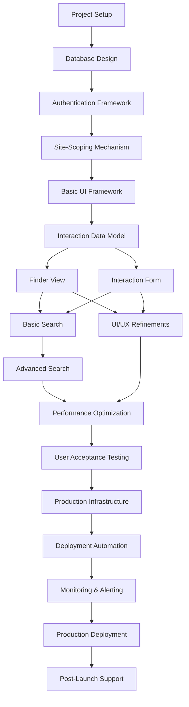

# Interaction Management System Roadmap

## Overview

This document outlines the development plan for the Interaction Management System, including milestones, feature implementation timelines, and future enhancement opportunities. The roadmap is designed to provide a clear path from initial development through production deployment and ongoing evolution of the system.

## Development Phases

### Phase 1: Foundation and Core Functionality (Q1)

The initial phase focuses on establishing the architectural foundation and implementing the core features necessary for a minimum viable product (MVP).

#### Milestones:

| Milestone | Description | Target Completion |
|-----------|-------------|-------------------|
| Project Setup | Initialize repositories, configure CI/CD pipelines, establish development environment | Week 1-2 |
| Database Design | Implement database schema, migrations, and initial seed data | Week 3-4 |
| Authentication Framework | Develop user authentication system with JWT token handling | Week 5-7 |
| Site-Scoping Mechanism | Implement site-based access control and data isolation | Week 8-10 |
| Basic UI Framework | Create application shell, navigation, and component library | Week 11-12 |

#### Deliverables:
- Functional development environment with CI/CD pipelines
- Database schema with site, user, and interaction models
- Secure authentication system with login/logout functionality
- Site context management and authorization framework
- Application shell with routing and navigation structure

### Phase 2: Core Feature Implementation (Q2)

This phase focuses on implementing the primary features of the application, including the Finder interface and Interaction management capabilities.

#### Milestones:

| Milestone | Description | Target Completion |
|-----------|-------------|-------------------|
| Interaction Data Model | Complete implementation of Interaction entity and related services | Week 13-14 |
| Finder View | Develop the tabular interface for viewing Interactions | Week 15-17 |
| Interaction Form | Create the form interface for adding/editing Interactions | Week 18-20 |
| Basic Search | Implement fundamental search capabilities for the Finder | Week 21-22 |
| Integration Testing | Verify integration between all components | Week 23-24 |

#### Deliverables:
- Complete Interaction data model with CRUD operations
- Functional Finder view with basic display and navigation
- Interaction form with validation and submission handling
- Search functionality across key Interaction fields
- Integration test suite verifying component interoperability

### Phase 3: Enhancement and Refinement (Q3)

The third phase enhances the core functionality with advanced features, improves the user experience, and prepares the system for production deployment.

#### Milestones:

| Milestone | Description | Target Completion |
|-----------|-------------|-------------------|
| Advanced Search | Implement filtering, sorting, and advanced search capabilities | Week 25-27 |
| UI/UX Refinements | Enhance user interface with improved styling and interactions | Week 28-30 |
| Performance Optimization | Optimize database queries, API responses, and UI rendering | Week 31-33 |
| User Acceptance Testing | Conduct UAT with stakeholders and incorporate feedback | Week 34-36 |

#### Deliverables:
- Advanced search with multi-field filtering and sorting
- Polished user interface with consistent styling and improved UX
- Optimized performance for all key operations
- UAT signoff from key stakeholders

### Phase 4: Production Deployment and Stabilization (Q4)

The final phase focuses on deploying the system to production, ensuring stability, and implementing monitoring and support processes.

#### Milestones:

| Milestone | Description | Target Completion |
|-----------|-------------|-------------------|
| Production Infrastructure | Set up production environment with proper scaling and security | Week 37-38 |
| Deployment Automation | Finalize CI/CD pipelines for production deployment | Week 39 |
| Monitoring & Alerting | Implement comprehensive monitoring and alerting systems | Week 40-41 |
| Production Deployment | Deploy application to production environment | Week 42 |
| Post-Launch Support | Provide support, address issues, and gather initial feedback | Week 43-48 |

#### Deliverables:
- Production-ready infrastructure with appropriate security controls
- Automated deployment process for reliable releases
- Monitoring dashboards and alert configurations
- Successful production deployment
- Stable application with support processes in place

## Feature Implementation Timeline

The following timeline outlines when specific features from the feature catalog will be implemented:

| Feature ID | Feature Name | Phase | Target Weeks |
|------------|--------------|-------|-------------|
| F-001 | User Authentication | Phase 1 | Weeks 5-7 |
| F-002 | Site-Scoped Access Control | Phase 1 | Weeks 8-10 |
| F-003 | Interaction Creation | Phase 2 | Weeks 13-16 |
| F-004 | Interaction Editing | Phase 2 | Weeks 17-19 |
| F-005 | Interaction Deletion | Phase 2 | Week 20 |
| F-006 | Interaction Finder View | Phase 2 | Weeks 15-17 |
| F-007 | Interaction Search | Phases 2 & 3 | Weeks 21-27 |

## Release Schedule

| Release | Description | Features Included | Target Date |
|---------|-------------|-------------------|-------------|
| 0.1.0 (Alpha) | Internal developer preview | F-001, F-002, initial F-006 | End of Q1 |
| 0.2.0 (Beta) | Limited stakeholder preview | F-003, F-004, F-005, basic F-007 | Mid Q2 |
| 0.3.0 (Beta) | Extended stakeholder testing | Complete F-006, enhanced F-007 | End of Q2 |
| 0.4.0 (RC) | Release candidate for UAT | All features with refinements | End of Q3 |
| 1.0.0 | Production release | All features, production-ready | Mid Q4 |
| 1.1.0 | First feature update | Bug fixes and initial enhancements | End of Q4 |

## Future Enhancements

The following features were identified as out-of-scope for the initial release but are planned for future development:

### Short-term Enhancements (Year 2, Q1-Q2)

| Enhancement | Description | Tentative Timeline |
|-------------|-------------|-------------------|
| Mobile Responsive Optimization | Enhance mobile experience beyond basic responsiveness | Year 2, Q1 |
| Calendar Integration | Allow interactions to be viewed and created in calendar format | Year 2, Q1 |
| Basic Reporting | Implement simple reporting capabilities for Interaction data | Year 2, Q1-Q2 |
| Notification System | Add email notifications for key interaction events | Year 2, Q2 |

### Medium-term Enhancements (Year 2, Q3-Q4)

| Enhancement | Description | Tentative Timeline |
|-------------|-------------|-------------------|
| Public API | Develop a secure API for third-party integration | Year 2, Q3 |
| Bulk Import/Export | Enable bulk operations for Interaction records | Year 2, Q3 |
| Advanced Analytics | Provide deeper insights into Interaction data | Year 2, Q3-Q4 |
| Offline Support | Implement limited offline functionality | Year 2, Q4 |

### Long-term Vision (Year 3+)

| Enhancement | Description | Tentative Timeline |
|-------------|-------------|-------------------|
| Mobile Native Applications | Develop dedicated apps for iOS and Android | Year 3, Q1-Q2 |
| Historical Version Tracking | Maintain full history of Interaction changes | Year 3, Q2 |
| AI-Assisted Insights | Implement machine learning for interaction analysis | Year 3, Q3-Q4 |
| Advanced Workflow Integration | Connect with enterprise workflow systems | Year 3+ |

## Risk Factors and Mitigations

| Risk | Impact | Mitigation Strategy |
|------|--------|---------------------|
| Resource Constraints | Schedule delays | Prioritize core features, maintain flexible timeline for non-critical items |
| Technical Challenges | Development delays | Allocate research spikes for complex features, maintain technical contingency buffer |
| Stakeholder Feedback Changes | Scope creep | Implement formal change management process, clearly define MVP requirements |
| Performance Issues | User dissatisfaction | Conduct regular performance testing, implement early optimizations for known bottlenecks |
| Security Vulnerabilities | Data breaches | Conduct security reviews at each phase, implement security testing in CI/CD pipeline |

## Roadmap Review and Updates

This roadmap will be reviewed and updated according to the following schedule:

- Monthly: Progress tracking against current phase milestones
- Quarterly: Comprehensive review of roadmap timeline and priorities
- After Major Milestones: Evaluation of completed work and adjustment of future plans
- As Needed: Updates based on significant stakeholder feedback or technical discoveries

The most recent review of this roadmap was conducted on: [Date]

## Appendix: Dependency Graph

